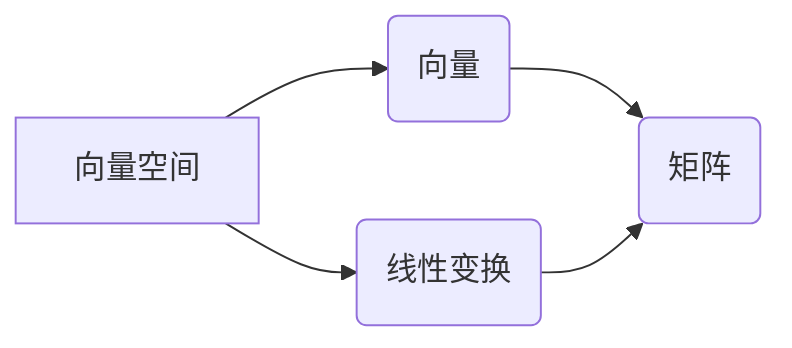

> 线性代数，逻辑基础，矩阵运算，向量空间，线性变换，算法原理，数学模型，代码实现，应用场景

## 1. 背景介绍

线性代数作为数学领域的重要分支，在计算机科学、人工智能、数据科学等领域有着广泛的应用。它为我们提供了处理大量数据、进行模式识别、构建机器学习模型等方面的强大工具。然而，许多人对线性代数的理解停留在公式推导和计算层面，缺乏对其逻辑基础的深入理解。

本文将从逻辑基础出发，深入探讨线性代数的核心概念、算法原理和应用场景，帮助读者建立对线性代数的深刻理解，并将其应用于实际问题解决。

## 2. 核心概念与联系

线性代数的核心概念包括向量、矩阵、线性变换等。这些概念之间有着密切的联系，相互依存，共同构成了线性代数的逻辑框架。

**2.1 向量空间**

向量空间是线性代数的基础概念之一。它是一个集合，其中元素称为向量，并满足一定的运算规则，例如向量加法和数乘。

**2.2 矩阵**

矩阵是一种特殊的数阵，它由若干行和若干列组成。矩阵可以用来表示线性变换，并通过矩阵运算进行计算。

**2.3 线性变换**

线性变换是一种将向量空间映射到另一个向量空间的函数，它满足以下两个性质：

* **加性:** T(u + v) = T(u) + T(v)
* **齐次性:** T(cu) = cT(u)

**2.4 核心概念关系图**



## 3. 核心算法原理 & 具体操作步骤

### 3.1 算法原理概述

线性代数算法的核心是利用矩阵和向量之间的运算关系，解决各种数学问题。常见的线性代数算法包括：

* **矩阵加法和减法:** 将两个相同维度的矩阵对应元素相加或相减。
* **矩阵乘法:** 将一个矩阵与另一个矩阵相乘，得到一个新的矩阵。
* **矩阵转置:** 将矩阵的行和列互换。
* **矩阵逆:** 找到一个矩阵，使其与原矩阵相乘等于单位矩阵。
* **特征值和特征向量:** 找到一个非零向量和一个标量，使得矩阵乘以该向量等于该标量乘以该向量。

### 3.2 算法步骤详解

以下以矩阵乘法为例，详细说明算法步骤：

1. **输入:** 两个矩阵 A 和 B。
2. **判断:** 检查 A 和 B 是否满足矩阵乘法的条件，即 A 的列数等于 B 的行数。
3. **计算:** 
    * 创建一个新的矩阵 C，其行数等于 A 的行数，列数等于 B 的列数。
    * 对于 C 中的每个元素，计算 A 的对应行与 B 的对应列的点积。
4. **输出:** 返回矩阵 C。

### 3.3 算法优缺点

**优点:**

* 运算效率高。
* 适用于处理大量数据。

**缺点:**

* 矩阵乘法运算量较大，对于大型矩阵，计算时间可能较长。

### 3.4 算法应用领域

线性代数算法广泛应用于以下领域：

* **图像处理:** 图像压缩、图像增强、图像识别等。
* **机器学习:** 模型训练、特征提取、数据分析等。
* **人工智能:** 自然语言处理、语音识别、机器人控制等。
* **科学计算:** 仿真模拟、数值解法等。

## 4. 数学模型和公式 & 详细讲解 & 举例说明

### 4.1 数学模型构建

线性代数的核心数学模型是向量空间和线性变换。

* **向量空间:**  一个集合 V，其中元素称为向量，并满足以下条件：
    * **封闭性:** 向量加法和数乘运算的结果仍然属于 V。
    * **结合律:** (u + v) + w = u + (v + w)
    * **交换律:** u + v = v + u
    * **零元:** 存在一个零向量 0，满足 u + 0 = u。
    * **逆元:** 对于每个向量 u，存在一个逆向量 -u，满足 u + (-u) = 0。
    * **分配律:** c(u + v) = cu + cv 和 (c + d)u = cu + du。

* **线性变换:**  一个从一个向量空间 V 到另一个向量空间 W 的函数 T，满足以下条件：
    * **加性:** T(u + v) = T(u) + T(v)
    * **齐次性:** T(cu) = cT(u)

### 4.2 公式推导过程

**矩阵乘法公式:**

设 A 是 m × n 矩阵，B 是 n × p 矩阵，则它们的乘积 C 是 m × p 矩阵，其元素 c<sub>ij</sub> 为：

$$c_{ij} = \sum_{k=1}^{n} a_{ik}b_{kj}$$

**证明:**

矩阵乘法本质上是将矩阵 A 的每一行与矩阵 B 的每一列进行点积运算。

### 4.3 案例分析与讲解

**例题:**

计算以下两个矩阵的乘积:

$$A = \begin{bmatrix} 1 & 2 \\ 3 & 4 \end{bmatrix}, \quad B = \begin{bmatrix} 5 & 6 \\ 7 & 8 \end{bmatrix}$$

**解题步骤:**

1. 确定矩阵 A 和 B 的维度。A 是 2 × 2 矩阵，B 是 2 × 2 矩阵。
2. 检查矩阵乘法的条件。A 的列数 (2) 等于 B 的行数 (2)，因此可以进行矩阵乘法。
3. 计算矩阵乘积 C。

$$C = AB = \begin{bmatrix} 1 & 2 \\ 3 & 4 \end{bmatrix} \begin{bmatrix} 5 & 6 \\ 7 & 8 \end{bmatrix} = \begin{bmatrix} (1 \cdot 5 + 2 \cdot 7) & (1 \cdot 6 + 2 \cdot 8) \\ (3 \cdot 5 + 4 \cdot 7) & (3 \cdot 6 + 4 \cdot 8) \end{bmatrix} = \begin{bmatrix} 19 & 22 \\ 43 & 50 \end{bmatrix}$$

## 5. 项目实践：代码实例和详细解释说明

### 5.1 开发环境搭建

本项目使用 Python 语言进行开发，并使用 NumPy 库进行矩阵运算。

**安装依赖:**

```bash
pip install numpy
```

### 5.2 源代码详细实现

```python
import numpy as np

# 定义两个矩阵
A = np.array([[1, 2], [3, 4]])
B = np.array([[5, 6], [7, 8]])

# 计算矩阵乘积
C = np.dot(A, B)

# 打印结果
print("矩阵 A:")
print(A)
print("
矩阵 B:")
print(B)
print("
矩阵 A * B:")
print(C)
```

### 5.3 代码解读与分析

* `import numpy as np`: 导入 NumPy 库，并使用别名 `np` 进行引用。
* `np.array()`: 创建 NumPy 数组，用于表示矩阵。
* `np.dot()`: 计算两个矩阵的点积，即矩阵乘法。
* `print()`: 打印矩阵 A、B 和它们的乘积 C。

### 5.4 运行结果展示

```
矩阵 A:
[[1 2]
 [3 4]]

矩阵 B:
[[5 6]
 [7 8]]

矩阵 A * B:
[[19 22]
 [43 50]]
```

## 6. 实际应用场景

### 6.1 图像处理

线性代数在图像处理中广泛应用，例如：

* **图像压缩:** 利用矩阵分解技术将图像数据压缩，减少存储空间。
* **图像增强:** 通过矩阵变换调整图像的亮度、对比度等参数，提高图像质量。
* **图像识别:** 利用特征提取技术将图像转换为向量，并通过线性分类器进行识别。

### 6.2 机器学习

线性代数是机器学习的基础，例如：

* **线性回归:** 利用线性方程模型预测连续变量。
* **逻辑回归:** 利用线性函数将输入数据映射到概率空间，用于分类问题。
* **支持向量机:** 利用线性分类器在高维空间中找到最佳的分隔超平面。

### 6.3 其他应用场景

* **科学计算:** 仿真模拟、数值解法等。
* **金融建模:** 风险管理、投资策略等。
* **推荐系统:** 基于用户行为数据进行商品推荐。

### 6.4 未来应用展望

随着人工智能和数据科学的发展，线性代数在未来将有更广泛的应用场景，例如：

* **深度学习:** 深度学习模型的训练和推理依赖于大量的矩阵运算。
* **自然语言处理:** 利用线性代数技术进行文本分析、机器翻译等。
* **计算机视觉:** 利用线性代数技术进行图像识别、目标跟踪等。

## 7. 工具和资源推荐

### 7.1 学习资源推荐

* **书籍:**
    * 《线性代数及其应用》 - Gilbert Strang
    * 《线性代数及其应用》 - David C. Lay
* **在线课程:**
    * MIT OpenCourseWare - Linear Algebra
    * Coursera - Linear Algebra Specialization

### 7.2 开发工具推荐

* **Python:** 
    * NumPy: 用于进行数值计算和矩阵运算。
    * SciPy: 用于科学计算和数据分析。
    * Matplotlib: 用于数据可视化。

### 7.3 相关论文推荐

* **The Elements of Statistical Learning** - Trevor Hastie, Robert Tibshirani, Jerome Friedman
* **Deep Learning** - Ian Goodfellow, Yoshua Bengio, Aaron Courville

## 8. 总结：未来发展趋势与挑战

### 8.1 研究成果总结

本文深入探讨了线性代数的核心概念、算法原理和应用场景，并通过代码实例展示了线性代数在实际应用中的应用。

### 8.2 未来发展趋势

随着人工智能和数据科学的发展，线性代数将继续发挥重要作用，并朝着以下方向发展：

* **更高效的算法:** 研究更高效的线性代数算法，以应对大规模数据处理的需求。
* **更广泛的应用:** 将线性代数应用于更多领域，例如生物信息学、材料科学等。
* **理论研究:** 深入研究线性代数的理论基础，探索其更深层次的性质和应用。

### 8.3 面临的挑战

* **算法复杂度:** 一些线性代数算法的复杂度较高，需要不断优化算法效率。
* **数据规模:** 随着数据规模的不断增长，需要开发更强大的计算资源和算法来处理大规模数据。
* **理论理解:** 线性代数的理论基础仍然存在一些未解之谜，需要进一步的研究和探索。

### 8.4 研究展望

未来，我们将继续致力于线性代数的研究，探索其更深层次的性质和应用，并为人工智能和数据科学的发展做出贡献。

## 9. 附录：常见问题与解答

**问题 1:** 线性代数与其他数学分支有什么关系？

**解答:** 线性代数与微积分、概率论、统计学等数学分支都有密切的联系。例如，微积分可以用来求解线性方程组的解，概率论和统计学可以用来分析线性代数模型的误差和可靠性。

**问题 2:** 如何学习线性代数？

**解答:** 学习线性代数需要扎实的数学基础，建议从基础概念开始学习，逐步深入理解。可以参考相关书籍、在线课程和实践项目。

**问题 3:** 线性代数在