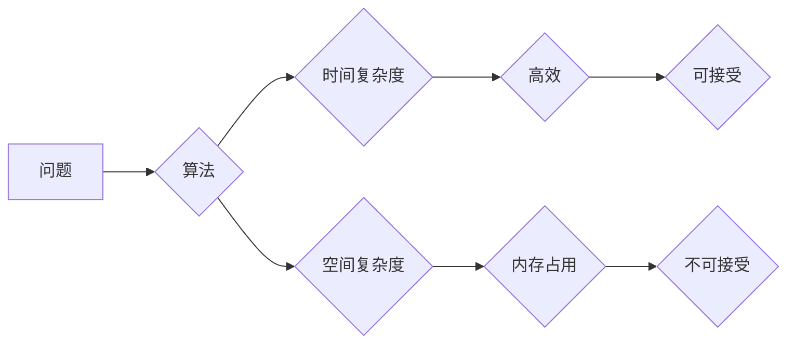

> 复杂性理论，时间复杂度，空间复杂度，算法分析，NP问题，P问题，计算极限

## 1. 背景介绍

在计算机科学的漫长发展历程中，我们不断追求更高效、更强大的计算能力。然而，随着问题的复杂性不断增加，我们逐渐意识到，并非所有问题都能以高效的方式解决。 

复杂性理论正是为了探究这个问题而诞生的。它试图量化算法的效率，并揭示哪些问题本质上难以高效解决。 

## 2. 核心概念与联系

复杂性理论的核心概念是时间复杂度和空间复杂度。

* **时间复杂度** 指的是一个算法在执行过程中所需要的计算步骤数量，通常用大O符号表示，例如 O(n)，O(n^2)，O(log n) 等。
* **空间复杂度** 指的是一个算法在执行过程中所需要的内存空间大小，也通常用大O符号表示。

**Mermaid 流程图**



## 3. 核心算法原理 & 具体操作步骤

### 3.1  算法原理概述

复杂性理论研究的算法通常是解决特定类型问题的通用算法。例如，排序算法、搜索算法、图算法等。这些算法的复杂度分析可以帮助我们选择最合适的算法，并评估其在不同规模的数据上的性能。

### 3.2  算法步骤详解

例如，冒泡排序算法的步骤如下：

1. 比较相邻的两个元素，如果顺序错误，则交换它们的位置。
2. 重复步骤1，直到整个数组排序完成。

### 3.3  算法优缺点

冒泡排序算法简单易懂，但其时间复杂度为 O(n^2)，在处理大规模数据时效率较低。

### 3.4  算法应用领域

冒泡排序算法常用于教育场景，用于讲解排序算法的基本原理。

## 4. 数学模型和公式 & 详细讲解 & 举例说明

### 4.1  数学模型构建

时间复杂度通常用函数来表示，例如 O(n) 表示算法的时间复杂度与输入数据大小 n 成正比。

### 4.2  公式推导过程

例如，冒泡排序算法的时间复杂度为 O(n^2) 的推导过程如下：

1. 外层循环执行 n-1 次。
2. 内层循环每次执行最多 n-i 次，其中 i 为外层循环的迭代次数。
3. 因此，总的计算步骤数量为：

$$
\sum_{i=1}^{n-1}(n-i) = \frac{n(n-1)}{2} \approx O(n^2)
$$

### 4.3  案例分析与讲解

通过公式推导，我们可以得出冒泡排序算法的时间复杂度为 O(n^2)，这意味着当输入数据规模增加时，算法执行时间会呈平方增长。

## 5. 项目实践：代码实例和详细解释说明

### 5.1  开发环境搭建

使用 Python 语言进行代码实现。

### 5.2  源代码详细实现

```python
def bubble_sort(arr):
    n = len(arr)
    for i in range(n):
        for j in range(0, n-i-1):
            if arr[j] > arr[j+1]:
                arr[j], arr[j+1] = arr[j+1], arr[j]
    return arr

# 测试代码
arr = [64, 34, 25, 12, 22, 11, 90]
sorted_arr = bubble_sort(arr)
print("排序后的数组:", sorted_arr)
```

### 5.3  代码解读与分析

代码实现了一个冒泡排序算法。外层循环控制了排序的轮数，内层循环比较相邻元素并交换位置。

### 5.4  运行结果展示

```
排序后的数组: [11, 12, 22, 25, 34, 64, 90]
```

## 6. 实际应用场景

复杂性理论在实际应用场景中具有重要意义。例如：

* **算法选择:** 在选择算法时，可以根据问题的规模和时间复杂度进行比较，选择最合适的算法。
* **性能优化:** 通过分析算法的复杂度，可以找出性能瓶颈，并进行优化。
* **问题复杂度分析:** 复杂性理论可以帮助我们理解某些问题本质上难以高效解决，例如 NP问题。

### 6.4  未来应用展望

随着人工智能和机器学习的发展，复杂性理论在这些领域也扮演着越来越重要的角色。例如，在训练深度神经网络时，需要考虑模型的复杂度和训练时间。

## 7. 工具和资源推荐

### 7.1  学习资源推荐

* **《算法导论》:**  经典的算法教材，对复杂性理论有详细的介绍。
* **Coursera 上的算法课程:**  许多大学开设了算法相关的在线课程，涵盖了复杂性理论等内容。

### 7.2  开发工具推荐

* **Python:**  Python 是一种非常适合算法实现的语言，拥有丰富的库和工具。

### 7.3  相关论文推荐

* **P vs NP问题:**  这是计算机科学领域最著名的未解问题之一，与复杂性理论密切相关。

## 8. 总结：未来发展趋势与挑战

### 8.1  研究成果总结

复杂性理论已经取得了巨大的成果，帮助我们理解了算法的效率和计算的极限。

### 8.2  未来发展趋势

未来，复杂性理论的研究将继续深入，例如：

* **量子计算的复杂性理论:**  随着量子计算的发展，需要研究量子算法的复杂性。
* **机器学习的复杂性理论:**  需要研究机器学习算法的复杂性和泛化能力。

### 8.3  面临的挑战

复杂性理论的研究也面临着一些挑战，例如：

* **NP问题:**  P vs NP问题仍然是一个未解的难题，其解决将对计算机科学产生深远的影响。
* **复杂算法的分析:**  对于一些复杂的算法，其复杂度分析仍然是一个难题。

### 8.4  研究展望

尽管面临挑战，但复杂性理论的研究前景依然广阔。随着计算机科学的发展，复杂性理论将继续发挥重要作用，帮助我们理解计算的本质和极限。

## 9. 附录：常见问题与解答

**Q1: 什么是 NP问题？**

**A1:** NP问题是指那些可以通过多项式时间验证解的难题。

**Q2: P问题和 NP问题有什么区别？**

**A2:** P问题是指可以通过多项式时间解决的难题，而 NP问题是指可以通过多项式时间验证解的难题。目前还不确定 P 是否等于 NP。

**Q3: 复杂性理论有什么应用？**

**A3:** 复杂性理论在算法选择、性能优化、问题复杂度分析等方面都有应用。


作者：禅与计算机程序设计艺术 / Zen and the Art of Computer Programming 
<end_of_turn>