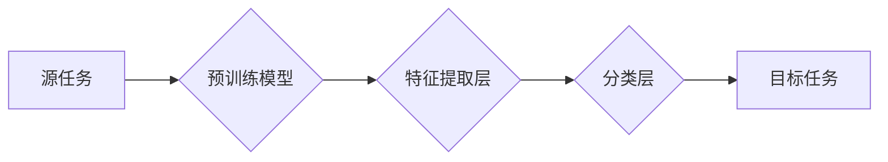

> 迁移学习，知识迁移，预训练模型，fine-tuning，深度学习，计算机视觉，自然语言处理

## 1. 背景介绍

在深度学习领域，训练一个强大的模型通常需要大量的 labeled 数据和大量的计算资源。然而，在许多实际应用场景中，获取大量 labeled 数据是困难且昂贵的。迁移学习 (Transfer Learning) 应运而生，它是一种利用已训练好的模型在新的任务上的学习方法，可以有效地解决数据稀缺问题。

迁移学习的核心思想是：将预先训练好的模型在源任务上的知识迁移到目标任务中，从而提高目标任务的学习效率和性能。源任务和目标任务可以是相同的，也可以是不同的。例如，在图像分类任务中，可以使用在 ImageNet 数据集上预训练的模型，将其迁移到其他图像分类任务中，例如识别特定类型的水果或车辆。

## 2. 核心概念与联系

迁移学习的核心概念包括：

* **源任务 (Source Task):** 预训练模型在该任务上进行训练，积累了丰富的知识和特征表示。
* **目标任务 (Target Task):** 迁移学习的目标任务，通常数据较少，需要利用源任务的知识进行学习。
* **特征提取层 (Feature Extraction Layer):** 预训练模型的早期层，负责提取底层特征，这些特征对多种任务都具有通用性。
* **分类层 (Classification Layer):** 用于将提取的特征映射到目标任务的类别。

**迁移学习流程图:**



## 3. 核心算法原理 & 具体操作步骤

### 3.1  算法原理概述

迁移学习的算法原理主要包括以下几种：

* **特征提取:** 利用预训练模型的特征提取层，提取源任务的特征表示，作为目标任务的输入特征。
* **微调 (Fine-tuning):** 对预训练模型的分类层进行微调，使其适应目标任务的类别。
* **知识蒸馏 (Knowledge Distillation):** 将预训练模型的知识蒸馏到一个更小的模型中，从而降低目标任务的计算成本。

### 3.2  算法步骤详解

1. **选择预训练模型:** 根据目标任务选择合适的预训练模型，例如 ImageNet 上预训练的 ResNet 或 BERT 模型。
2. **特征提取:** 将预训练模型的特征提取层作为目标任务的特征提取器，将源任务的特征表示作为目标任务的输入特征。
3. **微调:** 对预训练模型的分类层进行微调，使其适应目标任务的类别。
4. **评估:** 在目标任务的验证集上评估模型的性能，并根据性能进行模型调优。

### 3.3  算法优缺点

**优点:**

* **提高学习效率:** 利用预训练模型的知识，可以显著减少目标任务的训练时间和数据需求。
* **提升模型性能:** 预训练模型已经学习了大量的通用特征，可以提高目标任务的模型性能。
* **解决数据稀缺问题:** 迁移学习可以有效地解决数据稀缺问题，在数据有限的情况下也能取得不错的效果。

**缺点:**

* **选择合适的预训练模型:** 需要根据目标任务选择合适的预训练模型，否则可能会导致性能下降。
* **微调参数:** 微调预训练模型的参数需要谨慎选择，否则可能会导致模型过拟合或性能下降。
* **计算资源:** 迁移学习仍然需要一定的计算资源，特别是对于大型预训练模型。

### 3.4  算法应用领域

迁移学习在计算机视觉、自然语言处理、语音识别等多个领域都有广泛的应用，例如：

* **图像分类:** 使用 ImageNet 上预训练的模型进行目标检测、图像识别等任务。
* **自然语言处理:** 使用 BERT 或 GPT 模型进行文本分类、情感分析、机器翻译等任务。
* **语音识别:** 使用预训练的语音识别模型进行语音转文本等任务。

## 4. 数学模型和公式 & 详细讲解 & 举例说明

### 4.1  数学模型构建

迁移学习的数学模型可以概括为以下公式：

$$
\mathbf{f}(\mathbf{x}) = \mathbf{W}_s \mathbf{h}(\mathbf{x}) + \mathbf{b}_s
$$

其中：

* $\mathbf{x}$ 是输入数据。
* $\mathbf{h}(\mathbf{x})$ 是特征提取层对输入数据的处理结果。
* $\mathbf{W}_s$ 是源任务模型的权重参数。
* $\mathbf{b}_s$ 是源任务模型的偏置参数。
* $\mathbf{f}(\mathbf{x})$ 是源任务模型的输出结果。

### 4.2  公式推导过程

在迁移学习中，我们通常会将源任务模型的特征提取层作为目标任务的特征提取器，并对目标任务的分类层进行微调。

微调过程可以表示为：

$$
\mathbf{y} = \mathbf{W}_t \mathbf{f}(\mathbf{x}) + \mathbf{b}_t
$$

其中：

* $\mathbf{y}$ 是目标任务的输出结果。
* $\mathbf{W}_t$ 是目标任务模型的权重参数。
* $\mathbf{b}_t$ 是目标任务模型的偏置参数。

### 4.3  案例分析与讲解

例如，在图像分类任务中，我们可以使用 ImageNet 上预训练的 ResNet 模型进行微调。

1. 将 ResNet 模型的特征提取层作为目标任务的特征提取器。
2. 在目标任务的分类层上添加新的分类节点，对应目标任务的类别。
3. 使用目标任务的数据进行微调，更新目标任务模型的权重参数。

## 5. 项目实践：代码实例和详细解释说明

### 5.1  开发环境搭建

* Python 3.6+
* TensorFlow 2.0+
* Keras

### 5.2  源代码详细实现

```python
import tensorflow as tf
from tensorflow.keras.applications import ResNet50
from tensorflow.keras.layers import Dense, GlobalAveragePooling2D
from tensorflow.keras.models import Model

# 加载预训练模型
base_model = ResNet50(weights='imagenet', include_top=False)

# 冻结预训练模型的权重
base_model.trainable = False

# 添加新的分类层
x = base_model.output
x = GlobalAveragePooling2D()(x)
x = Dense(1024, activation='relu')(x)
predictions = Dense(num_classes, activation='softmax')(x)

# 创建新的模型
model = Model(inputs=base_model.input, outputs=predictions)

# 编译模型
model.compile(optimizer='adam',
              loss='categorical_crossentropy',
              metrics=['accuracy'])

# 训练模型
model.fit(train_data, train_labels, epochs=10)
```

### 5.3  代码解读与分析

* 使用 `ResNet50(weights='imagenet', include_top=False)` 加载预训练的 ResNet50 模型，并将其 `include_top` 设置为 `False`，表示不包含原有的分类层。
* 使用 `base_model.trainable = False` 冻结预训练模型的权重，防止其在微调过程中被更新。
* 添加新的分类层，包括 `GlobalAveragePooling2D` 层、 `Dense` 层和 `Dense` 层，用于将特征映射到目标任务的类别。
* 使用 `Model` 创建新的模型，将预训练模型的输入和新的分类层的输出作为模型的输入和输出。
* 使用 `model.compile` 编译模型，指定优化器、损失函数和评估指标。
* 使用 `model.fit` 训练模型，传入训练数据和标签。

### 5.4  运行结果展示

训练完成后，可以使用 `model.evaluate` 函数在验证集上评估模型的性能。

## 6. 实际应用场景

迁移学习在许多实际应用场景中都有广泛的应用，例如：

* **医疗图像分析:** 使用预训练的模型进行病灶检测、肿瘤分割等任务。
* **自然语言理解:** 使用预训练的模型进行文本摘要、问答系统等任务。
* **机器人控制:** 使用预训练的模型进行目标识别、路径规划等任务。

### 6.4  未来应用展望

随着深度学习技术的不断发展，迁移学习的应用场景将会更加广泛。未来，迁移学习可能会应用于以下领域：

* **个性化推荐:** 使用用户行为数据进行个性化推荐。
* **自动驾驶:** 使用预训练的模型进行场景理解、目标检测等任务。
* **药物研发:** 使用预训练的模型进行药物分子设计、药物作用机制预测等任务。

## 7. 工具和资源推荐

### 7.1  学习资源推荐

* **书籍:**
    * Deep Learning by Ian Goodfellow, Yoshua Bengio, and Aaron Courville
    * Transfer Learning in Neural Networks by Jason Brownlee
* **在线课程:**
    * Coursera: Deep Learning Specialization
    * Udacity: Deep Learning Nanodegree

### 7.2  开发工具推荐

* **TensorFlow:** https://www.tensorflow.org/
* **PyTorch:** https://pytorch.org/
* **Keras:** https://keras.io/

### 7.3  相关论文推荐

* **ImageNet Classification with Deep Convolutional Neural Networks** by Alex Krizhevsky, Ilya Sutskever, and Geoffrey E. Hinton
* **Transfer Learning** by Yoshua Bengio, Jean-Marc Vincent, and Pascal Lamblin
* **BERT: Pre-training of Deep Bidirectional Transformers for Language Understanding** by Jacob Devlin, Ming-Wei Chang, Kenton Lee, and Kristina Toutanova

## 8. 总结：未来发展趋势与挑战

### 8.1  研究成果总结

迁移学习在近年来取得了显著的进展，在许多领域取得了优异的性能。

### 8.2  未来发展趋势

未来，迁移学习的研究方向将更加注重以下几个方面：

* **更有效的迁移学习算法:** 探索更有效的迁移学习算法，提高迁移学习的效率和性能。
* **跨模态迁移学习:** 研究跨模态迁移学习，例如将图像知识迁移到文本任务中。
* **联邦迁移学习:** 研究联邦迁移学习，在保护数据隐私的前提下进行迁移学习。

### 8.3  面临的挑战

迁移学习仍然面临一些挑战，例如：

* **数据分布不一致:** 源任务和目标任务的数据分布可能存在差异，这会影响迁移学习的性能。
* **模型复杂度:** 迁移学习模型通常比较复杂，训练和部署成本较高。
* **可解释性:** 迁移学习模型的决策过程难以解释，这可能会影响其在一些应用场景中的可信度。

### 8.4  研究展望

尽管面临挑战，但迁移学习仍然是一个非常有前景的研究方向。随着深度学习技术的不断发展，相信迁移学习将在未来发挥更加重要的作用。

## 9. 附录：常见问题与解答

**Q1: 什么是迁移学习？**

A1: 迁移学习是一种利用已训练好的模型在新的任务上的学习方法，可以有效地解决数据稀缺问题。

**Q2: 迁移学习有哪些算法？**

A2: 迁移学习的算法主要包括特征提取、微调和知识蒸馏。

**Q3: 如何选择合适的预训练模型？**

A3: 选择预训练模型需要根据目标任务和数据特点进行选择。

**Q4: 迁移学习的应用场景有哪些？**

A4: 迁移学习在计算机视觉、自然语言处理、语音识别等多个领域都有广泛的应用。


作者：禅与计算机程序设计艺术 / Zen and the Art of Computer Programming 
<end_of_turn>