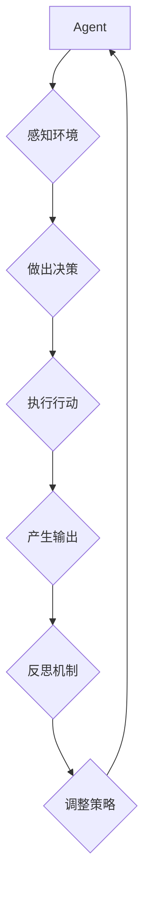

>  * 人工智能
>  * Agent
>  * 反思机制
>  * 输出质量
>  * 优化策略
>  * 知识图谱
>  * 迁移学习

## 1. 背景介绍

在人工智能领域，Agent 作为智能体，扮演着与环境交互、感知信息、做出决策并执行行动的角色。Agent 的输出质量直接影响其在各种应用场景中的表现，例如对话系统、机器人控制、推荐系统等。然而，现有的 Agent 模型往往存在输出质量不稳定、缺乏针对性、难以适应新环境等问题。

为了提升 Agent 的输出质量，我们需要从多个方面进行优化，其中反思机制是一个重要的方向。反思机制能够帮助 Agent 持续评估自身输出，识别错误和不足，并根据反馈进行调整和改进。

## 2. 核心概念与联系

**2.1  Agent 和输出质量**

Agent 是一个能够感知环境、做出决策并执行行动的智能体。其输出质量是指 Agent 在执行任务时产生的结果的质量，例如对话系统的回复质量、机器人控制的精度、推荐系统的准确率等。

**2.2  反思机制**

反思机制是指 Agent 能够对自身的行为和输出进行评估、分析和总结，并根据反馈进行调整和改进的机制。它可以帮助 Agent 识别错误和不足，提高决策的准确性，并促进自身的学习和成长。

**2.3  核心概念联系**

Agent 的输出质量与反思机制密切相关。通过反思机制，Agent 可以持续评估自身输出，识别错误和不足，并根据反馈进行调整和改进，从而提升输出质量。

**2.4  Mermaid 流程图**



## 3. 核心算法原理 & 具体操作步骤

**3.1  算法原理概述**

反思机制的实现通常基于以下核心算法原理：

* **错误检测:** 识别 Agent 输出中的错误或偏差。
* **原因分析:** 分析导致错误的原因，例如数据不足、模型缺陷、环境变化等。
* **策略调整:** 根据原因分析结果，调整 Agent 的策略或参数，以避免类似错误的发生。
* **知识更新:** 将反思过程中的经验和知识更新到 Agent 的知识库中，以提高其未来的决策能力。

**3.2  算法步骤详解**

1. **数据收集:** 收集 Agent 输出的数据，包括输出结果、环境信息、决策过程等。
2. **错误检测:** 使用预定义的规则或机器学习模型检测 Agent 输出中的错误或偏差。
3. **原因分析:** 利用知识图谱、因果推理等技术分析导致错误的原因。
4. **策略调整:** 根据原因分析结果，调整 Agent 的策略或参数，例如调整模型权重、修改决策规则等。
5. **知识更新:** 将反思过程中的经验和知识更新到 Agent 的知识库中，例如添加新的规则、更新已有规则的权重等。
6. **循环迭代:** 重复上述步骤，不断优化 Agent 的输出质量。

**3.3  算法优缺点**

**优点:**

* 能够持续提升 Agent 的输出质量。
* 能够帮助 Agent 适应不断变化的环境。
* 能够促进 Agent 的学习和成长。

**缺点:**

* 需要大量的训练数据和计算资源。
* 算法设计和实现较为复杂。
* 难以完全解决所有类型的错误。

**3.4  算法应用领域**

反思机制可以应用于各种 Agent 领域，例如：

* **对话系统:** 提升对话系统的自然流畅度和准确性。
* **机器人控制:** 提高机器人的控制精度和安全性。
* **推荐系统:** 提供更精准和个性化的推荐结果。
* **自动驾驶:** 增强自动驾驶系统的决策能力和安全性。

## 4. 数学模型和公式 & 详细讲解 & 举例说明

**4.1  数学模型构建**

我们可以使用一个简单的数学模型来表示 Agent 的输出质量和反思机制的影响。假设 Agent 的输出质量为 Q，反思机制的强度为 R，则可以表示为：

$$Q = f(R, D)$$

其中，D 代表 Agent 的输入数据。

**4.2  公式推导过程**

我们可以假设 f(R, D) 为一个线性函数，即：

$$Q = aR + bD$$

其中，a 和 b 为常数，代表反思机制强度和输入数据重要性的权重。

**4.3  案例分析与讲解**

假设 Agent 需要识别图像中的物体，输入数据为图像 D，反思机制强度为 R。

* 当 R 为 0 时，Agent 只依赖于输入数据 D 进行识别，输出质量 Q 可能较低。
* 当 R 逐渐增大时，反思机制的影响力增强，Agent 会根据之前的识别结果和错误分析进行调整，输出质量 Q 会逐渐提高。

## 5. 项目实践：代码实例和详细解释说明

**5.1  开发环境搭建**

* Python 3.7+
* TensorFlow 2.0+
* PyTorch 1.0+
* Jupyter Notebook

**5.2  源代码详细实现**

```python
import tensorflow as tf

# 定义 Agent 模型
class Agent(tf.keras.Model):
    def __init__(self):
        super(Agent, self).__init__()
        # 定义模型结构
        self.dense1 = tf.keras.layers.Dense(128, activation='relu')
        self.dense2 = tf.keras.layers.Dense(64, activation='relu')
        self.output = tf.keras.layers.Dense(10, activation='softmax')

    def call(self, inputs):
        x = self.dense1(inputs)
        x = self.dense2(x)
        return self.output(x)

# 实例化 Agent 模型
agent = Agent()

# 定义损失函数和优化器
loss_fn = tf.keras.losses.CategoricalCrossentropy()
optimizer = tf.keras.optimizers.Adam(learning_rate=0.001)

# 定义训练循环
def train_step(images, labels):
    with tf.GradientTape() as tape:
        predictions = agent(images)
        loss = loss_fn(labels, predictions)
    gradients = tape.gradient(loss, agent.trainable_variables)
    optimizer.apply_gradients(zip(gradients, agent.trainable_variables))
    return loss

# 训练模型
for epoch in range(10):
    for images, labels in train_data:
        loss = train_step(images, labels)
        print(f'Epoch: {epoch}, Loss: {loss.numpy()}')

# 评估模型
# ...

```

**5.3  代码解读与分析**

* 代码定义了一个简单的 Agent 模型，使用 TensorFlow 框架实现。
* 模型结构包括两层全连接层和一层输出层，输出层使用 softmax 函数进行归一化，用于分类任务。
* 训练循环使用梯度下降算法进行模型训练，损失函数为交叉熵损失函数，优化器为 Adam 优化器。

**5.4  运行结果展示**

* 训练完成后，可以评估模型的性能，例如准确率、召回率等。
* 可以使用测试集数据对模型进行评估，并分析模型的预测结果。

## 6. 实际应用场景

**6.1  对话系统**

反思机制可以帮助对话系统识别用户意图，并提供更准确、更自然的回复。例如，如果用户表达了对某个产品的疑问，对话系统可以根据之前的对话记录和产品知识库进行分析，并提供更详细的解答。

**6.2  机器人控制**

反思机制可以帮助机器人控制系统识别环境变化，并调整控制策略，以确保机器人能够安全、高效地完成任务。例如，如果机器人遇到障碍物，可以利用反思机制分析障碍物的位置和形状，并调整路径进行避障。

**6.3  推荐系统**

反思机制可以帮助推荐系统分析用户行为，并提供更个性化的推荐结果。例如，如果用户经常点击某个类型的商品，推荐系统可以利用反思机制学习用户的偏好，并推荐更多类似的商品。

**6.4  未来应用展望**

随着人工智能技术的不断发展，反思机制将在更多领域得到应用，例如医疗诊断、金融风险评估、教育个性化等。

## 7. 工具和资源推荐

**7.1  学习资源推荐**

* **书籍:**
    * 《深度学习》
    * 《人工智能：现代方法》
    * 《机器学习》
* **在线课程:**
    * Coursera: 深度学习
    * edX: 人工智能
    * Udacity: 机器学习工程师

**7.2  开发工具推荐**

* **TensorFlow:** 开源深度学习框架
* **PyTorch:** 开源深度学习框架
* **Jupyter Notebook:** 交互式编程环境

**7.3  相关论文推荐**

* **《Reinforcement Learning: An Introduction》**
* **《Deep Reinforcement Learning》**
* **《Meta-Learning》**

## 8. 总结：未来发展趋势与挑战

**8.1  研究成果总结**

反思机制是提升 Agent 输出质量的重要方向，已经取得了一定的研究成果。

**8.2  未来发展趋势**

* **更智能的反思机制:** 开发更智能、更灵活的反思机制，能够更好地理解和分析 Agent 的行为和输出。
* **跨模态反思:** 探索跨模态反思机制，能够处理不同类型的数据，例如文本、图像、音频等。
* **联邦学习下的反思:** 研究如何在联邦学习环境下实现反思机制，保护数据隐私的同时提升模型性能。

**8.3  面临的挑战**

* **数据需求:** 反思机制需要大量的训练数据，收集和标注数据是一个挑战。
* **算法复杂度:** 设计和实现高效的反思机制算法是一个技术难题。
* **解释性:** 反思机制的决策过程往往难以解释，缺乏透明度。

**8.4  研究展望**

未来，反思机制的研究将继续深入，探索更智能、更灵活、更普适的反思机制，推动人工智能技术的发展。

## 9. 附录：常见问题与解答

**9.1  Q: 反思机制的实现难度大吗？**

**A:** 反思机制的实现难度取决于具体的应用场景和算法设计。简单机制相对容易实现，而复杂机制则需要更深入的算法研究和开发。

**9.2  Q: 反思机制需要多少数据才能训练？**

**A:** 反思机制的数据需求取决于算法复杂度和应用场景。一般来说，需要比传统模型更多的训练数据才能达到良好的效果。

**9.3  Q: 反思机制的应用场景有哪些？**

**A:** 反思机制可以应用于各种 Agent 领域，例如对话系统、机器人控制、推荐系统等。

**9.4  Q: 反思机制的未来发展趋势是什么？**

**A:** 未来，反思机制的研究将继续深入，探索更智能、更灵活、更普适的反思机制，推动人工智能技术的发展。


作者：禅与计算机程序设计艺术 / Zen and the Art of Computer Programming 
<end_of_turn>