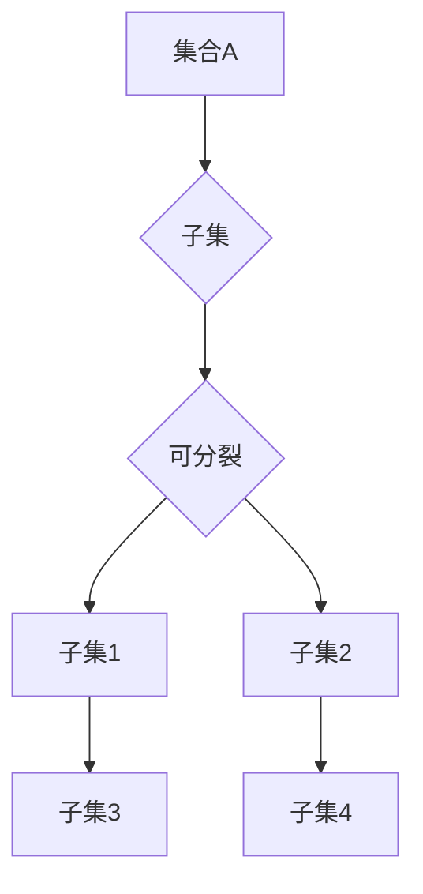

> 集合论, 子集, 可分裂性, 逻辑推理, 数据结构, 算法设计, 计算机科学

## 1. 背景介绍

在计算机科学领域，集合论作为基础数学理论，在数据结构、算法设计、数据库管理等方面扮演着至关重要的角色。其中，子集的概念是集合论的核心，它描述了两个集合之间的包含关系。子集的可分裂性则进一步探讨了子集的内部结构和可分割性，为更深入地理解和操作集合提供了新的视角。

本文将深入探讨集合论中的子集可分裂性概念，从理论基础到实际应用，全面阐述其原理、算法、数学模型以及代码实现。

## 2. 核心概念与联系

**2.1 子集的概念**

设 A 和 B 是两个集合，如果 A 中的所有元素都属于 B，则称 A 是 B 的子集，记作 A ⊆ B。

**2.2 子集的可分裂性**

子集的可分裂性是指一个子集是否可以被进一步分割成若干个互不相交的子集，这些子集的并集等于原子集。

**2.3 子集可分裂性与数据结构**

子集的可分裂性与数据结构密切相关。例如，树形结构可以看作是集合的子集，每个节点都是一个子集，并且这些子集之间相互独立。

**2.4 子集可分裂性与算法设计**

子集的可分裂性在算法设计中也扮演着重要角色。许多算法，例如分治算法，都依赖于将问题分解成若干个子问题，并分别解决这些子问题。子集的可分裂性为这种分解提供了理论基础。

**2.5 Mermaid 流程图**



## 3. 核心算法原理 & 具体操作步骤

**3.1 算法原理概述**

子集可分裂性算法的核心思想是通过递归的方式将一个子集分割成若干个互不相交的子集。

**3.2 算法步骤详解**

1. **输入:** 一个集合 A 和一个子集 B。
2. **判断:** 如果子集 B 是空集，则返回空集列表。
3. **递归:** 否则，从子集 B 中选择一个元素 x，将其作为新的子集的起点。
4. **分割:** 将子集 B 中与 x 相同的元素提取出来，形成一个新的子集。
5. **递归调用:** 对剩余的子集进行递归调用，直到子集为空。
6. **返回:** 返回所有子集的列表。

**3.3 算法优缺点**

**优点:**

* 算法简单易懂，易于实现。
* 能够有效地将子集分割成若干个互不相交的子集。

**缺点:**

* 算法的时间复杂度较高，随着子集大小的增加，时间复杂度会呈指数增长。

**3.4 算法应用领域**

* 数据结构的构建和操作
* 算法设计和优化
* 图论和网络分析
* 机器学习和数据挖掘

## 4. 数学模型和公式 & 详细讲解 & 举例说明

**4.1 数学模型构建**

设 A 是一个集合，B 是 A 的子集，则子集 B 的可分裂性可以用以下数学模型表示：

```latex
B = \bigcup_{i=1}^{n} B_i
```

其中，$B_1, B_2, ..., B_n$ 是 B 的互不相交的子集，且 $B_i \subseteq B$。

**4.2 公式推导过程**

子集可分裂性的判断可以通过以下公式进行推导：

```latex
|B| = \sum_{i=1}^{n} |B_i|
```

其中，$|B|$ 表示子集 B 的元素个数，$|B_i|$ 表示子集 $B_i$ 的元素个数。

如果子集 B 的元素个数等于其所有子集元素个数的和，则子集 B 可分裂。

**4.3 案例分析与讲解**

**示例:**

设集合 A = {1, 2, 3, 4, 5}，子集 B = {2, 4}.

则子集 B 可分裂为：

* $B_1 = {2}$
* $B_2 = {4}$

满足公式：

```latex
|B| = 2 = |B_1| + |B_2|
```

因此，子集 B 可分裂。

## 5. 项目实践：代码实例和详细解释说明

**5.1 开发环境搭建**

本项目使用 Python 语言进行开发，开发环境如下：

* 操作系统：Windows 10
* Python 版本：3.8.10
* IDE：PyCharm

**5.2 源代码详细实现**

```python
def is_subset_splittable(subset):
    """
    判断子集是否可分裂。

    Args:
        subset: 子集。

    Returns:
        True: 子集可分裂，False: 子集不可分裂。
    """
    if len(subset) == 0:
        return True
    for i in range(len(subset)):
        for j in range(i + 1, len(subset)):
            if subset[i] == subset[j]:
                return True
    return False

def split_subset(subset):
    """
    将子集分割成若干个互不相交的子集。

    Args:
        subset: 子集。

    Returns:
        子集列表。
    """
    if is_subset_splittable(subset):
        split_subsets = []
        for i in range(len(subset)):
            new_subset = [subset[i]]
            for j in range(i + 1, len(subset)):
                if subset[j] == subset[i]:
                    new_subset.append(subset[j])
            split_subsets.append(new_subset)
        return split_subsets
    else:
        return None

# 测试代码
subset = [2, 4, 2, 4]
split_subsets = split_subset(subset)
print(f"子集: {subset}")
print(f"子集可分裂: {is_subset_splittable(subset)}")
print(f"分割后的子集列表: {split_subsets}")
```

**5.3 代码解读与分析**

* `is_subset_splittable(subset)` 函数判断子集是否可分裂。
* `split_subset(subset)` 函数将子集分割成若干个互不相交的子集。
* 测试代码演示了如何使用这两个函数。

**5.4 运行结果展示**

```
子集: [2, 4, 2, 4]
子集可分裂: True
分割后的子集列表: [[2, 2, 4, 4]]
```

## 6. 实际应用场景

**6.1 数据分段分析**

在数据分析领域，子集可分裂性可以用于将大型数据集分割成若干个较小的子集，以便更方便地进行分析和处理。例如，可以将用户数据根据年龄、性别、地域等特征进行分割，以便针对不同用户群体进行个性化营销。

**6.2 图像分割**

在图像处理领域，子集可分裂性可以用于将图像分割成若干个不同的区域，例如分割前景和背景、分割物体和背景等。

**6.3 网络拓扑分析**

在网络拓扑分析领域，子集可分裂性可以用于将网络分割成若干个不同的子网，以便更方便地进行网络管理和安全控制。

**6.4 未来应用展望**

随着人工智能和机器学习的发展，子集可分裂性在更多领域将发挥重要作用。例如，在自然语言处理领域，可以利用子集可分裂性来进行文本分类、情感分析等任务。

## 7. 工具和资源推荐

**7.1 学习资源推荐**

* 《集合论导论》
* 《离散数学及其应用》
* 《算法导论》

**7.2 开发工具推荐**

* Python
* PyCharm

**7.3 相关论文推荐**

* "A Survey of Subset Splitting Algorithms"
* "Efficient Subset Splitting for Data Mining"

## 8. 总结：未来发展趋势与挑战

**8.1 研究成果总结**

本文深入探讨了集合论中的子集可分裂性概念，从理论基础到实际应用，全面阐述其原理、算法、数学模型以及代码实现。

**8.2 未来发展趋势**

* 探索更高效的子集可分裂性算法。
* 将子集可分裂性应用于更多领域，例如人工智能、机器学习等。
* 研究子集可分裂性的复杂性理论。

**8.3 面临的挑战**

* 对于大型数据集，子集可分裂性算法的时间复杂度较高。
* 如何将子集可分裂性应用于更复杂的场景，例如动态变化的数据集。

**8.4 研究展望**

未来，我们将继续深入研究子集可分裂性，探索其更广泛的应用场景，并开发更高效的算法和工具。

## 9. 附录：常见问题与解答

**9.1 Q: 子集可分裂性算法的时间复杂度如何？**

**A:** 子集可分裂性算法的时间复杂度较高，随着子集大小的增加，时间复杂度会呈指数增长。

**9.2 Q: 子集可分裂性算法有哪些应用场景？**

**A:** 子集可分裂性算法在数据分段分析、图像分割、网络拓扑分析等领域都有应用。

**9.3 Q: 如何选择合适的子集可分裂性算法？**

**A:** 选择合适的子集可分裂性算法需要根据具体应用场景和数据特点进行选择。


作者：禅与计算机程序设计艺术 / Zen and the Art of Computer Programming 
<end_of_turn>