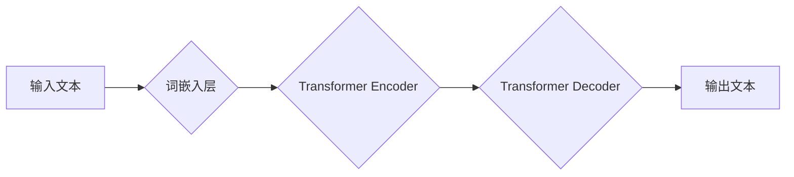

> 人工智能，大语言模型，LLM，深度学习，Transformer，自然语言处理，文本生成，机器学习

## 1. 背景介绍

人工智能（AI）正以惊人的速度发展，其影响力正在深刻地改变着我们的生活。其中，大语言模型（LLM）作为人工智能领域的一颗璀璨明珠，凭借其强大的文本处理能力和生成能力，正在掀起一场新的技术革命。

LLM 是指能够理解和生成人类语言的大型神经网络模型。它们通过学习海量文本数据，掌握了语言的语法、语义和上下文关系，从而能够执行各种自然语言处理（NLP）任务，例如文本分类、机器翻译、问答系统、文本摘要和代码生成等。

近年来，随着深度学习技术的进步和计算资源的增加，LLM 的规模和能力不断提升。例如，GPT-3、LaMDA 和 BERT 等模型的出现，展现了 LLM 在文本生成、对话系统和知识理解等方面的惊人潜力。

## 2. 核心概念与联系

**2.1  核心概念**

* **深度学习 (Deep Learning):**  一种机器学习的子领域，利用多层神经网络来模拟人类大脑的学习过程。
* **Transformer:**  一种新型的深度学习架构，能够有效地处理序列数据，例如文本。其核心是“注意力机制”，能够学习到文本中不同词语之间的关系。
* **自然语言处理 (NLP):**  计算机科学的一个分支，致力于使计算机能够理解和处理人类语言。

**2.2  架构图**



**2.3  联系**

LLM 的核心是深度学习技术，特别是 Transformer 架构。Transformer 架构能够有效地处理文本序列，并通过注意力机制学习到文本中不同词语之间的关系。

## 3. 核心算法原理 & 具体操作步骤

**3.1  算法原理概述**

LLM 的训练过程本质上是一个预测下一个词的概率的过程。模型通过学习大量的文本数据，建立了词语之间的关系和上下文依赖关系。在预测下一个词时，模型会根据之前出现的词语，计算出每个可能的词语出现的概率，并选择概率最高的词语作为预测结果。

**3.2  算法步骤详解**

1. **数据预处理:** 将原始文本数据进行清洗、分词、标记等预处理操作，使其能够被模型理解。
2. **词嵌入:** 将每个词语映射到一个低维向量空间中，使得语义相近的词语拥有相似的向量表示。
3. **Transformer Encoder:** 将输入文本序列编码成一个固定长度的向量表示，并捕捉文本中的语义信息和上下文关系。
4. **Transformer Decoder:** 根据编码后的文本向量，预测下一个词语的概率分布。
5. **损失函数:** 使用交叉熵损失函数来衡量模型预测结果与真实值的差异。
6. **反向传播:** 利用梯度下降算法，更新模型参数，使得模型预测结果与真实值之间的差异最小化。

**3.3  算法优缺点**

* **优点:**
    * 能够处理长文本序列，捕捉长距离依赖关系。
    * 训练效率高，能够在大型数据集上进行训练。
    * 生成文本质量高，能够生成流畅、自然的文本。
* **缺点:**
    * 训练成本高，需要大量的计算资源和数据。
    * 模型参数量大，部署成本高。
    * 容易受到训练数据偏差的影响，可能生成带有偏见或错误信息的文本。

**3.4  算法应用领域**

* 文本生成：小说、诗歌、剧本、新闻报道等。
* 机器翻译：将一种语言翻译成另一种语言。
* 问答系统：回答用户提出的问题。
* 聊天机器人：与用户进行自然语言对话。
* 代码生成：自动生成代码。

## 4. 数学模型和公式 & 详细讲解 & 举例说明

**4.1  数学模型构建**

LLM 的数学模型通常基于 Transformer 架构，其核心是注意力机制。注意力机制能够学习到文本中不同词语之间的关系，并赋予不同词语不同的权重。

**4.2  公式推导过程**

注意力机制的计算公式如下：

$$
Attention(Q, K, V) = softmax(\frac{QK^T}{\sqrt{d_k}})V
$$

其中：

* $Q$：查询矩阵
* $K$：键矩阵
* $V$：值矩阵
* $d_k$：键向量的维度
* $softmax$：softmax 函数

**4.3  案例分析与讲解**

假设我们有一个句子 "The cat sat on the mat"，我们想要计算 "cat" 和 "mat" 之间的注意力权重。

1. 将每个词语转换为词向量，得到 $Q$, $K$ 和 $V$ 矩阵。
2. 计算 $QK^T$，得到一个矩阵，其中每个元素表示两个词语之间的相似度。
3. 对 $QK^T$ 进行归一化，得到注意力权重矩阵。
4. 将注意力权重矩阵与 $V$ 矩阵相乘，得到最终的注意力输出。

## 5. 项目实践：代码实例和详细解释说明

**5.1  开发环境搭建**

* Python 3.7+
* PyTorch 或 TensorFlow
* CUDA 和 cuDNN

**5.2  源代码详细实现**

```python
import torch
import torch.nn as nn

class Transformer(nn.Module):
    def __init__(self, vocab_size, embedding_dim, num_heads, num_layers):
        super(Transformer, self).__init__()
        self.embedding = nn.Embedding(vocab_size, embedding_dim)
        self.transformer_layers = nn.ModuleList([
            nn.TransformerEncoderLayer(embedding_dim, num_heads)
            for _ in range(num_layers)
        ])
        self.linear = nn.Linear(embedding_dim, vocab_size)

    def forward(self, x):
        x = self.embedding(x)
        x = self.transformer_layers(x)
        x = self.linear(x)
        return x
```

**5.3  代码解读与分析**

* `Transformer` 类定义了一个 Transformer 模型。
* `embedding` 层将词语转换为词向量。
* `transformer_layers` 是一个列表，包含多个 Transformer Encoder 层。
* `linear` 层将 Transformer 输出转换为预测概率分布。

**5.4  运行结果展示**

训练好的 LLM 模型可以用于各种 NLP 任务，例如文本生成、机器翻译和问答系统。

## 6. 实际应用场景

**6.1  文本生成**

LLM 可以用于生成各种类型的文本，例如小说、诗歌、剧本、新闻报道等。例如，OpenAI 的 GPT-3 模型可以生成高质量的创意写作内容。

**6.2  机器翻译**

LLM 可以用于将一种语言翻译成另一种语言。例如，Google 的 Transformer 模型在机器翻译任务上取得了state-of-the-art 的性能。

**6.3  问答系统**

LLM 可以用于构建问答系统，能够回答用户提出的问题。例如，微软的 Turing 模型可以进行自然语言对话，并回答用户的问题。

**6.4  未来应用展望**

LLM 的应用场景还在不断扩展，未来可能会应用于以下领域：

* 个性化教育：根据学生的学习进度和需求，提供个性化的学习内容和辅导。
* 医疗诊断：辅助医生进行疾病诊断，提高诊断准确率。
* 法律服务：自动生成法律文件，提高法律服务的效率。

## 7. 工具和资源推荐

**7.1  学习资源推荐**

* **书籍:**
    * 《深度学习》 by Ian Goodfellow, Yoshua Bengio, and Aaron Courville
    * 《Transformer 详解》 by Jay Alammar
* **在线课程:**
    * Coursera: Deep Learning Specialization
    * fast.ai: Practical Deep Learning for Coders

**7.2  开发工具推荐**

* **PyTorch:** 一个开源的深度学习框架。
* **TensorFlow:** 另一个开源的深度学习框架。
* **Hugging Face Transformers:** 一个用于加载和使用预训练 Transformer 模型的库。

**7.3  相关论文推荐**

* 《Attention Is All You Need》 by Vaswani et al. (2017)
* 《BERT: Pre-training of Deep Bidirectional Transformers for Language Understanding》 by Devlin et al. (2018)
* 《GPT-3: Language Models are Few-Shot Learners》 by Brown et al. (2020)

## 8. 总结：未来发展趋势与挑战

**8.1  研究成果总结**

近年来，LLM 在 NLP 任务上的表现取得了显著进步，展现了强大的文本处理能力和生成能力。

**8.2  未来发展趋势**

* 模型规模的进一步扩大：更大的模型能够学习更复杂的语言模式。
* 训练数据的多样化：使用更丰富、更全面的数据训练模型，提高模型的泛化能力。
* 算法的创新：探索新的算法和架构，提高模型的效率和性能。
* 伦理和安全问题：研究 LLMs 的伦理和安全问题，确保其安全、可靠和可控地应用。

**8.3  面临的挑战**

* 训练成本高：训练大型 LLMs 需要大量的计算资源和时间。
* 数据偏差：训练数据可能存在偏差，导致模型生成带有偏见或错误信息的文本。
* 可解释性差：LLMs 的决策过程难以理解，这使得其应用在某些领域存在风险。

**8.4  研究展望**

未来，LLM 研究将继续朝着更强大、更安全、更可解释的方向发展。

## 9. 附录：常见问题与解答

* **什么是 LLMs 的训练数据？**

LLMs 的训练数据通常是大量的文本数据，例如书籍、文章、网站内容等。

* **LLMs 如何生成文本？**

LLMs 通过预测下一个词语的概率来生成文本。

* **LLMs 是否能够理解文本的含义？**

LLMs 能够捕捉文本中的语义信息和上下文关系，但其是否真正理解文本的含义仍是一个开放性问题。

作者：禅与计算机程序设计艺术 / Zen and the Art of Computer Programming


<end_of_turn>