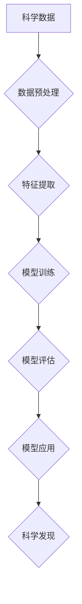

>人工智能，科学计算，机器学习，深度学习，自然语言处理，数据分析，科学发现

## 1. 背景介绍

科学研究历来是人类探索世界、理解自然规律和推动社会进步的重要驱动力。然而，传统的科学研究方法往往面临着数据量大、计算复杂、分析周期长等挑战。近年来，人工智能（AI）技术飞速发展，为科学研究带来了前所未有的机遇。AI算法能够高效处理海量数据，发现隐藏的模式和规律，加速科学发现和创新。

AI for Science是指利用人工智能技术辅助科学研究，涵盖多个领域，例如药物研发、材料科学、天文学、生物学等。AI技术在科学研究中的应用，可以从以下几个方面提升科学研究效率和成果：

* **加速数据分析和挖掘：** AI算法能够快速处理海量数据，发现隐藏的模式和规律，为科学研究提供新的见解。
* **优化实验设计和模拟：** AI可以根据历史数据和模型预测，优化实验设计方案，提高实验效率和成功率。
* **辅助科学发现和理论构建：** AI可以帮助科学家发现新的物理现象、化学反应或生物机制，并构建新的科学理论。
* **促进跨学科合作：** AI可以帮助不同学科的科学家共享数据和知识，促进跨学科合作和创新。

## 2. 核心概念与联系

**2.1 核心概念**

* **人工智能 (AI):** 人工智能是指模拟人类智能行为的计算机系统。AI技术包括机器学习、深度学习、自然语言处理等。
* **机器学习 (ML):** 机器学习是人工智能的一个子领域，它使计算机能够从数据中学习，并根据学习到的知识进行预测或决策。
* **深度学习 (DL):** 深度学习是机器学习的一个子领域，它使用多层神经网络来模拟人类大脑的学习过程。
* **科学计算 (SC):** 科学计算是指利用计算机进行科学研究和模拟。

**2.2 联系**

AI for Science将人工智能技术与科学计算相结合，利用AI算法处理海量科学数据，加速科学发现和创新。

**2.3 流程图**



## 3. 核心算法原理 & 具体操作步骤

**3.1 算法原理概述**

AI for Science中常用的算法包括：

* **监督学习:** 利用标记数据训练模型，预测未知数据。例如，在药物研发中，可以使用监督学习算法预测药物的活性。
* **无监督学习:** 利用未标记数据发现数据中的隐藏模式和结构。例如，可以使用无监督学习算法对蛋白质结构进行分类。
* **强化学习:** 通过奖励和惩罚机制训练模型，使其在特定环境中做出最优决策。例如，可以使用强化学习算法训练机器人进行复杂任务。

**3.2 算法步骤详解**

以监督学习为例，其步骤如下：

1. **数据收集和预处理:** 收集相关数据，并进行清洗、转换和特征工程等预处理操作。
2. **模型选择:** 根据任务需求选择合适的模型，例如线性回归、逻辑回归、决策树等。
3. **模型训练:** 使用训练数据训练模型，调整模型参数，使其能够准确预测未知数据。
4. **模型评估:** 使用测试数据评估模型的性能，例如准确率、召回率、F1-score等。
5. **模型部署:** 将训练好的模型部署到实际应用场景中，用于预测或决策。

**3.3 算法优缺点**

* **优点:** 能够从数据中学习，提高预测精度，自动化决策过程。
* **缺点:** 需要大量标记数据，容易受到数据偏差的影响，解释性较差。

**3.4 算法应用领域**

* **药物研发:** 预测药物活性、筛选候选药物、优化药物设计。
* **材料科学:** 预测材料性能、设计新材料、加速材料发现。
* **天文学:** 发现新星系、预测天体运动、分析宇宙演化。
* **生物学:** 预测蛋白质结构、分析基因功能、研究疾病机制。

## 4. 数学模型和公式 & 详细讲解 & 举例说明

**4.1 数学模型构建**

在AI for Science中，常用的数学模型包括线性回归、逻辑回归、支持向量机、神经网络等。

**4.2 公式推导过程**

以线性回归为例，其目标是找到一条直线，使得预测值与真实值之间的误差最小。

线性回归模型的公式为：

$$y = w_0 + w_1x_1 + w_2x_2 + ... + w_nx_n$$

其中：

* $y$ 是预测值
* $w_0, w_1, w_2, ..., w_n$ 是模型参数
* $x_1, x_2, ..., x_n$ 是输入特征

模型参数的学习过程可以使用最小二乘法进行优化。

**4.3 案例分析与讲解**

假设我们想要预测房屋价格，输入特征包括房屋面积、房间数量、地理位置等。我们可以使用线性回归模型训练一个预测模型，并根据模型预测，估算不同房屋的价格。

## 5. 项目实践：代码实例和详细解释说明

**5.1 开发环境搭建**

可以使用Python语言和相关的库进行AI for Science项目开发。常用的库包括：

* **NumPy:** 用于数值计算
* **Pandas:** 用于数据处理和分析
* **Scikit-learn:** 用于机器学习算法
* **TensorFlow:** 用于深度学习

**5.2 源代码详细实现**

以下是一个使用Scikit-learn库进行房屋价格预测的代码示例：

```python
import pandas as pd
from sklearn.model_selection import train_test_split
from sklearn.linear_model import LinearRegression
from sklearn.metrics import mean_squared_error

# 加载数据
data = pd.read_csv('house_data.csv')

# 分割数据
X = data[['面积', '房间数量']]
y = data['价格']
X_train, X_test, y_train, y_test = train_test_split(X, y, test_size=0.2, random_state=42)

# 创建模型
model = LinearRegression()

# 训练模型
model.fit(X_train, y_train)

# 预测结果
y_pred = model.predict(X_test)

# 评估模型
mse = mean_squared_error(y_test, y_pred)
print('均方误差:', mse)
```

**5.3 代码解读与分析**

* 首先，加载数据并进行特征选择和数据分割。
* 然后，创建线性回归模型并进行训练。
* 最后，使用训练好的模型进行预测，并评估模型性能。

**5.4 运行结果展示**

运行代码后，会输出模型的均方误差值，该值越小，模型的预测精度越高。

## 6. 实际应用场景

**6.1 药物研发**

AI for Science可以加速药物研发过程，例如：

* **药物靶点发现:** 利用AI算法分析基因组数据，预测药物靶点。
* **药物分子设计:** 利用AI算法设计新的药物分子，提高药物活性。
* **药物安全性评估:** 利用AI算法预测药物的潜在毒性，提高药物安全性。

**6.2 材料科学**

AI for Science可以帮助设计和发现新材料，例如：

* **材料性能预测:** 利用AI算法预测材料的机械性能、热性能、电性能等。
* **材料结构设计:** 利用AI算法设计新的材料结构，提高材料性能。
* **材料合成优化:** 利用AI算法优化材料合成工艺，提高材料合成效率。

**6.3 天文学**

AI for Science可以帮助天文学家分析天文数据，例如：

* **星系分类:** 利用AI算法对星系进行分类，研究星系演化。
* **天体运动预测:** 利用AI算法预测天体运动轨迹，发现新的天体。
* **宇宙演化研究:** 利用AI算法分析宇宙微波背景辐射，研究宇宙演化。

**6.4 未来应用展望**

AI for Science的应用前景广阔，未来将有更多新的应用场景出现，例如：

* **个性化医疗:** 利用AI算法分析患者基因数据，提供个性化医疗方案。
* **精准农业:** 利用AI算法分析土壤和气候数据，提高农业生产效率。
* **可持续发展:** 利用AI算法优化能源利用、减少环境污染，促进可持续发展。

## 7. 工具和资源推荐

**7.1 学习资源推荐**

* **在线课程:** Coursera, edX, Udacity 等平台提供AI for Science相关的在线课程。
* **书籍:** 《Deep Learning》、《Hands-On Machine Learning with Scikit-Learn, Keras & TensorFlow》等书籍介绍AI算法和应用。
* **博客和论坛:** Kaggle, Towards Data Science 等平台提供AI for Science相关的博客文章和论坛讨论。

**7.2 开发工具推荐**

* **Python:** Python语言是AI开发的常用语言，拥有丰富的库和工具。
* **Jupyter Notebook:** Jupyter Notebook是一个交互式编程环境，方便进行AI算法开发和调试。
* **TensorFlow:** TensorFlow是一个开源深度学习框架，用于开发和训练深度学习模型。

**7.3 相关论文推荐**

* **Nature:** https://www.nature.com/
* **Science:** https://www.science.org/
* **arXiv:** https://arxiv.org/

## 8. 总结：未来发展趋势与挑战

**8.1 研究成果总结**

AI for Science取得了显著的成果，在药物研发、材料科学、天文学等领域取得了突破。

**8.2 未来发展趋势**

* **模型规模和复杂度提升:** 未来AI模型将更加强大，能够处理更复杂的数据和任务。
* **跨学科合作加强:** AI for Science将更加注重跨学科合作，将AI技术应用于更多领域。
* **解释性AI发展:** 研究如何提高AI模型的解释性，使其决策更加透明和可理解。

**8.3 面临的挑战**

* **数据获取和质量:** AI模型的性能依赖于数据质量，获取高质量数据仍然是一个挑战。
* **算法可解释性:** 许多AI算法难以解释其决策过程，这限制了其在某些领域的应用。
* **伦理和社会影响:** AI for Science的应用可能带来伦理和社会影响，需要进行深入研究和讨论。

**8.4 研究展望**

未来，AI for Science将继续发展，为科学研究带来更多机遇和挑战。我们需要不断探索新的算法和技术，解决数据获取和解释性问题，并关注AI技术的伦理和社会影响。

## 9. 附录：常见问题与解答

**9.1 如何选择合适的AI算法？**

选择合适的AI算法取决于具体的应用场景和数据特点。例如，对于分类任务，可以使用支持向量机或决策树；对于回归任务，可以使用线性回归或神经网络。

**9.2 如何评估AI模型的性能？**

常用的评估指标包括准确率、召回率、F1-score、均方误差等。选择合适的评估指标取决于具体的应用场景。

**9.3 如何解决数据偏差问题？**

数据偏差会导致AI模型的性能下降。可以采用数据增强、样本均衡等方法来解决数据偏差问题。


作者：禅与计算机程序设计艺术 / Zen and the Art of Computer Programming 
<end_of_turn>