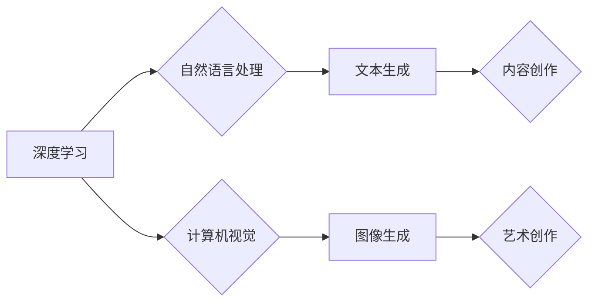

> AIGC, 文本生成, 图像生成, 算法原理, 数学模型, 项目实践, 应用场景

## 1. 背景介绍

近年来，人工智能（AI）技术取得了飞速发展，其中，生成式人工智能（AIGC）作为人工智能领域的新兴方向，备受关注。AIGC是指利用人工智能技术，从数据中学习并生成新的内容，例如文本、图像、音频、视频等。

AIGC技术在各个领域都展现出巨大的应用潜力，例如：

* **内容创作:** 自动生成新闻报道、广告文案、诗歌、小说等。
* **艺术创作:** 生成绘画、音乐、视频等艺术作品。
* **教育培训:** 个性化学习内容、自动生成习题和答案。
* **软件开发:** 自动生成代码、测试用例等。

AIGC技术的快速发展，为人类创造了无限可能，但也带来了新的挑战，例如：

* **数据安全:** AIGC模型训练需要大量数据，如何保证数据安全和隐私保护是一个重要问题。
* **内容质量:** AIGC生成的內容质量参差不齐，如何提高内容的真实性和原创性是一个关键挑战。
* **伦理问题:** AIGC技术可能被用于生成虚假信息、进行网络攻击等恶意行为，如何规范AIGC技术应用，避免其被滥用，是一个需要认真思考的伦理问题。

## 2. 核心概念与联系

AIGC的核心概念包括：

* **深度学习:** AIGC模型主要基于深度学习算法，例如Transformer、GAN等。
* **自然语言处理 (NLP):** 用于处理和理解人类语言，例如文本分类、情感分析、机器翻译等。
* **计算机视觉 (CV):** 用于处理和理解图像，例如图像识别、物体检测、图像生成等。

**AIGC 核心概念架构**



## 3. 核心算法原理 & 具体操作步骤

### 3.1  算法原理概述

AIGC常用的算法包括：

* **Transformer:**  一种基于注意力机制的深度学习模型，能够有效处理长文本序列，广泛应用于文本生成任务。
* **Generative Adversarial Networks (GAN):**  由生成器和判别器两部分组成，生成器生成数据，判别器判断数据真实性，两者相互竞争，最终生成逼真的数据。

### 3.2  算法步骤详解

**Transformer 算法步骤:**

1. **输入编码:** 将输入文本序列转换为向量表示。
2. **自注意力机制:** 计算每个词与其他词之间的关系，生成注意力权重。
3. **多头注意力:** 使用多个自注意力层，捕捉不同层次的语义信息。
4. **前馈神经网络:** 对每个词的向量表示进行非线性变换。
5. **输出解码:** 将编码后的向量表示转换为输出文本序列。

**GAN 算法步骤:**

1. **初始化生成器和判别器:**  随机初始化生成器和判别器的参数。
2. **生成器训练:**  生成器根据随机噪声生成数据，并将其输入判别器。
3. **判别器训练:**  判别器根据真实数据和生成数据判断其真实性，并更新参数。
4. **迭代训练:**  重复步骤2和3，直到生成器生成的數據与真实数据难以区分。

### 3.3  算法优缺点

**Transformer 算法:**

* **优点:**  能够有效处理长文本序列，生成高质量的文本。
* **缺点:**  训练成本高，计算复杂度大。

**GAN 算法:**

* **优点:**  能够生成逼真的数据，应用范围广泛。
* **缺点:**  训练过程不稳定，容易出现模式崩溃问题。

### 3.4  算法应用领域

* **文本生成:**  自动生成新闻报道、广告文案、诗歌、小说等。
* **图像生成:**  生成绘画、照片、视频等。
* **语音合成:**  生成逼真的语音。
* **音乐创作:**  生成音乐旋律和伴奏。

## 4. 数学模型和公式 & 详细讲解 & 举例说明

### 4.1  数学模型构建

Transformer 模型的核心是自注意力机制，其数学模型可以表示为：

$$
Attention(Q, K, V) = softmax(\frac{QK^T}{\sqrt{d_k}})V
$$

其中：

* $Q$：查询矩阵
* $K$：键矩阵
* $V$：值矩阵
* $d_k$：键向量的维度
* $softmax$：softmax 函数

### 4.2  公式推导过程

自注意力机制的目的是计算每个词与其他词之间的关系，并生成注意力权重。

1. 计算查询矩阵 $Q$ 与键矩阵 $K$ 的点积，并进行归一化处理。
2. 应用 softmax 函数，将点积结果转换为注意力权重。
3. 将注意力权重与值矩阵 $V$ 相乘，得到每个词的加权和，即最终的注意力输出。

### 4.3  案例分析与讲解

例如，在翻译句子 "The cat sat on the mat" 时，自注意力机制可以计算每个词与其他词之间的关系，例如 "cat" 与 "sat" 之间的关系，"sat" 与 "on" 之间的关系等。

通过计算这些关系，模型可以更好地理解句子的语义，并生成更准确的翻译。

## 5. 项目实践：代码实例和详细解释说明

### 5.1  开发环境搭建

* Python 3.7+
* TensorFlow 或 PyTorch 深度学习框架
* 其他必要的库，例如 NumPy、pandas 等

### 5.2  源代码详细实现

```python
# 使用 TensorFlow 实现简单的文本生成模型

import tensorflow as tf

# 定义模型结构
model = tf.keras.Sequential([
    tf.keras.layers.Embedding(input_dim=vocab_size, output_dim=embedding_dim),
    tf.keras.layers.LSTM(units=lstm_units),
    tf.keras.layers.Dense(units=vocab_size, activation='softmax')
])

# 编译模型
model.compile(optimizer='adam', loss='sparse_categorical_crossentropy', metrics=['accuracy'])

# 训练模型
model.fit(x_train, y_train, epochs=epochs)

# 生成文本
seed_text = "The quick brown fox"
for _ in range(generate_length):
    predictions = model.predict(tf.expand_dims(seed_text, 0))
    predicted_index = tf.argmax(predictions[0]).numpy()
    predicted_word = word_index[predicted_index]
    seed_text += " " + predicted_word
```

### 5.3  代码解读与分析

* **Embedding 层:** 将单词转换为向量表示。
* **LSTM 层:** 用于处理文本序列，捕捉文本中的上下文信息。
* **Dense 层:** 将 LSTM 输出转换为概率分布，预测下一个单词。
* **训练过程:** 使用训练数据训练模型，优化模型参数。
* **文本生成:** 使用训练好的模型，根据种子文本生成新的文本。

### 5.4  运行结果展示

运行代码后，可以生成新的文本，例如：

```
The quick brown fox jumps over the lazy dog.
```

## 6. 实际应用场景

### 6.1  内容创作

* **新闻报道:** 自动生成新闻报道摘要、新闻评论等。
* **广告文案:** 自动生成吸引人的广告文案。
* **小说创作:** 自动生成小说情节、人物对话等。

### 6.2  艺术创作

* **绘画生成:**  根据文本描述生成绘画作品。
* **音乐创作:**  生成音乐旋律和伴奏。
* **视频生成:**  根据剧本生成视频内容。

### 6.3  教育培训

* **个性化学习内容:**  根据学生的学习进度和兴趣生成个性化的学习内容。
* **自动生成习题和答案:**  自动生成各种类型的习题和答案。

### 6.4  未来应用展望

AIGC技术将在未来发挥更重要的作用，例如：

* **虚拟助手:**  更加智能、人性化的虚拟助手。
* **个性化服务:**  更加个性化的产品和服务。
* **创意产业:**  推动创意产业的创新发展。

## 7. 工具和资源推荐

### 7.1  学习资源推荐

* **书籍:**
    * 《Deep Learning》 by Ian Goodfellow, Yoshua Bengio, and Aaron Courville
    * 《Generative Deep Learning》 by David Foster
* **在线课程:**
    * Coursera: Deep Learning Specialization
    * Udacity: Deep Learning Nanodegree

### 7.2  开发工具推荐

* **TensorFlow:**  开源深度学习框架。
* **PyTorch:**  开源深度学习框架。
* **Hugging Face Transformers:**  提供预训练的 Transformer 模型。

### 7.3  相关论文推荐

* **Attention Is All You Need** (Vaswani et al., 2017)
* **Generative Adversarial Networks** (Goodfellow et al., 2014)

## 8. 总结：未来发展趋势与挑战

### 8.1  研究成果总结

AIGC技术取得了显著进展，能够生成高质量的文本、图像、音频等内容。

### 8.2  未来发展趋势

* **模型规模和能力提升:**  模型规模将继续扩大，能力将进一步提升。
* **多模态生成:**  融合文本、图像、音频等多模态数据进行生成。
* **个性化定制:**  根据用户需求进行个性化定制。

### 8.3  面临的挑战

* **数据安全和隐私保护:**  AIGC模型训练需要大量数据，如何保证数据安全和隐私保护是一个重要问题。
* **内容质量和原创性:**  AIGC生成的內容质量参差不齐，如何提高内容的真实性和原创性是一个关键挑战。
* **伦理问题:**  AIGC技术可能被用于生成虚假信息、进行网络攻击等恶意行为，如何规范AIGC技术应用，避免其被滥用，是一个需要认真思考的伦理问题。

### 8.4  研究展望

未来，AIGC技术将继续发展，并应用于更广泛的领域，为人类创造更多价值。

## 9. 附录：常见问题与解答

* **Q: AIGC技术与传统人工智能有什么区别？**

* **A:**  传统人工智能主要依赖规则和逻辑，而AIGC则利用深度学习算法从数据中学习，能够生成新的内容。

* **Q: AIGC技术是否会取代人类？**

* **A:**  AIGC技术可以辅助人类工作，提高效率，但不会取代人类。

* **Q: 如何学习AIGC技术？**

* **A:**  可以通过学习深度学习、自然语言处理等相关知识，并实践AIGC项目来学习AIGC技术。


作者：禅与计算机程序设计艺术 / Zen and the Art of Computer Programming 
<end_of_turn>