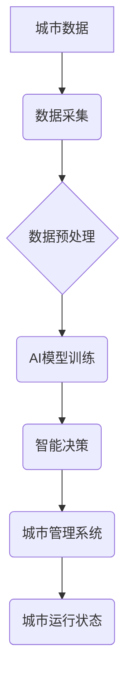

> 人工智能，城市计算，可持续发展，数据驱动，机器学习，深度学习，城市规划，智能交通，环境监测

## 1. 背景介绍

全球人口持续增长和城市化进程加速，城市面临着日益严峻的挑战，包括资源短缺、环境污染、交通拥堵、社会不公等。传统城市规划和管理模式难以有效应对这些挑战，迫切需要引入新的技术和理念来构建更加智能、可持续的城市。

人工智能（AI）作为一门新兴技术，正在深刻地改变着各行各业，包括城市发展。AI技术能够通过分析海量数据，识别模式和趋势，并做出智能决策，为城市管理提供新的思路和方法。

## 2. 核心概念与联系

**2.1 城市计算**

城市计算是指利用信息技术和计算能力，对城市运行状态进行实时监测、分析和管理，以提高城市效率、可持续性和居民生活质量。

**2.2 人工智能**

人工智能是指模拟人类智能行为的计算机系统，包括学习、推理、决策、感知和语言理解等能力。

**2.3 AI与城市计算的融合**

将AI技术与城市计算相结合，可以实现以下目标：

* **智能化城市管理:** 利用AI技术分析城市运行数据，预测城市发展趋势，优化资源配置，提高城市管理效率。
* **智慧交通系统:** 利用AI技术优化交通流量，减少拥堵，提高交通安全。
* **环境监测与保护:** 利用AI技术监测环境质量，预测污染风险，制定环境保护措施。
* **公共安全保障:** 利用AI技术分析安全数据，预测犯罪风险，提高公共安全水平。

**2.4 架构图**



## 3. 核心算法原理 & 具体操作步骤

**3.1 算法原理概述**

城市计算与AI融合的核心算法包括机器学习、深度学习、强化学习等。

* **机器学习:** 通过训练模型，使模型能够从数据中学习规律，并对新数据进行预测或分类。
* **深度学习:** 基于多层神经网络，能够学习更复杂的特征，适用于处理海量数据和复杂问题。
* **强化学习:** 通过奖励机制，训练模型在特定环境中做出最优决策。

**3.2 算法步骤详解**

1. **数据采集:** 收集城市运行数据，包括交通流量、环境监测、公共安全等方面的数据。
2. **数据预处理:** 对采集到的数据进行清洗、转换、特征提取等处理，使其适合模型训练。
3. **模型训练:** 选择合适的AI算法，并利用训练数据训练模型。
4. **模型评估:** 利用测试数据评估模型的性能，并进行模型调优。
5. **模型部署:** 将训练好的模型部署到城市管理系统中，用于实时数据分析和智能决策。

**3.3 算法优缺点**

* **优点:** 能够自动学习数据规律，提高决策效率，并提供数据驱动的决策支持。
* **缺点:** 需要大量数据进行训练，模型训练过程复杂，且模型解释性较差。

**3.4 算法应用领域**

* **智能交通:** 交通流量预测、拥堵缓解、智能信号灯控制。
* **环境监测:** 空气质量监测、水质监测、噪声污染监测。
* **公共安全:** 犯罪预测、视频监控、应急响应。
* **城市规划:** 城市发展趋势预测、土地利用规划、基础设施建设。

## 4. 数学模型和公式 & 详细讲解 & 举例说明

**4.1 数学模型构建**

城市计算与AI融合的数学模型通常基于统计学、概率论和优化理论。

**4.2 公式推导过程**

例如，在交通流量预测问题中，可以使用ARIMA模型进行预测。ARIMA模型的公式如下：

$$
y_t = c + \sum_{i=1}^p \phi_i y_{t-i} + \sum_{j=1}^q \theta_j \epsilon_{t-j} + \epsilon_t
$$

其中：

* $y_t$ 是时间t的流量值。
* $c$ 是截距项。
* $\phi_i$ 是自回归系数。
* $\theta_j$ 是移动平均系数。
* $\epsilon_t$ 是随机误差项。

**4.3 案例分析与讲解**

利用ARIMA模型可以预测未来一段时间内的交通流量，为交通管理提供决策依据。例如，如果预测到某个路段的流量将超过饱和流量，可以采取措施疏导交通，避免拥堵。

## 5. 项目实践：代码实例和详细解释说明

**5.1 开发环境搭建**

* 操作系统: Ubuntu 20.04
* Python 版本: 3.8
* 必要的库: pandas, numpy, scikit-learn, matplotlib

**5.2 源代码详细实现**

```python
import pandas as pd
from sklearn.model_selection import train_test_split
from sklearn.linear_model import LinearRegression
from sklearn.metrics import mean_squared_error

# 加载数据
data = pd.read_csv('traffic_data.csv')

# 划分训练集和测试集
X = data[['hour', 'weekday']]
y = data['traffic_volume']
X_train, X_test, y_train, y_test = train_test_split(X, y, test_size=0.2, random_state=42)

# 创建线性回归模型
model = LinearRegression()

# 训练模型
model.fit(X_train, y_train)

# 预测测试集数据
y_pred = model.predict(X_test)

# 计算模型性能
mse = mean_squared_error(y_test, y_pred)
print(f'Mean Squared Error: {mse}')

# 可视化预测结果
import matplotlib.pyplot as plt
plt.scatter(y_test, y_pred)
plt.xlabel('Actual Traffic Volume')
plt.ylabel('Predicted Traffic Volume')
plt.title('Traffic Volume Prediction')
plt.show()
```

**5.3 代码解读与分析**

* 代码首先加载交通数据，并划分训练集和测试集。
* 然后创建线性回归模型，并使用训练集训练模型。
* 接着使用测试集预测交通流量，并计算模型性能。
* 最后使用 matplotlib 库可视化预测结果。

**5.4 运行结果展示**

运行代码后，会输出模型的均方误差值，以及预测结果与实际值的散点图。

## 6. 实际应用场景

**6.1 智能交通**

* **交通流量预测:** 利用AI技术预测交通流量，为交通管理提供决策依据。
* **拥堵缓解:** 根据实时交通流量数据，优化交通信号灯控制，疏导交通拥堵。
* **智能导航:** 提供实时路况信息，推荐最优路线，提高驾驶效率。

**6.2 环境监测与保护**

* **空气质量监测:** 利用传感器数据，实时监测空气质量，并发布预警信息。
* **水质监测:** 利用传感器数据，实时监测水质，并进行污染源排查。
* **噪声污染监测:** 利用传感器数据，监测噪声水平，并制定噪声控制措施。

**6.3 公共安全保障**

* **犯罪预测:** 利用犯罪数据，预测犯罪风险，加强警力部署。
* **视频监控:** 利用AI技术分析视频监控数据，识别异常行为，提高安全防范水平。
* **应急响应:** 利用AI技术分析灾害信息，优化应急响应，减少灾害损失。

**6.4 未来应用展望**

* **城市微气候模拟:** 利用AI技术模拟城市微气候，优化城市绿化和建筑设计，提高城市宜居性。
* **智慧能源管理:** 利用AI技术优化能源分配，提高能源利用效率。
* **个性化城市服务:** 利用AI技术提供个性化城市服务，例如定制化交通路线、个性化推荐等。

## 7. 工具和资源推荐

**7.1 学习资源推荐**

* **书籍:**
    * 《深度学习》
    * 《机器学习实战》
    * 《Python数据科学手册》
* **在线课程:**
    * Coursera: 深度学习
    * edX: 机器学习
    * Udacity: AI工程师

**7.2 开发工具推荐**

* **Python:** 广泛应用于AI开发，拥有丰富的库和工具。
* **TensorFlow:** 开源深度学习框架，支持多种硬件平台。
* **PyTorch:** 开源深度学习框架，以其灵活性和易用性而闻名。
* **Jupyter Notebook:** 用于交互式编程和数据可视化的工具。

**7.3 相关论文推荐**

* **《Attention Is All You Need》:** 介绍了Transformer模型，在自然语言处理领域取得了突破性进展。
* **《Deep Residual Learning for Image Recognition》:** 介绍了ResNet模型，在图像识别领域取得了突破性进展。
* **《Generative Adversarial Networks》:** 介绍了GAN模型，在图像生成领域取得了突破性进展。

## 8. 总结：未来发展趋势与挑战

**8.1 研究成果总结**

AI技术在城市计算领域取得了显著进展，为城市管理和服务提供了新的思路和方法。

**8.2 未来发展趋势**

* **边缘计算:** 将AI模型部署到边缘设备，实现更快速、更低延迟的决策。
* **联邦学习:** 在不共享原始数据的情况下，训练联合模型，保护数据隐私。
* **多模态融合:** 将不同类型的数据融合在一起，例如文本、图像、视频等，提高AI模型的理解能力。

**8.3 面临的挑战**

* **数据质量:** 城市数据往往存在不完整、不准确、格式不统一等问题，需要进行有效的数据清洗和预处理。
* **模型解释性:** 许多AI模型的决策过程难以解释，这可能会导致人们对AI技术的信任度降低。
* **伦理问题:** AI技术在城市应用中可能引发一些伦理问题，例如数据隐私、算法偏见等，需要进行深入的探讨和解决。

**8.4 研究展望**

未来，AI技术将继续推动城市计算的发展，构建更加智能、可持续的城市。需要加强基础研究，解决技术难题，并关注AI技术的伦理和社会影响。

## 9. 附录：常见问题与解答

**9.1 如何选择合适的AI算法？**

选择合适的AI算法取决于具体应用场景和数据特点。例如，对于预测连续数值的场景，可以使用回归算法；对于分类问题，可以使用分类算法。

**9.2 如何处理城市数据中的噪声和异常值？**

可以使用数据清洗和预处理技术，例如删除异常值、填充缺失值、标准化数据等，来处理城市数据中的噪声和异常值。

**9.3 如何评估AI模型的性能？**

可以使用多种指标来评估AI模型的性能，例如准确率、召回率、F1-score、均方误差等。

**9.4 如何确保AI技术的公平性和可解释性？**

需要关注算法的偏见问题，并进行算法解释和透明化，以确保AI技术的公平性和可解释性。


作者：禅与计算机程序设计艺术 / Zen and the Art of Computer Programming 
<end_of_turn>