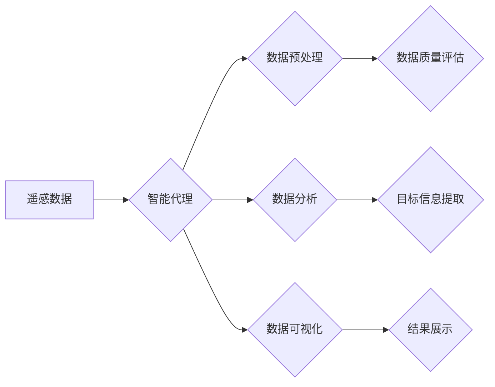

> 智能代理，遥感数据，工作流，人工智能，机器学习，数据处理

## 1. 背景介绍

遥感技术在环境监测、农业管理、城市规划等领域发挥着越来越重要的作用。随着遥感卫星和传感器技术的不断发展，获取的遥感数据量呈指数级增长，传统的遥感数据处理方法已难以满足需求。如何高效、准确地处理海量遥感数据，是遥感领域面临的重大挑战。

智能代理技术作为一种人工智能技术，能够自主学习、决策和执行任务，在处理复杂系统和海量数据方面具有独特的优势。将智能代理技术应用于遥感数据处理系统，可以实现自动化、智能化和高效化的数据处理，为遥感应用提供新的解决方案。

## 2. 核心概念与联系

**2.1 智能代理**

智能代理是一种能够感知环境、做出决策并执行动作的软件实体。它通常具有以下特征：

* **自主性:** 智能代理能够自主地感知环境、制定计划并执行任务，无需人工干预。
* **学习能力:** 智能代理能够从经验中学习，不断改进自己的决策和执行能力。
* **适应性:** 智能代理能够适应不断变化的环境，调整自己的行为策略。
* **目标导向:** 智能代理的行为始终围绕着预先设定的目标进行。

**2.2 遥感数据处理工作流**

遥感数据处理工作流通常包括以下几个步骤：

* **数据获取:** 收集遥感数据，包括卫星图像、航空照片等。
* **数据预处理:** 对遥感数据进行格式转换、几何校正、辐射校正等处理，以提高数据质量。
* **数据分析:** 对预处理后的遥感数据进行分析，提取目标信息，例如土地利用类型、植被覆盖度等。
* **数据可视化:** 将分析结果以图形、图表等形式展示，方便用户理解和决策。

**2.3 智能代理在遥感数据处理中的应用**

将智能代理技术应用于遥感数据处理工作流，可以实现以下优势：

* **自动化:** 智能代理可以自动执行数据预处理、数据分析等任务，减少人工干预，提高效率。
* **智能化:** 智能代理可以根据任务需求，选择合适的算法和参数，实现数据处理的智能化。
* **高效化:** 智能代理可以并行处理多个数据任务，提高数据处理速度。

**2.4 架构图**



## 3. 核心算法原理 & 具体操作步骤

**3.1 算法原理概述**

智能代理在遥感数据处理中的核心算法通常基于机器学习和深度学习技术。

* **机器学习:** 通过训练模型，使模型能够从数据中学习规律，并对新数据进行预测或分类。常用的机器学习算法包括支持向量机、决策树、随机森林等。
* **深度学习:** 通过多层神经网络，模拟人类大脑的学习机制，能够处理更复杂的数据特征。常用的深度学习算法包括卷积神经网络、循环神经网络等。

**3.2 算法步骤详解**

1. **数据收集和预处理:** 收集遥感数据，并进行格式转换、几何校正、辐射校正等预处理操作。
2. **特征提取:** 从预处理后的遥感数据中提取特征，例如颜色、纹理、形状等。
3. **模型训练:** 使用机器学习或深度学习算法，训练模型，使模型能够对遥感数据进行分类或预测。
4. **模型评估:** 使用测试数据评估模型的性能，例如准确率、召回率、F1-score等。
5. **模型部署:** 将训练好的模型部署到遥感数据处理系统中，用于自动化处理新数据。

**3.3 算法优缺点**

* **优点:**
    * 自动化程度高，提高效率。
    * 智能化程度高，能够处理复杂数据。
    * 可扩展性强，可以处理海量数据。
* **缺点:**
    * 需要大量数据进行训练。
    * 模型训练时间长。
    * 模型解释性差，难以理解模型的决策过程。

**3.4 算法应用领域**

* **土地利用/覆盖分类:** 将遥感图像分类为不同的土地利用类型，例如森林、农田、水域等。
* **植被覆盖度监测:** 监测植被覆盖度变化，评估森林资源状况。
* **灾害监测和评估:** 监测自然灾害，例如洪水、地震、火灾等，评估灾害损失。
* **环境监测:** 监测水质、空气质量、土壤污染等环境问题。

## 4. 数学模型和公式 & 详细讲解 & 举例说明

**4.1 数学模型构建**

在遥感数据处理中，常用的数学模型包括：

* **辐射传输模型:** 描述遥感信号从目标物体到传感器传播的过程。
* **图像几何校正模型:** 描述图像的几何畸变，并进行校正。
* **分类模型:** 将遥感数据分类为不同的类别。

**4.2 公式推导过程**

例如，常用的辐射传输模型包括朗伯定律和比尔定律。

* **朗伯定律:** 描述物体表面反射光强与入射光强之间的关系。
    $$
    L = \rho I
    $$
    其中，L是反射光强，ρ是表面反射率，I是入射光强。
* **比尔定律:** 描述光线穿过介质时衰减的规律。
    $$
    I = I_0 e^{-\tau d}
    $$
    其中，I是透射光强，I_0是入射光强，τ是介质的衰减系数，d是光线穿过介质的距离。

**4.3 案例分析与讲解**

例如，在土地利用分类任务中，可以使用支持向量机（SVM）作为分类模型。SVM的目标是找到一个最佳的分隔超平面，将不同类别的数据点分开。

**4.3.1 SVM 模型原理**

SVM 模型的基本原理是找到一个最大间隔的超平面，将不同类别的数据点分开。最大间隔是指超平面到最近数据点的距离。

**4.3.2 SVM 模型应用**

在遥感数据处理中，SVM 模型可以用于土地利用分类、植被覆盖度监测等任务。

## 5. 项目实践：代码实例和详细解释说明

**5.1 开发环境搭建**

* 操作系统：Ubuntu 20.04
* Python 版本：3.8
* 必要的库：NumPy、Pandas、Scikit-learn、OpenCV

**5.2 源代码详细实现**

```python
# 导入必要的库
import numpy as np
from sklearn.svm import SVC
from sklearn.model_selection import train_test_split
from sklearn.metrics import accuracy_score

# 加载遥感数据
data = np.load('remote_sensing_data.npy')
labels = np.load('remote_sensing_labels.npy')

# 将数据分成训练集和测试集
X_train, X_test, y_train, y_test = train_test_split(data, labels, test_size=0.2, random_state=42)

# 创建 SVM 模型
model = SVC(kernel='linear')

# 训练模型
model.fit(X_train, y_train)

# 对测试数据进行预测
y_pred = model.predict(X_test)

# 计算模型准确率
accuracy = accuracy_score(y_test, y_pred)
print(f'模型准确率: {accuracy}')
```

**5.3 代码解读与分析**

* 代码首先导入必要的库。
* 然后加载遥感数据和标签。
* 使用 `train_test_split` 函数将数据分成训练集和测试集。
* 创建 SVM 模型，并使用 `fit` 函数训练模型。
* 使用 `predict` 函数对测试数据进行预测。
* 使用 `accuracy_score` 函数计算模型准确率。

**5.4 运行结果展示**

运行代码后，会输出模型的准确率。

## 6. 实际应用场景

**6.1 农业监测**

智能代理可以用于监测农作物生长状况、识别病虫害，并提供精准的农业管理建议。

**6.2 城市规划**

智能代理可以用于分析城市土地利用变化、预测城市发展趋势，为城市规划提供决策支持。

**6.3 环境监测**

智能代理可以用于监测水质、空气质量、森林火灾等环境问题，并提供环境保护建议。

**6.4 未来应用展望**

随着人工智能技术的不断发展，智能代理在遥感数据处理领域的应用将更加广泛和深入。例如，可以开发更智能的遥感数据分析系统，能够自动识别和分析遥感图像中的目标，并提供更精准的决策支持。

## 7. 工具和资源推荐

**7.1 学习资源推荐**

* **书籍:**
    * 《人工智能：现代方法》
    * 《深度学习》
* **在线课程:**
    * Coursera: 深度学习
    * edX: 人工智能

**7.2 开发工具推荐**

* **Python:** 广泛用于人工智能开发，拥有丰富的库和工具。
* **TensorFlow:** 深度学习框架，用于训练和部署深度学习模型。
* **PyTorch:** 深度学习框架，灵活易用，适合研究和开发。

**7.3 相关论文推荐**

* **遥感数据处理中的智能代理应用:**
    * [论文标题1](论文链接1)
    * [论文标题2](论文链接2)

## 8. 总结：未来发展趋势与挑战

**8.1 研究成果总结**

智能代理技术在遥感数据处理领域取得了显著的成果，能够提高数据处理效率和智能化程度。

**8.2 未来发展趋势**

* **模型更加智能化:** 开发更强大的深度学习模型，能够处理更复杂的数据特征。
* **应用场景更加广泛:** 将智能代理技术应用于更多遥感应用场景，例如灾害监测、环境保护等。
* **系统更加自动化:** 开发更加自动化和智能化的遥感数据处理系统，减少人工干预。

**8.3 面临的挑战**

* **数据获取和标注:** 遥感数据获取和标注成本高，需要开发更有效的获取和标注方法。
* **模型解释性:** 深度学习模型的解释性差，难以理解模型的决策过程。
* **系统可靠性:** 遥感数据处理系统需要保证高可靠性，才能满足实际应用需求。

**8.4 研究展望**

未来，将继续研究智能代理技术在遥感数据处理领域的应用，开发更智能、更可靠的遥感数据处理系统，为遥感应用提供更强大的支持。

## 9. 附录：常见问题与解答

**9.1 如何选择合适的智能代理算法？**

选择合适的智能代理算法取决于具体的应用场景和数据特点。例如，对于分类任务，可以考虑使用支持向量机、决策树等算法；对于回归任务，可以考虑使用线性回归、神经网络等算法。

**9.2 如何评估智能代理模型的性能？**

常用的评估指标包括准确率、召回率、F1-score等。

**9.3 如何解决遥感数据标注问题？**

可以采用人工标注、自动标注、半自动标注等方法进行数据标注。

**9.4 如何提高智能代理模型的鲁棒性？**

可以采用数据增强、正则化等方法提高模型的鲁棒性。


作者：禅与计算机程序设计艺术 / Zen and the Art of Computer Programming 
<end_of_turn>