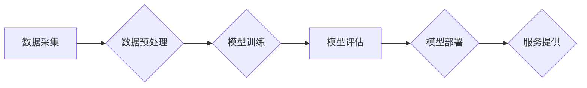

> AI大模型、创业、挑战、机遇、技术、商业、应用

## 1. 背景介绍

近年来，人工智能（AI）技术突飞猛进，特别是大模型的出现，为各行各业带来了前所未有的机遇。大模型，是指参数规模庞大、训练数据海量的人工智能模型，具备强大的泛化能力和学习能力，能够在自然语言处理、计算机视觉、语音识别等领域取得突破性进展。

随着大模型技术的成熟，越来越多的创业者看到了其中的商机，纷纷涌入AI大模型创业领域。然而，创业之路并非一帆风顺，AI大模型创业也面临着诸多挑战。

## 2. 核心概念与联系

**2.1 AI大模型概述**

AI大模型是指参数规模庞大、训练数据海量的人工智能模型。其核心特点包括：

* **规模化：** 大模型拥有数亿甚至数十亿个参数，远超传统机器学习模型。
* **泛化能力强：** 由于训练数据量大，大模型能够更好地泛化到未知数据，表现出更强的学习能力。
* **多任务学习：** 大模型可以同时学习多个任务，例如文本生成、图像识别、语音合成等。

**2.2 创业与AI大模型的结合**

AI大模型的强大能力为创业者提供了无限可能。创业者可以利用大模型技术开发各种创新产品和服务，例如：

* **智能客服：** 利用大模型构建智能聊天机器人，为用户提供24小时在线服务。
* **个性化推荐：** 根据用户的行为数据和偏好，利用大模型进行个性化商品推荐。
* **内容创作：** 利用大模型生成高质量的文本、图像、音频等内容。

**2.3 创业挑战与机遇**

AI大模型创业虽然充满机遇，但也面临着诸多挑战：

* **技术门槛高：** 训练和部署大模型需要强大的计算资源和专业技术。
* **数据获取困难：** 大模型需要海量数据进行训练，获取高质量数据是一个难题。
* **伦理风险：** 大模型可能存在偏见、歧视等伦理风险，需要谨慎对待。

**2.4 Mermaid 流程图**



## 3. 核心算法原理 & 具体操作步骤

**3.1 算法原理概述**

大模型的训练主要基于深度学习算法，其中Transformer模型是目前最流行的架构之一。Transformer模型的核心思想是利用注意力机制，捕捉文本序列中不同词之间的关系，从而更好地理解上下文信息。

**3.2 算法步骤详解**

1. **数据预处理：** 将原始文本数据进行清洗、分词、词向量化等处理，使其能够被模型理解。
2. **模型训练：** 利用深度学习框架（如TensorFlow、PyTorch）训练Transformer模型，通过反向传播算法不断优化模型参数。
3. **模型评估：** 使用测试数据集评估模型的性能，例如准确率、召回率、F1-score等指标。
4. **模型部署：** 将训练好的模型部署到服务器或云平台，使其能够提供服务。

**3.3 算法优缺点**

**优点：**

* 强大的泛化能力
* 能够处理长文本序列
* 训练效率高

**缺点：**

* 计算资源需求高
* 训练时间长
* 容易出现过拟合问题

**3.4 算法应用领域**

* 自然语言处理：文本分类、情感分析、机器翻译、问答系统等
* 计算机视觉：图像识别、目标检测、图像生成等
* 语音识别：语音转文本、语音合成等

## 4. 数学模型和公式 & 详细讲解 & 举例说明

**4.1 数学模型构建**

Transformer模型的核心是注意力机制，其数学模型可以表示为：

$$
Attention(Q, K, V) = softmax(\frac{QK^T}{\sqrt{d_k}})V
$$

其中：

* $Q$：查询矩阵
* $K$：键矩阵
* $V$：值矩阵
* $d_k$：键向量的维度
* $softmax$：softmax函数

**4.2 公式推导过程**

注意力机制的目的是计算查询向量与键向量的相关性，并根据相关性对值向量进行加权求和。

1. 计算查询向量与每个键向量的点积，得到一个分数矩阵。
2. 对分数矩阵进行归一化，得到一个概率分布。
3. 将概率分布与值向量进行加权求和，得到最终的输出向量。

**4.3 案例分析与讲解**

假设我们有一个句子“我爱学习编程”，我们要计算“学习”这个词与整个句子的相关性。

1. 将句子中的每个词都转换为向量表示。
2. 将“学习”作为查询向量，其他词作为键向量。
3. 计算查询向量与每个键向量的点积，得到一个分数矩阵。
4. 对分数矩阵进行归一化，得到一个概率分布，表示“学习”与每个词的相关性。
5. 将概率分布与值向量进行加权求和，得到最终的输出向量，表示“学习”与整个句子的相关性。

## 5. 项目实践：代码实例和详细解释说明

**5.1 开发环境搭建**

* 操作系统：Ubuntu 20.04
* Python 版本：3.8
* 深度学习框架：TensorFlow 2.0

**5.2 源代码详细实现**

```python
import tensorflow as tf

# 定义Transformer模型
class Transformer(tf.keras.Model):
    def __init__(self, vocab_size, embedding_dim, num_heads, num_layers):
        super(Transformer, self).__init__()
        self.embedding = tf.keras.layers.Embedding(vocab_size, embedding_dim)
        self.transformer_layers = tf.keras.layers.StackedRNNCells([
            tf.keras.layers.Attention(num_heads=num_heads)
            for _ in range(num_layers)
        ])

    def call(self, inputs):
        embeddings = self.embedding(inputs)
        outputs = self.transformer_layers(embeddings)
        return outputs

# 实例化模型
model = Transformer(vocab_size=10000, embedding_dim=128, num_heads=8, num_layers=6)

# 编译模型
model.compile(optimizer='adam', loss='mse')

# 训练模型
model.fit(x_train, y_train, epochs=10)
```

**5.3 代码解读与分析**

* 模型定义：定义了一个Transformer模型，包含嵌入层、多层Transformer层。
* 嵌入层：将词向量化，将每个词转换为一个向量表示。
* Transformer层：包含注意力机制和多头自注意力机制，用于捕捉文本序列中词之间的关系。
* 模型编译：使用Adam优化器和均方误差损失函数编译模型。
* 模型训练：使用训练数据训练模型，训练epochs轮次。

**5.4 运行结果展示**

训练完成后，可以将模型应用于文本生成、机器翻译等任务，并评估模型的性能。

## 6. 实际应用场景

**6.1 智能客服**

利用大模型构建智能聊天机器人，为用户提供24小时在线服务，例如回答常见问题、处理订单、预约服务等。

**6.2 个性化推荐**

根据用户的行为数据和偏好，利用大模型进行个性化商品推荐，例如电商平台、音乐平台、视频平台等。

**6.3 内容创作**

利用大模型生成高质量的文本、图像、音频等内容，例如新闻报道、广告文案、诗歌创作等。

**6.4 未来应用展望**

* **医疗诊断：** 利用大模型分析患者的病历、影像数据等，辅助医生进行诊断。
* **教育教学：** 利用大模型个性化定制学习方案，提高学习效率。
* **科学研究：** 利用大模型分析海量数据，加速科学发现。

## 7. 工具和资源推荐

**7.1 学习资源推荐**

* **书籍：**
    * 《深度学习》
    * 《自然语言处理》
* **在线课程：**
    * Coursera
    * edX
* **开源项目：**
    * TensorFlow
    * PyTorch

**7.2 开发工具推荐**

* **深度学习框架：** TensorFlow、PyTorch
* **云平台：** AWS、Google Cloud、Azure
* **编程语言：** Python

**7.3 相关论文推荐**

* 《Attention Is All You Need》
* 《BERT: Pre-training of Deep Bidirectional Transformers for Language Understanding》
* 《GPT-3: Language Models are Few-Shot Learners》

## 8. 总结：未来发展趋势与挑战

**8.1 研究成果总结**

近年来，AI大模型取得了显著进展，在自然语言处理、计算机视觉等领域取得了突破性进展。

**8.2 未来发展趋势**

* 模型规模进一步扩大
* 模型训练效率提升
* 模型应用场景更加广泛
* 模型安全性与可靠性增强

**8.3 面临的挑战**

* 计算资源需求高
* 数据获取困难
* 伦理风险
* 可解释性问题

**8.4 研究展望**

未来，AI大模型研究将继续朝着更强大、更安全、更可解释的方向发展。


## 9. 附录：常见问题与解答

**9.1 如何选择合适的AI大模型？**

选择合适的AI大模型需要根据具体的应用场景和需求进行考虑，例如模型规模、训练数据、性能指标等。

**9.2 如何训练自己的AI大模型？**

训练自己的AI大模型需要具备一定的技术基础和资源支持，包括数据准备、模型选择、训练环境搭建等。

**9.3 AI大模型存在哪些伦理风险？**

AI大模型可能存在偏见、歧视、隐私泄露等伦理风险，需要谨慎对待。

**9.4 如何提高AI大模型的安全性？**

可以通过模型安全评估、对抗训练、数据安全保护等措施提高AI大模型的安全性。


作者：禅与计算机程序设计艺术 / Zen and the Art of Computer Programming 
<end_of_turn>