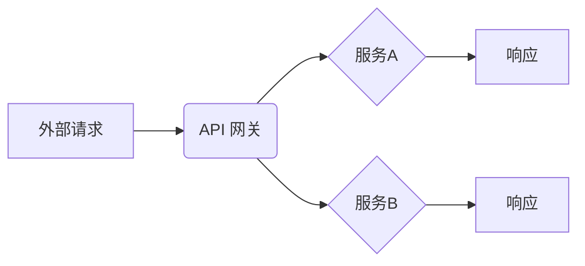

> API 网关, API 管理, 微服务架构, 安全, 性能优化, 监控

## 1. 背景介绍

在当今以互联网为核心的时代，应用程序之间的交互日益频繁，API（Application Programming Interface）作为应用程序之间通信的桥梁，扮演着越来越重要的角色。随着微服务架构的兴起，应用程序被拆分成多个独立的服务，API 网关作为连接这些服务的统一入口，成为了现代软件架构不可或缺的一部分。

API 网关的功能不仅仅局限于转发请求，它还承担着安全控制、流量管理、性能优化、监控分析等多重职责，为应用程序提供了一层全面的保护和管理层。

## 2. 核心概念与联系

API 网关是位于应用程序和外部世界之间的中间层，它负责接收来自外部的请求，并将其转发到相应的服务。同时，API 网关还提供了一系列功能，例如：

* **路由转发：** 根据请求的路径和方法，将请求转发到相应的服务。
* **安全控制：** 对请求进行身份验证和授权，确保只有授权的用户才能访问特定的资源。
* **流量管理：** 控制请求的流量，防止服务被过载。
* **性能优化：** 通过缓存、压缩等手段，提高请求的响应速度。
* **监控分析：** 收集请求和响应的日志，以便进行性能分析和故障诊断。

**API 网关架构**



## 3. 核心算法原理 & 具体操作步骤

### 3.1  算法原理概述

API 网关的核心算法主要包括路由算法、安全算法和流量管理算法。

* **路由算法：** 根据请求的路径和方法，将请求转发到相应的服务。常见的路由算法包括正则表达式匹配、哈希路由和树形路由。
* **安全算法：** 对请求进行身份验证和授权，确保只有授权的用户才能访问特定的资源。常见的安全算法包括OAuth 2.0、JWT（JSON Web Token）和API 密钥。
* **流量管理算法：** 控制请求的流量，防止服务被过载。常见的流量管理算法包括限流、降级和熔断。

### 3.2  算法步骤详解

**路由算法示例：正则表达式匹配**

1. API 网关收到外部请求。
2. 解析请求的路径和方法。
3. 使用正则表达式匹配请求路径，找到匹配的路由规则。
4. 根据路由规则，将请求转发到相应的服务。

**安全算法示例：OAuth 2.0**

1. 用户发起请求，需要授权访问资源。
2. API 网关引导用户到授权服务器进行授权。
3. 用户授权后，授权服务器颁发访问令牌给用户。
4. 用户将访问令牌发送给 API 网关。
5. API 网关验证访问令牌的有效性，并允许用户访问资源。

**流量管理算法示例：限流**

1. API 网关记录每个用户的请求次数。
2. 当用户的请求次数超过设定阈值时，API 网关会拒绝用户的请求。
3. 设定不同的阈值，对不同类型的用户进行不同的限流策略。

### 3.3  算法优缺点

**路由算法**

* **正则表达式匹配：** 灵活、可定制，但性能较低。
* **哈希路由：** 性能高，但路由规则难以维护。
* **树形路由：** 性能中等，路由规则易于维护。

**安全算法**

* **OAuth 2.0：** 安全性高，标准化程度高，但配置复杂。
* **JWT：** 轻量级、易于实现，但安全性相对较低。
* **API 密钥：** 简单易用，但安全性较低。

**流量管理算法**

* **限流：** 简单易用，但可能导致用户体验下降。
* **降级：** 降低服务响应时间，但可能影响服务功能。
* **熔断：** 在服务故障时，阻止请求进入服务，保护服务稳定性。

### 3.4  算法应用领域

API 网关的算法广泛应用于各种领域，例如：

* **电商平台：** 控制商品访问流量，防止服务崩溃。
* **社交媒体：** 管理用户访问权限，保护用户隐私。
* **金融服务：** 安全验证用户身份，防止欺诈行为。
* **云计算：** 管理 API 调用次数，控制成本。

## 4. 数学模型和公式 & 详细讲解 & 举例说明

### 4.1  数学模型构建

API 网关的流量管理算法可以采用数学模型来描述，例如：

* **令牌桶算法：** 

令牌桶算法是一种常用的流量控制算法，它通过模拟一个桶来控制请求的频率。

令牌桶算法的数学模型如下：

$$
T(t) = \begin{cases}
    \text{rate} \cdot \Delta t & \text{if } T(t) < \text{capacity} \\
    \text{capacity} & \text{otherwise}
\end{cases}
$$

其中：

* $T(t)$：令牌桶中的令牌数量
* $\text{rate}$：令牌生成速率
* $\Delta t$：时间间隔
* $\text{capacity}$：令牌桶的容量

**举例说明：**

假设令牌生成速率为 10 个令牌/秒，令牌桶容量为 100 个令牌。则每秒钟生成 10 个令牌，直到令牌桶容量达到 100 个令牌。

* **滑动窗口算法：**

滑动窗口算法是一种基于时间窗口的流量控制算法，它通过记录一段时间内的请求数量来控制请求频率。

滑动窗口算法的数学模型如下：

$$
\text{window_size} = \text{time_window} \cdot \text{rate}
$$

其中：

* $\text{window_size}$：滑动窗口的大小
* $\text{time_window}$：时间窗口的长度
* $\text{rate}$：请求速率

**举例说明：**

假设时间窗口长度为 1 分钟，请求速率为 100 个请求/分钟。则滑动窗口的大小为 100 个请求。

### 4.2  公式推导过程

**令牌桶算法的推导过程：**

1. 假设令牌生成速率为 $r$，令牌桶容量为 $c$。
2. 在时间间隔 $\Delta t$ 内，生成 $r \cdot \Delta t$ 个令牌。
3. 令牌桶中的令牌数量 $T(t)$ 变化如下：

$$
T(t) = \min(T(t) + r \cdot \Delta t, c)
$$

4. 当令牌桶中的令牌数量大于 0 时，允许一个请求通过。

**滑动窗口算法的推导过程：**

1. 假设时间窗口长度为 $w$，请求速率为 $s$。
2. 滑动窗口的大小为 $w \cdot s$。
3. 在时间窗口内，允许最多 $w \cdot s$ 个请求通过。
4. 当请求数量超过滑动窗口大小时，拒绝后续请求。

### 4.3  案例分析与讲解

**令牌桶算法案例：**

假设一个 API 网关需要控制用户每天访问 API 的次数，每天允许访问 100 次。可以使用令牌桶算法来实现，令牌生成速率为 1 个令牌/秒，令牌桶容量为 86400 个令牌（每天 24 小时 * 60 分钟 * 60 秒）。

**滑动窗口算法案例：**

假设一个 API 网关需要控制用户每分钟访问 API 的次数，每分钟允许访问 10 次。可以使用滑动窗口算法来实现，时间窗口长度为 1 分钟，请求速率为 10 个请求/分钟。

## 5. 项目实践：代码实例和详细解释说明

### 5.1  开发环境搭建

* 操作系统：Linux
* 编程语言：Go
* 工具：Docker、Kubernetes

### 5.2  源代码详细实现

```go
package main

import (
\t"fmt"
\t"net/http"
)

func main() {
\thttp.HandleFunc("/api/v1/users", handleUserRequest)
\tfmt.Println("API Gateway started on port 8080")
\thttp.ListenAndServe(":8080", nil)
}

func handleUserRequest(w http.ResponseWriter, r *http.Request) {
\t// 1. 路由转发
\t// 根据请求路径，转发到相应的服务
\t// 例如，转发到 /api/v1/users 服务

\t// 2. 安全控制
\t// 验证用户身份和权限

\t// 3. 流量管理
\t// 控制请求频率

\t// 4. 性能优化
\t// 使用缓存、压缩等手段提高响应速度

\t// 5. 监控分析
\t// 收集请求和响应日志

\tfmt.Fprintf(w, "Hello from API Gateway!")
}
```

### 5.3  代码解读与分析

* `http.HandleFunc`: 注册路由规则，将请求路径 `/api/v1/users` 映射到 `handleUserRequest` 函数。
* `handleUserRequest`: 处理用户请求的函数，包含路由转发、安全控制、流量管理、性能优化和监控分析等功能。

### 5.4  运行结果展示

启动 API 网关服务后，访问 `http://localhost:8080/api/v1/users`，将返回 "Hello from API Gateway!" 的响应。

## 6. 实际应用场景

API 网关在各种场景下都有广泛的应用，例如：

* **电商平台：** 控制商品访问流量，防止服务崩溃。
* **社交媒体：** 管理用户访问权限，保护用户隐私。
* **金融服务：** 安全验证用户身份，防止欺诈行为。
* **云计算：** 管理 API 调用次数，控制成本。

### 6.4  未来应用展望

随着微服务架构的普及和 API 的日益重要性，API 网关的应用场景将会更加广泛，例如：

* **API 管理平台：** 提供 API 的发布、管理、监控和分析等功能。
* **服务网格：** 在微服务架构中，API 网关可以作为服务网格的一部分，提供服务发现、负载均衡和安全控制等功能。
* **边缘计算：** API 网关可以部署在边缘节点，提供本地化服务和数据处理。

## 7. 工具和资源推荐

### 7.1  学习资源推荐

* **书籍：**
    * API Gateway Design Patterns
    * Building Microservices
* **博客：**
    * https://www.nginx.com/blog/
    * https://www.apigee.com/blog/

### 7.2  开发工具推荐

* **Kong:** 开源 API 网关，支持多种协议和插件。
* **Tyk:** 开源 API 网关，提供丰富的 API 管理功能。
* **Apigee:** 企业级 API 网关，提供强大的功能和支持。

### 7.3  相关论文推荐

* **API Gateway Design Patterns**
* **Microservices Architecture: Principles and Patterns**

## 8. 总结：未来发展趋势与挑战

### 8.1  研究成果总结

API 网关已经成为现代软件架构中不可或缺的一部分，它为应用程序提供了安全、可靠、可扩展的访问控制和管理机制。

### 8.2  未来发展趋势

* **更智能化的 API 网关：** 利用人工智能和机器学习技术，实现更智能的流量管理、安全控制和故障诊断。
* **更强大的 API 管理平台：** 提供更丰富的 API 管理功能，例如 API 设计、文档生成、测试和监控。
* **更安全的 API 网关：** 采用更先进的安全技术，防止 API 攻击和数据泄露。

### 8.3  面临的挑战

* **复杂性：** API 网关的架构和功能