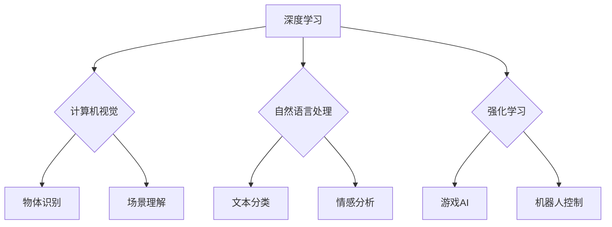

> 人工智能，深度学习，计算机视觉，自然语言处理，强化学习，应用场景，未来趋势

## 1. 背景介绍

人工智能（AI）正以惊人的速度发展，其影响力正在深刻地改变着我们的世界。从自动驾驶汽车到医疗诊断，从个性化推荐到智能客服，AI技术正在各个领域展现出强大的应用潜力。作为AI领域的领军人物之一，Andrej Karpathy 博士的研究和工作为推动AI技术的发展做出了重要贡献。

Andrej Karpathy 博士是特斯拉自动驾驶团队的负责人，也是OpenAI的联合创始人之一。他是一位享誉全球的计算机科学家，在深度学习、计算机视觉和自然语言处理等领域取得了突破性的成果。他的研究成果被广泛应用于自动驾驶、图像识别、语音识别等领域，对推动AI技术的发展产生了深远的影响。

## 2. 核心概念与联系

**2.1 深度学习**

深度学习是机器学习的一个子领域，它利用多层神经网络来模拟人类大脑的学习过程。通过训练大量的样本数据，深度学习模型能够自动学习特征，并进行复杂的模式识别和预测。

**2.2 计算机视觉**

计算机视觉是让计算机“看”和理解图像和视频的技术。它利用深度学习算法来识别物体、场景、人脸等，并进行图像分类、目标检测、图像分割等任务。

**2.3 自然语言处理**

自然语言处理（NLP）是让计算机理解和处理人类语言的技术。它利用深度学习算法来分析文本数据，进行文本分类、情感分析、机器翻译等任务。

**2.4 强化学习**

强化学习是一种机器学习方法，它通过奖励和惩罚机制来训练智能体，使其在特定环境中做出最优决策。

**2.5 应用场景**

深度学习、计算机视觉、自然语言处理和强化学习等技术在各个领域都有广泛的应用场景，例如：

* **自动驾驶:** 利用计算机视觉和强化学习技术，使汽车能够感知周围环境，并做出安全可靠的驾驶决策。
* **医疗诊断:** 利用计算机视觉和深度学习技术，辅助医生进行疾病诊断，提高诊断准确率。
* **个性化推荐:** 利用自然语言处理和深度学习技术，根据用户的兴趣和行为，推荐个性化的商品和服务。
* **智能客服:** 利用自然语言处理技术，开发智能客服系统，为用户提供快速、高效的客户服务。

**2.6 Mermaid 流程图**



## 3. 核心算法原理 & 具体操作步骤

### 3.1 算法原理概述

深度学习算法的核心是多层神经网络。神经网络由多个层组成，每层包含多个神经元。每个神经元接收来自上一层的输入信号，并对其进行处理，然后将处理后的信号传递到下一层。通过训练大量的样本数据，神经网络能够自动学习特征，并进行复杂的模式识别和预测。

### 3.2 算法步骤详解

1. **数据预处理:** 将原始数据进行清洗、转换和特征提取，使其适合深度学习模型的训练。
2. **模型构建:** 根据具体的应用场景，选择合适的深度学习模型架构，例如卷积神经网络（CNN）、循环神经网络（RNN）等。
3. **模型训练:** 利用训练数据，通过反向传播算法，调整模型参数，使其能够准确地预测目标输出。
4. **模型评估:** 利用测试数据，评估模型的性能，例如准确率、召回率、F1-score等。
5. **模型部署:** 将训练好的模型部署到实际应用场景中，进行预测和决策。

### 3.3 算法优缺点

**优点:**

* **高准确率:** 深度学习模型能够学习到复杂的特征，从而实现高准确率的预测。
* **自动化特征提取:** 深度学习模型能够自动学习特征，无需人工特征工程。
* **泛化能力强:** 深度学习模型能够泛化到新的数据，并进行预测。

**缺点:**

* **数据依赖:** 深度学习模型需要大量的样本数据进行训练。
* **计算资源消耗大:** 深度学习模型的训练需要大量的计算资源。
* **可解释性差:** 深度学习模型的决策过程难以解释。

### 3.4 算法应用领域

深度学习算法广泛应用于各个领域，例如：

* **计算机视觉:** 图像识别、目标检测、图像分割、人脸识别等。
* **自然语言处理:** 文本分类、情感分析、机器翻译、文本生成等。
* **语音识别:** 语音转文本、语音合成等。
* **推荐系统:** 商品推荐、内容推荐等。
* **医疗诊断:** 疾病诊断、影像分析等。

## 4. 数学模型和公式 & 详细讲解 & 举例说明

### 4.1 数学模型构建

深度学习模型的数学基础是神经网络。神经网络由多个层组成，每层包含多个神经元。每个神经元接收来自上一层的输入信号，并对其进行处理，然后将处理后的信号传递到下一层。

**4.1.1 神经元模型:**

一个神经元的输入信号为 $x_1, x_2, ..., x_n$，权重为 $w_1, w_2, ..., w_n$，偏置为 $b$。神经元的输出为：

$$
f(z) = f(w_1x_1 + w_2x_2 + ... + w_nx_n + b)
$$

其中，$f$ 是激活函数，例如 sigmoid 函数、ReLU 函数等。

**4.1.2 多层神经网络:**

多层神经网络由多个神经元层组成。每一层的神经元接收上一层的输出作为输入，并将其传递到下一层。

### 4.2 公式推导过程

深度学习模型的训练过程是通过反向传播算法来实现的。反向传播算法的核心思想是利用梯度下降法来更新模型参数，使其能够最小化损失函数。

**4.2.1 损失函数:**

损失函数用于衡量模型预测结果与真实值的差距。常见的损失函数包括均方误差（MSE）、交叉熵损失等。

**4.2.2 梯度下降法:**

梯度下降法是一种迭代优化算法，它通过计算损失函数的梯度，来更新模型参数，使其朝着损失函数最小化的方向前进。

### 4.3 案例分析与讲解

**4.3.1 图像分类:**

假设我们有一个图像分类任务，目标是将图像分类为不同的类别，例如猫、狗、鸟等。我们可以使用卷积神经网络（CNN）来解决这个问题。CNN 可以自动学习图像特征，并进行分类。

**4.3.2 文本分类:**

假设我们有一个文本分类任务，目标是将文本分类为不同的类别，例如正向情感、负向情感、中性情感等。我们可以使用循环神经网络（RNN）来解决这个问题。RNN 可以处理序列数据，例如文本，并学习文本的语义信息。

## 5. 项目实践：代码实例和详细解释说明

### 5.1 开发环境搭建

* **操作系统:** Ubuntu 18.04
* **编程语言:** Python 3.6
* **深度学习框架:** TensorFlow 2.0

### 5.2 源代码详细实现

```python
import tensorflow as tf

# 定义模型结构
model = tf.keras.models.Sequential([
    tf.keras.layers.Conv2D(32, (3, 3), activation='relu', input_shape=(28, 28, 1)),
    tf.keras.layers.MaxPooling2D((2, 2)),
    tf.keras.layers.Conv2D(64, (3, 3), activation='relu'),
    tf.keras.layers.MaxPooling2D((2, 2)),
    tf.keras.layers.Flatten(),
    tf.keras.layers.Dense(10, activation='softmax')
])

# 编译模型
model.compile(optimizer='adam',
              loss='sparse_categorical_crossentropy',
              metrics=['accuracy'])

# 加载数据集
(x_train, y_train), (x_test, y_test) = tf.keras.datasets.mnist.load_data()

# 数据预处理
x_train = x_train.astype('float32') / 255.0
x_test = x_test.astype('float32') / 255.0
x_train = x_train.reshape((x_train.shape[0], 28, 28, 1))
x_test = x_test.reshape((x_test.shape[0], 28, 28, 1))

# 训练模型
model.fit(x_train, y_train, epochs=5)

# 评估模型
loss, accuracy = model.evaluate(x_test, y_test)
print('Test loss:', loss)
print('Test accuracy:', accuracy)
```

### 5.3 代码解读与分析

这段代码实现了使用 TensorFlow 框架训练一个简单的 MNIST 手写数字识别模型。

* **模型结构:** 代码定义了一个简单的卷积神经网络（CNN）模型，包含两个卷积层、两个最大池化层、一个全连接层和一个输出层。
* **模型编译:** 代码使用 Adam 优化器、交叉熵损失函数和准确率作为评估指标来编译模型。
* **数据加载和预处理:** 代码使用 MNIST 数据集，并对数据进行预处理，例如归一化和形状转换。
* **模型训练:** 代码使用 `model.fit()` 方法训练模型，训练 epochs=5 次。
* **模型评估:** 代码使用 `model.evaluate()` 方法评估模型在测试集上的性能。

### 5.4 运行结果展示

训练完成后，模型能够准确识别 MNIST 手写数字。

## 6. 实际应用场景

### 6.1 自动驾驶

自动驾驶汽车需要感知周围环境，并做出安全可靠的驾驶决策。深度学习算法可以用于实现自动驾驶汽车的关键功能，例如：

* **物体检测:** 检测道路上的车辆、行人、交通信号灯等物体。
* **场景理解:** 理解道路场景，例如道路类型、交通流量等。
* **路径规划:** 规划行驶路径，并避开障碍物。

### 6.2 医疗诊断

深度学习算法可以辅助医生进行疾病诊断，提高诊断准确率。例如：

* **影像分析:** 分析 X 光片、CT 扫描、MRI 图像等，识别肿瘤、骨折等病变。
* **病理学诊断:** 分析病理切片，识别癌细胞等。
* **疾病预测:** 根据患者的病史、症状等信息，预测疾病风险。

### 6.3 个性化推荐

深度学习算法可以根据用户的兴趣和行为，推荐个性化的商品和服务。例如：

* **电商推荐:** 推荐用户可能感兴趣的商品。
* **内容推荐:** 推荐用户可能感兴趣的文章、视频等内容。
* **音乐推荐:** 推荐用户可能喜欢的音乐。

### 6.4 未来应用展望

随着深度学习技术的不断发展，其应用场景将更加广泛。例如：

* **机器人:** 深度学习可以使机器人更加智能，能够更好地感知环境、理解指令、做出决策。
* **自然语言理解:** 深度学习可以使机器更加理解人类语言，能够更好地进行对话、翻译、写作等任务。
* **科学研究:** 深度学习可以用于分析大规模数据，发现新的科学规律。

## 7. 工具和资源推荐

### 7.1 学习资源推荐

* **书籍:**
    * 深度学习 (Deep Learning) - Ian Goodfellow, Yoshua Bengio, Aaron Courville
    * 构建深度学习模型 (Hands-On Machine Learning with Scikit-Learn, Keras & TensorFlow) - Aurélien Géron