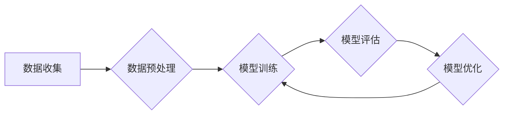

> 大语言模型，计算，人工智能，自然语言处理，Transformer，深度学习，应用场景

## 1. 背景介绍

近年来，人工智能领域取得了令人瞩目的进展，其中大语言模型（Large Language Models，LLMs）作为一种强大的工具，在自然语言处理（Natural Language Processing，NLP）领域展现出巨大的潜力。大语言模型能够理解和生成人类语言，并完成各种复杂的任务，例如文本生成、翻译、问答、代码生成等。

Andrej Karpathy，一位享誉全球的人工智能专家，在推动大语言模型发展方面做出了重要贡献。他曾担任特斯拉人工智能总监，领导了 Autopilot 项目的开发，并对深度学习和计算机视觉领域做出了杰出贡献。

## 2. 核心概念与联系

大语言模型的核心概念是利用深度学习算法训练一个庞大的神经网络模型，使其能够理解和生成人类语言。这些模型通常基于 Transformer 架构，该架构能够有效地处理序列数据，例如文本。

**Mermaid 流程图：大语言模型的训练过程**



大语言模型的训练过程包括以下步骤：

1. **数据收集:** 收集大量文本数据，例如书籍、文章、代码等。
2. **数据预处理:** 对收集到的数据进行清洗、格式化和标记，使其能够被模型理解。
3. **模型训练:** 利用深度学习算法训练模型，使其能够从数据中学习语言的规律。
4. **模型评估:** 对训练好的模型进行评估，衡量其性能。
5. **模型优化:** 根据评估结果，调整模型参数，提高其性能。

## 3. 核心算法原理 & 具体操作步骤

### 3.1  算法原理概述

大语言模型的核心算法是 Transformer 架构，它是一种基于注意力机制的神经网络模型。注意力机制能够帮助模型关注输入序列中重要的信息，从而提高模型的理解和生成能力。

### 3.2  算法步骤详解

Transformer 架构主要由以下几个部分组成：

1. **编码器 (Encoder):** 用于将输入序列编码成一个固定长度的向量表示。
2. **解码器 (Decoder):** 用于根据编码后的向量表示生成输出序列。
3. **注意力机制:** 用于帮助模型关注输入序列中重要的信息。

### 3.3  算法优缺点

**优点:**

* 能够有效处理长序列数据。
* 具有强大的泛化能力。
* 可以并行训练，提高训练效率。

**缺点:**

* 训练成本高，需要大量的计算资源。
* 模型参数量大，部署成本高。

### 3.4  算法应用领域

Transformer 架构在 NLP 领域得到了广泛应用，例如：

* 文本生成
* 机器翻译
* 问答系统
* 代码生成

## 4. 数学模型和公式 & 详细讲解 & 举例说明

### 4.1  数学模型构建

Transformer 架构的数学模型主要基于线性变换、激活函数和注意力机制。

**线性变换:** 用于将输入数据映射到不同的维度空间。

**激活函数:** 用于引入非线性，提高模型的表达能力。

**注意力机制:** 用于计算输入序列中每个词与输出序列中每个词之间的相关性，并根据相关性调整输出的权重。

### 4.2  公式推导过程

注意力机制的计算公式如下：

$$
Attention(Q, K, V) = softmax(\frac{QK^T}{\sqrt{d_k}})V
$$

其中：

* $Q$：查询矩阵
* $K$：键矩阵
* $V$：值矩阵
* $d_k$：键向量的维度

### 4.3  案例分析与讲解

假设我们有一个句子 "The cat sat on the mat"，我们要计算每个词与 "sat" 词之间的注意力权重。

1. 将句子中的每个词转换为词向量，形成查询矩阵 $Q$、键矩阵 $K$ 和值矩阵 $V$。
2. 计算 $QK^T$，得到一个矩阵，每个元素表示两个词之间的相关性。
3. 对 $QK^T$ 进行归一化，得到注意力权重矩阵。
4. 将注意力权重矩阵与值矩阵 $V$ 进行加权求和，得到 "sat" 词的上下文表示。

## 5. 项目实践：代码实例和详细解释说明

### 5.1  开发环境搭建

为了实现大语言模型的开发，需要搭建一个合适的开发环境。常用的开发环境包括：

* Python 3.x
* TensorFlow 或 PyTorch 深度学习框架
* CUDA 和 cuDNN GPU 加速库

### 5.2  源代码详细实现

以下是一个使用 TensorFlow 实现简单 Transformer 模型的代码示例：

```python
import tensorflow as tf

# 定义 Transformer 模型
class Transformer(tf.keras.Model):
    def __init__(self, vocab_size, embedding_dim, num_heads, num_layers):
        super(Transformer, self).__init__()
        self.embedding = tf.keras.layers.Embedding(vocab_size, embedding_dim)
        self.transformer_layers = tf.keras.layers.StackedRNNCells([
            tf.keras.layers.MultiHeadAttention(num_heads=num_heads, key_dim=embedding_dim)
            for _ in range(num_layers)
        ])

    def call(self, inputs):
        x = self.embedding(inputs)
        x = self.transformer_layers(x)
        return x

# 实例化模型
model = Transformer(vocab_size=10000, embedding_dim=128, num_heads=8, num_layers=6)

# 训练模型
# ...
```

### 5.3  代码解读与分析

这段代码定义了一个简单的 Transformer 模型，包括嵌入层、多头注意力层和堆叠的 RNN 层。

* 嵌入层将每个词转换为一个词向量。
* 多头注意力层用于计算每个词与其他词之间的注意力权重。
* 堆叠的 RNN 层用于将注意力权重信息传递到下一个层级。

### 5.4  运行结果展示

训练好的模型可以用于各种 NLP 任务，例如文本生成、机器翻译等。

## 6. 实际应用场景

大语言模型在各个领域都有着广泛的应用场景：

### 6.1  聊天机器人

大语言模型可以用于构建更智能、更自然的聊天机器人，能够理解用户的意图并提供更准确的回复。

### 6.2  文本摘要

大语言模型可以自动生成文本摘要，提取文本的关键信息，节省用户阅读时间。

### 6.3  机器翻译

大语言模型可以实现高质量的机器翻译，将文本从一种语言翻译成另一种语言。

### 6.4  未来应用展望

随着大语言模型技术的不断发展，其应用场景将会更加广泛，例如：

* 自动写作
* 代码生成
* 教育辅助
* 医疗诊断

## 7. 工具和资源推荐

### 7.1  学习资源推荐

* **书籍:**
    * "Deep Learning" by Ian Goodfellow, Yoshua Bengio, and Aaron Courville
    * "Attention Is All You Need" by Vaswani et al.
* **在线课程:**
    * Coursera: Deep Learning Specialization
    * Stanford CS224N: Natural Language Processing with Deep Learning

### 7.2  开发工具推荐

* **TensorFlow:** https://www.tensorflow.org/
* **PyTorch:** https://pytorch.org/

### 7.3  相关论文推荐

* "Attention Is All You Need"
* "BERT: Pre-training of Deep Bidirectional Transformers for Language Understanding"
* "GPT-3: Language Models are Few-Shot Learners"

## 8. 总结：未来发展趋势与挑战

### 8.1  研究成果总结

大语言模型在 NLP 领域取得了显著的进展，能够完成各种复杂的任务，并展现出强大的泛化能力。

### 8.2  未来发展趋势

未来，大语言模型的发展趋势包括：

* 模型规模的进一步扩大
* 训练数据的多样化和高质量化
* 算法的创新和优化
* 应用场景的拓展

### 8.3  面临的挑战

大语言模型也面临着一些挑战，例如：

* 训练成本高
* 模型参数量大
* 存在潜在的偏见和误导性

### 8.4  研究展望

未来，需要进一步研究大语言模型的安全性、可解释性和伦理问题，使其能够更安全、更可靠地应用于各个领域。

## 9. 附录：常见问题与解答

### 9.1  常见问题

* 什么是 Transformer 架构？
* 大语言模型的训练过程是什么？
* 大语言模型有哪些应用场景？

### 9.2  解答

* Transformer 架构是一种基于注意力机制的神经网络模型，能够有效处理长序列数据。
* 大语言模型的训练过程包括数据收集、数据预处理、模型训练、模型评估和模型优化。
* 大语言模型的应用场景包括聊天机器人、文本摘要、机器翻译等。


作者：禅与计算机程序设计艺术 / Zen and the Art of Computer Programming 
<end_of_turn>