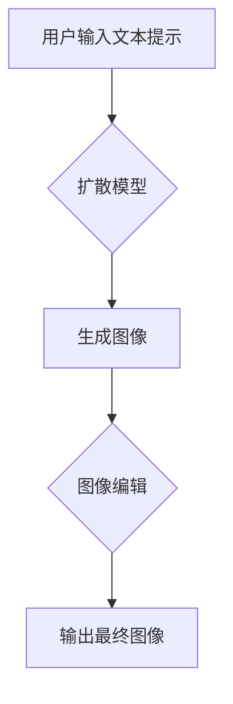

> Dify.AI, ComfyUI,  文本到图像,  AI 生成模型,  扩散模型,  文本提示,  图像编辑,  AI 艺术

## 1. 背景介绍

近年来，人工智能领域取得了令人瞩目的进展，特别是文本到图像生成模型的快速发展。Dify.AI 和 ComfyUI 便是这两大领域中备受关注的开源项目。它们都基于强大的扩散模型架构，能够根据用户提供的文本提示生成高质量的图像，并提供丰富的图像编辑功能。

Dify.AI 由 HuggingFace 开发，是一个基于 Stable Diffusion 的文本到图像生成模型，它以其易于使用和强大的生成能力而闻名。ComfyUI 则是一个基于 PyTorch 的开源项目，它提供了更灵活的图像编辑和控制功能，并支持多种不同的扩散模型。

尽管 Dify.AI 和 ComfyUI 都是文本到图像生成领域的优秀代表，但它们在架构、功能和应用场景上也存在一些差异。本文将深入探讨 Dify.AI 和 ComfyUI 的相似之处和区别，并分析它们在未来发展趋势中的潜在影响。

## 2. 核心概念与联系

### 2.1 扩散模型

扩散模型是一种基于概率的生成模型，它通过逐步添加噪声到图像中，然后学习逆向过程，从噪声图像中恢复出原始图像。这种模型架构具有以下特点：

* **渐进式生成:** 扩散模型通过一系列步骤逐步生成图像，每个步骤都添加或去除噪声，最终生成完整的图像。
* **强大的生成能力:** 扩散模型能够生成高质量、逼真的图像，并支持多种图像风格和主题。
* **灵活的控制:** 通过调整文本提示或其他控制参数，可以对生成图像进行细粒度的控制。

### 2.2 文本提示

文本提示是扩散模型生成图像的关键输入，它提供给模型关于生成图像的语义信息。文本提示可以描述图像的主题、风格、构图、颜色等方面，从而引导模型生成符合用户意图的图像。

### 2.3 图像编辑

图像编辑是指对已生成图像进行修改和调整，以达到特定的效果。Dify.AI 和 ComfyUI 都提供了丰富的图像编辑功能，例如：

* **图像修复:** 修复图像中的瑕疵或损坏部分。
* **图像增强:** 提高图像的清晰度、对比度和色彩饱和度。
* **图像风格迁移:** 将图像应用于不同的艺术风格。

### 2.4 Mermaid 流程图

## 3. 核心算法原理 & 具体操作步骤

### 3.1 算法原理概述

Dify.AI 和 ComfyUI 都基于扩散模型的原理，其核心算法可以概括为以下步骤：

1. **前向扩散:** 将原始图像逐步添加噪声，直到变成纯噪声图像。
2. **逆向扩散:** 从纯噪声图像开始，逐步去除噪声，最终恢复出原始图像。
3. **文本提示引导:** 在逆向扩散过程中，使用文本提示来引导模型生成符合用户意图的图像。

### 3.2 算法步骤详解

1. **前向扩散:**

   * 将原始图像输入到扩散模型中。
   * 在每个时间步长，模型添加一定量的噪声到图像中。
   * 重复上述步骤，直到图像变成纯噪声。

2. **逆向扩散:**

   * 从纯噪声图像开始。
   * 在每个时间步长，模型根据文本提示和前一步的噪声图像，预测并去除一部分噪声。
   * 重复上述步骤，直到恢复出原始图像。

3. **文本提示引导:**

   * 文本提示被编码成一个向量，并与模型的输出结果相结合。
   * 通过调整文本提示的权重，可以控制生成图像的风格、主题和细节。

### 3.3 算法优缺点

**优点:**

* **强大的生成能力:** 扩散模型能够生成高质量、逼真的图像。
* **灵活的控制:** 通过调整文本提示和控制参数，可以对生成图像进行细粒度的控制。
* **易于训练:** 扩散模型的训练过程相对简单，并且可以利用现有的预训练模型进行微调。

**缺点:**

* **计算成本高:** 扩散模型的训练和生成过程需要大量的计算资源。
* **生成速度慢:** 扩散模型的生成速度相对较慢，尤其是在生成高分辨率图像时。

### 3.4 算法应用领域

扩散模型在图像生成、图像编辑、图像修复、图像风格迁移等领域都有广泛的应用。

## 4. 数学模型和公式 & 详细讲解 & 举例说明

### 4.1 数学模型构建

扩散模型的核心数学模型是马尔可夫链，它描述了图像在扩散过程中的状态转移。

设 $x_t$ 表示图像在时间步 $t$ 的状态，则马尔可夫链的转移概率可以表示为：

$$
p(x_{t+1} | x_t) = \mathcal{N}(x_{t+1} | \sqrt{\beta_t} x_t, (1-\beta_t) I)
$$

其中：

* $\mathcal{N}$ 表示高斯分布。
* $\beta_t$ 是时间步 $t$ 的扩散系数，它控制着噪声的添加量。
* $I$ 是单位矩阵。

### 4.2 公式推导过程

扩散模型的训练目标是学习一个逆向扩散过程，即从纯噪声图像恢复出原始图像。

训练过程可以看作是学习一个映射函数 $f_\theta$，它将噪声图像 $x_T$ 映射到原始图像 $x_0$：

$$
x_0 = f_\theta(x_T)
$$

为了学习这个映射函数，我们使用最小二乘损失函数，它衡量了预测图像和真实图像之间的差异。

### 4.3 案例分析与讲解

假设我们想要生成一张猫的图像。我们可以使用以下步骤：

1. 准备一个文本提示 "一只可爱的猫"。
2. 将文本提示编码成一个向量。
3. 将纯噪声图像输入到扩散模型中。
4. 在逆向扩散过程中，根据文本提示向量和模型的输出结果，逐步去除噪声。
5. 经过多次迭代后，最终生成一张符合文本提示的猫的图像。

## 5. 项目实践：代码实例和详细解释说明

### 5.1 开发环境搭建

Dify.AI 和 ComfyUI 都支持多种开发环境，例如 Linux、macOS 和 Windows。

### 5.2 源代码详细实现

Dify.AI 和 ComfyUI 的源代码都可以在 GitHub 上找到。

### 5.3 代码解读与分析

Dify.AI 和 ComfyUI 的代码实现主要包括以下部分：

* **扩散模型架构:** 包含了前向扩散、逆向扩散和文本提示引导的实现。
* **数据加载和预处理:** 包含了图像数据的加载、预处理和增强。
* **训练和评估:** 包含了模型的训练、评估和保存。
* **图像生成和编辑:** 包含了根据文本提示生成图像和编辑图像的功能。

### 5.4 运行结果展示

Dify.AI 和 ComfyUI 都可以生成高质量的图像，并提供丰富的图像编辑功能。

## 6. 实际应用场景

### 6.1 艺术创作

Dify.AI 和 ComfyUI 可以帮助艺术家创作新的艺术作品，例如绘画、雕塑和动画。

### 6.2 游戏开发

Dify.AI 和 ComfyUI 可以用于生成游戏中的角色、场景和道具，提高游戏开发效率。

### 6.3 教育培训

Dify.AI 和 ComfyUI 可以用于创建互动式教学内容，例如虚拟实验室和模拟场景。

### 6.4 未来应用展望

Dify.AI 和 ComfyUI 的未来应用场景还非常广阔，例如：

* **个性化定制:** 根据用户的喜好生成个性化的图像和视频。
* **虚拟现实和增强现实:** 在虚拟现实和增强现实场景中生成逼真的图像和物体。
* **医学图像分析:** 用于医学图像的分析和诊断。

## 7. 工具和资源推荐

### 7.1 学习资源推荐

* **HuggingFace:** https://huggingface.co/
* **PyTorch:** https://pytorch.org/
* **OpenAI:** https://openai.com/

### 7.2 开发工具推荐

* **Jupyter Notebook:** https://jupyter.org/
* **VS Code:** https://code.visualstudio.com/

### 7.3 相关论文推荐

* **Denoising Diffusion Probabilistic Models**
* **Generative Modeling by Estimating Gradients of the Data Distribution**

## 8. 总结：未来发展趋势与挑战

### 8.1 研究成果总结

Dify.AI 和 ComfyUI 的出现标志着文本到图像生成领域取得了新的突破。它们不仅在生成图像质量上取得了显著提升，而且在图像编辑和控制方面也提供了更灵活的功能。

### 8.2 未来发展趋势

未来，文本到图像生成模型将朝着以下方向发展：

* **更高质量的图像生成:** 研究人员将继续探索新的模型架构和训练方法，以生成更高质量、更逼真的图像。
* **更强大的控制能力:** 研究人员将开发更强大的文本提示和控制机制，以更好地控制生成图像的风格、主题和细节。
* **更广泛的应用场景:** 文本到图像生成模型将应用于更多领域，例如教育、医疗、娱乐和设计。

### 8.3 面临的挑战

尽管文本到图像生成模型取得了显著进展，但仍然面临一些挑战：

* **计算成本高:** 训练和生成高质量图像需要大量的计算资源，这限制了模型的普及。
* **数据偏见:** 训练数据可能存在偏见，导致生成的图像也存在偏见。
* **伦理问题:** 文本到图像生成模型可能被用于生成虚假信息或进行恶意攻击，需要认真考虑其伦理问题。

### 8.4 研究展望

未来，研究人员将继续探索文本到图像生成模型的潜力，并解决其面临的挑战。

## 9. 附录：常见问题与解答

### 9.1 如何安装 Dify.AI 和 ComfyUI？

### 9.2 如何使用 Dify.AI 和 ComfyUI 生成图像？

### 9.3 如何编辑生成的图像？

### 9.4 如何训练自己的文本到图像生成模型？

作者：禅与计算机程序设计艺术 / Zen and the Art of Computer Programming

<end_of_turn>