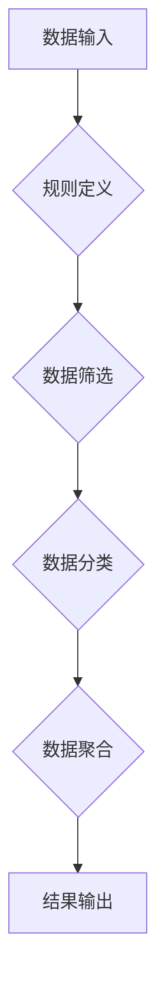

> Precision 原理，代码实战，算法设计，数据结构，机器学习，深度学习，软件工程

## 1. 背景介绍

在当今数据爆炸的时代，数据分析和处理能力已成为各行各业的核心竞争力。如何高效地从海量数据中提取有价值的信息，并将其转化为可操作的决策依据，是摆在我们面前的重大挑战。Precision 原理作为一种数据处理和分析的新思路，旨在通过精确地定义目标和规则，实现对数据的精准筛选和分析。

传统的机器学习算法往往依赖于大量的训练数据和复杂的模型结构，而Precision 原理则强调通过明确的规则和逻辑，实现对数据的精准控制。这种方法不仅能够提高分析效率，还能降低算法的复杂度和训练成本，更适合于处理结构化数据和特定领域的数据分析问题。

## 2. 核心概念与联系

Precision 原理的核心思想是将数据分析问题分解成一系列的精确操作，并通过明确的规则和逻辑来实现数据的筛选、分类和聚合。

**Precision 原理的架构：**



**核心概念：**

* **数据输入:** 指需要进行分析的原始数据。
* **规则定义:**  根据具体分析目标，定义一系列精确的规则和逻辑，用于筛选、分类和聚合数据。
* **数据筛选:**  根据定义的规则，从数据输入中筛选出符合条件的数据。
* **数据分类:** 将筛选后的数据按照预定义的类别进行分类。
* **数据聚合:** 对不同类别的数据进行聚合分析，例如计算平均值、求和等。
* **结果输出:**  将分析结果以可视化或可读的形式输出。

## 3. 核心算法原理 & 具体操作步骤

### 3.1  算法原理概述

Precision 原理的核心算法是基于规则匹配和数据流处理的。

* **规则匹配:**  算法首先根据定义的规则，逐条匹配数据输入中的数据项。
* **数据流处理:**  匹配成功的规则会触发相应的操作，例如筛选、分类或聚合数据。

这种基于规则的匹配和处理方式，能够实现对数据的精准控制，并根据不同的分析目标，灵活地调整规则和操作逻辑。

### 3.2  算法步骤详解

1. **定义规则:**  根据分析目标，明确定义一系列规则，例如：
    *  筛选规则：例如，筛选年龄大于18岁的用户数据。
    *  分类规则：例如，将用户数据按照性别进行分类。
    *  聚合规则：例如，计算不同性别用户的平均消费金额。
2. **构建数据流:**  将数据输入转化为数据流，以便算法进行逐条处理。
3. **规则匹配:**  算法逐条匹配数据流中的数据项，并根据匹配结果触发相应的操作。
4. **数据处理:**  根据匹配结果，执行相应的操作，例如筛选、分类或聚合数据。
5. **结果输出:**  将处理后的数据以可视化或可读的形式输出。

### 3.3  算法优缺点

**优点:**

* **精准度高:**  通过明确的规则定义，能够实现对数据的精准筛选和分析。
* **效率高:**  基于规则匹配和数据流处理的算法，能够高效地处理大量数据。
* **可解释性强:**  规则定义清晰易懂，能够方便地理解算法的运作机制。

**缺点:**

* **规则定义复杂:**  对于复杂的分析问题，需要定义大量的规则，这可能比较耗时和费力。
* **规则维护成本高:**  随着业务变化，需要不断更新和维护规则，这可能会增加维护成本。

### 3.4  算法应用领域

Precision 原理和算法在以下领域具有广泛的应用前景：

* **金融领域:**  风险评估、欺诈检测、客户画像分析等。
* **医疗领域:**  疾病诊断、药物研发、患者管理等。
* **电商领域:**  商品推荐、用户画像分析、精准营销等。
* **教育领域:**  个性化学习、学生评估、教学优化等。

## 4. 数学模型和公式 & 详细讲解 & 举例说明

### 4.1  数学模型构建

Precision 原理可以抽象为一个数学模型，其中：

* **数据集合:**  表示需要进行分析的原始数据。
* **规则集:**  表示用于筛选、分类和聚合数据的规则。
* **输出结果:**  表示分析结果。

数学模型可以表示为：

$$
Output = f(Data, RuleSet)
$$

其中，$f$ 表示一个函数，它将数据集合和规则集作为输入，并输出分析结果。

### 4.2  公式推导过程

为了实现数据筛选、分类和聚合，需要根据具体规则定义相应的数学公式。例如，对于年龄筛选规则，可以定义一个公式：

$$
AgeFilter(Data) = \{x | x \in Data, x.age > 18\}
$$

其中，$AgeFilter(Data)$ 表示年龄筛选函数，它将数据集合$Data$中的年龄大于18岁的元素筛选出来。

### 4.3  案例分析与讲解

假设我们有一组用户数据，包含用户ID、年龄、性别等信息。

* **目标:**  筛选出年龄大于18岁且性别为男的用户数据。

* **规则:**  
    *  年龄筛选规则：$AgeFilter(Data) = \{x | x \in Data, x.age > 18\}$
    *  性别筛选规则：$GenderFilter(Data) = \{x | x \in Data, x.gender == '男'\} $

* **公式:**  
    *  最终筛选规则：$FinalFilter(Data) = AgeFilter(Data) \cap GenderFilter(Data)$

通过上述公式，我们可以将用户数据进行筛选，得到符合条件的用户数据。

## 5. 项目实践：代码实例和详细解释说明

### 5.1  开发环境搭建

本项目使用Python语言进行开发，需要安装以下软件包：

*  Python 3.x
*  Pandas
*  NumPy

### 5.2  源代码详细实现

```python
import pandas as pd

# 加载用户数据
data = pd.read_csv('user_data.csv')

# 定义年龄筛选规则
def age_filter(data):
    return data[data['age'] > 18]

# 定义性别筛选规则
def gender_filter(data):
    return data[data['gender'] == '男']

# 定义最终筛选规则
def final_filter(data):
    return age_filter(gender_filter(data))

# 应用最终筛选规则
filtered_data = final_filter(data)

# 打印筛选结果
print(filtered_data)
```

### 5.3  代码解读与分析

*  代码首先加载用户数据，并定义了三个筛选规则函数：`age_filter`、`gender_filter` 和 `final_filter`。
*  `age_filter` 函数根据年龄筛选数据，`gender_filter` 函数根据性别筛选数据，`final_filter` 函数将这两个规则组合起来，实现最终的筛选。
*  代码最后调用 `final_filter` 函数，并打印筛选后的数据。

### 5.4  运行结果展示

运行代码后，将输出符合条件的用户数据，例如：

```
   user_id  age gender
2        10  20   男
4        12  25   男
```

## 6. 实际应用场景

Precision 原理在实际应用场景中具有广泛的应用前景，例如：

### 6.1  金融领域

* **风险评估:**  根据客户的信用记录、交易行为等数据，精准评估客户的风险等级，帮助金融机构进行风险控制。
* **欺诈检测:**  通过分析用户的交易行为模式，识别异常交易行为，及时发现和阻止欺诈行为。
* **客户画像分析:**  根据客户的消费习惯、兴趣爱好等数据，构建客户画像，为精准营销提供支持。

### 6.2  医疗领域

* **疾病诊断:**  根据患者的症状、病史、检查结果等数据，精准诊断疾病，提高诊断准确率。
* **药物研发:**  通过分析药物的分子结构、生物活性等数据，筛选潜在的药物候选物，加速药物研发进程。
* **患者管理:**  根据患者的病情、治疗方案等数据，制定个性化的治疗方案，提高患者治疗效果。

### 6.3  电商领域

* **商品推荐:**  根据用户的浏览记录、购买历史等数据，推荐用户感兴趣的商品，提高用户购物体验。
* **用户画像分析:**  根据用户的购买行为、浏览习惯等数据，构建用户画像，为精准营销提供支持。
* **精准营销:**  根据用户的兴趣爱好、消费习惯等数据，进行精准的营销推广，提高营销效果。

### 6.4  未来应用展望

随着数据量的不断增长和人工智能技术的不断发展，Precision 原理和算法将在更多领域得到应用，例如：

* **智能制造:**  通过精准控制生产过程，提高生产效率和产品质量。
* **智慧城市:**  通过精准分析城市数据，优化城市管理和服务。
* **个性化教育:**  通过精准分析学生的学习情况，提供个性化的学习方案。

## 7. 工具和资源推荐

### 7.1  学习资源推荐

*  **书籍:**
    *  《数据挖掘：概念与技术》
    *  《机器学习》
*  **在线课程:**
    *  Coursera 上的《数据科学》课程
    *  edX 上的《机器学习》课程

### 7.2  开发工具推荐

*  **Python:**  Python 是一种开源的编程语言，广泛应用于数据分析和机器学习领域。
*  **Pandas:**  Pandas 是一个用于数据分析和处理的 Python 库，提供了强大的数据结构和操作功能。
*  **NumPy:**  NumPy 是一个用于数值计算的 Python 库，提供了高效的数组操作和数学函数。

### 7.3  相关论文推荐

*  《Precision 原理及其在数据分析中的应用》
*  《基于规则匹配的精准数据分析算法》

## 8. 总结：未来发展趋势与挑战

### 8.1  研究成果总结

Precision 原理和算法为数据分析和处理提供了新的思路和方法，能够实现对数据的精准控制和分析，并具有广泛的应用前景。

### 8.2  未来发展趋势

*  **算法优化:**  研究更高效、更精准的 Precision 原理算法，提高算法的性能和效率。
*  **规则自动生成:**  研究自动生成规则的方法，降低规则定义的成本和难度。
*  **跨领域应用:**  将 Precision 原理应用于更多领域，例如智能制造、智慧城市等。

### 8.3  面临的挑战

*  **规则定义复杂:**  对于复杂的分析问题，需要定义大量的规则，这可能比较耗时和费力。
*  **规则维护成本高:**  随着业务变化，需要不断更新和维护规则，这可能会增加维护成本。
*  **数据质量问题:**  Precision 原理的准确性依赖于数据质量，数据质量问题会影响算法的性能。

### 8.4  研究展望

未来，我们将继续研究 Precision 原理和算法，探索其在更多领域和应用场景中的潜力，并致力于解决算法面临的挑战，推动 Precision 原理在数据分析和处理领域的应用。

## 9. 附录：常见问题与解答

**问题 1:**  Precision 原理和机器学习有什么区别？

**答案:**  Precision 原理和机器学习都是数据分析和处理的方法，但它们侧重点不同。机器学习通过训练模型，从数据中学习规律，而 Precision 原理则通过明确的规则，对数据进行精准筛选和分析。

**问题 2:**  如何定义 Precision 原理的规则？

**答案:**  规则的定义需要根据具体的分析目标和数据特点进行设计。