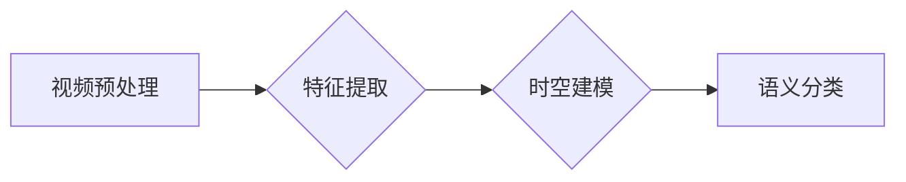

> 深度学习，视频理解，CNN，RNN，Transformer，Python，TensorFlow，PyTorch

## 1. 背景介绍

视频数据作为一种丰富的多模态信息，蕴含着巨大的价值。从监控录像到社交媒体视频，从教学视频到娱乐视频，视频内容涵盖了生活的方方面面。然而，与图像数据相比，视频数据具有更高的复杂性和动态性，其理解和分析面临着更大的挑战。

深度学习技术的兴起为视频理解带来了新的机遇。深度神经网络能够自动学习视频中的特征，并进行复杂的模式识别和预测。近年来，基于深度学习的视频理解方法取得了显著的进展，在视频分类、目标检测、动作识别、视频摘要等领域取得了突破性成果。

## 2. 核心概念与联系

视频理解的核心在于从视频序列中提取有意义的信息，并将其转化为可理解的语义表示。

**2.1 视频数据特点**

视频数据具有以下特点：

* **时空连续性:** 视频帧之间存在着时间上的依赖关系，视频内容的理解需要考虑帧之间的时空上下文。
* **多尺度特征:** 视频中包含着不同尺度的物体和动作，需要提取多尺度特征才能全面理解视频内容。
* **复杂场景:** 视频场景通常复杂多样，包含着多个物体、动作和交互，需要强大的表示能力才能进行准确的理解。

**2.2 深度学习模型架构**

深度学习模型通常采用卷积神经网络 (CNN) 和循环神经网络 (RNN) 的组合来处理视频数据。

* **CNN:** 用于提取视频帧的时空特征。
* **RNN:** 用于处理视频帧之间的时空依赖关系。

**2.3 视频理解流程**

视频理解流程通常包括以下步骤：

1. **视频预处理:** 对视频进行帧提取、尺寸调整、数据增强等预处理操作。
2. **特征提取:** 使用 CNN 模型提取视频帧的时空特征。
3. **时空建模:** 使用 RNN 模型处理视频帧之间的时空依赖关系。
4. **语义分类:** 根据提取的特征进行视频分类、目标检测、动作识别等任务。

**2.4 Mermaid 流程图**



## 3. 核心算法原理 & 具体操作步骤

### 3.1  算法原理概述

**3.1.1  卷积神经网络 (CNN)**

CNN 是一种专门用于处理图像数据的深度神经网络。它利用卷积操作来提取图像特征，并通过池化操作来降低特征维度。CNN 的结构通常由多个卷积层、池化层和全连接层组成。

**3.1.2  循环神经网络 (RNN)**

RNN 是一种专门用于处理序列数据的深度神经网络。它具有循环连接，能够捕获序列中的长期依赖关系。RNN 的结构通常由多个隐藏层组成，每个隐藏层都包含一个循环单元。

**3.1.3  Transformer**

Transformer 是一种基于注意力机制的深度神经网络，能够有效地处理长序列数据。它摒弃了 RNN 的循环连接，而是通过自注意力机制来捕获序列中的依赖关系。Transformer 的结构通常由多个编码器和解码器组成，每个编码器和解码器都包含多个注意力层和多头注意力层。

### 3.2  算法步骤详解

**3.2.1  视频预处理**

1. **帧提取:** 从视频中提取每一帧图像。
2. **尺寸调整:** 将每一帧图像调整为固定的尺寸。
3. **数据增强:** 对视频帧进行随机裁剪、旋转、翻转等操作，以增加训练数据的多样性。

**3.2.2  特征提取**

1. 使用 CNN 模型对视频帧进行特征提取。
2. 将提取的特征作为输入，输入到 RNN 或 Transformer 模型中。

**3.2.3  时空建模**

1. 使用 RNN 或 Transformer 模型处理视频帧之间的时空依赖关系。
2. 将处理后的时空特征作为输入，进行语义分类。

**3.2.4  语义分类**

1. 使用全连接层对时空特征进行分类。
2. 输出视频的类别标签或其他语义信息。

### 3.3  算法优缺点

**3.3.1  CNN**

* **优点:** 能够有效地提取图像特征，并具有良好的鲁棒性。
* **缺点:** 难以处理视频帧之间的时空依赖关系。

**3.3.2  RNN**

* **优点:** 能够捕获视频帧之间的时空依赖关系。
* **缺点:** 训练速度慢，难以处理长序列数据。

**3.3.3  Transformer**

* **优点:** 能够有效地处理长序列数据，并具有更高的准确率。
* **缺点:** 计算量较大，训练成本高。

### 3.4  算法应用领域

* **视频分类:** 将视频分类为不同的类别，例如动作识别、场景识别、情感识别等。
* **目标检测:** 在视频中检测和跟踪目标，例如人脸识别、车辆检测、物体跟踪等。
* **动作识别:** 从视频中识别动作，例如体育动作识别、舞蹈动作识别、日常动作识别等。
* **视频摘要:** 生成视频的简短摘要，例如会议视频摘要、新闻视频摘要、教学视频摘要等。

## 4. 数学模型和公式 & 详细讲解 & 举例说明

### 4.1  数学模型构建

**4.1.1  CNN 模型**

CNN 模型的数学模型主要包括卷积操作、池化操作和激活函数。

* **卷积操作:** 使用卷积核对输入图像进行卷积，提取图像特征。
* **池化操作:** 对卷积后的特征图进行池化，降低特征维度。
* **激活函数:** 将卷积后的特征图进行非线性变换，提高模型的表达能力。

**4.1.2  RNN 模型**

RNN 模型的数学模型主要包括循环单元。循环单元能够捕获序列中的长期依赖关系。

* **循环单元:** 将当前输入和隐藏状态进行线性变换，并通过激活函数进行非线性变换，得到新的隐藏状态。

**4.1.3  Transformer 模型**

Transformer 模型的数学模型主要包括自注意力机制和多头注意力机制。

* **自注意力机制:** 计算每个词与所有其他词之间的注意力权重，并根据权重进行加权求和，得到每个词的上下文表示。
* **多头注意力机制:** 使用多个自注意力机制，并对输出进行拼接，提高模型的表达能力。

### 4.2  公式推导过程

**4.2.1  卷积操作公式**

$$
y_{i,j} = \sum_{m=0}^{M-1} \sum_{n=0}^{N-1} x_{i+m,j+n} * w_{m,n}
$$

其中：

* $y_{i,j}$ 是卷积输出的像素值。
* $x_{i+m,j+n}$ 是输入图像的像素值。
* $w_{m,n}$ 是卷积核的权值。
* $M$ 和 $N$ 是卷积核的大小。

**4.2.2  循环单元公式**

$$
h_t = f(W_h h_{t-1} + W_x x_t + b)
$$

其中：

* $h_t$ 是隐藏状态。
* $h_{t-1}$ 是上一个时间步的隐藏状态。
* $x_t$ 是当前时间步的输入。
* $W_h$ 和 $W_x$ 是权值矩阵。
* $b$ 是偏置项。
* $f$ 是激活函数。

### 4.3  案例分析与讲解

**4.3.1  视频分类案例**

使用 CNN 模型对视频进行分类，例如将视频分类为“跑步”、“跳跃”或“行走”。

**4.3.2  目标检测案例**

使用目标检测模型在视频中检测和跟踪目标，例如在监控视频中检测和跟踪车辆。

**4.3.3  动作识别案例**

使用动作识别模型从视频中识别动作，例如识别体育动作、舞蹈动作或日常动作。

## 5. 项目实践：代码实例和详细解释说明

### 5.1  开发环境搭建

1. 安装 Python 3.x。
2. 安装深度学习框架，例如 TensorFlow 或 PyTorch。
3. 安装必要的库，例如 NumPy、OpenCV、Matplotlib 等。

### 5.2  源代码详细实现

```python
# 使用 TensorFlow 实现视频分类

import tensorflow as tf

# 定义 CNN 模型
model = tf.keras.models.Sequential([
    tf.keras.layers.Conv2D(32, (3, 3), activation='relu', input_shape=(128, 128, 3)),
    tf.keras.layers.MaxPooling2D((2, 2)),
    tf.keras.layers.Conv2D(64, (3, 3), activation='relu'),
    tf.keras.layers.MaxPooling2D((2, 2)),
    tf.keras.layers.Flatten(),
    tf.keras.layers.Dense(10, activation='softmax')
])

# 编译模型
model.compile(optimizer='adam',
              loss='sparse_categorical_crossentropy',
              metrics=['accuracy'])

# 训练模型
model.fit(x_train, y_train, epochs=10)

# 评估模型
loss, accuracy = model.evaluate(x_test, y_test)
print('Loss:', loss)
print('Accuracy:', accuracy)
```

### 5.3  代码解读与分析

* **模型定义:** 使用 TensorFlow 的 Keras API 定义了一个 CNN 模型，包含卷积层、池化层和全连接层。
* **模型编译:** 使用 Adam 优化器、交叉熵损失函数和准确率指标编译模型。
* **模型训练:** 使用训练数据训练模型，设置训练轮数为 10。
* **模型评估:** 使用测试数据评估模型的性能，输出损失值和准确率。

### 5.4  运行结果展示

运行代码后，会输出模型的训练过程和评估结果，例如损失值和准确率。

## 6. 实际应用场景

### 6.1  视频监控

* **异常行为检测:** 使用深度学习模型检测视频监控中异常行为，例如入侵、斗殴、火灾等。
* **目标跟踪:** 使用目标检测模型跟踪视频监控中的目标，例如人员跟踪、车辆跟踪等。

### 6.2  医疗诊断

* **疾病诊断:** 使用深度学习模型分析医学影像视频，辅助医生诊断疾病。
* **手术辅助:** 使用深度学习模型辅助医生进行手术操作，提高手术精度和安全性。

### 6.3  体育运动分析

* **动作识别:** 使用动作识别模型识别运动员的动作，例如篮球投篮、足球传球等。
* **运动性能评估:** 使用深度学习模型评估运动员的运动性能，例如速度、力量、耐力等。

### 6.4  未来应用展望

* **视频生成:** 使用深度学习模型生成逼真的视频，例如虚拟人物、虚拟场景等。
* **视频编辑:** 使用深度学习模型自动编辑视频，例如剪辑、字幕、特效等。
* **视频理解与推理:** 使用深度学习模型进行更高级的视频理解，例如视频故事理解、视频情景推理等。

## 7. 工具和资源推荐

### 7.1  学习资源推荐

* **书籍:**
    * 《深度学习》
    * 《Python深度学习》
    * 《动手学深度学习》
* **在线课程:**
    * Coursera 深度学习课程
    * Udacity 深度学习课程
    * fast.ai 深度学习课程

### 7.2  开发工具推荐

* **深度学习框架:** TensorFlow, PyTorch, Keras
* **图像处理库:** OpenCV
* **数据可视化库:** Matplotlib, Seaborn

### 7