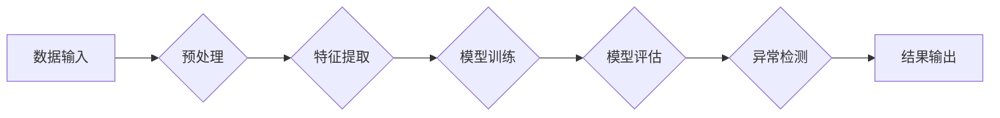

> 深度学习，异常检测，神经网络，Python，TensorFlow，Keras，数据预处理，特征提取，模型评估

## 1. 背景介绍

在当今数据爆炸的时代，异常检测作为一种重要的数据挖掘技术，在各个领域发挥着越来越重要的作用。从金融欺诈检测到工业设备故障预测，从医疗影像分析到网络安全威胁识别，异常检测能够帮助我们识别数据中的异常值，从而及时发现潜在问题并采取相应的措施。

传统的异常检测方法通常依赖于统计模型或规则引擎，但这些方法往往难以应对复杂、高维的数据场景。随着深度学习技术的快速发展，基于神经网络的异常检测方法逐渐成为研究热点。深度学习模型能够自动学习数据中的复杂特征，并对异常值进行更精准的识别。

## 2. 核心概念与联系

### 2.1 异常检测概述

异常检测是指从正常数据集中识别出与众不同的数据点，这些数据点可能代表着异常事件或错误行为。异常检测的目标是识别出这些异常值，并将其与正常数据区分开来。

### 2.2 深度学习与异常检测

深度学习是一种机器学习的子领域，它利用多层神经网络来学习数据中的复杂特征。深度学习模型能够自动学习数据中的模式和结构，并对异常值进行更精准的识别。

### 2.3 神经网络架构

常用的神经网络架构用于异常检测包括：

* **自编码器 (Autoencoder):** 自编码器是一种无监督学习模型，它通过学习数据自身的编码来重建原始数据。异常值由于其与正常数据结构差异较大，在重建过程中会表现出较大的误差。
* **卷积神经网络 (CNN):** 卷积神经网络擅长于处理图像数据，但也可以应用于其他类型的序列数据，例如文本和时间序列数据。CNN 可以学习数据中的空间特征和时间特征，从而识别出异常值。
* **循环神经网络 (RNN):** 循环神经网络擅长于处理序列数据，例如文本和时间序列数据。RNN 可以学习数据中的时间依赖关系，从而识别出异常值。

**Mermaid 流程图**



## 3. 核心算法原理 & 具体操作步骤

### 3.1  算法原理概述

基于神经网络的异常检测算法的核心原理是利用神经网络学习数据中的正常模式，并识别与这些模式不符的数据点。

### 3.2  算法步骤详解

1. **数据预处理:** 首先需要对原始数据进行预处理，例如数据清洗、数据归一化等。
2. **特征提取:** 将原始数据转换为适合神经网络学习的特征向量。
3. **模型训练:** 使用训练数据训练神经网络模型，使模型能够学习数据中的正常模式。
4. **模型评估:** 使用测试数据评估模型的性能，例如准确率、召回率等。
5. **异常检测:** 将新的数据输入到训练好的模型中，模型会输出每个数据点的异常得分。根据异常得分阈值，将数据点分类为正常或异常。

### 3.3  算法优缺点

**优点:**

* 能够自动学习数据中的复杂特征，无需人工设计特征。
* 对高维数据具有较好的鲁棒性。
* 能够识别出非线性关系和复杂模式的异常值。

**缺点:**

* 需要大量的训练数据。
* 训练过程可能比较耗时。
* 模型解释性较差，难以理解模型是如何进行决策的。

### 3.4  算法应用领域

* **金融欺诈检测:** 识别信用卡欺诈、网络钓鱼等异常交易。
* **工业设备故障预测:** 预判设备故障，避免生产停机。
* **医疗影像分析:** 识别病变区域，辅助医生诊断。
* **网络安全威胁识别:** 检测恶意软件、网络攻击等威胁。

## 4. 数学模型和公式 & 详细讲解 & 举例说明

### 4.1  数学模型构建

假设我们有一个包含 $n$ 个样本的数据集 $D = \{x_1, x_2, ..., x_n\}$, 其中每个样本 $x_i$ 是一个 $d$ 维的特征向量。我们的目标是学习一个模型 $f(x)$，能够将每个样本 $x$ 映射到一个异常得分 $s(x)$。

### 4.2  公式推导过程

常用的异常得分计算方法包括：

* **重建误差:** 自编码器模型的异常得分可以定义为输入数据与重建数据的差异。

$$
s(x) = ||x - f(x)||^2
$$

* **概率密度估计:** 可以使用概率密度估计方法来计算样本的异常得分。样本的异常得分等于其在训练数据分布下的概率密度。

$$
s(x) = -\log p(x)
$$

### 4.3  案例分析与讲解

假设我们有一个包含 100 个样本的信用卡交易数据集，其中 90 个样本是正常的交易，10 个样本是欺诈交易。我们可以使用自编码器模型来训练一个异常检测模型。

训练完成后，我们可以将新的信用卡交易数据输入到模型中，模型会输出每个交易的异常得分。根据异常得分阈值，我们可以将交易分类为正常或欺诈。

## 5. 项目实践：代码实例和详细解释说明

### 5.1  开发环境搭建

* Python 3.6+
* TensorFlow 2.0+
* Keras 2.0+
* Jupyter Notebook

### 5.2  源代码详细实现

```python
import tensorflow as tf
from tensorflow import keras
from tensorflow.keras import layers

# 定义自编码器模型
input_img = keras.Input(shape=(784,))
encoded = layers.Dense(128, activation='relu')(input_img)
decoded = layers.Dense(784, activation='sigmoid')(encoded)

autoencoder = keras.Model(input_img, decoded)

# 编译模型
autoencoder.compile(optimizer='adam', loss='binary_crossentropy')

# 训练模型
autoencoder.fit(x_train, x_train, epochs=10, batch_size=256)

# 使用模型进行异常检测
predictions = autoencoder.predict(x_test)
reconstruction_errors = tf.reduce_sum(tf.square(x_test - predictions), axis=1)

# 设置异常得分阈值
threshold = 0.1

# 识别异常值
anomalies = tf.where(reconstruction_errors > threshold)

print(f"异常值数量: {anomalies.shape[0]}")
```

### 5.3  代码解读与分析

* 我们定义了一个包含编码器和解码器的自编码器模型。
* 编码器将输入数据压缩成一个低维的特征向量，解码器将特征向量解码回原始数据。
* 我们使用均方误差作为损失函数，并使用 Adam 优化器训练模型。
* 训练完成后，我们可以使用模型预测新的数据，并计算重建误差。
* 根据重建误差阈值，我们可以识别出异常值。

### 5.4  运行结果展示

运行代码后，我们可以得到异常值的数量。

## 6. 实际应用场景

### 6.1  金融欺诈检测

在金融领域，异常检测可以用于识别信用卡欺诈、网络钓鱼等异常交易。

### 6.2  工业设备故障预测

在工业生产中，异常检测可以用于预测设备故障，避免生产停机。

### 6.3  医疗影像分析

在医疗领域，异常检测可以用于识别病变区域，辅助医生诊断。

### 6.4  未来应用展望

随着深度学习技术的不断发展，异常检测在更多领域将得到应用，例如：

* **网络安全威胁识别:** 检测恶意软件、网络攻击等威胁。
* **智能交通:** 检测交通异常，例如拥堵、事故等。
* **环境监测:** 检测环境污染、自然灾害等异常情况。

## 7. 工具和资源推荐

### 7.1  学习资源推荐

* **书籍:**
    * 深度学习
    * Python深度学习
* **在线课程:**
    * Coursera: 深度学习
    * Udacity: 深度学习工程师
* **博客:**
    * TensorFlow Blog
    * Keras Blog

### 7.2  开发工具推荐

* **TensorFlow:** 开源深度学习框架
* **Keras:** 高级API，用于构建和训练深度学习模型
* **PyTorch:** 开源深度学习框架

### 7.3  相关论文推荐

* Autoencoders for Anomaly Detection
* Deep Learning for Anomaly Detection: A Survey
* Anomaly Detection with Convolutional Neural Networks

## 8. 总结：未来发展趋势与挑战

### 8.1  研究成果总结

基于神经网络的异常检测方法取得了显著的成果，在多个领域得到了应用。

### 8.2  未来发展趋势

* **模型的复杂度和性能将进一步提升:** 研究人员将探索更复杂的模型架构和训练方法，以提高异常检测的准确性和鲁棒性。
* **异常检测将更加个性化:** 将根据用户的需求和应用场景定制异常检测模型。
* **异常检测将更加自动化:** 将开发更加自动化和智能化的异常检测系统，能够自动识别和处理异常事件。

### 8.3  面临的挑战

* **数据质量:** 异常检测模型的性能依赖于训练数据的质量。
* **模型解释性:** 深度学习模型的决策过程难以解释，这可能会导致模型的可信度降低。
* **计算资源:** 训练大型深度学习模型需要大量的计算资源。

### 8.4  研究展望

未来，我们将继续探索基于神经网络的异常检测方法，以提高其性能和鲁棒性，并将其应用于更多领域。

## 9. 附录：常见问题与解答

### 9.1  Q1: 如何选择合适的异常检测模型？

**A1:** 选择合适的异常检测模型需要根据具体应用场景和数据特点进行选择。

### 9.2  Q2: 如何评估异常检测模型的性能？

**A2:** 常用的评估指标包括准确率、召回率、F1-score等。

### 9.3  Q3: 如何处理异常值？

**A3:** 处理异常值的方法包括删除、替换、修正等。

作者：禅与计算机程序设计艺术 / Zen and the Art of Computer Programming


<end_of_turn>