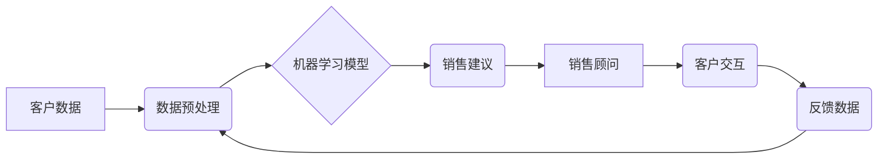

>  * 人工智能
>  * 销售顾问
>  * 机器学习
>  * 自然语言处理
>  * 深度学习
>  * 云计算
>  * 大数据

## 1. 背景介绍

在当今数据爆炸的时代，企业积累了海量的客户数据，但如何有效地利用这些数据来提升销售效率和客户体验一直是企业面临的挑战。传统的销售模式依赖于人工销售人员的经验和技能，存在着效率低下、成本高昂、客户体验不佳等问题。而人工智能技术的发展为企业提供了新的解决方案。

Sales-Consultant，即人工智能销售顾问，是一种利用人工智能技术，模拟人类销售人员进行销售咨询、产品推荐、客户服务等工作的智能系统。它能够通过分析客户数据、理解客户需求、提供个性化建议，帮助企业提升销售效率、提高客户满意度，最终实现商业价值。

## 2. 核心概念与联系

### 2.1  人工智能 (AI)

人工智能 (AI) 是指模拟人类智能行为的计算机系统。它涵盖了多个领域，包括机器学习、深度学习、自然语言处理、计算机视觉等。

### 2.2  机器学习 (ML)

机器学习是人工智能的一个子领域，它通过算法训练模型，使模型能够从数据中学习，并根据学习到的知识进行预测或决策。

### 2.3  深度学习 (DL)

深度学习是机器学习的一个子领域，它使用多层神经网络来模拟人类大脑的学习过程，能够处理更复杂的数据，并取得更优的性能。

### 2.4  自然语言处理 (NLP)

自然语言处理是人工智能的一个子领域，它致力于使计算机能够理解和处理人类语言。

### 2.5  云计算

云计算是一种按需提供的计算资源，包括计算能力、存储空间、网络带宽等。它能够提供弹性、可扩展、经济高效的计算环境。

### 2.6  大数据

大数据是指海量、高速度、高多样性的数据。

**Sales-Consultant 架构图**



## 3. 核心算法原理 & 具体操作步骤

### 3.1  算法原理概述

Sales-Consultant 的核心算法原理是基于机器学习和深度学习的推荐系统。它通过训练模型，学习客户的购买行为、偏好和需求，并根据这些信息提供个性化的销售建议。

### 3.2  算法步骤详解

1. **数据收集和预处理:** 收集客户数据，包括购买历史、浏览记录、用户画像等，并进行清洗、转换、特征提取等预处理操作。
2. **模型训练:** 使用机器学习算法，例如协同过滤、内容推荐、深度神经网络等，训练模型，学习客户的购买行为模式和偏好。
3. **预测和推荐:** 根据客户的当前行为和特征，模型预测客户可能感兴趣的产品或服务，并提供个性化的销售建议。
4. **反馈和优化:** 收集客户对推荐的反馈，并根据反馈信息不断优化模型，提高推荐的准确性和有效性。

### 3.3  算法优缺点

**优点:**

* **个性化推荐:** 根据客户的个人需求和偏好提供个性化的推荐，提高客户体验。
* **提高销售效率:** 自动化销售流程，解放销售人员的时间，提高销售效率。
* **数据驱动决策:** 基于数据分析，提供数据驱动的销售决策支持。

**缺点:**

* **数据依赖:** 算法的性能依赖于数据的质量和数量。
* **黑盒问题:** 一些深度学习模型难以解释，难以理解模型的决策过程。
* **隐私问题:** 需要处理大量客户数据，需要关注数据隐私和安全问题。

### 3.4  算法应用领域

* **电商平台:** 产品推荐、个性化营销
* **金融服务:** 贷款审批、理财建议
* **医疗保健:** 疾病诊断、个性化治疗方案
* **教育培训:** 个性化学习推荐、在线辅导

## 4. 数学模型和公式 & 详细讲解 & 举例说明

### 4.1  数学模型构建

Sales-Consultant 的核心算法通常基于协同过滤或内容推荐模型。

**协同过滤模型:**

协同过滤模型基于用户的行为相似性进行推荐。假设用户 A 和用户 B 都喜欢电影 X，那么用户 A 可能也喜欢用户 B 喜欢但自己没有看过的电影。

**内容推荐模型:**

内容推荐模型基于商品的特征进行推荐。例如，如果用户喜欢动作片，那么系统会推荐其他动作片。

### 4.2  公式推导过程

协同过滤模型的评分预测公式：

$$
\hat{r}_{u,i} = \bar{r}_u + \frac{\sum_{j \in N(u)} (r_{u,j} - \bar{r}_u) \cdot (r_{j,i} - \bar{r}_j)}{\sum_{j \in N(u)} (r_{u,j} - \bar{r}_u)^2}
$$

其中：

* $\hat{r}_{u,i}$: 用户 u 对物品 i 的预测评分
* $\bar{r}_u$: 用户 u 的平均评分
* $r_{u,j}$: 用户 u 对物品 j 的实际评分
* $N(u)$: 用户 u 评分过的物品集合

### 4.3  案例分析与讲解

假设用户 A 和用户 B 都评分过电影 X 和 Y，用户 A 对电影 X 的评分为 5，对电影 Y 的评分为 3，用户 B 对电影 X 的评分为 4，对电影 Y 的评分为 4。

根据协同过滤模型的评分预测公式，我们可以预测用户 A 对电影 Y 的评分。

## 5. 项目实践：代码实例和详细解释说明

### 5.1  开发环境搭建

* Python 3.x
* TensorFlow 或 PyTorch
* Jupyter Notebook

### 5.2  源代码详细实现

```python
# 导入必要的库
import pandas as pd
from sklearn.model_selection import train_test_split
from sklearn.metrics import mean_squared_error

# 加载数据
data = pd.read_csv('sales_data.csv')

# 数据预处理
# ...

# 将数据分为训练集和测试集
X_train, X_test, y_train, y_test = train_test_split(data[['feature1', 'feature2', ...]], data['target'], test_size=0.2)

# 训练模型
model = ... # 使用协同过滤或内容推荐模型

# 模型训练
model.fit(X_train, y_train)

# 模型评估
y_pred = model.predict(X_test)
rmse = mean_squared_error(y_test, y_pred, squared=False)
print(f'RMSE: {rmse}')

# 生成销售建议
# ...
```

### 5.3  代码解读与分析

* 数据预处理：将原始数据转换为模型可接受的格式，例如特征工程、数据归一化等。
* 模型选择：根据业务需求选择合适的机器学习模型，例如协同过滤、内容推荐、深度神经网络等。
* 模型训练：使用训练数据训练模型，并调整模型参数以获得最佳性能。
* 模型评估：使用测试数据评估模型的性能，例如RMSE、准确率等指标。
* 销售建议生成：根据模型预测结果，生成个性化的销售建议。

### 5.4  运行结果展示

运行代码后，可以得到模型的评估结果，例如RMSE值，以及根据模型预测生成的销售建议。

## 6. 实际应用场景

### 6.1  电商平台

* **个性化推荐:** 根据用户的浏览历史、购买记录、兴趣爱好等信息，推荐个性化的商品。
* **促銷活動:** 根据用户的消费习惯和偏好，推送精准的促銷活動信息。
* **客户服务:** 利用聊天机器人技术，提供24小时在线客户服务，解答客户疑问，处理售后问题。

### 6.2  金融服务

* **贷款审批:** 根据用户的信用记录、收入状况、资产负债等信息，自动审批贷款申请。
* **理财建议:** 根据用户的风险偏好、投资目标等信息，提供个性化的理财建议。
* **欺诈检测:** 利用机器学习算法，识别和预防金融欺诈行为。

### 6.3  医疗保健

* **疾病诊断:** 根据用户的症状、病史、体检结果等信息，辅助医生进行疾病诊断。
* **个性化治疗方案:** 根据用户的基因信息、生活习惯、病症等信息，制定个性化的治疗方案。
* **药物研发:** 利用机器学习算法，加速药物研发过程。

### 6.4  未来应用展望

随着人工智能技术的不断发展，Sales-Consultant 将在更多领域得到应用，例如教育培训、旅游出行、智能家居等。未来，Sales-Consultant 将更加智能化、个性化、人性化，为用户提供更加便捷、高效、满意的服务。

## 7. 工具和资源推荐

### 7.1  学习资源推荐

* **书籍:**
    * 《深度学习》
    * 《机器学习实战》
    * 《Python机器学习》
* **在线课程:**
    * Coursera
    * edX
    * Udacity

### 7.2  开发工具推荐

* **Python:** 
* **TensorFlow:** 深度学习框架
* **PyTorch:** 深度学习框架
* **Scikit-learn:** 机器学习库

### 7.3  相关论文推荐

* **Collaborative Filtering for Recommender Systems**
* **Content-Based Recommendation Systems**
* **Deep Learning for Recommender Systems**

## 8. 总结：未来发展趋势与挑战

### 8.1  研究成果总结

Sales-Consultant 技术在近年来取得了显著的进展，能够有效地提升销售效率、提高客户体验。

### 8.2  未来发展趋势

* **更智能化:** 利用更先进的机器学习算法和深度学习模型，提高推荐的准确性和个性化程度。
* **更个性化:** 更加深入地理解用户的需求和偏好，提供更加精准的销售建议。
* **更人性化:** 更加注重用户体验，提供更加友好的交互方式。

### 8.3  面临的挑战

* **数据质量:** 算法的性能依赖于数据的质量和数量，需要不断收集和清洗数据。
* **黑盒问题:** 一些深度学习模型难以解释，难以理解模型的决策过程。
* **隐私问题:** 需要处理大量客户数据，需要关注数据隐私和安全问题。

### 8.4  研究展望

未来，Sales-Consultant 技术将继续朝着更智能化、更个性化、更人性化的方向发展，为企业和用户带来更多价值。


## 9. 附录：常见问题与解答

**Q1: Sales-Consultant 是否会取代人类销售人员？**

A1: Sales-Consultant 能够自动化一些销售流程，提高销售效率，但它并不会完全取代人类销售人员。人类销售人员仍然需要负责与客户建立关系、提供个性化服务、解决复杂问题等工作。

**Q2: Sales-Consultant 的数据安全如何保障？**

A2: Sales-Consultant 的开发和部署需要严格遵循数据安全和隐私保护的原则，例如数据加密、访问控制、匿名化处理等。

**Q3: 如何评估 Sales-Consultant 的效果？**

A3: Sales-Consultant 的效果可以通过多种指标进行评估，例如销售额增长、客户满意度、转化率等。


作者：禅与计算机程序设计艺术 / Zen and the Art of Computer Programming 
<end_of_turn>