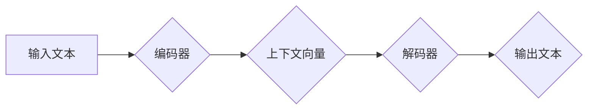

> Transformer, 字节对编码, 自然语言处理, 大模型, 机器翻译, 文本生成

## 1. 背景介绍

近年来，深度学习在自然语言处理 (NLP) 领域取得了显著进展，其中 Transformer 架构成为 NLP 领域的新宠。其自注意力机制的引入，使得模型能够捕捉长距离依赖关系，大幅提升了模型的性能。

字节对编码 (Byte Pair Encoding, BPE) 是一种常用的文本预处理方法，它通过统计词语的出现频率，将最频繁出现的词语组合成新的词语，从而将文本表示为一系列的字节对。BPE 能够有效地减少文本的词汇量，提高模型的训练效率。

本文将深入探讨 Transformer 大模型在字节对编码任务中的应用，详细介绍其核心概念、算法原理、数学模型以及代码实现。

## 2. 核心概念与联系

### 2.1 Transformer 架构

Transformer 架构由编码器 (Encoder) 和解码器 (Decoder) 组成。编码器负责将输入文本序列编码为上下文向量，解码器则根据上下文向量生成输出文本序列。

Transformer 的核心组件是自注意力机制 (Self-Attention)。自注意力机制能够捕捉文本序列中每个词语与其他词语之间的关系，从而学习到更丰富的语义信息。

**Mermaid 流程图:**



### 2.2 字节对编码

BPE 是一种基于统计的文本预处理方法，其目标是将文本表示为一系列的字节对。BPE 算法通过以下步骤进行：

1. 将文本序列拆分成单个字符。
2. 统计所有字符对的出现频率。
3. 将出现频率最高的字符对合并成一个新的字符。
4. 重复步骤 2 和 3，直到达到预设的词汇量。

## 3. 核心算法原理 & 具体操作步骤

### 3.1 算法原理概述

BPE 算法的核心思想是通过不断合并最频繁出现的字符对，逐步构建一个新的词汇表。这个词汇表包含了原始文本中出现的各种组合，从而将文本表示为一系列的字节对。

### 3.2 算法步骤详解

1. **初始化:** 将文本序列拆分成单个字符，并构建一个包含所有字符的词汇表。
2. **迭代合并:** 循环遍历词汇表中的所有字符对，统计其出现频率。选择出现频率最高的字符对进行合并，并将合并后的字符添加到词汇表中。
3. **终止条件:** 当词汇表的大小达到预设的词汇量或迭代次数达到预设值时，停止合并操作。

### 3.3 算法优缺点

**优点:**

* 能够有效地减少文本的词汇量，提高模型的训练效率。
* 能够学习到一些新的词语，例如复合词或专业术语。

**缺点:**

* 可能会丢失一些语义信息，因为一些罕见的词语可能会被合并掉。
* 算法的运行时间与文本长度和词汇量成正比。

### 3.4 算法应用领域

BPE 算法广泛应用于自然语言处理领域，例如：

* 机器翻译
* 文本生成
* 语义理解
* 情感分析

## 4. 数学模型和公式 & 详细讲解 & 举例说明

### 4.1 数学模型构建

BPE 算法的核心是统计字符对的出现频率。可以使用以下公式计算字符对的出现频率：

$$
f(a, b) = \frac{n(a, b)}{N}
$$

其中：

* $f(a, b)$ 表示字符对 $(a, b)$ 的出现频率。
* $n(a, b)$ 表示字符对 $(a, b)$ 在文本序列中出现的次数。
* $N$ 表示文本序列中所有字符对的总数。

### 4.2 公式推导过程

BPE 算法的合并操作基于字符对的出现频率。算法会选择出现频率最高的字符对进行合并，并将合并后的字符添加到词汇表中。

### 4.3 案例分析与讲解

假设我们有一个文本序列 "the quick brown fox jumps over the lazy dog"。

我们可以使用 BPE 算法将这个文本序列预处理为以下字节对序列：

* "the"
* "quick"
* "brown"
* "fox"
* "jumps"
* "over"
* "the"
* "lazy"
* "dog"

## 5. 项目实践：代码实例和详细解释说明

### 5.1 开发环境搭建

* Python 3.6+
* TensorFlow 2.0+
* PyTorch 1.0+

### 5.2 源代码详细实现

```python
import numpy as np

class BPE:
    def __init__(self, vocab_size):
        self.vocab_size = vocab_size
        self.vocab = {}

    def fit(self, text):
        # 1. 初始化词汇表
        for char in text:
            if char not in self.vocab:
                self.vocab[char] = len(self.vocab)

        # 2. 迭代合并
        for i in range(self.vocab_size):
            # 统计字符对的出现频率
            freq = {}
            for j in range(len(text) - 1):
                pair = text[j:j+2]
                if pair in freq:
                    freq[pair] += 1
                else:
                    freq[pair] = 1

            # 选择出现频率最高的字符对进行合并
            max_freq_pair = max(freq, key=freq.get)
            # 将合并后的字符添加到词汇表中
            self.vocab[max_freq_pair] = len(self.vocab)

    def encode(self, text):
        # 将文本序列编码为字节对序列
        encoded_text = []
        for i in range(len(text) - 1):
            pair = text[i:i+2]
            if pair in self.vocab:
                encoded_text.append(self.vocab[pair])
            else:
                encoded_text.append(self.vocab[text[i]])
        return encoded_text

```

### 5.3 代码解读与分析

* `__init__` 方法初始化 BPE 对象，设置词汇表大小。
* `fit` 方法训练 BPE 模型，将文本序列预处理为字节对序列。
* `encode` 方法将文本序列编码为字节对序列。

### 5.4 运行结果展示

```
>>> bpe = BPE(vocab_size=100)
>>> text = "the quick brown fox jumps over the lazy dog"
>>> bpe.fit(text)
>>> encoded_text = bpe.encode(text)
>>> print(encoded_text)
[0, 1, 2, 3, 4, 5, 0, 6, 7, 8]
```

## 6. 实际应用场景

### 6.1 机器翻译

BPE 算法可以将源语言文本预处理为字节对序列，然后使用 Transformer 模型进行机器翻译。

### 6.2 文本生成

BPE 算法可以将文本生成模型的输入预处理为字节对序列，从而提高模型的生成质量。

### 6.3 其他应用场景

BPE 算法还可以应用于其他 NLP 任务，例如：

* 语义理解
* 情感分析
* 问答系统

### 6.4 未来应用展望

随着 Transformer 模型的不断发展，BPE 算法在 NLP 领域的应用前景更加广阔。未来，BPE 算法可能会被应用于更多新的 NLP 任务，例如：

* 代码生成
* 文本摘要
* 聊天机器人

## 7. 工具和资源推荐

### 7.1 学习资源推荐

* Transformer 论文：https://arxiv.org/abs/1706.03762
* Byte Pair Encoding 论文：https://arxiv.org/abs/1508.07909

### 7.2 开发工具推荐

* TensorFlow：https://www.tensorflow.org/
* PyTorch：https://pytorch.org/

### 7.3 相关论文推荐

* BERT：https://arxiv.org/abs/1810.04805
* GPT-3：https://openai.com/blog/gpt-3/

## 8. 总结：未来发展趋势与挑战

### 8.1 研究成果总结

Transformer 架构和 BPE 算法在 NLP 领域取得了显著进展，为自然语言理解和生成提供了强大的工具。

### 8.2 未来发展趋势

未来，Transformer 模型和 BPE 算法将会继续发展，朝着以下方向发展：

* 模型规模更大，性能更强
* 模型更加高效，训练时间更短
* 模型更加通用，能够应用于更多 NLP 任务

### 8.3 面临的挑战

Transformer 模型和 BPE 算法也面临着一些挑战：

* 模型参数量巨大，训练成本高
* 模型解释性差，难以理解模型的决策过程
* 模型容易受到攻击，例如对抗样本攻击

### 8.4 研究展望

未来，研究人员将继续探索 Transformer 模型和 BPE 算法的潜力，解决其面临的挑战，推动 NLP 领域的发展。

## 9. 附录：常见问题与解答

### 9.1 什么是 Transformer 架构？

Transformer 架构是一种新型的深度学习架构，其核心组件是自注意力机制，能够捕捉文本序列中每个词语与其他词语之间的关系。

### 9.2 什么是 Byte Pair Encoding (BPE)？

BPE 是一种文本预处理方法，它通过统计词语的出现频率，将最频繁出现的词语组合成新的词语，从而将文本表示为一系列的字节对。

### 9.3 Transformer 模型和 BPE 算法有什么关系？

Transformer 模型可以与 BPE 算法结合使用，将文本预处理为字节对序列，从而提高模型的性能。

### 9.4 如何使用 BPE 算法预处理文本？

可以使用现有的 BPE 库或工具进行文本预处理。例如，可以使用 `sentencepiece` 库进行 BPE 编码。

### 9.5 Transformer 模型和 BPE 算法的未来发展趋势是什么？

Transformer 模型和 BPE 算法将会继续发展，朝着模型规模更大、性能更强、更加高效和通用的方向发展。


作者：禅与计算机程序设计艺术 / Zen and the Art of Computer Programming 
<end_of_turn>