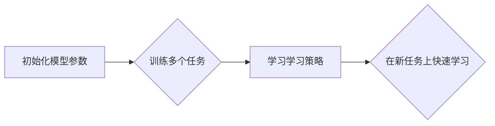

> 元学习，小样本学习，迁移学习，模型参数，学习策略，泛化能力，深度学习

## 1. 背景介绍

在机器学习领域，数据是至关重要的资源。传统的机器学习算法通常需要大量的 labeled 数据才能达到良好的性能。然而，在许多现实世界应用场景中，获取大量 labeled 数据往往成本高昂、时间consuming，甚至不可行。因此，如何有效地利用有限的 labeled 数据，提高模型在小样本学习场景下的泛化能力，成为了一个重要的研究方向。

元学习 (Meta-Learning) 作为一种新兴的机器学习范式，旨在学习学习策略，从而能够快速适应新的任务和数据分布。它通过在多个任务上进行训练，学习如何学习，从而在新的、未见过的任务上表现出色。元学习的优势在于，它可以利用之前学习到的知识，快速适应新的任务，从而有效地解决小样本学习问题。

## 2. 核心概念与联系

元学习的核心思想是学习一个通用的学习算法，这个算法能够在新的任务上快速学习。

**元学习与传统机器学习的区别：**

* **传统机器学习:** 针对单个任务进行训练，学习一个特定的模型参数。
* **元学习:** 针对多个任务进行训练，学习一个通用的学习策略，这个策略能够指导模型在新的任务上快速学习。

**元学习与迁移学习的关系:**

* **迁移学习:** 利用已学习到的知识迁移到新的任务上。
* **元学习:** 可以看作是一种更高级的迁移学习，它学习的是一个通用的学习策略，而不是特定的模型参数。

**元学习的流程:**



## 3. 核心算法原理 & 具体操作步骤

### 3.1  算法原理概述

元学习算法的核心是学习一个能够指导模型在新的任务上快速学习的学习策略。常见的元学习算法包括：

* **Model-Agnostic Meta-Learning (MAML):** MAML 是一种通用的元学习算法，它可以应用于各种机器学习模型。MAML 的目标是学习一个模型参数，使得在新的任务上进行少量梯度更新后，模型的性能能够达到最佳。
* **Prototypical Networks:** Prototypical Networks 是一种基于原型学习的元学习算法。它将每个任务的样本映射到一个原型向量，然后根据原型向量预测新样本所属的任务类别。
* **Matching Networks:** Matching Networks 是一种基于匹配的元学习算法。它通过计算新样本与每个任务样本之间的相似度，来预测新样本所属的任务类别。

### 3.2  算法步骤详解

以 MAML 为例，详细说明其算法步骤：

1. **初始化模型参数:** 为模型参数赋予初始值。
2. **训练多个任务:** 在多个任务的数据集上进行训练，每个任务包含少量 labeled 数据。
3. **学习学习策略:** 通过优化模型参数，使得在新的任务上进行少量梯度更新后，模型的性能能够达到最佳。
4. **在新任务上快速学习:** 将训练好的模型参数应用于新的任务，并进行少量梯度更新，即可在新的任务上快速学习。

### 3.3  算法优缺点

**优点:**

* **小样本学习能力强:** 元学习算法能够在少量 labeled 数据下有效地学习。
* **泛化能力强:** 元学习算法能够学习到通用的学习策略，从而在新的任务上表现出色。
* **适应性强:** 元学习算法能够快速适应新的任务和数据分布。

**缺点:**

* **训练成本高:** 元学习算法需要在多个任务上进行训练，训练成本较高。
* **算法复杂度高:** 元学习算法的实现较为复杂。

### 3.4  算法应用领域

元学习算法在以下领域具有广泛的应用前景:

* **自然语言处理:** 文本分类、机器翻译、问答系统等。
* **计算机视觉:** 图像识别、目标检测、图像分割等。
* **推荐系统:** 商品推荐、用户画像等。
* **医疗诊断:** 病症诊断、疾病预测等。

## 4. 数学模型和公式 & 详细讲解 & 举例说明

### 4.1  数学模型构建

MAML 的目标是学习一个模型参数 θ，使得在新的任务上进行少量梯度更新后，模型的性能能够达到最佳。

假设我们有 N 个任务，每个任务包含 M 个样本。每个任务的损失函数为 L(θ, x, y)，其中 x 是样本，y 是标签。

MAML 的目标函数为：

$$
\mathcal{L}(\theta) = \frac{1}{N} \sum_{i=1}^{N} \left[ \frac{1}{M} \sum_{j=1}^{M} L(\theta, x_i^j, y_i^j) + \frac{1}{K} \sum_{k=1}^{K} L(\theta + \alpha \nabla_{\theta} L(\theta, x_i^j, y_i^j), x_i^{j'}, y_i^{j'}) \right]
$$

其中：

* θ 是模型参数
* N 是任务数量
* M 是每个任务的样本数量
* K 是梯度更新次数
* α 是学习率
* x_i^j 是第 i 个任务的第 j 个样本
* y_i^j 是第 i 个任务的第 j 个样本的标签
* x_i^{j'} 是第 i 个任务的第 j' 个样本 (用于梯度更新)
* y_i^{j'} 是第 i 个任务的第 j' 个样本的标签 (用于梯度更新)

### 4.2  公式推导过程

MAML 的目标函数旨在最小化模型在每个任务上的损失函数，同时也要考虑模型在新的任务上进行少量梯度更新后的性能。

* 第一个项是每个任务的平均损失函数，用于衡量模型在每个任务上的性能。
* 第二项是模型在新的任务上进行少量梯度更新后的平均损失函数，用于衡量模型的泛化能力。

### 4.3  案例分析与讲解

假设我们有一个图像分类任务，需要将图像分类为猫、狗或鸟。我们可以使用 MAML 算法来训练一个模型，使得它能够在新的图像分类任务上快速学习。

1. 我们首先收集一些猫、狗和鸟的图像数据，并将其分成多个任务。每个任务包含少量 labeled 数据。
2. 我们使用 MAML 算法训练模型，目标是学习一个能够在新的任务上快速学习的模型参数。
3. 训练完成后，我们可以将模型应用于新的图像分类任务，并进行少量梯度更新，即可在新的任务上快速学习。

## 5. 项目实践：代码实例和详细解释说明

### 5.1  开发环境搭建

* Python 3.6+
* PyTorch 1.0+
* CUDA 10.0+

### 5.2  源代码详细实现

```python
import torch
import torch.nn as nn
import torch.optim as optim

# 定义模型
class SimpleModel(nn.Module):
    def __init__(self):
        super(SimpleModel, self).__init__()
        self.fc1 = nn.Linear(784, 128)
        self.fc2 = nn.Linear(128, 10)

    def forward(self, x):
        x = x.view(-1, 784)
        x = torch.relu(self.fc1(x))
        x = self.fc2(x)
        return x

# 定义 MAML 算法
class MAML(nn.Module):
    def __init__(self, model, lr):
        super(MAML, self).__init__()
        self.model = model
        self.optimizer = optim.Adam(self.model.parameters(), lr=lr)

    def train(self, tasks):
        for task in tasks:
            # 训练一个 epoch
            for epoch in range(1):
                for batch_idx, (x, y) in enumerate(task):
                    # 计算梯度
                    loss = self.loss_function(self.model(x), y)
                    self.optimizer.zero_grad()
                    loss.backward()
                    # 更新模型参数
                    self.optimizer.step()

# 定义损失函数
loss_function = nn.CrossEntropyLoss()

# 实例化模型和 MAML 算法
model = SimpleModel()
maml = MAML(model, lr=0.01)

# 训练 MAML 算法
tasks = # ...
maml.train(tasks)
```

### 5.3  代码解读与分析

* **模型定义:** 代码中定义了一个简单的多层感知机模型 (SimpleModel)。
* **MAML 算法定义:** 代码中定义了一个 MAML 算法类 (MAML)，它包含了模型、优化器和训练方法。
* **训练方法:** MAML 算法的训练方法是通过在多个任务上进行训练，每个任务包含少量 labeled 数据。
* **损失函数:** 代码中使用交叉熵损失函数 (CrossEntropyLoss) 来计算模型的损失。

### 5.4  运行结果展示

训练完成后，我们可以将模型应用于新的图像分类任务，并进行少量梯度更新，即可在新的任务上快速学习。

## 6. 实际应用场景

元学习在以下实际应用场景中展现出巨大的潜力:

* **个性化推荐:** 根据用户的历史行为和偏好，学习个性化的推荐策略。
* **自动驾驶:** 在有限的训练数据下，快速学习新的驾驶场景和规则。
* **医疗诊断:** 利用少量病历数据，学习诊断疾病的模型。
* **机器人控制:** 在新的环境中，快速学习新的控制策略。

### 6.4  未来应用展望

随着元学习算法的不断发展，其在更多领域将会得到应用，例如:

* **自然语言理解:** 更深入地理解人类语言，例如进行更准确的文本摘要、机器翻译和问答系统。
* **计算机视觉:** 更强大的图像识别、目标检测和图像生成能力。
* **药物研发:** 利用元学习加速药物研发过程，例如预测药物的有效性和安全性。

## 7. 工具和资源推荐

### 7.1  学习资源推荐

* **论文:**
    * Finn, C., Abbeel, P., & Levine, S. (2017). Model-agnostic meta-learning for fast adaptation of deep networks.
    * Vinyals, O., Blundell, C., Lillicrap, T. P., Georgiev, P., Kavukcuoglu, K., & Wierstra, D. (2016). Matching networks for one shot learning.
* **博客:**
    * OpenAI Blog: https://openai.com/blog/
    * DeepMind Blog: https://deepmind.com/blog/

### 7.2  开发工具推荐

* **PyTorch:** https://pytorch.org/
* **TensorFlow:** https://www.tensorflow.org/

### 7.3  相关论文推荐

* **Meta-Learning with Differentiable Convex Optimization**
* **Learning to Learn by Gradient Descent by Gradient Descent**
* **Prototypical Networks for Few-Shot Learning**

## 8. 总结：未来发展趋势与挑战

### 8.1  研究成果总结

元学习在小样本学习领域取得了显著的进展，能够有效地利用有限的 labeled 数据，提高模型的泛化能力。

### 8.2  未来发展趋势

* **更有效的元学习算法:** 研究更有效的元学习算法，例如基于强化学习的元学习算法。
* **元学习与其他机器学习方法的结合:** 将元学习与其他机器学习方法结合，例如迁移学习、联邦学习等。
* **元学习在更多领域的应用:** 将元学习应用于更多领域，例如自然语言理解、计算机视觉、药物研发等。

### 8.3  面临的挑战

* **训练成本高:** 元学习算法的训练成本较高，需要大量的计算资源。
* **算法复杂度高:** 元学习算法的实现较为复杂