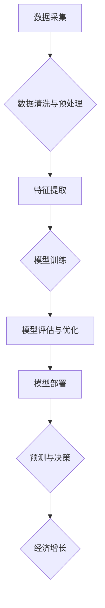

>  人工智能、经济增长、数据驱动、算法优化、可持续发展

## 1. 背景介绍

世界经济的增长一直是人类社会关注的焦点。从工业革命到信息时代，经济增长模式经历了深刻的变化。传统经济增长模式主要依赖于自然资源的开采和劳动力投入，但随着资源的枯竭和劳动力成本的上升，这种模式面临着越来越大的挑战。

近年来，人工智能（AI）技术飞速发展，为世界经济增长带来了新的机遇。AI技术的应用能够提高生产效率、优化资源配置、创造新的价值，从而推动经济增长。

## 2. 核心概念与联系

**2.1 数据驱动经济增长**

数据是人工智能的核心驱动力。随着互联网、物联网等技术的普及，海量数据被不断产生和积累。这些数据蕴含着丰富的经济价值，可以通过AI技术进行分析和挖掘，从而为经济增长提供新的动力。

**2.2 算法优化经济效率**

人工智能算法能够通过学习和分析数据，找到最优的决策方案，从而提高经济效率。例如，在物流领域，AI算法可以优化运输路线，降低运输成本；在金融领域，AI算法可以识别欺诈行为，降低风险。

**2.3 智能化生产推动经济转型**

人工智能技术能够实现智能化生产，提高生产效率和产品质量。例如，在制造业，AI技术可以实现机器人的自动化操作，提高生产效率；在农业，AI技术可以实现精准农业，提高产量和质量。

**2.4 创新驱动经济发展**

人工智能技术能够促进创新，创造新的产品和服务。例如，在医疗领域，AI技术可以辅助医生诊断疾病，提高医疗水平；在教育领域，AI技术可以个性化教学，提高教育质量。

**Mermaid 流程图**



## 3. 核心算法原理 & 具体操作步骤

**3.1 算法原理概述**

人工智能算法的核心原理是通过学习和分析数据，找到规律和模式，从而实现预测、决策等功能。常见的AI算法包括：

* **机器学习算法:** 
    * **监督学习:** 通过标记数据训练模型，例如分类、回归等。
    * **无监督学习:** 通过未标记数据发现模式，例如聚类、降维等。
    * **强化学习:** 通过奖励机制训练模型，例如游戏AI、机器人控制等。
* **深度学习算法:** 
    * **卷积神经网络 (CNN):** 用于图像识别、物体检测等。
    * **循环神经网络 (RNN):** 用于自然语言处理、语音识别等。
    * **生成对抗网络 (GAN):** 用于图像生成、文本生成等。

**3.2 算法步骤详解**

1. **数据收集和预处理:** 收集相关数据，并进行清洗、转换、特征提取等预处理操作。
2. **模型选择:** 根据具体任务选择合适的AI算法模型。
3. **模型训练:** 使用训练数据训练模型，调整模型参数，使其能够准确预测或决策。
4. **模型评估:** 使用测试数据评估模型的性能，例如准确率、召回率、F1-score等。
5. **模型优化:** 根据评估结果，调整模型参数或选择其他算法模型，提高模型性能。
6. **模型部署:** 将训练好的模型部署到实际应用场景中，用于预测或决策。

**3.3 算法优缺点**

* **优点:** 
    * 自动化决策，提高效率。
    * 挖掘数据隐藏价值，发现新规律。
    * 适应复杂环境，不断学习和优化。
* **缺点:** 
    * 需要大量数据进行训练。
    * 模型解释性较差，难以理解决策过程。
    * 存在算法偏差和公平性问题。

**3.4 算法应用领域**

* **金融:** 欺诈检测、风险评估、投资决策。
* **医疗:** 疾病诊断、药物研发、个性化治疗。
* **制造:** 质量控制、预测维护、智能制造。
* **零售:** 商品推荐、库存管理、客户服务。
* **交通:** 智能驾驶、交通流量预测、物流优化。

## 4. 数学模型和公式 & 详细讲解 & 举例说明

**4.1 数学模型构建**

人工智能算法的数学模型通常基于概率论、统计学和微积分等数学基础。例如，线性回归模型的数学表达式为：

$$y = w_0 + w_1x_1 + w_2x_2 + ... + w_nx_n + \epsilon$$

其中：

* $y$ 是预测值。
* $w_0, w_1, ..., w_n$ 是模型参数。
* $x_1, x_2, ..., x_n$ 是输入特征。
* $\epsilon$ 是误差项。

**4.2 公式推导过程**

模型参数的学习过程通常使用梯度下降算法，通过迭代更新参数，使得模型预测值与真实值之间的误差最小化。梯度下降算法的数学表达式为：

$$w_{i} = w_{i} - \alpha \frac{\partial Loss}{\partial w_{i}}$$

其中：

* $w_i$ 是模型参数。
* $\alpha$ 是学习率。
* $Loss$ 是损失函数，用于衡量模型预测值与真实值之间的误差。

**4.3 案例分析与讲解**

例如，在房价预测问题中，我们可以使用线性回归模型预测房屋价格。输入特征包括房屋面积、房间数量、地理位置等，输出特征是房屋价格。通过训练模型，我们可以得到房屋价格与输入特征之间的关系，从而预测新房子的价格。

## 5. 项目实践：代码实例和详细解释说明

**5.1 开发环境搭建**

* 操作系统: Ubuntu 20.04
* Python 版本: 3.8
* 必要的库: pandas, numpy, scikit-learn

**5.2 源代码详细实现**

```python
import pandas as pd
from sklearn.linear_model import LinearRegression
from sklearn.model_selection import train_test_split

# 加载数据
data = pd.read_csv('house_price.csv')

# 选择特征和目标变量
features = ['area', 'rooms', 'location']
target = 'price'

# 将数据分为训练集和测试集
X_train, X_test, y_train, y_test = train_test_split(data[features], data[target], test_size=0.2, random_state=42)

# 创建线性回归模型
model = LinearRegression()

# 训练模型
model.fit(X_train, y_train)

# 预测测试集数据
y_pred = model.predict(X_test)

# 评估模型性能
from sklearn.metrics import mean_squared_error
mse = mean_squared_error(y_test, y_pred)
print(f'Mean Squared Error: {mse}')
```

**5.3 代码解读与分析**

* 首先，我们加载数据并选择特征和目标变量。
* 然后，我们将数据分为训练集和测试集，用于训练和评估模型。
* 接下来，我们创建线性回归模型并训练模型。
* 最后，我们使用训练好的模型预测测试集数据，并评估模型性能。

**5.4 运行结果展示**

运行代码后，会输出模型的均方误差 (MSE) 值，用于衡量模型预测精度。

## 6. 实际应用场景

**6.1 金融领域**

* **信用风险评估:** 使用AI算法分析客户的财务数据，预测其是否会违约。
* **欺诈检测:** 使用AI算法识别异常交易行为，防止金融欺诈。
* **投资决策:** 使用AI算法分析市场数据，预测股票价格走势，辅助投资决策。

**6.2 医疗领域**

* **疾病诊断:** 使用AI算法分析患者的病历、影像数据等，辅助医生诊断疾病。
* **药物研发:** 使用AI算法分析药物分子结构和生物活性，加速药物研发。
* **个性化治疗:** 使用AI算法分析患者的基因信息和生活习惯，制定个性化治疗方案。

**6.3 制造领域**

* **质量控制:** 使用AI算法分析产品缺陷，提高产品质量。
* **预测维护:** 使用AI算法分析设备运行数据，预测设备故障，进行及时维护。
* **智能制造:** 使用AI算法控制机器人和自动化设备，实现智能化生产。

**6.4 未来应用展望**

随着人工智能技术的不断发展，其在世界经济增长中的作用将更加重要。未来，人工智能将应用于更多领域，创造更多价值。例如：

* **个性化服务:** AI技术将能够提供更加个性化的产品和服务，满足不同用户的需求。
* **自动驾驶:** AI技术将推动自动驾驶汽车的普及，改变交通出行方式。
* **新兴产业:** AI技术将催生新的产业和商业模式，创造新的经济增长点。

## 7. 工具和资源推荐

**7.1 学习资源推荐**

* **在线课程:** Coursera, edX, Udacity
* **书籍:**
    * 《深度学习》
    * 《机器学习实战》
    * 《人工智能：一种现代方法》
* **开源库:** TensorFlow, PyTorch, scikit-learn

**7.2 开发工具推荐**

* **编程语言:** Python
* **IDE:** Jupyter Notebook, PyCharm
* **云平台:** AWS, Azure, Google Cloud

**7.3 相关论文推荐**

* **《ImageNet Classification with Deep Convolutional Neural Networks》**
* **《Attention Is All You Need》**
* **《Generative Adversarial Nets》**

## 8. 总结：未来发展趋势与挑战

**8.1 研究成果总结**

近年来，人工智能技术取得了长足的进步，在各个领域都取得了显著的应用成果。例如，在图像识别、自然语言处理、语音识别等领域，AI算法的性能已经超过了人类水平。

**8.2 未来发展趋势**

* **模型规模和能力的提升:** 未来，AI模型将更加强大，能够处理更加复杂的任务。
* **算法的泛化能力增强:** 未来，AI算法将更加能够适应不同的场景和数据。
* **边缘计算和联邦学习的应用:** 未来，AI计算将更加分散，更加安全和隐私保护。

**8.3 面临的挑战**

* **数据安全和隐私保护:** AI算法依赖于大量数据，如何保证数据安全和隐私保护是一个重要的挑战。
* **算法公平性和可解释性:** AI算法可能存在偏差和不可解释性，如何确保算法公平性和可解释性是一个重要的研究方向。
* **伦理和社会影响:** AI技术的发展可能带来一些伦理和社会问题，需要进行深入的思考和讨论。

**8.4 研究展望**

未来，人工智能研究将继续朝着更加智能、更加安全、更加可解释的方向发展。


## 9. 附录：常见问题与解答

**9.1 如何选择合适的AI算法？**

选择合适的AI算法取决于具体的应用场景和数据特点。例如，对于分类问题，可以使用支持向量机、决策树等算法；对于回归问题，可以使用线性回归、神经网络等算法。

**9.2 如何评估AI模型的性能？**

常用的AI模型性能评估指标包括准确率、召回率、F1-score、AUC等。

**9.3 如何解决AI算法的过拟合问题？**

过拟合是指AI模型在训练数据上表现很好，但在测试数据上表现较差。解决过拟合问题的方法包括：

* 减少模型复杂度
* 增加训练数据量
* 使用正则化技术
* 使用交叉验证

**9.4 如何保证AI算法的公平性和可解释性？**

保证AI算法的公平性和可解释性是一个重要的研究方向。一些方法包括：

* 使用公平性约束条件训练模型
* 使用可解释性方法解释模型决策过程
* 促进AI算法的透明度和可访问性

作者