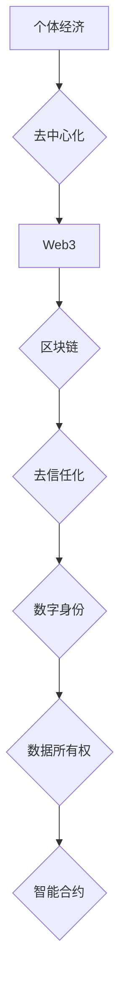

> 个体经济、去中心化、Web3、区块链、去信任化、数字身份、数据所有权、智能合约

## 1. 背景介绍

互联网的诞生和发展，深刻地改变了人类社会，带来了前所未有的信息共享和沟通便利。然而，传统的互联网架构仍然以中心化模式为主，由少数巨头公司掌控着数据和平台，这导致了数据垄断、隐私泄露等问题，也限制了个体的自主性和经济参与度。

近年来，区块链技术、去中心化应用（DeFi）和Web3等新兴技术兴起，为打破中心化模式、赋能个体崛起提供了新的可能性。这些技术基于去信任化、开源和透明的原则，构建了一个更加开放、平等和自治的网络世界，每个人都可以成为独立的经济主体，拥有自己的数据和资产。

## 2. 核心概念与联系

**2.1 个体经济**

个体经济是指以个人或小型群体为基础的经济活动，强调个体的自主性和独立性。在个体经济中，每个人都可以根据自己的技能、兴趣和资源，参与到各种经济活动中，并从中获得收益。

**2.2 去中心化**

去中心化是指权力和控制分散在多个节点或参与者手中，而不是集中在单一实体。去中心化网络能够抵抗单点故障，提高系统的安全性、可靠性和抗审查性。

**2.3 Web3**

Web3是一个基于区块链技术的下一代互联网，其核心特点是去中心化、开源和用户所有权。在Web3中，用户可以拥有自己的数据和身份，并通过智能合约参与到各种去中心化应用中。

**2.4 区块链**

区块链是一种分布式账本技术，能够记录和验证交易信息，并确保其不可篡改和透明。区块链技术为去中心化应用提供了底层基础设施，保障了数据安全和交易可靠性。

**2.5 去信任化**

去信任化是指无需依赖第三方机构或中心化的权威，通过智能合约和加密技术实现信任和安全。去信任化能够降低交易成本，提高效率，并促进更公平的合作模式。

**2.6 数字身份**

数字身份是指基于区块链技术的个人身份认证系统，能够保障用户的身份安全和隐私保护。数字身份可以帮助用户在Web3中进行身份验证、授权和数据共享。

**2.7 数据所有权**

数据所有权是指个人对自身数据拥有自主控制权，可以决定如何使用、共享和出售自己的数据。在Web3中，用户可以拥有自己的数据，并通过数据交易平台获得收益。

**2.8 智能合约**

智能合约是一种自动执行的代码协议，能够根据预先设定的规则自动执行交易和执行合同条款。智能合约可以提高交易效率，降低成本，并减少人为错误。

**Mermaid 流程图**



## 3. 核心算法原理 & 具体操作步骤

**3.1 算法原理概述**

个体经济的崛起依赖于一系列核心算法，这些算法能够实现去中心化、去信任化和数据所有权等关键功能。

* **共识算法:** 确保网络中的所有节点达成一致，验证交易信息和更新区块链状态。常见的共识算法包括工作量证明（PoW）、权益证明（PoS）等。
* **加密算法:** 保证数据安全和隐私保护，防止数据被篡改或窃取。常见的加密算法包括椭圆曲线密码学（ECC）、哈希函数等。
* **智能合约执行引擎:** 能够解释和执行智能合约代码，自动执行交易和合同条款。

**3.2 算法步骤详解**

1. **用户注册:** 用户通过数字身份系统注册，获得自己的数字身份标识。
2. **数据上传:** 用户可以将自己的数据上传到去中心化的数据存储平台，并设置数据访问权限。
3. **数据交易:** 用户可以将自己的数据出售给需要的数据分析公司或研究机构，并通过智能合约获得收益。
4. **智能合约执行:** 当用户同意数据交易协议时，智能合约会自动执行，将数据和收益分配给相关参与者。
5. **数据安全保障:** 数据存储和交易过程都经过加密和验证，确保数据安全和隐私保护。

**3.3 算法优缺点**

**优点:**

* **去中心化:** 避免了数据垄断和中心化控制，提高了系统的安全性、可靠性和抗审查性。
* **去信任化:** 通过智能合约和加密技术实现信任和安全，降低了交易成本和风险。
* **数据所有权:** 用户拥有自己的数据，可以自主决定如何使用、共享和出售自己的数据。

**缺点:**

* **技术复杂性:** 区块链技术和智能合约开发需要较高的技术门槛。
* **可扩展性:** 目前区块链技术的可扩展性仍然是一个挑战，需要进一步优化和改进。
* **监管不确定性:** 区块链技术和去中心化应用的监管环境仍然不完善，需要进一步探索和规范。

**3.4 算法应用领域**

* **数据交易市场:** 用户可以将自己的数据出售给需要的数据分析公司或研究机构。
* **供应链管理:** 通过区块链技术追踪商品的来源和流通路径，提高供应链的透明度和安全性。
* **医疗保健:** 保护患者的医疗数据隐私，并实现数据共享和协作。
* **金融服务:** 提供去中心化的金融服务，例如借贷、支付和投资。

## 4. 数学模型和公式 & 详细讲解 & 举例说明

**4.1 数学模型构建**

个体经济的数学模型可以基于博弈论、信息经济学和网络科学等理论构建。

* **博弈论:** 分析个体在不同场景下的决策行为，以及这些决策行为对整体经济的影响。
* **信息经济学:** 研究信息不对称如何影响个体经济行为，以及如何通过信息共享和交易来降低信息成本。
* **网络科学:** 研究个体之间的连接和互动关系，以及这些关系如何影响个体经济的规模和效率。

**4.2 公式推导过程**

例如，我们可以使用博弈论中的纳什均衡模型来分析个体在数据交易市场中的行为。

假设有两个参与者，A和B，他们分别拥有数据资产和需求。A可以决定是否出售自己的数据给B，B可以决定是否购买A的数据。

* **A的收益函数:**  如果A出售数据给B，收益为$R_A(x)$, 其中x是数据交易价格。如果A不出售数据，收益为$R_A(0)$.
* **B的收益函数:** 如果B购买A的数据，收益为$R_B(x)$, 其中x是数据交易价格。如果B不购买A的数据，收益为$R_B(0)$.

纳什均衡是指，在给定对方策略的情况下，每个参与者都无法通过单方面改变自己的策略来获得更高的收益。

**4.3 案例分析与讲解**

我们可以通过案例分析来理解个体经济的数学模型和应用。例如，我们可以分析一个去中心化数据交易平台的运作机制，以及用户在平台上的数据交易行为。

## 5. 项目实践：代码实例和详细解释说明

**5.1 开发环境搭建**

* 安装Node.js和npm
* 安装Truffle框架
* 创建一个新的Truffle项目

**5.2 源代码详细实现**

```javascript
// SPDX-License-Identifier: MIT
pragma solidity ^0.8.0;

contract DataMarketplace {
    // 数据提供者地址
    mapping(address => bool) public dataProviders;

    // 数据购买者地址
    mapping(address => bool) public dataBuyers;

    // 数据交易记录
    struct DataTransaction {
        address dataProvider;
        address dataBuyer;
        uint256 price;
        bool completed;
    }

    // 数据交易记录列表
    DataTransaction[] public transactions;

    // 添加数据提供者
    function addDataProvider(address _address) public {
        dataProviders[_address] = true;
    }

    // 添加数据购买者
    function addDataBuyer(address _address) public {
        dataBuyers[_address] = true;
    }

    // 创建数据交易
    function createTransaction(address _dataBuyer, uint256 _price) public {
        require(dataProviders[msg.sender], "Only data providers can create transactions");
        transactions.push(DataTransaction(msg.sender, _dataBuyer, _price, false));
    }

    // 完成数据交易
    function completeTransaction(uint256 _transactionIndex) public {
        require(dataBuyers[msg.sender], "Only data buyers can complete transactions");
        require(transactions[_transactionIndex].dataProvider == msg.sender, "Only data provider can complete transactions");
        transactions[_transactionIndex].completed = true;
    }
}
```

**5.3 代码解读与分析**

* 该代码实现了一个简单的去中心化数据交易平台合约。
* 合约定义了数据提供者和数据购买者的角色，并提供了创建和完成数据交易的函数。
* 数据交易记录存储在`transactions`数组中，每个交易记录包含交易双方地址、交易价格和交易状态。
* 合约使用`require`语句来验证用户身份和交易状态，确保交易的安全性。

**5.4 运行结果展示**

可以通过Truffle框架部署合约到以太坊网络，并使用Web3.js等工具进行交互测试。

## 6. 实际应用场景

**6.1 数据交易市场**

个体经济的崛起为数据交易市场提供了新的可能性。用户可以将自己的数据出售给需要的数据分析公司或研究机构，并获得收益。

**6.2 供应链管理**

区块链技术可以帮助企业实现供应链的透明化和可追溯性。通过记录商品的来源和流通路径，企业可以提高供应链的安全性、效率和可信度。

**6.3 医疗保健**

个体经济可以帮助患者更好地控制自己的医疗数据。患者可以将自己的医疗数据存储在去中心化的平台上，并选择与哪些医生或机构共享数据。

**6.4 未来应用展望**

个体经济的应用场景还在不断扩展，未来可能会应用于更多领域，例如教育、娱乐、金融等。随着区块链技术和Web3技术的不断发展，个体经济将成为未来经济发展的重要趋势。

## 7. 工具和资源推荐

**7.1 学习资源推荐**

* **书籍:**
    * 《区块链革命》
    * 《Web3：去中心化互联网的未来》
    * 《智能合约编程》
* **在线课程:**
    * Coursera: 区块链技术
    * Udemy: Web3开发
    * edX: 智能合约编程

**7.2 开发工具推荐**

* **Truffle:** 区块链开发框架
* **Remix:** 在线智能合约开发环境
* **MetaMask:** 以太坊钱包

**7.3 相关论文推荐**

* **The Bitcoin White Paper:** https://bitcoin.org/bitcoin.pdf
* **A Next Generation Internet Architecture: The Web3 Vision:** https://web3.org/

## 8. 总结：未来发展趋势与挑战

**8.1 研究成果总结**

个体经济的崛起是区块链技术和Web3技术的必然结果，它为个体提供了更多的自主性和经济参与度。

**8.2 未来发展趋势**

* **去中心化应用的普及:** 随着区块链技术的成熟，更多去中心化应用将会涌现，覆盖更广泛的领域。
* **数据所有权的增强:** 用户将拥有更多控制权，可以自主决定如何使用、共享和出售自己的数据。
* **经济模式的创新:** 个体经济将催生新的经济模式，例如数据交易市场、去中心化金融等。

**8.3 面临的挑战**

* **技术复杂性:** 区块链技术和智能合约开发需要