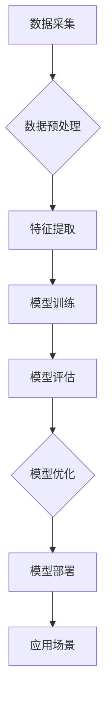

> 人工智能，机器学习，深度学习，自然语言处理，计算机视觉，学科建立，发展趋势，挑战

## 1. 背景介绍

人工智能（Artificial Intelligence，简称AI）作为一门跨学科领域，近年来发展迅速，取得了令人瞩目的成就。从语音识别、图像识别到自动驾驶、医疗诊断，AI技术已渗透到各个领域，深刻地改变着人们的生活方式和工作模式。

然而，尽管AI取得了如此巨大的进步，但将其作为独立学科的建立却并非一蹴而就。AI的发展历程可以追溯到20世纪50年代，早期研究主要集中在符号人工智能和专家系统领域。随着计算机硬件和软件技术的不断发展，机器学习和深度学习等新兴技术逐渐成为AI研究的热点。

## 2. 核心概念与联系

**2.1  人工智能的核心概念**

人工智能的核心概念是模拟和实现人类智能的行为。这包括但不限于：

* **学习：**从数据中提取知识和规律，不断改进自身性能。
* **推理：**根据已有的知识和规则，推断出新的结论。
* **决策：**在不确定性环境下，选择最佳行动方案。
* **感知：**理解和解释来自外部世界的信息，例如图像、声音、文本等。
* **语言理解：**理解和生成人类语言。

**2.2  人工智能与相关学科的联系**

人工智能是一个跨学科领域，与众多学科密切相关，例如：

* **计算机科学：**提供算法、数据结构、编程语言等基础理论和工具。
* **数学：**为人工智能提供理论基础，例如概率论、统计学、线性代数等。
* **心理学：**研究人类认知机制，为人工智能提供灵感和指导。
* **神经科学：**研究大脑的结构和功能，为人工智能提供生物学基础。
* **哲学：**探讨人工智能的伦理、社会影响等问题。

**2.3  人工智能的架构**

人工智能系统通常由以下几个主要部分组成：

* **数据采集和预处理：**收集和处理来自各种来源的数据，使其适合人工智能算法的训练和使用。
* **特征提取：**从原始数据中提取有用的特征，用于训练人工智能模型。
* **模型训练：**使用训练数据训练人工智能模型，使其能够学习和预测。
* **模型评估和优化：**评估模型的性能，并进行相应的优化，提高模型的准确性和效率。
* **应用部署：**将训练好的模型部署到实际应用场景中，实现人工智能功能。



## 3. 核心算法原理 & 具体操作步骤

**3.1  算法原理概述**

机器学习是人工智能的核心技术之一，它通过算法学习数据，从数据中发现规律，并根据这些规律进行预测或决策。机器学习算法可以分为监督学习、无监督学习和强化学习三大类。

* **监督学习：**利用标记数据训练模型，预测新的数据标签。例如，图像分类、文本分类等。
* **无监督学习：**利用未标记数据发现数据中的潜在结构和规律。例如，聚类分析、降维等。
* **强化学习：**通过试错学习，在环境中获得最大奖励。例如，游戏AI、机器人控制等。

**3.2  算法步骤详解**

以监督学习为例，其基本步骤如下：

1. **数据收集和预处理：**收集相关数据，并进行清洗、转换、特征工程等预处理操作。
2. **模型选择：**根据具体任务选择合适的机器学习算法，例如线性回归、逻辑回归、决策树、支持向量机等。
3. **模型训练：**使用训练数据训练模型，调整模型参数，使其能够准确预测数据标签。
4. **模型评估：**使用测试数据评估模型的性能，例如准确率、召回率、F1-score等。
5. **模型优化：**根据评估结果，调整模型参数或选择其他算法，提高模型性能。
6. **模型部署：**将训练好的模型部署到实际应用场景中，用于预测新的数据。

**3.3  算法优缺点**

不同的机器学习算法具有不同的优缺点，需要根据具体任务选择合适的算法。例如，线性回归算法简单易实现，但对非线性关系的拟合能力较弱；决策树算法可以处理非线性关系，但容易过拟合；支持向量机算法可以处理高维数据，但训练时间较长。

**3.4  算法应用领域**

机器学习算法广泛应用于各个领域，例如：

* **图像识别：**人脸识别、物体检测、图像分类等。
* **自然语言处理：**文本分类、情感分析、机器翻译等。
* **推荐系统：**商品推荐、音乐推荐、电影推荐等。
* **医疗诊断：**疾病预测、影像分析、药物研发等。
* **金融风险控制：**欺诈检测、信用评分、投资决策等。

## 4. 数学模型和公式 & 详细讲解 & 举例说明

**4.1  数学模型构建**

机器学习算法通常基于数学模型进行构建。例如，线性回归模型假设数据之间存在线性关系，可以用以下公式表示：

$$y = w_0 + w_1x_1 + w_2x_2 + ... + w_nx_n + \epsilon$$

其中：

* $y$ 是预测值
* $w_0, w_1, ..., w_n$ 是模型参数
* $x_1, x_2, ..., x_n$ 是输入特征
* $\epsilon$ 是误差项

**4.2  公式推导过程**

机器学习算法的训练过程本质上是参数优化过程。常用的优化算法包括梯度下降法、随机梯度下降法等。这些算法通过迭代更新模型参数，使得模型预测值与真实值之间的误差最小化。

**4.3  案例分析与讲解**

以线性回归为例，假设我们想要预测房屋价格，输入特征包括房屋面积、房间数量等。我们可以使用线性回归模型训练一个模型，并根据模型预测，估算不同房屋的价格。

## 5. 项目实践：代码实例和详细解释说明

**5.1  开发环境搭建**

可以使用Python语言和相关的机器学习库，例如Scikit-learn、TensorFlow、PyTorch等，进行机器学习项目开发。

**5.2  源代码详细实现**

```python
from sklearn.linear_model import LinearRegression
from sklearn.model_selection import train_test_split
from sklearn.metrics import mean_squared_error

# 加载数据
data = ...

# 将数据分为训练集和测试集
X_train, X_test, y_train, y_test = train_test_split(data[:, :-1], data[:, -1], test_size=0.2)

# 创建线性回归模型
model = LinearRegression()

# 训练模型
model.fit(X_train, y_train)

# 预测测试集数据
y_pred = model.predict(X_test)

# 计算模型性能
mse = mean_squared_error(y_test, y_pred)
print(f"Mean Squared Error: {mse}")
```

**5.3  代码解读与分析**

这段代码演示了如何使用Scikit-learn库进行线性回归模型的训练和预测。首先，加载数据并将其分为训练集和测试集。然后，创建线性回归模型并使用训练集进行模型训练。最后，使用训练好的模型预测测试集数据，并计算模型性能。

**5.4  运行结果展示**

运行代码后，会输出模型的均方误差（MSE）值，该值反映了模型预测值与真实值之间的误差大小。

## 6. 实际应用场景

**6.1  医疗诊断**

人工智能可以用于辅助医生进行疾病诊断，例如根据患者的症状、病史和影像数据，预测疾病的可能性。

**6.2  金融风险控制**

人工智能可以用于识别金融欺诈行为，例如信用卡诈骗、网络钓鱼等，并进行风险评估和控制。

**6.3  智能客服**

人工智能可以用于构建智能客服系统，例如聊天机器人，为客户提供24小时在线服务。

**6.4  未来应用展望**

人工智能技术的未来应用前景广阔，例如：

* **个性化教育：**根据学生的学习情况，提供个性化的学习方案。
* **自动驾驶：**实现无人驾驶汽车，提高交通安全和效率。
* **科学研究：**加速科学发现，例如药物研发、材料科学等。

## 7. 工具和资源推荐

**7.1  学习资源推荐**

* **在线课程：**Coursera、edX、Udacity等平台提供丰富的机器学习和深度学习课程。
* **书籍：**《深入理解机器学习》、《深度学习》等书籍是机器学习和深度学习的经典教材。
* **博客和论坛：**机器学习和深度学习领域的博客和论坛，例如Towards Data Science、Machine Learning Mastery等，可以获取最新的研究成果和实践经验。

**7.2  开发工具推荐**

* **Python：**机器学习和深度学习的常用编程语言。
* **Scikit-learn：**Python机器学习库，提供各种机器学习算法和工具。
* **TensorFlow：**Google开发的深度学习框架。
* **PyTorch：**Facebook开发的深度学习框架。

**7.3  相关论文推荐**

* **《ImageNet Classification with Deep Convolutional Neural Networks》**
* **《Attention Is All You Need》**
* **《Generative Adversarial Networks》**

## 8. 总结：未来发展趋势与挑战

**8.1  研究成果总结**

近年来，人工智能取得了令人瞩目的成就，例如图像识别、自然语言处理、语音识别等领域取得了突破性进展。

**8.2  未来发展趋势**

人工智能的发展趋势包括：

* **模型规模和复杂度提升：**模型参数规模和复杂度不断提升，例如Transformer模型的出现。
* **跨模态学习：**融合不同模态数据，例如文本、图像、音频等，实现更全面的理解和交互。
* **可解释性增强：**提高人工智能模型的透明度和可解释性，增强用户对模型决策的信任。
* **边缘计算：**将人工智能模型部署到边缘设备，实现更快速的响应和更低的延迟。

**8.3  面临的挑战**

人工智能发展也面临着一些挑战，例如：

* **数据获取和隐私保护：**人工智能算法依赖于大量数据，如何获取高质量数据并保护用户隐私是一个重要问题。
* **算法偏见和公平性：**人工智能算法可能存在偏见，导致不公平的结果，需要研究如何解决算法偏见问题。
* **安全性和可靠性：**人工智能系统需要保证安全性和可靠性，避免出现安全漏洞和不可预知的错误。
* **伦理和社会影响：**人工智能的发展可能带来一些伦理和社会问题，例如就业替代、算法监管等，需要进行深入探讨和研究。

**8.4  研究展望**

未来，人工智能研究将继续朝着更智能、更安全、更可解释的方向发展。我们需要加强基础理论研究，探索人工智能的本质和边界；同时，也要关注人工智能的社会影响，确保人工智能技术能够造福人类。

## 9. 附录：常见问题与解答

**9.1  什么是机器学习？**

机器学习是一种人工智能技术，它通过算法学习数据，从数据中发现规律，并根据这些规律进行预测或决策。

**9.2  什么是深度学习？**

深度学习是一种机器学习的子领域，它使用多层神经网络来模拟人类大脑的学习过程。

**9.3  如何选择合适的机器学习算法？**

选择合适的机器学习算法需要根据具体任务和数据特点进行选择。例如，对于分类任务，可以考虑使用逻辑回归、决策树、支持向量机等算法；对于回归任务，可以考虑使用线性回归、支持向量回归等算法。

**9.4  如何评估机器学习模型的性能？**

常用的