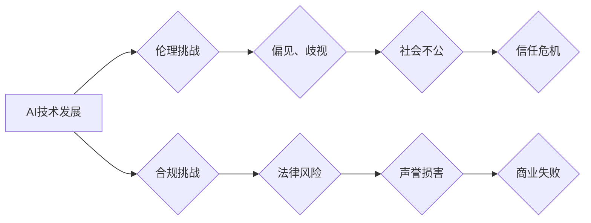

> 人工智能，创业，伦理，合规，策略，风险管理，社会责任，法律法规，数据隐私，算法偏见

## 1. 背景介绍

人工智能（AI）技术近年来发展迅速，已渗透到各个领域，为创业者带来了前所未有的机遇。从自动驾驶到医疗诊断，从个性化推荐到智能客服，AI技术正在改变着我们的生活方式和商业模式。然而，AI技术的快速发展也带来了新的伦理和合规挑战。

**1.1 AI 创业的机遇与挑战**

AI创业的机遇在于：

* **技术突破:** AI技术的进步带来了全新的应用场景和商业模式。
* **市场需求:**  社会对AI技术的应用需求日益增长，为AI创业提供了广阔的市场空间。
* **投资热潮:**  全球范围内对AI技术的投资热情高涨，为AI创业提供了充足的资金支持。

然而，AI创业也面临着诸多挑战：

* **伦理风险:** AI算法可能存在偏见、歧视等伦理问题，需要谨慎处理。
* **合规风险:**  AI技术的应用需要遵守相关法律法规，否则可能面临法律诉讼和声誉损害。
* **技术门槛:**  AI技术研发需要高水平的专业人才和技术支持，创业者需要克服技术门槛。

**1.2 伦理合规的重要性**

在AI创业过程中，伦理合规问题至关重要。

* **社会责任:**  AI创业者需要承担起社会责任，确保AI技术的应用造福人类，而不是带来负面影响。
* **商业可持续性:**  违反伦理合规规范可能会损害企业声誉，导致商业失败。
* **法律风险:**  违反相关法律法规可能会面临严厉的法律制裁。

## 2. 核心概念与联系

**2.1 核心概念**

* **人工智能 (AI):**  模拟人类智能的计算机系统，能够学习、推理、决策等。
* **机器学习 (ML):**  一种AI技术，使计算机能够从数据中学习，无需明确编程。
* **深度学习 (DL):**  一种更高级的机器学习技术，使用多层神经网络模拟人类大脑的结构和功能。
* **伦理:**  道德原则和规范，指导人类行为，确保社会和谐发展。
* **合规:**  遵守法律法规和行业标准，避免违法违规行为。

**2.2 核心概念联系**

AI技术的发展带来了伦理和合规挑战，需要创业者在开发和应用AI技术时，充分考虑伦理和合规问题。

**Mermaid 流程图**



## 3. 核心算法原理 & 具体操作步骤

**3.1 算法原理概述**

机器学习算法的核心原理是通过训练模型，使模型能够从数据中学习规律，并根据学习到的规律进行预测或分类。常见的机器学习算法包括：

* **监督学习:**  使用标记数据训练模型，例如分类和回归问题。
* **无监督学习:**  使用未标记数据训练模型，例如聚类和降维问题。
* **强化学习:**  通过奖励和惩罚机制训练模型，使模型能够在环境中学习最佳策略。

**3.2 算法步骤详解**

1. **数据收集和预处理:**  收集相关数据，并进行清洗、转换、特征工程等预处理操作。
2. **模型选择:**  根据具体问题选择合适的机器学习算法。
3. **模型训练:**  使用训练数据训练模型，调整模型参数，使模型能够准确预测或分类。
4. **模型评估:**  使用测试数据评估模型的性能，例如准确率、召回率、F1-score等。
5. **模型部署:**  将训练好的模型部署到实际应用场景中。

**3.3 算法优缺点**

* **优点:**  能够自动学习数据规律，无需人工编程，具有强大的预测和分类能力。
* **缺点:**  需要大量数据进行训练，训练时间长，容易受到数据质量的影响，解释性较差。

**3.4 算法应用领域**

机器学习算法广泛应用于各个领域，例如：

* **图像识别:**  人脸识别、物体检测、图像分类等。
* **自然语言处理:**  文本分类、情感分析、机器翻译等。
* **推荐系统:**  商品推荐、内容推荐、用户画像等。
* **医疗诊断:**  疾病预测、影像分析、药物研发等。

## 4. 数学模型和公式 & 详细讲解 & 举例说明

**4.1 数学模型构建**

机器学习算法通常使用数学模型来表示数据之间的关系。常见的数学模型包括：

* **线性回归模型:**  用于预测连续变量，假设数据之间存在线性关系。
* **逻辑回归模型:**  用于分类问题，假设数据之间存在非线性关系。
* **神经网络模型:**  用于复杂问题，模拟人类大脑的结构和功能。

**4.2 公式推导过程**

例如，线性回归模型的目标是找到一条直线，使得直线与数据点之间的距离最小。

**公式:**

$$
y = w_0 + w_1x
$$

其中：

* $y$ 是预测值
* $x$ 是输入特征
* $w_0$ 和 $w_1$ 是模型参数

**损失函数:**

$$
L = \frac{1}{n}\sum_{i=1}^{n}(y_i - \hat{y}_i)^2
$$

其中：

* $n$ 是数据点的数量
* $y_i$ 是真实值
* $\hat{y}_i$ 是预测值

**梯度下降算法:**

用于优化模型参数，使得损失函数最小化。

**4.3 案例分析与讲解**

例如，可以使用线性回归模型预测房价。

* **输入特征:**  房屋面积、房间数量、地理位置等。
* **输出特征:**  房屋价格。

通过训练模型，可以得到一个预测房价的公式，例如：

$$
房价 = 10000 + 500 * 面积
$$

## 5. 项目实践：代码实例和详细解释说明

**5.1 开发环境搭建**

* **操作系统:**  Windows、macOS、Linux
* **编程语言:**  Python
* **机器学习库:**  scikit-learn、TensorFlow、PyTorch

**5.2 源代码详细实现**

```python
from sklearn.linear_model import LinearRegression
from sklearn.model_selection import train_test_split
import pandas as pd

# 加载数据
data = pd.read_csv('house_data.csv')

# 分割数据
X = data[['面积', '房间数量']]
y = data['房价']
X_train, X_test, y_train, y_test = train_test_split(X, y, test_size=0.2, random_state=42)

# 创建模型
model = LinearRegression()

# 训练模型
model.fit(X_train, y_train)

# 预测房价
y_pred = model.predict(X_test)

# 评估模型性能
from sklearn.metrics import mean_squared_error
mse = mean_squared_error(y_test, y_pred)
print(f'均方误差: {mse}')
```

**5.3 代码解读与分析**

* 使用 scikit-learn 库加载数据、分割数据、创建模型、训练模型和评估模型性能。
* 使用线性回归模型预测房价。
* 使用均方误差 (MSE) 评估模型性能。

**5.4 运行结果展示**

运行代码后，会输出模型的均方误差值，表示模型预测房价的准确性。

## 6. 实际应用场景

**6.1 医疗诊断**

AI技术可以辅助医生进行疾病诊断，例如：

* **影像分析:**  AI算法可以分析医学影像，例如X光片、CT扫描、MRI扫描，识别肿瘤、骨折等异常情况。
* **病历分析:**  AI算法可以分析患者病历，识别疾病风险、预测疾病发展趋势。

**6.2 金融风险管理**

AI技术可以帮助金融机构识别和管理风险，例如：

* **欺诈检测:**  AI算法可以分析交易数据，识别异常交易，防止欺诈行为。
* **信用评分:**  AI算法可以分析客户信用信息，评估客户信用风险，为贷款决策提供参考。

**6.3 个性化推荐**

AI技术可以提供个性化推荐，例如：

* **电商推荐:**  AI算法可以分析用户购买历史、浏览记录等数据，推荐用户可能感兴趣的商品。
* **内容推荐:**  AI算法可以分析用户阅读习惯、观看记录等数据，推荐用户可能感兴趣的内容。

**6.4 未来应用展望**

AI技术在未来将应用于更多领域，例如：

* **自动驾驶:**  AI算法可以控制车辆行驶，实现自动驾驶。
* **机器人技术:**  AI算法可以赋予机器人智能，使其能够完成复杂的任务。
* **教育领域:**  AI算法可以个性化教学，提高学习效率。

## 7. 工具和资源推荐

**7.1 学习资源推荐**

* **在线课程:**  Coursera、edX、Udacity 等平台提供丰富的AI课程。
* **书籍:**  《深度学习》、《机器学习实战》等书籍是学习AI技术的经典教材。
* **开源项目:**  TensorFlow、PyTorch 等开源项目提供了丰富的AI工具和代码示例。

**7.2 开发工具推荐**

* **Python:**  Python 是最常用的AI开发语言。
* **Jupyter Notebook:**  Jupyter Notebook 是一个交互式编程环境，方便进行AI开发和实验。
* **IDE:**  VS Code、PyCharm 等IDE可以提高AI开发效率。

**7.3 相关论文推荐**

* **《ImageNet Classification with Deep Convolutional Neural Networks》**
* **《Attention Is All You Need》**
* **《BERT: Pre-training of Deep Bidirectional Transformers for Language Understanding》**

## 8. 总结：未来发展趋势与挑战

**8.1 研究成果总结**

近年来，AI技术取得了长足的进步，在各个领域都取得了显著的应用成果。

**8.2 未来发展趋势**

* **模型规模化:**  AI模型将越来越大，拥有更强的学习能力。
* **算法多样化:**  新的AI算法将不断涌现，解决更复杂的问题。
* **边缘计算:**  AI计算将更加靠近数据源，实现更实时、高效的应用。

**8.3 面临的挑战**

* **数据安全:**  AI算法依赖大量数据，数据安全问题需要得到重视。
* **算法偏见:**  AI算法可能存在偏见，需要进行公平性评估和改进。
* **伦理规范:**  AI技术的应用需要遵循伦理规范，避免负面影响。

**8.4 研究展望**

未来，AI研究将更加注重伦理、安全和可解释性，推动AI技术朝着更加安全、可信、可控的方向发展。

## 9. 附录：常见问题与解答

**9.1 如何避免AI算法的偏见？**

* 使用多样化的训练数据，确保数据代表真实世界。
* 对训练数据进行预处理，消除潜在的偏见。
* 使用公平性评估指标，评估算法的公平性。

**9.2 如何保障AI算法的安全？**

* 使用安全的机器学习框架和工具。
* 对模型进行安全评估，识别潜在的漏洞。
* 实施安全监控机制，防止模型被恶意攻击。

**9.3 如何解释AI算法的决策？**

* 使用可解释性方法，解释模型的决策过程。
* 提供透明的模型文档，说明模型的原理和局限性。
* 与用户进行沟通，解释模型的决策结果。


作者：禅与