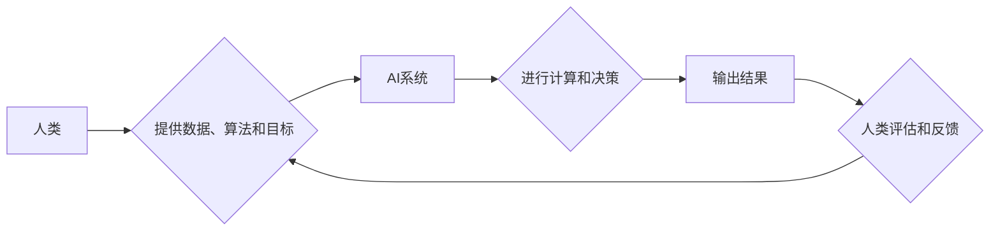

> 人工智能，AI，未来就业，技能培训，人类计算，自动化，机器学习，深度学习，自然语言处理，计算机视觉

## 1. 背景介绍

人工智能（AI）正以惊人的速度发展，其影响力正在深刻地改变着我们的生活和工作方式。从自动驾驶汽车到智能家居，从医疗诊断到金融交易，AI技术正在各个领域发挥着越来越重要的作用。然而，AI的发展也引发了人们对未来就业前景的担忧。一些人担心，AI将取代人类的工作，导致大量失业。

事实上，AI的发展既带来了机遇也带来了挑战。一方面，AI技术可以自动化许多重复性、低技能的工作，释放人类的生产力，创造新的工作岗位。另一方面，AI也可能导致一些传统行业和职业的消失，需要人们进行职业转型和技能升级。

## 2. 核心概念与联系

**2.1 人类计算**

人类计算是指人类利用自身的认知能力和创造力进行计算和解决问题的能力。它包括逻辑推理、抽象思维、语言理解、决策判断等多种能力。

**2.2 人工智能**

人工智能是指模拟人类智能行为的计算机系统。它包括机器学习、深度学习、自然语言处理、计算机视觉等多个分支领域。

**2.3 AI与人类计算的联系**

AI技术的发展离不开人类的参与和引导。人类为AI系统提供数据、算法和目标，并对AI系统的输出进行评估和反馈。同时，AI技术也能够帮助人类提高计算效率、增强决策能力，从而提升人类的计算能力。

**2.4  AI时代的人类计算**

在AI时代，人类计算将更加注重创造性、批判性思维和解决复杂问题的能力。人类需要与AI系统协同工作，发挥各自的优势，共同完成更复杂的任务。

**Mermaid 流程图**



## 3. 核心算法原理 & 具体操作步骤

**3.1 算法原理概述**

机器学习算法是AI的核心技术之一，它能够通过学习数据来预测未来结果或发现数据中的模式。常见的机器学习算法包括：

* **监督学习:** 利用标记数据训练模型，预测新的数据标签。例如，图像分类、文本分类等。
* **无监督学习:** 利用未标记数据发现数据中的隐藏结构或模式。例如，聚类分析、降维等。
* **强化学习:** 通过试错学习，在环境中获得最大奖励。例如，游戏AI、机器人控制等。

**3.2 算法步骤详解**

以监督学习为例，其基本步骤如下：

1. **数据收集和预处理:** 收集相关数据，并进行清洗、转换、特征工程等预处理操作。
2. **模型选择:** 根据任务需求选择合适的机器学习算法模型。
3. **模型训练:** 利用标记数据训练模型，调整模型参数，使其能够准确预测新的数据标签。
4. **模型评估:** 利用测试数据评估模型的性能，例如准确率、召回率、F1-score等。
5. **模型部署:** 将训练好的模型部署到实际应用场景中，用于预测新的数据。

**3.3 算法优缺点**

**优点:**

* 自动化学习，无需人工编程。
* 能够发现数据中的隐藏模式。
* 性能不断提升，应用范围不断扩大。

**缺点:**

* 需要大量数据进行训练。
* 模型解释性较差，难以理解模型的决策过程。
* 对数据质量要求高，数据偏差会影响模型性能。

**3.4 算法应用领域**

机器学习算法广泛应用于各个领域，例如：

* **图像识别:** 人脸识别、物体检测、图像分类等。
* **自然语言处理:** 文本分类、情感分析、机器翻译等。
* **推荐系统:** 商品推荐、内容推荐、用户画像等。
* **金融领域:** 风险评估、欺诈检测、投资预测等。
* **医疗领域:** 疾病诊断、药物研发、患者管理等。

## 4. 数学模型和公式 & 详细讲解 & 举例说明

**4.1 数学模型构建**

机器学习算法通常基于数学模型进行构建。例如，线性回归模型可以表示为：

$$y = w_0 + w_1x_1 + w_2x_2 + ... + w_nx_n + \epsilon$$

其中：

* $y$ 是预测结果。
* $w_0, w_1, w_2, ..., w_n$ 是模型参数。
* $x_1, x_2, ..., x_n$ 是输入特征。
* $\epsilon$ 是误差项。

**4.2 公式推导过程**

机器学习算法的训练过程通常是通过优化模型参数来最小化误差。常用的优化算法包括梯度下降法、随机梯度下降法等。

**4.3 案例分析与讲解**

以线性回归为例，其目标是找到最佳的模型参数，使得预测结果与真实值之间的误差最小。可以使用梯度下降法迭代更新模型参数，直到误差达到最小值。

## 5. 项目实践：代码实例和详细解释说明

**5.1 开发环境搭建**

可以使用Python语言和相关的机器学习库，例如Scikit-learn、TensorFlow、PyTorch等，进行机器学习项目开发。

**5.2 源代码详细实现**

```python
from sklearn.linear_model import LinearRegression
from sklearn.model_selection import train_test_split
from sklearn.metrics import mean_squared_error

# 数据加载和预处理
# ...

# 数据分割
X_train, X_test, y_train, y_test = train_test_split(X, y, test_size=0.2)

# 模型训练
model = LinearRegression()
model.fit(X_train, y_train)

# 模型预测
y_pred = model.predict(X_test)

# 模型评估
mse = mean_squared_error(y_test, y_pred)
print(f"Mean Squared Error: {mse}")
```

**5.3 代码解读与分析**

这段代码实现了线性回归模型的训练和预测过程。首先，加载和预处理数据，然后将数据分割为训练集和测试集。接着，创建线性回归模型并使用训练集进行训练。最后，使用测试集进行预测，并计算模型的误差。

**5.4 运行结果展示**

运行结果会显示模型的误差值，例如Mean Squared Error。

## 6. 实际应用场景

**6.1 医疗诊断**

AI技术可以帮助医生分析患者的病历、影像数据等信息，提高诊断的准确性和效率。例如，AI可以用于识别肺癌、乳腺癌等疾病。

**6.2 金融风险评估**

AI技术可以分析客户的财务数据、交易记录等信息，评估客户的信用风险和欺诈风险。例如，AI可以用于识别信用卡欺诈交易。

**6.3 自动驾驶汽车**

AI技术是自动驾驶汽车的核心技术之一，它可以帮助汽车感知周围环境、做出决策、控制车辆行驶。

**6.4 未来应用展望**

AI技术的发展将带来更多新的应用场景，例如：

* **个性化教育:** AI可以根据学生的学习情况提供个性化的学习方案。
* **智能家居:** AI可以控制家居设备，提供更加舒适的生活体验。
* **机器人服务:** AI可以赋予机器人更强的智能，用于提供服务、协助工作等。

## 7. 工具和资源推荐

**7.1 学习资源推荐**

* **在线课程:** Coursera、edX、Udacity等平台提供丰富的AI课程。
* **书籍:** 《深度学习》、《机器学习实战》等书籍是学习AI的经典教材。
* **开源项目:** TensorFlow、PyTorch等开源项目可以帮助你实践AI技术。

**7.2 开发工具推荐**

* **Python:** Python是AI开发最常用的编程语言。
* **Scikit-learn:** Python机器学习库，提供各种机器学习算法和工具。
* **TensorFlow:** Google开发的深度学习框架。
* **PyTorch:** Facebook开发的深度学习框架。

**7.3 相关论文推荐**

* **《ImageNet Classification with Deep Convolutional Neural Networks》**
* **《Attention Is All You Need》**
* **《BERT: Pre-training of Deep Bidirectional Transformers for Language Understanding》**

## 8. 总结：未来发展趋势与挑战

**8.1 研究成果总结**

近年来，AI技术取得了长足的进步，在各个领域都取得了显著的应用成果。

**8.2 未来发展趋势**

* **模型规模和能力的提升:** AI模型将变得更加强大，能够处理更复杂的任务。
* **算法的泛化能力增强:** AI算法将能够更好地适应不同的数据和场景。
* **AI技术的融合应用:** AI技术将与其他技术融合，例如物联网、云计算等，创造新的应用场景。

**8.3 面临的挑战**

* **数据安全和隐私保护:** AI技术的应用需要处理大量数据，如何保证数据安全和隐私保护是一个重要的挑战。
* **算法的解释性和可信度:** AI算法的决策过程往往难以理解，如何提高算法的解释性和可信度是一个重要的研究方向。
* **AI技术的伦理问题:** AI技术的应用可能带来一些伦理问题，例如算法偏见、工作岗位替代等，需要进行深入的探讨和研究。

**8.4 研究展望**

未来，AI技术将继续发展，带来更多新的机遇和挑战。我们需要加强对AI技术的理解和研究，并制定相应的政策和规范，引导AI技术健康发展，造福人类社会。

## 9. 附录：常见问题与解答

**9.1 如何学习AI技术？**

可以学习在线课程、阅读书籍、参与开源项目等方式学习AI技术。

**9.2 AI技术会取代人类工作吗？**

AI技术可能会改变一些工作内容，但不会完全取代人类工作。人类需要与AI技术协同工作，发挥各自的优势。

**9.3 如何应对AI带来的挑战？**

我们需要加强对AI技术的理解和研究，并制定相应的政策和规范，引导AI技术健康发展。


作者：禅与计算机程序设计艺术 / Zen and the Art of Computer Programming 
<end_of_turn>