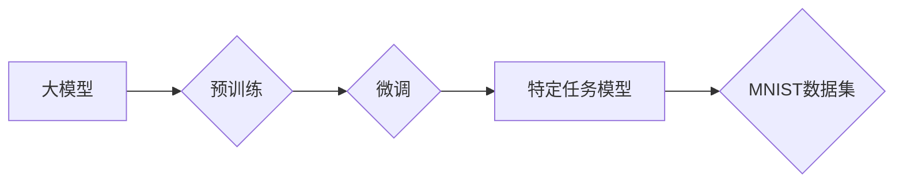
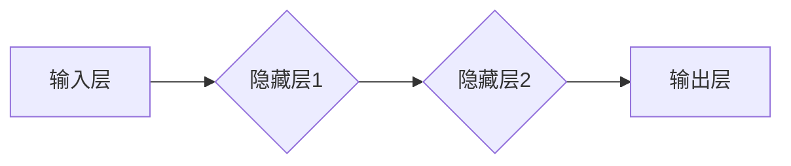

> 大模型开发, 微调, MNIST数据集, 特征工程, 标签编码, 神经网络, 计算机视觉

## 1. 背景介绍

近年来，深度学习在计算机视觉、自然语言处理等领域取得了突破性进展，其核心驱动力是大型模型的不断发展。这些大型模型通常拥有数十亿甚至数千亿的参数，通过海量数据训练，能够学习到复杂的特征表示，从而实现卓越的性能。然而，训练大型模型需要巨大的计算资源和时间成本，对于个人开发者或小型团队来说，难以负担。

微调技术应运而生，它通过在预训练的大模型基础上，使用少量特定领域的标注数据进行训练，从而实现模型在特定任务上的性能提升。微调技术降低了模型训练的门槛，使得更多人能够利用大型模型的优势。

MNIST数据集是计算机视觉领域最经典的图像识别数据集之一，包含60,000张手写数字图像，用于训练和测试模型。本文将以MNIST数据集为例，介绍从零开始开发和微调大模型的基本流程，并深入探讨其特征和标签的处理方法。

## 2. 核心概念与联系

### 2.1  大模型

大模型是指参数量达到数十亿甚至数千亿的深度学习模型。它们通常通过大量的文本、图像、音频等数据进行预训练，学习到丰富的通用知识和表示能力。

### 2.2  微调

微调是指在预训练的大模型基础上，使用少量特定领域的标注数据进行训练，从而使模型在特定任务上表现更优。

### 2.3  MNIST数据集

MNIST数据集包含60,000张手写数字图像，分为训练集和测试集，每个图像的大小为28x28像素，标签为0-9的数字。

**核心概念与联系流程图:**



## 3. 核心算法原理 & 具体操作步骤

### 3.1  算法原理概述

MNIST数据集的特征和标签处理主要基于以下算法原理：

* **特征提取:** 将图像像素值转换为数字特征向量，以便模型理解。
* **标签编码:** 将数字标签转换为one-hot编码，以便模型进行分类。
* **神经网络训练:** 使用神经网络模型，通过反向传播算法，学习图像特征和标签之间的映射关系。

### 3.2  算法步骤详解

1. **数据预处理:** 
    * 将MNIST数据集加载到内存中。
    * 对图像进行归一化处理，将像素值范围缩放到0-1之间。
    * 将图像转换为特征向量，例如使用flatten操作将图像展开为一维向量。
2. **标签编码:** 
    * 将数字标签转换为one-hot编码，例如标签为5，则one-hot编码为[0,0,0,0,0,1,0,0,0,0]。
3. **模型构建:** 
    * 使用深度学习框架，例如TensorFlow或PyTorch，构建神经网络模型。
    * 模型结构可以根据任务需求进行调整，例如使用卷积神经网络（CNN）进行图像识别。
4. **模型训练:** 
    * 使用训练数据进行模型训练，优化模型参数，使模型能够准确识别手写数字。
    * 使用交叉验证等技术，评估模型的性能，并根据评估结果调整模型参数和训练策略。
5. **模型评估:** 
    * 使用测试数据评估模型的性能，例如计算准确率、召回率等指标。
6. **模型部署:** 
    * 将训练好的模型部署到实际应用场景中，例如用于手写数字识别系统。

### 3.3  算法优缺点

**优点:**

* 准确率高：神经网络模型能够学习到复杂的图像特征，从而实现高准确率的识别。
* 可扩展性强：模型结构可以根据任务需求进行调整，并支持并行训练，提高训练效率。

**缺点:**

* 计算资源消耗大：训练大型神经网络模型需要大量的计算资源和时间。
* 数据依赖性强：模型性能受训练数据质量和数量的影响较大。

### 3.4  算法应用领域

* **图像识别:** 手写数字识别、物体检测、图像分类等。
* **自然语言处理:** 文本分类、情感分析、机器翻译等。
* **语音识别:** 语音转文本、语音助手等。

## 4. 数学模型和公式 & 详细讲解 & 举例说明

### 4.1  数学模型构建

神经网络模型可以看作是一个由多个层组成的计算图，每个层包含多个神经元。每个神经元接收来自上一层的输入信号，并通过激活函数进行处理，输出到下一层。

**神经网络模型结构:**



### 4.2  公式推导过程

**激活函数:**

常用的激活函数包括ReLU、Sigmoid、Tanh等。

**ReLU函数:**

$$
f(x) = max(0, x)
$$

**Sigmoid函数:**

$$
f(x) = \frac{1}{1 + e^{-x}}
$$

**损失函数:**

常用的损失函数包括交叉熵损失、均方误差等。

**交叉熵损失:**

$$
L = - \sum_{i=1}^{N} y_i \log(\hat{y}_i)
$$

其中，$y_i$为真实标签，$\hat{y}_i$为模型预测的概率。

**梯度下降算法:**

用于优化模型参数，更新模型参数的方向和步长。

$$
\theta = \theta - \alpha \nabla L(\theta)
$$

其中，$\theta$为模型参数，$\alpha$为学习率，$\nabla L(\theta)$为损失函数的梯度。

### 4.3  案例分析与讲解

以MNIST数据集为例，使用CNN模型进行手写数字识别。

* **输入层:** 接收28x28像素的图像数据。
* **隐藏层:** 使用多个卷积层和池化层，提取图像特征。
* **输出层:** 使用全连接层，将特征映射到10个数字类别。

训练过程中，使用交叉熵损失函数和梯度下降算法，优化模型参数，使模型能够准确识别手写数字。

## 5. 项目实践：代码实例和详细解释说明

### 5.1  开发环境搭建

* **操作系统:** Linux、macOS或Windows。
* **编程语言:** Python。
* **深度学习框架:** TensorFlow或PyTorch。
* **其他依赖库:** NumPy、Matplotlib等。

### 5.2  源代码详细实现

```python
import tensorflow as tf

# 定义模型结构
model = tf.keras.models.Sequential([
    tf.keras.layers.Flatten(input_shape=(28, 28)),
    tf.keras.layers.Dense(128, activation='relu'),
    tf.keras.layers.Dense(10, activation='softmax')
])

# 编译模型
model.compile(optimizer='adam',
              loss='sparse_categorical_crossentropy',
              metrics=['accuracy'])

# 加载MNIST数据集
(x_train, y_train), (x_test, y_test) = tf.keras.datasets.mnist.load_data()

# 数据预处理
x_train = x_train.astype('float32') / 255
x_test = x_test.astype('float32') / 255

# 模型训练
model.fit(x_train, y_train, epochs=5)

# 模型评估
loss, accuracy = model.evaluate(x_test, y_test)
print('Test loss:', loss)
print('Test accuracy:', accuracy)
```

### 5.3  代码解读与分析

* **模型定义:** 使用`tf.keras.models.Sequential`构建一个顺序模型，包含一个flatten层、一个全连接层和一个输出层。
* **模型编译:** 使用`adam`优化器、`sparse_categorical_crossentropy`损失函数和`accuracy`指标编译模型。
* **数据加载:** 使用`tf.keras.datasets.mnist.load_data()`加载MNIST数据集。
* **数据预处理:** 将图像数据归一化到0-1之间。
* **模型训练:** 使用`model.fit()`训练模型，训练5个epochs。
* **模型评估:** 使用`model.evaluate()`评估模型在测试集上的性能。

### 5.4  运行结果展示

训练完成后，模型将输出测试集上的损失值和准确率。

## 6. 实际应用场景

MNIST数据集的特征和标签处理技术广泛应用于以下场景：

* **手写数字识别:** 用于识别银行支票、邮件地址等手写数字。
* **OCR系统:** 用于将图像中的文本转换为可编辑文本。
* **机器学习教育:** 用于教学和研究深度学习算法。

### 6.4  未来应用展望

随着深度学习技术的不断发展，MNIST数据集的特征和标签处理技术将应用于更广泛的领域，例如：

* **图像分类:** 用于识别物体、场景、人物等。
* **图像分割:** 用于将图像分割成不同的区域。
* **图像生成:** 用于生成新的图像。

## 7. 工具和资源推荐

### 7.1  学习资源推荐

* **书籍:**
    * 深度学习
    * 构建深度学习模型
* **在线课程:**
    * Coursera深度学习课程
    * Udacity深度学习课程

### 7.2  开发工具推荐

* **深度学习框架:** TensorFlow、PyTorch、Keras
* **数据处理库:** NumPy、Pandas
* **可视化工具:** Matplotlib、Seaborn

### 7.3  相关论文推荐

* **AlexNet: ImageNet Classification with Deep Convolutional Neural Networks**
* **VGGNet: Very Deep Convolutional Networks for Large-Scale Image Recognition**
* **ResNet: Deep Residual Learning for Image Recognition**

## 8. 总结：未来发展趋势与挑战

### 8.1  研究成果总结

MNIST数据集的特征和标签处理技术取得了显著的成果，例如：

* **准确率提升:** 深度学习模型在MNIST数据集上的准确率已经超过了99%。
* **模型效率提升:** 模型结构和训练策略的优化，提高了模型的训练效率。

### 8.2  未来发展趋势

* **模型更深更广:** 研究更深更广的网络结构，提高模型的表达能力。
* **数据增强:** 使用数据增强技术，增加训练数据的多样性，提高模型的泛化能力。
* **迁移学习:** 利用预训练模型，减少训练数据和时间成本。

### 8.3  面临的挑战

* **数据标注:** 大规模数据标注成本高昂。
* **模型解释性:** 深度学习模型的决策过程难以解释。
* **公平性与偏见:** 模型可能存在公平性与偏见问题。

### 8.4  研究展望

未来研究将重点关注以下方向：

* **自动数据标注:** 研究自动数据标注技术，降低数据标注成本。
* **可解释性研究:** 研究深度学习模型的决策过程，提高模型的解释性。
* **公平性与偏见检测:** 研究模型的公平性与偏见问题，并提出解决方案。

## 9. 附录：常见问题与解答

**Q1: 如何选择合适的激活函数？**

**A1:** 不同的激活函数适用于不同的场景。ReLU函数简单高效，常用于隐藏层；Sigmoid函数输出范围在0-1之间，常用于二分类问题；Tanh函数输出范围在-1到1之间，常用于处理连续数据。

**Q2: 如何防止模型过拟合？