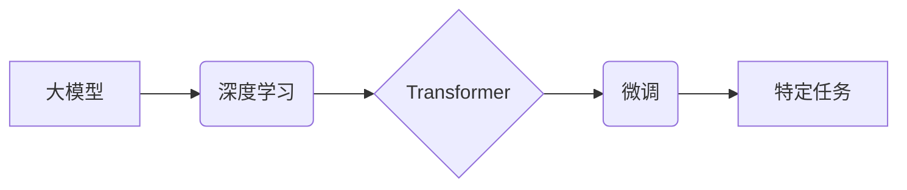

> 大模型、深度学习、Transformer、微调、自然语言处理、计算机视觉

## 1. 背景介绍

人工智能（AI）近年来取得了令人瞩目的进展，其中大模型扮演着越来越重要的角色。大模型是指参数规模庞大、训练数据海量的人工智能模型，其强大的学习能力和泛化能力使其能够在各种任务中表现出色，例如自然语言处理、计算机视觉、语音识别等。

传统的机器学习模型通常需要针对特定任务进行训练，而大模型则可以进行预训练，并在后续任务中进行微调，从而提高效率和性能。

大模型的出现，标志着人工智能进入了一个新的时代，它为解决更复杂、更具挑战性的问题提供了新的可能性。

## 2. 核心概念与联系

### 2.1 大模型

大模型是指参数数量超过数十亿甚至数千亿的深度学习模型。这些模型通过训练海量数据，学习到丰富的知识和模式，从而能够在各种任务中表现出色。

### 2.2 深度学习

深度学习是机器学习的一个子领域，它利用多层神经网络来模拟人类大脑的学习过程。深度学习模型能够自动从数据中学习特征，无需人工特征工程，这使得它在图像识别、语音识别等领域取得了突破性进展。

### 2.3 Transformer

Transformer是一种新型的深度学习架构，它通过自注意力机制来捕捉序列数据中的长距离依赖关系。Transformer在自然语言处理领域取得了显著的成果，例如机器翻译、文本摘要、问答系统等。

### 2.4 微调

微调是指在预训练模型的基础上，针对特定任务进行进一步训练的过程。微调可以利用预训练模型已经学习到的知识，从而提高模型的性能和效率。

**核心概念与联系流程图**



## 3. 核心算法原理 & 具体操作步骤

### 3.1 算法原理概述

大模型的训练主要基于深度学习算法，其中Transformer架构在自然语言处理领域尤为重要。Transformer通过自注意力机制，能够捕捉序列数据中的长距离依赖关系，从而学习到更丰富的语义信息。

### 3.2 算法步骤详解

1. **数据预处理:** 将原始数据进行清洗、格式化和编码，使其能够被模型理解。
2. **模型构建:** 根据任务需求选择合适的模型架构，例如BERT、GPT等。
3. **预训练:** 使用海量数据对模型进行预训练，学习到通用的语言表示。
4. **微调:** 将预训练模型应用于特定任务，使用少量标记数据进行微调，使其能够更好地完成目标任务。
5. **评估:** 使用测试数据评估模型的性能，并根据结果进行模型优化。

### 3.3 算法优缺点

**优点:**

* 强大的学习能力：大模型能够学习到丰富的知识和模式，从而在各种任务中表现出色。
* 泛化能力强：预训练模型能够在不同任务和数据集上表现良好。
* 效率高：微调过程比从头训练模型更加高效。

**缺点:**

* 计算资源需求高：训练大模型需要大量的计算资源和时间。
* 数据依赖性强：大模型的性能取决于训练数据的质量和数量。
* 可解释性差：大模型的决策过程难以理解，这可能会导致模型的不可信赖性。

### 3.4 算法应用领域

大模型在各个领域都有广泛的应用，例如：

* **自然语言处理:** 机器翻译、文本摘要、问答系统、对话系统等。
* **计算机视觉:** 图像识别、物体检测、图像生成等。
* **语音识别:** 语音转文本、语音合成等。
* **推荐系统:** 商品推荐、内容推荐等。

## 4. 数学模型和公式 & 详细讲解 & 举例说明

### 4.1 数学模型构建

大模型的数学模型通常基于深度神经网络，其中Transformer架构是其中一种重要的模型结构。Transformer模型由多个编码器和解码器层组成，每个层包含多个子层，例如自注意力层、多头注意力层、前馈神经网络层等。

### 4.2 公式推导过程

Transformer模型的核心是自注意力机制，其计算公式如下：

$$
Attention(Q, K, V) = softmax(\frac{QK^T}{\sqrt{d_k}})V
$$

其中：

* $Q$：查询矩阵
* $K$：键矩阵
* $V$：值矩阵
* $d_k$：键向量的维度
* $softmax$：softmax函数

### 4.3 案例分析与讲解

假设我们有一个句子“我爱学习编程”，将其转换为词向量表示，然后使用自注意力机制计算每个词与其他词之间的注意力权重。

例如，词“学习”与词“编程”之间的注意力权重会比较高，因为它们在语义上相关。

## 5. 项目实践：代码实例和详细解释说明

### 5.1 开发环境搭建

* Python 3.7+
* PyTorch 1.7+
* CUDA 10.2+

### 5.2 源代码详细实现

```python
import torch
import torch.nn as nn

class Transformer(nn.Module):
    def __init__(self, vocab_size, embedding_dim, num_heads, num_layers):
        super(Transformer, self).__init__()
        self.embedding = nn.Embedding(vocab_size, embedding_dim)
        self.transformer_layers = nn.ModuleList([
            nn.TransformerEncoderLayer(embedding_dim, num_heads)
            for _ in range(num_layers)
        ])
        self.linear = nn.Linear(embedding_dim, vocab_size)

    def forward(self, x):
        x = self.embedding(x)
        for layer in self.transformer_layers:
            x = layer(x)
        x = self.linear(x)
        return x
```

### 5.3 代码解读与分析

* `__init__` 方法初始化模型参数，包括词嵌入层、Transformer编码器层和输出层。
* `forward` 方法定义模型的正向传播过程，将输入序列转换为输出序列。

### 5.4 运行结果展示

训练完成后，可以使用测试数据评估模型的性能，例如计算准确率、困惑度等指标。

## 6. 实际应用场景

### 6.1 自然语言处理

大模型在自然语言处理领域有广泛的应用，例如：

* **机器翻译:** 使用大模型可以实现更高质量的机器翻译，例如将中文翻译成英文。
* **文本摘要:** 大模型可以自动生成文本摘要，例如将长篇文章总结成几句话。
* **问答系统:** 大模型可以构建问答系统，例如回答用户提出的问题。

### 6.2 计算机视觉

大模型也可以应用于计算机视觉领域，例如：

* **图像识别:** 使用大模型可以识别图像中的物体，例如人、车、树等。
* **物体检测:** 大模型可以检测图像中物体的位置和类别，例如在图像中找到所有的人和车。
* **图像生成:** 大模型可以生成新的图像，例如根据文本描述生成图像。

### 6.3 其他领域

大模型还可以应用于其他领域，例如：

* **语音识别:** 使用大模型可以实现更准确的语音识别，例如将语音转成文本。
* **推荐系统:** 使用大模型可以构建更精准的推荐系统，例如推荐用户可能感兴趣的商品或内容。

### 6.4 未来应用展望

随着大模型技术的不断发展，其应用场景将会更加广泛，例如：

* **个性化教育:** 根据学生的学习情况，提供个性化的学习内容和辅导。
* **医疗诊断:** 利用大模型分析患者的病历和影像数据，辅助医生进行诊断。
* **科学研究:** 利用大模型分析海量数据，加速科学研究的进展。

## 7. 工具和资源推荐

### 7.1 学习资源推荐

* **书籍:**
    * 《深度学习》
    * 《自然语言处理》
    * 《Transformer模型详解》
* **在线课程:**
    * Coursera: 深度学习
    * Udacity: 自然语言处理
    * fast.ai: 深度学习

### 7.2 开发工具推荐

* **PyTorch:** 深度学习框架
* **TensorFlow:** 深度学习框架
* **HuggingFace:** 预训练模型库

### 7.3 相关论文推荐

* 《Attention Is All You Need》
* 《BERT: Pre-training of Deep Bidirectional Transformers for Language Understanding》
* 《GPT-3: Language Models are Few-Shot Learners》

## 8. 总结：未来发展趋势与挑战

### 8.1 研究成果总结

大模型的出现，标志着人工智能进入了一个新的时代，它为解决更复杂、更具挑战性的问题提供了新的可能性。

大模型在自然语言处理、计算机视觉等领域取得了显著的成果，并正在不断扩展到更多领域。

### 8.2 未来发展趋势

* **模型规模更大:** 未来大模型的规模将会进一步扩大，参数数量将达到数万亿甚至数千亿。
* **模型架构更复杂:** 未来大模型的架构将会更加复杂，例如多模态模型、自监督学习模型等。
* **应用场景更广泛:** 未来大模型的应用场景将会更加广泛，例如个性化教育、医疗诊断、科学研究等。

### 8.3 面临的挑战

* **计算资源需求高:** 训练大模型需要大量的计算资源和时间，这对于资源有限的机构和个人来说是一个挑战。
* **数据依赖性强:** 大模型的性能取决于训练数据的质量和数量，而高质量的训练数据往往难以获取。
* **可解释性差:** 大模型的决策过程难以理解，这可能会导致模型的不可信赖性。

### 8.4 研究展望

未来，大模型研究将继续朝着更强大、更智能、更可解释的方向发展。

## 9. 附录：常见问题与解答

**Q1: 如何选择合适的预训练模型？**

**A1:** 选择预训练模型需要根据具体的任务需求和数据特点进行选择。

例如，对于自然语言理解任务，BERT模型是一个不错的选择；对于文本生成任务，GPT模型是一个更好的选择。

**Q2: 如何进行大模型的微调？**

**A2:** 微调大模型需要使用少量标记数据，并调整模型的学习率和训练 epochs 等参数。

可以使用预训练模型库提供的微调脚本进行操作。

**Q3: 如何评估大模型的性能？**

**A3:** 大模型的性能可以使用各种指标进行评估，例如准确率、困惑度、BLEU 等。

具体的指标选择需要根据任务需求进行选择。


作者：禅与计算机程序设计艺术 / Zen and the Art of Computer Programming 
<end_of_turn>