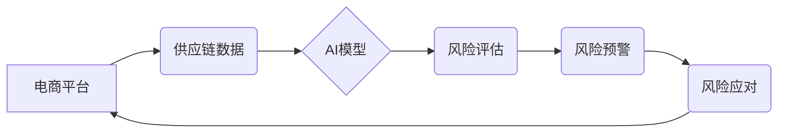

> 供应链风险管理,电商平台,人工智能,机器学习,预测分析,风险评估,数据驱动

## 1. 背景介绍

随着电子商务的蓬勃发展，电商平台已成为商品交易的重要渠道，其供应链网络也日益复杂化。然而，供应链风险也随之增加，包括供应中断、物流延误、产品质量问题、欺诈行为等。这些风险不仅会损害电商平台的声誉和利益，还会影响消费者体验和社会稳定。

传统供应链风险管理方法往往依赖于经验和规则，难以应对复杂多变的市场环境。而人工智能（AI）技术的快速发展为供应链风险管理提供了新的机遇。AI算法能够从海量数据中识别风险模式，并提供精准的风险预警和应对建议，有效降低电商平台的风险。

## 2. 核心概念与联系

**2.1 供应链风险管理**

供应链风险管理是指识别、评估、控制和应对供应链中可能出现的各种风险，以确保供应链的稳定运行和目标达成。

**2.2 电商平台**

电商平台是指提供电子商务交易服务的平台，包括商品展示、交易撮合、支付结算、物流配送等功能。

**2.3 人工智能（AI）**

人工智能是指模拟人类智能行为的计算机系统，包括机器学习、深度学习、自然语言处理等技术。

**2.4 核心概念架构**



## 3. 核心算法原理 & 具体操作步骤

**3.1 算法原理概述**

在供应链风险管理中，常用的AI算法包括：

* **机器学习（ML）:** 利用历史数据训练模型，识别风险模式并进行预测。
* **深度学习（DL）:** 使用多层神经网络，对复杂数据进行更深入的分析，提高风险识别精度。
* **自然语言处理（NLP）:** 分析文本数据，如新闻报道、社交媒体评论等，识别潜在风险信号。

**3.2 算法步骤详解**

1. **数据收集:** 收集供应链相关数据，包括订单信息、物流数据、产品信息、供应商信息等。
2. **数据预处理:** 清洗、转换和格式化数据，使其适合模型训练。
3. **特征工程:** 从原始数据中提取有价值的特征，用于模型训练。
4. **模型训练:** 选择合适的AI算法，利用训练数据训练模型。
5. **模型评估:** 使用测试数据评估模型性能，并进行调优。
6. **模型部署:** 将训练好的模型部署到生产环境中，实时进行风险预测和预警。

**3.3 算法优缺点**

| 算法类型 | 优点 | 缺点 |
|---|---|---|
| 机器学习 | 易于实现，性能良好 | 需要大量训练数据，对数据质量要求高 |
| 深度学习 | 能够处理复杂数据，识别更精细的风险模式 | 计算资源需求高，训练时间长 |
| 自然语言处理 | 可以分析文本数据，识别潜在风险信号 | 对文本数据处理要求高，识别精度有限 |

**3.4 算法应用领域**

* **供应中断风险预测:** 预警潜在的供应中断风险，帮助电商平台及时采取措施。
* **物流延误风险评估:** 预测物流延误的可能性，优化物流路线和配送策略。
* **产品质量风险控制:** 识别潜在的产品质量问题，提高产品质量控制水平。
* **欺诈行为检测:** 识别欺诈交易和虚假账户，保护电商平台和消费者的利益。

## 4. 数学模型和公式 & 详细讲解 & 举例说明

**4.1 数学模型构建**

供应链风险评估模型可以采用贝叶斯网络、决策树等数学模型。

**4.2 公式推导过程**

例如，可以使用贝叶斯定理来计算特定风险发生的概率：

$$P(A|B) = \frac{P(B|A)P(A)}{P(B)}$$

其中：

* $P(A|B)$ 是事件 A 在事件 B 发生的条件概率。
* $P(B|A)$ 是事件 B 在事件 A 发生的条件概率。
* $P(A)$ 是事件 A 的概率。
* $P(B)$ 是事件 B 的概率。

**4.3 案例分析与讲解**

假设电商平台要评估某个供应商的供应中断风险。可以根据历史数据，计算供应商供应中断的概率 $P(A)$，以及供应中断发生时，平台损失的概率 $P(B|A)$。

如果平台获得关于该供应商近期生产能力下降的信息，可以将其作为新的证据 $B$，更新风险评估结果。

$$P(A|B) = \frac{P(B|A)P(A)}{P(B)}$$

通过计算新的风险概率，平台可以做出更明智的决策，例如寻找备用供应商或调整订单量。

## 5. 项目实践：代码实例和详细解释说明

**5.1 开发环境搭建**

* 操作系统：Ubuntu 20.04
* Python 版本：3.8
* 必要的库：pandas, scikit-learn, TensorFlow, PyTorch

**5.2 源代码详细实现**

```python
import pandas as pd
from sklearn.model_selection import train_test_split
from sklearn.linear_model import LogisticRegression

# 加载数据
data = pd.read_csv('supply_chain_data.csv')

# 特征工程
features = ['supplier_rating', 'delivery_time', 'product_quality']
target = 'risk_level'

# 数据分割
X_train, X_test, y_train, y_test = train_test_split(data[features], data[target], test_size=0.2)

# 模型训练
model = LogisticRegression()
model.fit(X_train, y_train)

# 模型评估
accuracy = model.score(X_test, y_test)
print(f'模型准确率: {accuracy}')

# 预测风险
new_data = pd.DataFrame({'supplier_rating': [4], 'delivery_time': [2], 'product_quality': [3]})
risk_prediction = model.predict(new_data)
print(f'新数据风险预测: {risk_prediction}')
```

**5.3 代码解读与分析**

* 代码首先加载数据，并进行特征工程，选择与风险相关的特征。
* 然后使用 `train_test_split` 函数将数据分割成训练集和测试集。
* 选择逻辑回归模型进行训练，并使用 `score` 函数评估模型性能。
* 最后，使用训练好的模型预测新数据的风险等级。

**5.4 运行结果展示**

运行代码后，会输出模型的准确率和对新数据的风险预测结果。

## 6. 实际应用场景

**6.1 供应链风险预警**

电商平台可以利用AI模型，实时监控供应链数据，识别潜在的风险信号，并及时发出预警。例如，如果某个供应商的生产能力下降，AI模型可以预测其供应中断的风险，平台可以提前采取措施，例如寻找备用供应商或调整订单量。

**6.2 产品质量控制**

AI模型可以分析产品质量数据，识别潜在的质量问题，帮助电商平台提高产品质量控制水平。例如，如果AI模型检测到某个产品的缺陷率较高，平台可以对该产品进行更严格的检验，或与供应商协商改进生产工艺。

**6.3 欺诈行为检测**

AI模型可以分析交易数据，识别欺诈交易和虚假账户，保护电商平台和消费者的利益。例如，如果AI模型检测到某个用户的交易行为异常，平台可以对其进行身份验证，或冻结其账户。

**6.4 未来应用展望**

随着AI技术的不断发展，其在供应链风险管理中的应用将更加广泛和深入。例如，未来可能出现以下应用场景：

* **智能供应链协同:** AI模型可以帮助不同环节的供应链参与者进行协同，提高供应链效率和弹性。
* **个性化风险管理:** AI模型可以根据不同客户和产品的风险特征，提供个性化的风险管理方案。
* **预测性维护:** AI模型可以预测设备故障，帮助电商平台进行预测性维护，降低运营成本。

## 7. 工具和资源推荐

**7.1 学习资源推荐**

* **书籍:**
    * 《深度学习》
    * 《机器学习实战》
    * 《Python机器学习》
* **在线课程:**
    * Coursera: 深度学习
    * edX: 机器学习
    * Udacity: AI工程师

**7.2 开发工具推荐**

* **Python:** 广泛应用于AI开发，拥有丰富的库和工具。
* **TensorFlow:** 开源深度学习框架，支持多种硬件平台。
* **PyTorch:** 开源深度学习框架，以其灵活性和易用性而闻名。
* **Jupyter Notebook:** 用于交互式编程和数据可视化的工具。

**7.3 相关论文推荐**

* **Supply Chain Risk Management Using Machine Learning**
* **Deep Learning for Supply Chain Risk Prediction**
* **Natural Language Processing for Supply Chain Risk Detection**

## 8. 总结：未来发展趋势与挑战

**8.1 研究成果总结**

AI技术在供应链风险管理领域取得了显著成果，能够有效识别和预测风险，提高供应链的稳定性和韧性。

**8.2 未来发展趋势**

* **模型更加智能化:** 未来AI模型将更加智能化，能够自主学习和适应变化的市场环境。
* **数据更加丰富:** 未来将收集更多类型的供应链数据，为AI模型提供更丰富的训练素材。
* **应用更加广泛:** AI技术将应用于供应链管理的各个环节，覆盖更广泛的领域。

**8.3 面临的挑战**

* **数据质量问题:** 供应链数据往往存在不完整、不准确、格式不统一等问题，需要进行有效的数据清洗和预处理。
* **模型解释性问题:** 一些AI模型的决策过程难以解释，这可能会导致用户对模型结果缺乏信任。
* **伦理问题:** AI技术在供应链风险管理中的应用，需要考虑伦理问题，例如数据隐私保护和算法公平性。

**8.4 研究展望**

未来研究将重点关注以下几个方面:

* **开发更智能、更鲁棒的AI模型:** 研究更先进的机器学习算法，提高模型的预测精度和鲁棒性。
* **解决数据质量问题:** 研究数据清洗、预处理和集成技术，提高数据质量。
* **提升模型解释性:** 研究可解释AI技术，使模型的决策过程更加透明。
* **探讨AI技术在供应链风险管理中的伦理问题:** 制定相应的规范和准则，确保AI技术在供应链风险管理中的安全、有效和可持续发展。

## 9. 附录：常见问题与解答

**9.1 如何选择合适的AI算法？**

选择合适的AI算法取决于具体的应用场景和数据特点。例如，对于分类问题，可以考虑逻辑回归、支持向量机等算法；对于回归问题，可以考虑线性回归、决策树等算法。

**9.2 如何评估AI模型的性能？**

常用的评估指标包括准确率、召回率、F1-score等。

**9.3 如何处理供应链数据中的缺失值？**

常用的处理方法包括删除缺失值、用平均值或中位数填充缺失值等。

**9.4 如何防止AI模型过拟合？**

常用的防止过拟合的方法包括正则化、交叉验证等。


作者：禅与计算机程序设计艺术 / Zen and the Art of Computer Programming 
<end_of_turn>