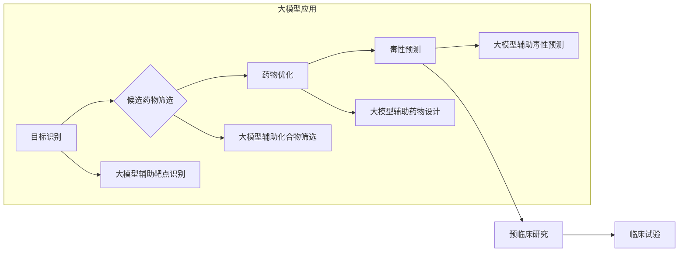

> 大模型、新药发现、人工智能、机器学习、深度学习、药物研发、生物信息学

## 1. 背景介绍

新药研发是一个漫长而复杂的流程，通常需要花费十年时间和数十亿美元的投资。从目标识别到临床试验，每个阶段都充满了挑战和不确定性。传统药物研发方法依赖于经验和试错，效率低下，成功率也较低。近年来，人工智能（AI）技术蓬勃发展，为新药发现带来了新的希望。

大模型，作为AI领域的一项重要突破，凭借其强大的学习能力和泛化能力，在医学研究中展现出巨大的潜力。大模型能够处理海量医学数据，识别复杂的生物学规律，并预测药物的活性、毒性等关键特性。

## 2. 核心概念与联系

### 2.1 大模型概述

大模型是指参数量巨大、训练数据量庞大的人工智能模型。这些模型通常基于深度学习架构，例如Transformer，能够学习复杂的模式和关系。

### 2.2 新药发现流程

新药发现是一个多阶段的过程，包括以下步骤：

1. **目标识别**: 确定治疗特定疾病的潜在药物靶点。
2. **候选药物筛选**: 从大量的化合物库中筛选出具有潜在生物活性的候选药物。
3. **药物优化**: 对候选药物进行结构优化，提高其活性、安全性等特性。
4. **预临床研究**: 在动物模型中进行安全性、有效性和药代动力学等方面的研究。
5. **临床试验**: 在人体志愿者中进行多阶段的临床试验，评估药物的安全性、有效性和最佳剂量。

### 2.3 大模型在药物发现中的应用

大模型可以应用于新药发现的各个阶段，加速药物研发进程。

* **目标识别**: 利用大模型分析基因组、蛋白质组等大规模生物数据，识别与疾病相关的关键靶点。
* **候选药物筛选**: 利用大模型预测化合物与靶点的结合亲和力，筛选出具有潜在生物活性的候选药物。
* **药物优化**: 利用大模型模拟药物与靶点的相互作用，指导药物结构的优化设计。
* **毒性预测**: 利用大模型分析药物的化学结构和生物活性，预测药物的潜在毒性。

**Mermaid 流程图**



## 3. 核心算法原理 & 具体操作步骤

### 3.1 算法原理概述

大模型在药物发现中的应用主要基于以下核心算法：

* **深度学习**: 利用多层神经网络学习复杂的生物学规律，例如蛋白质结构预测、药物活性预测等。
* **机器学习**: 利用统计学方法从数据中学习模式，例如药物靶点识别、药物组合预测等。
* **自然语言处理**: 利用自然语言处理技术分析医学文献，提取药物相关信息，例如药物作用机制、副作用等。

### 3.2 算法步骤详解

**以药物活性预测为例，详细说明大模型应用步骤：**

1. **数据收集**: 收集大量药物结构和生物活性数据，例如药物分子结构、靶点信息、活性实验结果等。
2. **数据预处理**: 对数据进行清洗、格式化、特征提取等处理，使其适合模型训练。
3. **模型训练**: 利用深度学习算法，例如卷积神经网络（CNN）或循环神经网络（RNN），训练模型，学习药物结构与活性之间的关系。
4. **模型评估**: 利用测试数据评估模型的预测性能，例如准确率、敏感度、特异度等。
5. **模型部署**: 将训练好的模型部署到实际应用场景中，用于预测新药物的活性。

### 3.3 算法优缺点

**优点**:

* **高准确率**: 大模型能够学习复杂的模式和关系，预测药物活性等关键特性时具有较高的准确率。
* **自动化程度高**: 大模型可以自动化完成药物发现的多个步骤，提高效率。
* **数据驱动**: 大模型基于海量数据训练，能够发现传统方法难以发现的规律。

**缺点**:

* **数据依赖**: 大模型的性能依赖于训练数据的质量和数量。
* **计算资源需求高**: 训练大模型需要大量的计算资源和时间。
* **可解释性低**: 大模型的决策过程较为复杂，难以解释其预测结果。

### 3.4 算法应用领域

大模型在药物发现领域的应用范围广泛，包括：

* **靶点识别**: 识别与疾病相关的关键靶点。
* **候选药物筛选**: 从大量的化合物库中筛选出具有潜在生物活性的候选药物。
* **药物优化**: 对候选药物进行结构优化，提高其活性、安全性等特性。
* **毒性预测**: 预测药物的潜在毒性。
* **药物组合**: 预测药物组合的协同作用。

## 4. 数学模型和公式 & 详细讲解 & 举例说明

### 4.1 数学模型构建

在药物活性预测任务中，常用的数学模型是回归模型。回归模型的目标是预测连续变量，例如药物活性。

**线性回归模型**:

$$
y = \beta_0 + \beta_1x_1 + \beta_2x_2 + ... + \beta_nx_n + \epsilon
$$

其中：

* $y$ 是药物活性
* $x_1, x_2, ..., x_n$ 是药物结构的特征
* $\beta_0, \beta_1, \beta_2, ..., \beta_n$ 是模型参数
* $\epsilon$ 是误差项

### 4.2 公式推导过程

线性回归模型的参数可以通过最小二乘法估计。最小二乘法旨在找到一组参数，使得模型预测值与实际值之间的误差平方和最小。

### 4.3 案例分析与讲解

假设我们想要预测药物对特定靶点的结合亲和力。我们可以使用药物结构的特征作为输入，例如分子大小、疏水性等，并训练一个线性回归模型。

训练完成后，我们可以使用模型预测新药物的结合亲和力。

## 5. 项目实践：代码实例和详细解释说明

### 5.1 开发环境搭建

* 操作系统：Linux/macOS
* Python 版本：3.7+
* 必要的库：TensorFlow/PyTorch、Scikit-learn、NumPy、Pandas等

### 5.2 源代码详细实现

```python
# 导入必要的库
import tensorflow as tf
from sklearn.model_selection import train_test_split
from sklearn.metrics import mean_squared_error

# 加载数据
data = pd.read_csv('drug_activity_data.csv')

# 分割数据
X_train, X_test, y_train, y_test = train_test_split(data[['feature1', 'feature2', ...]], data['activity'], test_size=0.2)

# 定义模型
model = tf.keras.Sequential([
    tf.keras.layers.Dense(64, activation='relu', input_shape=(X_train.shape[1],)),
    tf.keras.layers.Dense(32, activation='relu'),
    tf.keras.layers.Dense(1)
])

# 编译模型
model.compile(optimizer='adam', loss='mse')

# 训练模型
model.fit(X_train, y_train, epochs=100)

# 评估模型
y_pred = model.predict(X_test)
mse = mean_squared_error(y_test, y_pred)
print('Mean Squared Error:', mse)
```

### 5.3 代码解读与分析

* 代码首先导入必要的库。
* 然后加载药物活性数据，并将其分割为训练集和测试集。
* 接下来定义一个简单的深度学习模型，包含三层全连接层。
* 模型使用Adam优化器和均方误差损失函数进行训练。
* 最后，使用测试集评估模型的性能，并打印均方误差。

### 5.4 运行结果展示

运行代码后，会输出模型的训练过程和测试集上的均方误差。

## 6. 实际应用场景

大模型在药物发现领域的应用场景非常广泛，例如：

* **靶点识别**: 利用大模型分析基因组、蛋白质组等大规模生物数据，识别与疾病相关的关键靶点。例如，AlphaFold2可以预测蛋白质的三维结构，帮助科学家识别新的药物靶点。
* **候选药物筛选**: 利用大模型预测化合物与靶点的结合亲和力，筛选出具有潜在生物活性的候选药物。例如，DeepChem是一个开源平台，提供多种深度学习算法用于药物发现。
* **药物优化**: 利用大模型模拟药物与靶点的相互作用，指导药物结构的优化设计。例如，Generative Adversarial Networks (GANs) 可以生成新的药物分子结构，并评估其活性。
* **毒性预测**: 利用大模型分析药物的化学结构和生物活性，预测药物的潜在毒性。例如，Tox21是一个公开数据库，包含了大量药物毒性数据，可以用于训练毒性预测模型。

### 6.4 未来应用展望

随着大模型技术的不断发展，其在药物发现领域的应用将更加广泛和深入。未来，大模型可能能够：

* **加速新药研发**: 大模型可以自动化完成药物发现的多个步骤，缩短新药研发周期。
* **降低新药研发成本**: 大模型可以提高药物发现的效率，降低新药研发成本。
* **开发个性化药物**: 大模型可以根据患者的基因信息和病史，开发个性化的药物治疗方案。

## 7. 工具和资源推荐

### 7.1 学习资源推荐

* **书籍**:
    * Deep Learning by Ian Goodfellow, Yoshua Bengio, and Aaron Courville
    * Hands-On Machine Learning with Scikit-Learn, Keras & TensorFlow by Aurélien Géron
* **在线课程**:
    * Coursera: Deep Learning Specialization by Andrew Ng
    * Udacity: Deep Learning Nanodegree
* **博客**:
    * Towards Data Science
    * Machine Learning Mastery

### 7.2 开发工具推荐

* **深度学习框架**: TensorFlow, PyTorch, Keras
* **数据处理库**: NumPy, Pandas
* **机器学习库**: Scikit-learn
* **云计算平台**: Google Cloud Platform, Amazon Web Services, Microsoft Azure

### 7.3 相关论文推荐

* **AlphaFold2**: https://www.nature.com/articles/s41586-021-03819-2
* **DeepChem**: https://deepchem.io/
* **Tox21**: https://tripod.nih.gov/tox21/

## 8. 总结：未来发展趋势与挑战

### 8.1 研究成果总结

大模型在药物发现领域取得了显著的成果，例如：

* **提高药物活性预测的准确率**: 大模型能够学习复杂的生物学规律，预测药物活性等关键特性时具有较高的准确率。
* **加速药物发现的效率**: 大模型可以自动化完成药物发现的多个步骤，缩短新药研发周期。
* **降低药物发现的成本**: 大模型可以提高药物发现的效率，降低新药研发成本。

### 8.2 未来发展趋势

* **模型规模的进一步扩大**: 随着计算资源的不断发展，大模型的规模将进一步扩大，学习能力将进一步增强。
* **多模态数据的融合**: 将基因组、蛋白质组、影像学等多模态数据融合到大模型中，提高药物发现的准确性和效率。
* **解释性模型的开发**: 开发能够解释模型决策过程的模型，提高大模型的可信度和可解释性。

