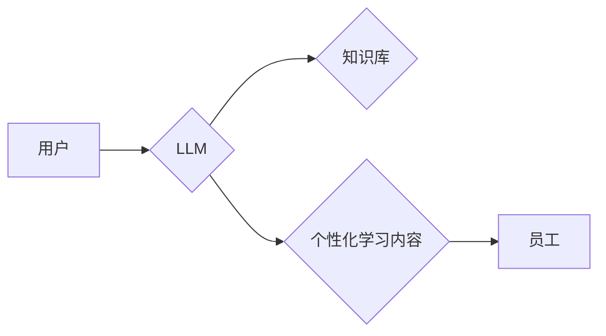

> Large Language Model (LLM), 员工培训, 深度学习, 自然语言处理 (NLP), 知识图谱, 个性化学习, 效率提升

## 1. 背景介绍

在当今数字化时代，员工培训已成为企业持续发展的重要驱动力。传统的培训模式往往面临着效率低、内容单一、难以满足个性化需求等挑战。而大型语言模型 (LLM) 的出现，为员工培训带来了全新的可能性。LLM 作为一种强大的人工智能技术，能够理解和生成人类语言，具备强大的文本处理能力，为打造更智能、高效、个性化的员工培训方案提供了技术基础。

## 2. 核心概念与联系

**2.1 LLM 简介**

大型语言模型 (LLM) 是一种基于深度学习的自然语言处理 (NLP) 模型，通过训练海量文本数据，学习语言的语法、语义和上下文关系。LLM 能够执行多种自然语言任务，例如文本生成、翻译、摘要、问答等。

**2.2 LLM 在员工培训中的应用**

LLM 可以应用于员工培训的各个环节，例如：

* **内容创作:** LLM 可以根据培训主题自动生成学习材料，包括文章、视频脚本、案例分析等。
* **个性化学习:** LLM 可以根据员工的学习进度、知识水平和兴趣爱好，定制个性化的学习路径和内容。
* **互动式学习:** LLM 可以与员工进行对话式互动，回答员工的疑问，提供个性化的指导和反馈。
* **知识库构建:** LLM 可以帮助构建企业内部的知识库，方便员工查找和获取相关信息。

**2.3 架构图**



## 3. 核心算法原理 & 具体操作步骤

**3.1 算法原理概述**

LLM 的核心算法是基于 Transformer 架构的深度神经网络。Transformer 模型通过自注意力机制，能够捕捉文本序列中长距离依赖关系，从而实现更准确的语言理解和生成。

**3.2 算法步骤详解**

1. **数据预处理:** 将文本数据进行清洗、分词、标记等预处理操作，使其能够被模型理解。
2. **模型训练:** 使用训练数据训练 Transformer 模型，通过反向传播算法不断调整模型参数，使其能够生成更准确的文本输出。
3. **模型评估:** 使用测试数据评估模型的性能，例如准确率、困惑度等指标。
4. **模型部署:** 将训练好的模型部署到服务器上，供用户使用。

**3.3 算法优缺点**

* **优点:** 
    * 能够处理长文本序列，捕捉长距离依赖关系。
    * 训练效率高，能够快速学习大量数据。
    * 生成文本质量高，能够生成流畅、自然的语言。
* **缺点:** 
    * 训练成本高，需要大量的计算资源和数据。
    * 模型参数量大，部署成本较高。
    * 容易受到训练数据偏差的影响，可能生成带有偏见或错误的信息。

**3.4 算法应用领域**

LLM 广泛应用于自然语言处理领域，例如：

* **机器翻译:** 将一种语言翻译成另一种语言。
* **文本摘要:** 将长篇文本压缩成短篇摘要。
* **问答系统:** 回答用户提出的问题。
* **聊天机器人:** 与用户进行对话式互动。

## 4. 数学模型和公式 & 详细讲解 & 举例说明

**4.1 数学模型构建**

LLM 的数学模型通常基于 Transformer 架构，其核心是自注意力机制。自注意力机制能够计算每个词与其他词之间的相关性，从而捕捉文本序列中的长距离依赖关系。

**4.2 公式推导过程**

自注意力机制的计算公式如下：

$$
Attention(Q, K, V) = softmax(\frac{QK^T}{\sqrt{d_k}})V
$$

其中：

* $Q$：查询矩阵
* $K$：键矩阵
* $V$：值矩阵
* $d_k$：键向量的维度
* $softmax$：softmax 函数

**4.3 案例分析与讲解**

假设我们有一个句子 "The cat sat on the mat"，其词向量表示为：

* cat: [0.1, 0.2, 0.3]
* sat: [0.4, 0.5, 0.6]
* on: [0.7, 0.8, 0.9]
* the: [1.0, 1.1, 1.2]
* mat: [1.3, 1.4, 1.5]

使用自注意力机制计算 "cat" 与其他词之间的相关性，可以发现 "cat" 与 "sat" 之间相关性最高，因为它们在句子中紧密相连。

## 5. 项目实践：代码实例和详细解释说明

**5.1 开发环境搭建**

* Python 3.7+
* TensorFlow 或 PyTorch 深度学习框架
* CUDA 和 cuDNN (可选，用于 GPU 加速)

**5.2 源代码详细实现**

```python
import tensorflow as tf

# 定义 Transformer 模型
class Transformer(tf.keras.Model):
    def __init__(self, vocab_size, embedding_dim, num_heads, num_layers):
        super(Transformer, self).__init__()
        self.embedding = tf.keras.layers.Embedding(vocab_size, embedding_dim)
        self.transformer_layers = [
            tf.keras.layers.MultiHeadAttention(num_heads=num_heads, key_dim=embedding_dim)
            for _ in range(num_layers)
        ]
        self.dense = tf.keras.layers.Dense(vocab_size)

    def call(self, inputs):
        # ... (代码实现 Transformer 模型的 forward pass)

# 实例化 Transformer 模型
model = Transformer(vocab_size=10000, embedding_dim=512, num_heads=8, num_layers=6)

# 训练模型
model.compile(optimizer='adam', loss='sparse_categorical_crossentropy', metrics=['accuracy'])
model.fit(train_data, train_labels, epochs=10)

```

**5.3 代码解读与分析**

* `Transformer` 类定义了 Transformer 模型的结构。
* `embedding` 层将词向量化。
* `transformer_layers` 列表包含多个 `MultiHeadAttention` 层，用于捕捉文本序列中的长距离依赖关系。
* `dense` 层用于将模型输出映射到词汇表大小。
* `call` 方法实现 Transformer 模型的 forward pass。

**5.4 运行结果展示**

训练完成后，可以使用模型对新的文本进行预测，例如生成文本续写、翻译等。

## 6. 实际应用场景

**6.1 个性化学习路径**

LLM 可以根据员工的学习进度、知识水平和兴趣爱好，定制个性化的学习路径和内容。例如，对于一个初学者，LLM 可以推荐基础课程和入门级学习材料；对于一个经验丰富的员工，LLM 可以推荐高级课程和专业知识。

**6.2 智能问答系统**

LLM 可以构建智能问答系统，帮助员工快速查找和获取相关信息。例如，员工可以通过自然语言提问，LLM 可以从企业内部的知识库中找到答案。

**6.3 虚拟导师**

LLM 可以扮演虚拟导师的角色，为员工提供个性化的指导和反馈。例如，员工可以与虚拟导师进行对话，讨论学习内容，寻求帮助。

**6.4 未来应用展望**

LLM 在员工培训领域的应用前景广阔，未来可能出现以下应用场景：

* **沉浸式培训:** 使用虚拟现实 (VR) 或增强现实 (AR) 技术，结合 LLM 创建沉浸式培训环境，让员工身临其境地体验培训内容。
* **个性化学习游戏:** 将 LLM 与游戏机制结合，开发个性化学习游戏，让员工在玩乐中学习。
* **跨语言培训:** 使用多语言 LLM，为不同语言的员工提供个性化的培训内容。

## 7. 工具和资源推荐

**7.1 学习资源推荐**

* **书籍:**
    * 《深度学习》
    * 《自然语言处理》
* **在线课程:**
    * Coursera: 深度学习
    * edX: 自然语言处理
* **博客和论坛:**
    * TensorFlow Blog
    * PyTorch Blog
    * Stack Overflow

**7.2 开发工具推荐**

* **深度学习框架:** TensorFlow, PyTorch
* **文本处理库:** NLTK, SpaCy
* **云计算平台:** AWS, Azure, GCP

**7.3 相关论文推荐**

* Attention Is All You Need
* BERT: Pre-training of Deep Bidirectional Transformers for Language Understanding

## 8. 总结：未来发展趋势与挑战

**8.1 研究成果总结**

LLM 在员工培训领域的应用取得了显著成果，能够提升培训效率、个性化学习体验和知识获取能力。

**8.2 未来发展趋势**

* **模型规模和性能提升:** 未来 LLM 模型规模将进一步扩大，性能将得到显著提升，能够处理更复杂的任务。
* **多模态学习:** LLM 将与其他模态数据 (例如图像、音频) 相结合，实现多模态学习，提供更丰富的培训体验。
* **伦理和安全问题:** 随着 LLM 的发展，伦理和安全问题将更加重要，需要加强相关研究和监管。

**8.3 面临的挑战**

* **数据获取和标注:** LLM 的训练需要大量高质量的数据，数据获取和标注成本较高。
* **模型解释性和可解释性:** LLM 的决策过程难以解释，缺乏可解释性，这可能导致信任问题。
* **公平性和偏见:** LLM 容易受到训练数据偏差的影响，可能产生不公平或偏见的结果。

**8.4 研究展望**

未来研究方向包括：

* 开发更高效、更鲁棒的 LLM 训练方法。
* 提高 LLM 的模型解释性和可解释性。
* 缓解 LLM 的公平性和偏见问题。


## 9. 附录：常见问题与解答

**9.1 如何选择合适的 LLM 模型？**

选择合适的 LLM 模型需要考虑以下因素：

* **任务类型:** 不同的任务需要不同的模型架构。
* **数据规模:** 模型规模与训练数据规模相关。
* **计算资源:** 训练大型模型需要大量的计算资源。

**9.2 如何评估 LLM 模型的性能？**

常用的评估指标包括：

* **准确率:** 模型预测正确的比例。
* **困惑度:** 模型预测下一个词的概率分布的混乱程度。
* **BLEU 分数:** 机器翻译模型的评估指标。

**9.3 如何解决 LLM 模型的公平性和偏见问题？**

* 使用更公平、更代表性的训练数据。
* 开发公平性评估指标和算法。
* 使用正则化技术来缓解模型的偏见。


作者：禅与计算机程序设计艺术 / Zen and the Art of Computer Programming 
<end_of_turn>