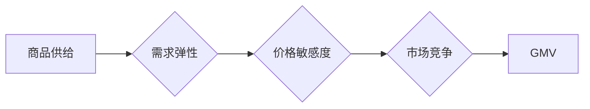

> GMV, 商品供给, 需求弹性, 价格敏感度, 市场竞争, 算法模型, 数据分析

## 1. 背景介绍

在当今数字经济时代，电商平台作为商品交易的重要载体，其发展与用户行为、商品供给和市场竞争息息相关。其中，商品供给对平台的总交易额（GMV）有着至关重要的影响。

GMV（Gross Merchandise Volume）是指电商平台上所有商品的总交易额，是衡量平台规模和交易活跃度的关键指标。商品供给充足、种类丰富、价格合理，能够有效满足用户需求，从而促进平台GMV的增长。

然而，商品供给并非简单的数量增加就能带来GMV的提升。商品供给的质量、价格、市场竞争等因素都会对GMV产生复杂的影响。

## 2. 核心概念与联系

**2.1 核心概念**

* **GMV（总交易额）：** 指电商平台上所有商品的总交易额，是衡量平台规模和交易活跃度的关键指标。
* **商品供给：** 指电商平台上商品的数量、种类、价格等方面的总量和结构。
* **需求弹性：** 指消费者对商品价格变化的反应程度，即商品需求量对价格变化的百分比变化。
* **价格敏感度：** 指消费者对商品价格变化的敏感程度，即消费者对价格变化的感知和反应程度。
* **市场竞争：** 指电商平台上不同商家之间的竞争程度，包括价格竞争、产品竞争、服务竞争等。

**2.2 核心概念联系**

商品供给、需求弹性、价格敏感度和市场竞争相互影响，共同决定了平台GMV的最终水平。

* **商品供给充足，需求弹性高，价格敏感度低，市场竞争激烈，GMV增长潜力大。**
* **商品供给不足，需求弹性低，价格敏感度高，市场竞争不激烈，GMV增长潜力小。**

**2.3  Mermaid 流程图**



## 3. 核心算法原理 & 具体操作步骤

**3.1 算法原理概述**

为了预测商品供给对GMV的影响，我们可以利用机器学习算法构建预测模型。常用的算法包括线性回归、逻辑回归、决策树、随机森林等。这些算法通过分析历史数据，学习商品供给、需求弹性、价格敏感度和市场竞争等因素之间的关系，从而预测未来GMV的变化趋势。

**3.2 算法步骤详解**

1. **数据收集与预处理:** 收集平台的历史交易数据，包括商品信息、用户行为、市场价格等。对数据进行清洗、转换、编码等预处理操作，确保数据质量和算法模型的训练效果。
2. **特征工程:** 从原始数据中提取特征，例如商品类别、价格、销量、用户评分等，这些特征能够更好地反映商品供给和用户需求的关系。
3. **模型选择与训练:** 选择合适的机器学习算法，并根据训练数据对模型进行训练，调整模型参数，使其能够准确预测GMV的变化趋势。
4. **模型评估与优化:** 使用测试数据对模型进行评估，评估模型的预测精度、召回率、F1-score等指标。根据评估结果，对模型进行优化，例如调整特征选择、模型参数、算法类型等，提高模型的预测效果。
5. **模型部署与监控:** 将训练好的模型部署到线上环境，实时预测GMV的变化趋势，并对模型进行持续监控，及时发现问题并进行调整。

**3.3 算法优缺点**

* **优点:** 能够准确预测GMV的变化趋势，为平台决策提供数据支持。
* **缺点:** 需要大量历史数据进行训练，对数据质量要求较高。模型的预测效果受训练数据和算法选择的影响，需要不断优化和改进。

**3.4 算法应用领域**

* **电商平台:** 预测商品供给对GMV的影响，优化商品库存管理、价格策略和促销活动。
* **物流公司:** 预测货物的运输需求，优化物流路线和配送效率。
* **金融机构:** 预测贷款需求和风险，优化贷款审批和风险控制。

## 4. 数学模型和公式 & 详细讲解 & 举例说明

**4.1 数学模型构建**

我们可以构建一个线性回归模型来预测GMV，模型如下：

$$GMV = \beta_0 + \beta_1 * Supply + \beta_2 * DemandElasticity + \beta_3 * PriceSensitivity + \beta_4 * Competition$$

其中：

* $GMV$：总交易额
* $Supply$：商品供给量
* $DemandElasticity$：需求弹性
* $PriceSensitivity$：价格敏感度
* $Competition$：市场竞争程度
* $\beta_0$，$\beta_1$，$\beta_2$，$\beta_3$，$\beta_4$：模型参数

**4.2 公式推导过程**

通过最小二乘法，我们可以求解模型参数，使得模型预测的GMV与实际GMV之间的误差最小。

**4.3 案例分析与讲解**

假设我们有一个电商平台，其历史数据显示：

* 商品供给量 $Supply = 1000$
* 需求弹性 $DemandElasticity = 0.8$
* 价格敏感度 $PriceSensitivity = 0.5$
* 市场竞争程度 $Competition = 0.7$

模型参数 $\beta_0$，$\beta_1$，$\beta_2$，$\beta_3$，$\beta_4$ 已通过训练得到。

我们可以将这些值代入模型公式，预测平台的GMV：

$$GMV = \beta_0 + \beta_1 * 1000 + \beta_2 * 0.8 + \beta_3 * 0.5 + \beta_4 * 0.7$$

通过计算，我们可以得到平台的GMV预测值。

## 5. 项目实践：代码实例和详细解释说明

**5.1 开发环境搭建**

* 操作系统：Windows/macOS/Linux
* Python 版本：3.6+
* 必要的库：pandas, numpy, scikit-learn, matplotlib

**5.2 源代码详细实现**

```python
import pandas as pd
from sklearn.linear_model import LinearRegression
from sklearn.model_selection import train_test_split
from sklearn.metrics import mean_squared_error

# 1. 数据加载和预处理
data = pd.read_csv('gmv_data.csv')
# ... 数据清洗、特征工程等操作

# 2. 特征选择和目标变量
X = data[['Supply', 'DemandElasticity', 'PriceSensitivity', 'Competition']]
y = data['GMV']

# 3. 数据分割
X_train, X_test, y_train, y_test = train_test_split(X, y, test_size=0.2, random_state=42)

# 4. 模型训练
model = LinearRegression()
model.fit(X_train, y_train)

# 5. 模型评估
y_pred = model.predict(X_test)
mse = mean_squared_error(y_test, y_pred)
print(f'模型均方误差: {mse}')

# 6. 模型预测
# 使用训练好的模型预测新的GMV值
new_data = pd.DataFrame({'Supply': [1200], 'DemandElasticity': [0.9], 'PriceSensitivity': [0.6], 'Competition': [0.8]})
predicted_gmv = model.predict(new_data)
print(f'预测的GMV: {predicted_gmv}')
```

**5.3 代码解读与分析**

* 代码首先加载数据，并进行预处理操作，例如数据清洗、特征工程等。
* 然后，代码选择特征和目标变量，并将数据分割成训练集和测试集。
* 接着，代码训练线性回归模型，并使用测试集评估模型的性能。
* 最后，代码使用训练好的模型预测新的GMV值。

**5.4 运行结果展示**

运行代码后，会输出模型的均方误差以及预测的GMV值。

## 6. 实际应用场景

**6.1 商品库存管理**

电商平台可以通过预测商品供给对GMV的影响，优化商品库存管理。例如，如果预测某个商品的供给量不足，平台可以提前增加采购量，避免缺货导致的GMV损失。

**6.2 价格策略优化**

电商平台可以通过预测商品供给对GMV的影响，优化商品价格策略。例如，如果预测某个商品的供给量充足，平台可以适当降低价格，吸引更多用户购买，从而提升GMV。

**6.3 促销活动策划**

电商平台可以通过预测商品供给对GMV的影响，优化促销活动策划。例如，如果预测某个商品的供给量充足，平台可以策划促销活动，例如限时折扣、满减优惠等，吸引更多用户购买，从而提升GMV。

**6.4 未来应用展望**

随着人工智能技术的不断发展，商品供给对GMV的影响预测模型将会更加精准和智能。未来，我们可以利用更先进的算法和数据分析技术，构建更复杂的预测模型，例如考虑季节性、节日效应等因素，为电商平台提供更精准的决策支持。

## 7. 工具和资源推荐

**7.1 学习资源推荐**

* **书籍:**
    * 《Python机器学习实战》
    * 《数据挖掘与机器学习》
* **在线课程:**
    * Coursera: Machine Learning
    * edX: Artificial Intelligence

**7.2 开发工具推荐**

* **Python:** 
    * Jupyter Notebook
    * PyCharm
* **数据分析工具:**
    * pandas
    * numpy
    * matplotlib

**7.3 相关论文推荐**

* **商品供给与GMV的关系研究**
* **基于机器学习的电商平台GMV预测模型**

## 8. 总结：未来发展趋势与挑战

**8.1 研究成果总结**

本文介绍了商品供给对GMV的影响，并探讨了相关的核心概念、算法原理、实践案例以及未来应用展望。

**8.2 未来发展趋势**

* **模型精度提升:** 利用更先进的算法和数据分析技术，构建更精准的预测模型。
* **多因素考虑:** 将更多因素，例如季节性、节日效应、用户行为等，纳入模型预测。
* **个性化推荐:** 基于用户行为和商品特征，提供个性化的商品推荐，提升用户体验和GMV。

**8.3 面临的挑战**

* **数据质量:** 预测模型的精度依赖于数据质量，需要不断完善数据收集和清洗流程。
* **算法复杂度:** 构建更复杂的预测模型，需要克服算法复杂度和计算资源的限制。
* **隐私保护:** 在利用用户数据进行预测时，需要保障用户隐私安全。

**8.4 研究展望**

未来，我们将继续深入研究商品供给对GMV的影响，探索更精准、更智能的预测模型，为电商平台提供更有效的决策支持。

## 9. 附录：常见问题与解答

**9.1 Q: 如何评估预测模型的精度？**

**A:** 常用的评估指标包括均方误差（MSE）、平均绝对误差（MAE）、R-squared等。

**9.2 Q: 如何处理缺失数据？**

**A:** 可以使用平均值、中位数或其他填充方法处理缺失数据。

**9.3 Q: 如何选择合适的算法？**

**A:** 需要根据数据的特点和预测目标选择合适的算法。例如，线性回归适用于线性关系，决策树适用于非线性关系。


作者：禅与计算机程序设计艺术 / Zen and the Art of Computer Programming 
<end_of_turn>