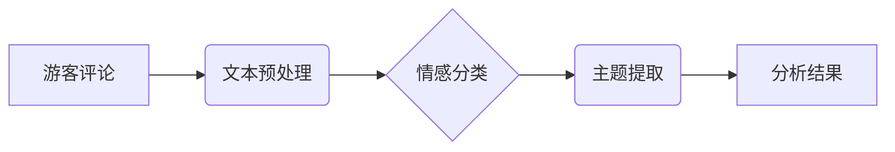

> 自然语言处理（NLP）、旅游景点评论、情感分析、主题提取、机器学习、深度学习

## 1. 背景介绍

随着互联网和移动技术的快速发展，旅游业也迎来了数字化转型。游客通过在线平台分享旅行体验，发表评论和评价，为其他游客提供参考。这些评论数据蕴含着丰富的旅游景点信息，例如景点特色、服务质量、游客满意度等。有效分析这些评论数据，可以帮助旅游机构了解游客需求，改进服务质量，提升旅游体验。

基于自然语言处理（NLP）技术的旅游景点评论分析，已成为旅游业发展的重要方向。通过对游客评论进行情感分析、主题提取等处理，可以挖掘出隐藏的价值，为旅游机构提供决策支持。

## 2. 核心概念与联系

**2.1 自然语言处理（NLP）**

自然语言处理（NLP）是人工智能领域的一个重要分支，旨在使计算机能够理解、处理和生成人类语言。NLP技术涵盖了文本分析、语音识别、机器翻译等多个方面。

**2.2 旅游景点评论分析**

旅游景点评论分析是指利用NLP技术对游客发表的旅游景点评论进行分析，提取其中的情感、主题、趋势等信息。

**2.3 核心概念关系**

NLP技术为旅游景点评论分析提供了基础，通过NLP技术，可以对游客评论进行文本预处理、情感分类、主题提取等操作，最终实现对旅游景点评论的深入分析。

**2.4 架构图**



## 3. 核心算法原理 & 具体操作步骤

**3.1 算法原理概述**

旅游景点评论分析通常采用机器学习和深度学习算法。

* **机器学习算法:** 
    * **朴素贝叶斯算法:** 基于贝叶斯定理，通过计算单词在不同情感类别中的概率，预测评论的情感类别。
    * **支持向量机 (SVM):** 通过寻找最佳的分隔超平面，将评论数据分类到不同的情感类别。
    * **决策树算法:** 通过构建决策树模型，根据评论中的特征，预测评论的情感类别。

* **深度学习算法:**
    * **循环神经网络 (RNN):** 可以处理序列数据，例如评论文本，捕捉评论中的上下文信息，提高情感分类的准确率。
    * **长短期记忆网络 (LSTM):** 是一种RNN的变体，能够更好地处理长序列数据，更准确地捕捉评论中的情感信息。
    * **Transformer:**  一种基于注意力机制的深度学习模型，能够更好地理解评论中的语义关系，提高情感分类和主题提取的准确率。

**3.2 算法步骤详解**

1. **数据收集:** 收集大量旅游景点评论数据，包括评论文本、情感标签等。
2. **数据预处理:** 对评论数据进行清洗、去停用词、分词等处理，以便于后续算法训练。
3. **特征提取:** 从评论文本中提取特征，例如单词、词性、情感词等。
4. **模型训练:** 使用机器学习或深度学习算法，对训练数据进行训练，学习评论与情感之间的关系。
5. **模型评估:** 使用测试数据评估模型的性能，例如准确率、召回率等。
6. **模型部署:** 将训练好的模型部署到实际应用场景中，对新的评论数据进行分析。

**3.3 算法优缺点**

| 算法 | 优点 | 缺点 |
|---|---|---|
| 朴素贝叶斯 | 简单易实现，训练速度快 | 假设特征独立性，对数据分布敏感 |
| SVM | 泛化能力强，对高维数据鲁棒性好 | 训练时间长，参数选择困难 |
| 决策树 | 易于理解和解释 | 过拟合问题 |
| RNN | 可以处理序列数据，捕捉上下文信息 | 训练时间长，梯度消失问题 |
| LSTM | 能够更好地处理长序列数据 | 训练时间更长 |
| Transformer | 能够更好地理解语义关系 | 计算资源消耗大 |

**3.4 算法应用领域**

* **旅游业:** 分析游客评论，了解游客需求，改进服务质量。
* **电商:** 分析用户评论，了解产品优缺点，改进产品设计。
* **金融:** 分析客户反馈，识别潜在风险。
* **医疗:** 分析患者病历，辅助医生诊断。

## 4. 数学模型和公式 & 详细讲解 & 举例说明

**4.1 数学模型构建**

情感分类任务可以看作是一个分类问题，可以使用概率模型来表示评论情感的分布。例如，可以使用朴素贝叶斯模型来计算评论属于不同情感类别的概率。

**4.2 公式推导过程**

朴素贝叶斯模型的基本公式如下：

$$P(C|D) = \frac{P(D|C)P(C)}{P(D)}$$

其中：

* $P(C|D)$: 评论 $D$ 属于类别 $C$ 的概率。
* $P(D|C)$: 类别 $C$ 下评论 $D$ 的概率。
* $P(C)$: 类别 $C$ 的先验概率。
* $P(D)$: 评论 $D$ 的概率。

**4.3 案例分析与讲解**

假设我们有一个旅游景点评论数据集，包含三个情感类别：正面、负面、中性。我们可以使用朴素贝叶斯模型来训练一个情感分类器。

训练过程中，我们需要计算每个类别下评论的概率，以及每个单词在不同类别下的概率。例如，如果“景色”这个单词在正面评论中出现的频率更高，那么它在正面评论中的概率会更高。

在预测新评论的情感时，我们可以根据新评论中的单词概率，计算它属于每个情感类别的概率，选择概率最高的类别作为预测结果。

## 5. 项目实践：代码实例和详细解释说明

**5.1 开发环境搭建**

* Python 3.x
* TensorFlow 或 PyTorch
* NLTK 或 spaCy

**5.2 源代码详细实现**

```python
import nltk
from nltk.corpus import stopwords
from sklearn.model_selection import train_test_split
from sklearn.feature_extraction.text import TfidfVectorizer
from sklearn.linear_model import LogisticRegression

# 数据加载和预处理
# ...

# 特征提取
vectorizer = TfidfVectorizer(stop_words=stopwords.words('english'))
X = vectorizer.fit_transform(data['text'])

# 数据分割
X_train, X_test, y_train, y_test = train_test_split(X, data['sentiment'], test_size=0.2)

# 模型训练
model = LogisticRegression()
model.fit(X_train, y_train)

# 模型评估
accuracy = model.score(X_test, y_test)
print(f'Accuracy: {accuracy}')

# 新评论预测
new_comment = "The hotel was amazing! The staff was friendly and helpful."
new_comment_vector = vectorizer.transform([new_comment])
prediction = model.predict(new_comment_vector)
print(f'Prediction: {prediction}')
```

**5.3 代码解读与分析**

* 数据加载和预处理：加载评论数据，并进行文本清洗、去停用词、分词等操作。
* 特征提取：使用TF-IDF向量化技术，将评论文本转换为数字特征向量。
* 数据分割：将数据分为训练集和测试集。
* 模型训练：使用逻辑回归模型训练情感分类器。
* 模型评估：使用测试集评估模型的性能。
* 新评论预测：使用训练好的模型对新评论进行情感分类。

**5.4 运行结果展示**

运行代码后，会输出模型的准确率以及对新评论的预测结果。

## 6. 实际应用场景

**6.1 旅游景点推荐**

根据游客评论的情感分析结果，可以推荐符合游客偏好的旅游景点。

**6.2 旅游服务改进**

分析游客评论中的负面意见，可以帮助旅游机构改进服务质量。

**6.3 旅游营销推广**

利用游客评论中的正面评价，进行旅游营销推广。

**6.4 未来应用展望**

* **个性化旅游推荐:** 根据游客的兴趣爱好和评论偏好，提供个性化的旅游推荐。
* **智能客服:** 利用NLP技术，开发智能客服系统，自动回复游客咨询。
* **虚拟旅游体验:** 利用VR/AR技术，结合游客评论，打造沉浸式的虚拟旅游体验。

## 7. 工具和资源推荐

**7.1 学习资源推荐**

* **书籍:**
    * 自然语言处理与深度学习
    * 深度学习
* **在线课程:**
    * Coursera: 自然语言处理
    * edX: 深度学习
* **博客:**
    * NLP Progress
    * Jay Alammar's Blog

**7.2 开发工具推荐**

* **Python:** 
    * NLTK
    * spaCy
    * Gensim
* **深度学习框架:**
    * TensorFlow
    * PyTorch

**7.3 相关论文推荐**

* Attention Is All You Need
* BERT: Pre-training of Deep Bidirectional Transformers for Language Understanding

## 8. 总结：未来发展趋势与挑战

**8.1 研究成果总结**

基于NLP技术的旅游景点评论分析取得了显著进展，能够有效地提取评论的情感、主题、趋势等信息，为旅游业发展提供了新的思路和方法。

**8.2 未来发展趋势**

* **多模态分析:** 将文本数据与图像、音频等多模态数据结合，进行更全面的分析。
* **跨语言分析:** 实现不同语言评论的跨语言分析，拓展分析范围。
* **个性化分析:** 根据用户的个人特征和偏好，提供个性化的分析结果。

**8.3 面临的挑战**

* **数据质量:** 评论数据存在噪声、不完整等问题，需要进行有效的数据清洗和预处理。
* **情感细粒度分析:** 现有的情感分类模型难以捕捉到细粒度的情感表达。
* **解释性:** 深度学习模型的决策过程难以解释，需要开发更可解释的模型。

**8.4 研究展望**

未来，基于NLP技术的旅游景点评论分析将朝着更智能、更精准、更个性化的方向发展，为旅游业提供更有效的决策支持。

## 9. 附录：常见问题与解答

**9.1 如何处理评论中的负面情绪？**

可以将负面情绪进行分类，例如针对服务、环境、价格等方面的负面情绪，并针对不同的负面情绪提出相应的解决方案。

**9.2 如何提高情感分类的准确率？**

可以尝试使用更复杂的深度学习模型，例如Transformer，并进行更细致的数据预处理和特征工程。

**9.3 如何进行主题提取？**

可以使用主题模型，例如LDA，从评论数据中提取出主要的主题。


作者：禅与计算机程序设计艺术 / Zen and the Art of Computer Programming 
<end_of_turn>