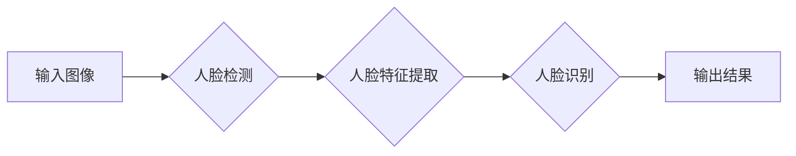

> 人脸检测、人脸识别、深度学习、卷积神经网络、迁移学习、OpenCV、TensorFlow

## 1. 背景介绍

人脸检测与识别技术作为计算机视觉领域的重要分支，近年来取得了显著进展，并广泛应用于人脸门禁、身份验证、安防监控、人脸搜索等领域。传统的基于特征工程的人脸检测与识别方法依赖于人工提取特征，效率低、鲁棒性差。随着深度学习技术的兴起，基于深度学习的人脸检测与识别系统凭借其强大的学习能力和鲁棒性，取得了突破性的进展。

深度学习模型能够自动学习图像特征，无需人工干预，从而提高了人脸检测与识别的准确率和效率。本文将深入探讨基于深度学习的人脸检测与识别系统的设计与实现，涵盖核心概念、算法原理、数学模型、代码实例以及实际应用场景等方面。

## 2. 核心概念与联系

**2.1 人脸检测**

人脸检测是指在图像或视频中定位和识别人脸区域的任务。其目标是找到图像中所有的人脸，并将其边界框标注出来。

**2.2 人脸识别**

人脸识别是指根据人脸图像特征，将人脸与数据库中的已知人脸进行匹配，从而识别出该人脸的身份。

**2.3 深度学习**

深度学习是一种机器学习的子领域，它利用多层神经网络来模拟人类大脑的学习过程。深度学习模型能够自动学习图像特征，并进行复杂的模式识别任务。

**2.4 卷积神经网络 (CNN)**

卷积神经网络是一种专门用于处理图像数据的深度学习模型。CNN 利用卷积操作和池化操作来提取图像特征，并具有强大的特征学习能力。

**2.5 迁移学习**

迁移学习是指将预训练模型的知识迁移到新的任务或数据集上的技术。在人脸检测与识别领域，可以利用预训练的CNN模型，将其迁移到新的数据集上进行训练，从而提高训练效率和模型性能。

**2.6 流程图**



## 3. 核心算法原理 & 具体操作步骤

### 3.1 算法原理概述

基于深度学习的人脸检测与识别系统主要基于卷积神经网络 (CNN) 算法。CNN 可以自动学习图像特征，并进行人脸检测和识别任务。

人脸检测通常使用目标检测算法，例如 YOLO、SSD、Faster R-CNN 等。这些算法可以将图像划分为多个区域，并预测每个区域是否包含人脸。

人脸识别通常使用特征提取算法，例如 FaceNet、VGGFace 等。这些算法可以提取人脸图像的特征向量，并根据特征向量的相似度进行人脸识别。

### 3.2 算法步骤详解

**3.2.1 人脸检测步骤**

1. **图像预处理:** 对输入图像进行尺寸调整、归一化等预处理操作。
2. **特征提取:** 使用 CNN 模型提取图像特征。
3. **目标检测:** 使用目标检测算法预测图像中的人脸区域。
4. **非极大值抑制:** 去除冗余的检测框，保留最优的检测结果。

**3.2.2 人脸识别步骤**

1. **人脸检测:** 使用人脸检测算法检测图像中的人脸区域。
2. **人脸特征提取:** 使用 CNN 模型提取人脸图像的特征向量。
3. **特征匹配:** 将提取的特征向量与数据库中的特征向量进行比较，找到最相似的特征向量。
4. **身份识别:** 根据特征匹配结果，识别出人脸的身份。

### 3.3 算法优缺点

**优点:**

* **高准确率:** 深度学习模型能够自动学习图像特征，从而提高人脸检测与识别系统的准确率。
* **鲁棒性强:** 深度学习模型对光照、姿态、表情等变化具有较强的鲁棒性。
* **效率高:** 深度学习模型的推理速度较快，能够满足实时应用的需求。

**缺点:**

* **训练数据量大:** 深度学习模型需要大量的训练数据才能达到较高的准确率。
* **计算资源需求高:** 深度学习模型的训练和推理需要大量的计算资源。
* **可解释性差:** 深度学习模型的决策过程较为复杂，难以解释其决策依据。

### 3.4 算法应用领域

基于深度学习的人脸检测与识别技术广泛应用于以下领域:

* **人脸门禁:** 用于身份验证和安全控制。
* **身份验证:** 用于银行、机场、政府机构等场所的身份验证。
* **安防监控:** 用于监控人员进出、识别嫌疑人等。
* **人脸搜索:** 用于搜索数据库中的人脸图像。
* **人脸识别支付:** 用于支付和消费。

## 4. 数学模型和公式 & 详细讲解 & 举例说明

### 4.1 数学模型构建

人脸检测与识别系统通常使用卷积神经网络 (CNN) 作为其核心模型。CNN 由多个卷积层、池化层和全连接层组成。

**卷积层:** 使用卷积核对输入图像进行卷积操作，提取图像特征。

**池化层:** 对卷积层的输出进行池化操作，降低特征图的尺寸，提高模型的鲁棒性。

**全连接层:** 将池化层的输出进行全连接操作，将特征向量映射到输出空间。

### 4.2 公式推导过程

**卷积操作:**

$$
y_{i,j} = \sum_{m=0}^{M-1} \sum_{n=0}^{N-1} x_{i+m,j+n} * w_{m,n} + b
$$

其中:

* $y_{i,j}$ 是卷积层的输出值。
* $x_{i+m,j+n}$ 是输入图像的像素值。
* $w_{m,n}$ 是卷积核的权值。
* $b$ 是卷积层的偏置值。

**池化操作:**

$$
y_{i,j} = \max(x_{i,j}, x_{i+1,j}, x_{i,j+1}, x_{i+1,j+1})
$$

其中:

* $y_{i,j}$ 是池化层的输出值。
* $x_{i,j}$ 是卷积层的输出值。

### 4.3 案例分析与讲解

**人脸识别案例:**

假设我们有一个包含1000张人脸图像的数据库，每个图像都对应一个唯一的身份标识。

1. 使用预训练的CNN模型提取每个图像的人脸特征向量。
2. 将特征向量存储到数据库中，并与身份标识关联。
3. 当需要识别新的人脸图像时，首先使用人脸检测算法检测图像中的人脸区域。
4. 提取人脸图像的特征向量，并与数据库中的特征向量进行比较。
5. 根据特征匹配结果，识别出人脸的身份。

## 5. 项目实践：代码实例和详细解释说明

### 5.1 开发环境搭建

* 操作系统: Ubuntu 18.04
* Python 版本: 3.7
* 深度学习框架: TensorFlow 2.0
* 图像处理库: OpenCV

### 5.2 源代码详细实现

```python
import tensorflow as tf
from tensorflow.keras.models import load_model
import cv2

# 加载预训练的CNN模型
model = load_model('face_detection_model.h5')

# 人脸检测函数
def detect_faces(image):
    # 将图像预处理为模型输入格式
    image = cv2.resize(image, (224, 224))
    image = image / 255.0
    image = tf.expand_dims(image, axis=0)

    # 使用模型进行人脸检测
    predictions = model.predict(image)
    # ...

# 人脸识别函数
def recognize_face(image):
    # ...

# 主函数
if __name__ == '__main__':
    # 读取图像
    image = cv2.imread('input.jpg')

    # 检测人脸
    faces = detect_faces(image)

    # 识别人脸
    for face in faces:
        # ...

    # 显示结果
    cv2.imshow('Result', image)
    cv2.waitKey(0)
```

### 5.3 代码解读与分析

* 代码首先加载预训练的CNN模型。
* `detect_faces()` 函数负责检测图像中的人脸区域。
* `recognize_face()` 函数负责识别人脸的身份。
* 主函数读取图像，调用 `detect_faces()` 和 `recognize_face()` 函数进行人脸检测和识别，并显示结果。

### 5.4 运行结果展示

运行代码后，将显示包含人脸检测框和身份识别的图像。

## 6. 实际应用场景

### 6.1 人脸门禁系统

基于深度学习的人脸检测与识别技术可以用于构建人脸门禁系统，实现无钥匙门禁、身份验证等功能。

### 6.2 身份验证系统

人脸识别技术可以用于银行、机场、政府机构等场所的身份验证，提高安全性和效率。

### 6.3 安防监控系统

人脸识别技术可以用于监控人员进出、识别嫌疑人等，提高安防监控的效率和准确性。

### 6.4 未来应用展望

随着深度学习技术的不断发展，人脸检测与识别技术将应用于更多领域，例如：

* **医疗诊断:** 人脸识别技术可以用于识别患者的病情，辅助医生进行诊断。
* **教育管理:** 人脸识别技术可以用于学生考勤、身份验证等。
* **零售服务:** 人脸识别技术可以用于个性化推荐、会员服务等。

## 7. 工具和资源推荐

### 7.1 学习资源推荐

* **书籍:**
    * 深度学习
    * 人工智能
* **在线课程:**
    * Coursera
    * edX
    * Udacity

### 7.2 开发工具推荐

* **深度学习框架:** TensorFlow, PyTorch
* **图像处理库:** OpenCV
* **云平台:** AWS, Google Cloud, Azure

### 7.3 相关论文推荐

* **FaceNet: A Unified Embedding for Face Recognition and Clustering**
* **SSD: Single Shot MultiBox Detector**
* **Faster R-CNN: Towards Real-Time Object Detection with Region Proposal Networks**

## 8. 总结：未来发展趋势与挑战

### 8.1 研究成果总结

基于深度学习的人脸检测与识别技术取得了显著进展，准确率和效率大幅提升。

### 8.2 未来发展趋势

* **更准确、更鲁棒的人脸检测与识别算法:** 研究更先进的深度学习模型，提高算法的准确率和鲁棒性。
* **跨模态人脸识别:** 将人脸识别与其他模态信息（例如语音、指纹）融合，提高识别准确率。
* **隐私保护:** 研究人脸识别技术的隐私保护方法，确保个人信息安全。

### 8.3 面临的挑战

* **数据标注:** 人脸检测与识别算法需要大量的标注数据，数据标注成本高。
* **模型解释性:** 深度学习模型的决策过程较为复杂，难以解释其决策依据。
* **公平性与偏见:** 人脸识别算法可能存在公平性问题，例如对不同种族或性别的人脸识别准确率不同。

### 8.4 研究展望

未来，人脸检测与识别技术将继续发展，应用于更多领域，为人们的生活带来更多便利。

## 9. 附录：常见问题与解答

**常见问题:**

* **人脸检测与识别算法的准确率如何？**

**解答:**

基于深度学习的人脸检测与识别算法的准确率已经非常高，但仍存在一定的误差。准确率取决于多种因素，