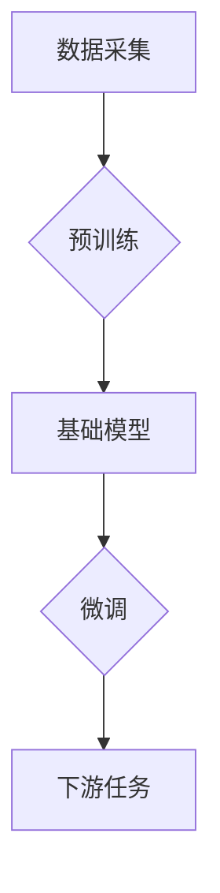

> 基础模型、技术标准、社会责任、伦理规范、可解释性、公平性、安全、隐私、可持续发展

## 1. 背景介绍

近年来，基础模型（Foundation Models）在人工智能领域取得了突破性的进展，其强大的泛化能力和适应性使其在自然语言处理、计算机视觉、语音识别等多个领域展现出巨大的潜力。基础模型通常是指在海量数据上训练的大规模深度学习模型，能够执行多种任务，并通过微调实现特定应用场景的优化。

然而，基础模型的快速发展也引发了诸多技术和社会伦理方面的挑战。其强大的能力可能被用于恶意目的，例如生成虚假信息、进行网络攻击、侵犯个人隐私等。因此，建立基础模型的技术标准和规范，并明确其社会责任，至关重要。

## 2. 核心概念与联系

**2.1 基础模型的定义**

基础模型是指在海量数据上进行预训练的深度学习模型，其目标是学习通用知识和表示能力，能够适应多种下游任务。

**2.2 基础模型的特征**

* **规模庞大:** 基础模型通常拥有数亿甚至数十亿个参数，需要大量的计算资源进行训练。
* **泛化能力强:** 基础模型在预训练阶段学习到的知识能够应用于多种不同的任务，无需针对每个任务进行专门的训练。
* **可迁移性高:** 基础模型可以被微调到特定任务，并快速达到较高的性能。

**2.3 基础模型的架构**

基础模型的架构通常基于 Transformer 这种强大的序列建模网络，例如 GPT-3、BERT、DALL-E 等。



## 3. 核心算法原理 & 具体操作步骤

**3.1 算法原理概述**

基础模型的训练主要基于自监督学习和迁移学习的原理。

* **自监督学习:** 在海量未标记数据上训练模型，通过预测缺失信息、生成文本等方式学习语言的结构和语义。
* **迁移学习:** 将预训练模型在特定任务上进行微调，利用预先学习到的知识快速提升模型性能。

**3.2 算法步骤详解**

1. **数据收集和预处理:** 收集海量文本数据，并进行清洗、分词、标记等预处理操作。
2. **模型架构设计:** 选择合适的 Transformer 架构，并根据任务需求进行调整。
3. **预训练阶段:** 使用自监督学习方法，在预处理后的数据上训练模型，学习语言的表示能力。
4. **微调阶段:** 将预训练模型用于特定任务，根据任务需求调整模型参数，并使用标记数据进行微调。
5. **评估和优化:** 使用测试数据评估模型性能，并根据评估结果调整模型参数和训练策略。

**3.3 算法优缺点**

* **优点:** 泛化能力强、可迁移性高、训练效率高。
* **缺点:** 训练成本高、数据依赖性强、可解释性差。

**3.4 算法应用领域**

* 自然语言处理: 文本生成、机器翻译、问答系统、文本摘要等。
* 计算机视觉: 图像分类、目标检测、图像生成等。
* 语音识别: 语音转文本、语音合成等。

## 4. 数学模型和公式 & 详细讲解 & 举例说明

**4.1 数学模型构建**

基础模型通常基于 Transformer 架构，其核心是注意力机制。注意力机制允许模型关注输入序列中与当前任务相关的部分，从而提高模型的理解能力和表达能力。

**4.2 公式推导过程**

注意力机制的计算公式如下：

$$
Attention(Q, K, V) = softmax(\frac{QK^T}{\sqrt{d_k}})V
$$

其中：

* $Q$：查询矩阵
* $K$：键矩阵
* $V$：值矩阵
* $d_k$：键向量的维度
* $softmax$：softmax 函数

**4.3 案例分析与讲解**

例如，在机器翻译任务中，查询矩阵 $Q$ 包含源语言的词嵌入，键矩阵 $K$ 包含目标语言的词嵌入，值矩阵 $V$ 包含目标语言的词嵌入。注意力机制会计算每个源语言词与每个目标语言词之间的相关性，并根据相关性权重分配注意力，从而生成更准确的翻译结果。

## 5. 项目实践：代码实例和详细解释说明

**5.1 开发环境搭建**

使用 Python 语言和深度学习框架 TensorFlow 或 PyTorch 进行开发。

**5.2 源代码详细实现**

```python
import tensorflow as tf

# 定义 Transformer 模型
class Transformer(tf.keras.Model):
    def __init__(self, vocab_size, embedding_dim, num_heads, num_layers):
        super(Transformer, self).__init__()
        self.embedding = tf.keras.layers.Embedding(vocab_size, embedding_dim)
        self.transformer_layers = tf.keras.layers.StackedRNNCells([
            tf.keras.layers.MultiHeadAttention(num_heads=num_heads, key_dim=embedding_dim)
            for _ in range(num_layers)
        ])
        self.output_layer = tf.keras.layers.Dense(vocab_size)

    def call(self, inputs):
        # Embedding
        embedded = self.embedding(inputs)
        # Transformer layers
        output = self.transformer_layers(embedded)
        # Output layer
        output = self.output_layer(output)
        return output

# 实例化模型
model = Transformer(vocab_size=10000, embedding_dim=512, num_heads=8, num_layers=6)

# 训练模型
model.compile(optimizer='adam', loss='sparse_categorical_crossentropy', metrics=['accuracy'])
model.fit(train_data, train_labels, epochs=10)
```

**5.3 代码解读与分析**

代码实现了 Transformer 模型的结构和训练过程。

* Embedding 层将输入词转换为词嵌入向量。
* Transformer 层使用多头注意力机制和多层感知机进行特征提取和序列建模。
* Output 层将特征向量映射到输出词的概率分布。

**5.4 运行结果展示**

训练完成后，模型可以用于预测新的文本序列。

## 6. 实际应用场景

基础模型在各个领域都有广泛的应用场景，例如：

* **自然语言处理:**

    * **聊天机器人:** 基于基础模型的聊天机器人能够进行更自然、更流畅的对话。
    * **文本生成:** 基于基础模型的文本生成模型能够生成高质量的新闻文章、小说、诗歌等文本。
    * **机器翻译:** 基于基础模型的机器翻译系统能够实现更高效、更准确的语言翻译。

* **计算机视觉:**

    * **图像识别:** 基于基础模型的图像识别系统能够识别各种物体、场景和人物。
    * **图像生成:** 基于基础模型的图像生成模型能够生成逼真的图像和视频。
    * **目标检测:** 基于基础模型的目标检测系统能够准确地定位图像中的目标。

* **语音识别:**

    * **语音转文本:** 基于基础模型的语音转文本系统能够将语音信号转换为文本。
    * **语音合成:** 基于基础模型的语音合成系统能够生成逼真的语音。

**6.4 未来应用展望**

基础模型的应用前景广阔，未来将应用于更多领域，例如：

* **医疗保健:** 基于基础模型的医疗诊断系统能够辅助医生进行疾病诊断。
* **教育:** 基于基础模型的教育系统能够提供个性化的学习体验。
* **科学研究:** 基于基础模型的科学研究工具能够加速科学发现。

## 7. 工具和资源推荐

**7.1 学习资源推荐**

* **书籍:**
    * 《深度学习》
    * 《自然语言处理》
    * 《Transformer 详解》
* **在线课程:**
    * Coursera: 深度学习
    * Udacity: 自然语言处理
    * fast.ai: 深度学习

**7.2 开发工具推荐**

* **深度学习框架:** TensorFlow, PyTorch
* **编程语言:** Python
* **云计算平台:** Google Cloud Platform, Amazon Web Services, Microsoft Azure

**7.3 相关论文推荐**

* 《Attention Is All You Need》
* 《BERT: Pre-training of Deep Bidirectional Transformers for Language Understanding》
* 《GPT-3: Language Models are Few-Shot Learners》

## 8. 总结：未来发展趋势与挑战

**8.1 研究成果总结**

基础模型在人工智能领域取得了显著的进展，其强大的泛化能力和适应性为各种应用场景提供了新的可能性。

**8.2 未来发展趋势**

* **模型规模的进一步扩大:** 随着计算资源的不断提升，基础模型的规模将继续扩大，从而提升模型的性能和能力。
* **多模态学习:** 基础模型将融合文本、图像、音频等多种模态数据，实现更全面的知识表示和理解。
* **可解释性和安全性:** 研究人员将致力于提高基础模型的可解释性和安全性，使其能够更好地服务于人类社会。

**8.3 面临的挑战**

* **数据获取和隐私保护:** 基础模型的训练需要海量数据，如何获取高质量数据并保护用户隐私是一个重要的挑战。
* **计算资源消耗:** 基础模型的训练需要大量的计算资源，如何降低训练成本是一个重要的研究方向。
* **伦理规范和社会责任:** 基础模型的强大能力可能被用于恶意目的，因此需要制定相应的伦理规范和社会责任准则。

**8.4 研究展望**

未来，基础模型的研究将继续朝着更强大、更安全、更可解释的方向发展，为人工智能的广泛应用提供坚实的基础。

## 9. 附录：常见问题与解答

**9.1 如何选择合适的基础模型？**

选择合适的基础模型需要根据具体的应用场景和任务需求进行考虑。例如，对于文本生成任务，可以选择 GPT-3 等文本生成模型；对于图像识别任务，可以选择 ResNet 等图像识别模型。

**9.2 如何进行基础模型的微调？**

基础模型的微调需要使用标记数据，并根据任务需求调整模型参数。可以使用迁移学习的策略，将预训练模型作为初始模型，并使用少量标记数据进行微调。

**9.3 如何评估基础模型的性能？**

基础模型的性能可以使用各种指标进行评估，例如准确率、召回率、F1-score 等。具体的评估指标需要根据任务需求进行选择。


作者：禅与计算机程序设计艺术 / Zen and the Art of Computer Programming 
<end_of_turn>