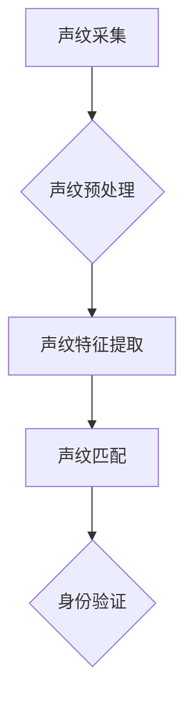

> 声纹识别,语音安全,深度学习,人工智能,创业,商业应用,技术趋势

## 1. 背景介绍

在数字时代，语音交互日益普及，从智能手机的语音助手到智能家居的语音控制，语音技术已经渗透到我们生活的方方面面。然而，随着语音技术的进步，语音安全也日益受到关注。声纹识别作为一种独特的生物识别技术，凭借其独特的声学特征，为语音安全提供了新的解决方案。

声纹识别技术是指通过分析和识别用户的声学特征，来验证用户的身份或进行身份认证的技术。与传统的密码或指纹识别相比，声纹识别具有以下优势：

* **便捷性:** 用户无需输入密码或触摸设备，只需通过语音即可进行身份验证。
* **安全性:** 声纹是每个人独一无二的生物特征，不易被伪造或盗用。
* **用户体验:** 语音交互更加自然流畅，提升了用户体验。

随着人工智能技术的快速发展，深度学习算法的应用为声纹识别技术带来了新的突破。深度学习算法能够自动学习和提取声纹特征，提高了声纹识别的准确性和鲁棒性。

## 2. 核心概念与联系

声纹识别系统通常由以下几个模块组成：

* **声纹采集模块:** 收集用户的语音信号。
* **声纹预处理模块:** 对采集到的语音信号进行预处理，例如降噪、增强、均衡等。
* **声纹特征提取模块:** 从预处理后的语音信号中提取声纹特征，例如梅尔频率倒谱系数 (MFCC)、线性预测系数 (LPC) 等。
* **声纹匹配模块:** 将提取的声纹特征与已有的声纹模板进行匹配，判断用户的身份。

**Mermaid 流程图:**



## 3. 核心算法原理 & 具体操作步骤

### 3.1  算法原理概述

声纹识别算法的核心是提取声纹特征并进行匹配。常用的声纹特征提取方法包括：

* **梅尔频率倒谱系数 (MFCC):** MFCC 是一种模拟人耳对声音感知的特征提取方法，能够有效地提取语音信号中的关键信息。
* **线性预测系数 (LPC):** LPC 通过分析语音信号的预测误差来提取声纹特征，能够有效地描述语音信号的声学特性。

声纹匹配算法通常采用距离度量方法，例如欧氏距离、马氏距离等，来计算提取的声纹特征之间的相似度。

### 3.2  算法步骤详解

1. **声纹采集:** 使用麦克风或其他音频设备采集用户的语音信号。
2. **声纹预处理:** 对采集到的语音信号进行预处理，例如降噪、增强、均衡等，以去除噪声和提高信号质量。
3. **声纹特征提取:** 使用 MFCC 或 LPC 等算法提取语音信号中的声纹特征。
4. **声纹匹配:** 将提取的声纹特征与已有的声纹模板进行匹配，计算特征之间的相似度。
5. **身份验证:** 根据匹配结果判断用户的身份。

### 3.3  算法优缺点

**优点:**

* **安全性高:** 声纹是每个人独一无二的生物特征，不易被伪造或盗用。
* **便捷性强:** 用户无需输入密码或触摸设备，只需通过语音即可进行身份验证。
* **用户体验好:** 语音交互更加自然流畅，提升了用户体验。

**缺点:**

* **受环境影响:** 声纹识别算法容易受到环境噪声、用户情绪等因素的影响。
* **数据量需求大:** 训练声纹识别模型需要大量的声纹数据。
* **隐私安全问题:** 声纹数据属于敏感信息，需要妥善保护用户隐私。

### 3.4  算法应用领域

声纹识别技术在以下领域具有广泛的应用前景:

* **金融安全:** 银行、支付平台等金融机构可以使用声纹识别技术进行身份验证，提高资金安全。
* **医疗保健:** 医院可以使用声纹识别技术进行患者身份识别，提高医疗服务效率。
* **智能家居:** 智能家居设备可以使用声纹识别技术进行语音控制，提供更加便捷的用户体验。
* **企业管理:** 企业可以使用声纹识别技术进行员工考勤、会议记录等管理工作。

## 4. 数学模型和公式 & 详细讲解 & 举例说明

### 4.1  数学模型构建

声纹识别算法通常基于统计模型，例如高斯混合模型 (GMM) 或隐马尔可夫模型 (HMM)。

**高斯混合模型 (GMM):**

GMM 假设声纹特征服从多个高斯分布的混合，每个高斯分布代表一个特定的声纹状态。GMM 可以用来建模声纹特征的概率分布，并用于声纹匹配。

**隐马尔可夫模型 (HMM):**

HMM 是一个用于处理时序数据的统计模型，可以用来建模语音信号的声学特征序列。HMM 可以用来识别语音信号中的不同音素或单词。

### 4.2  公式推导过程

**GMM 的概率密度函数:**

$$
p(x|\theta) = \sum_{i=1}^{M} \alpha_i \mathcal{N}(x|\mu_i, \Sigma_i)
$$

其中:

* $x$ 是声纹特征向量。
* $\theta$ 是 GMM 的参数，包括混合系数 $\alpha_i$、均值向量 $\mu_i$ 和协方差矩阵 $\Sigma_i$。
* $\mathcal{N}(x|\mu_i, \Sigma_i)$ 是高斯分布的概率密度函数。

**HMM 的状态转移概率矩阵:**

$$
A = \begin{bmatrix}
a_{11} & a_{12} & \cdots & a_{1N} \\
a_{21} & a_{22} & \cdots & a_{2N} \\
\vdots & \vdots & \ddots & \vdots \\
a_{N1} & a_{N2} & \cdots & a_{NN}
\end{bmatrix}
$$

其中:

* $a_{ij}$ 是从状态 $i$ 转移到状态 $j$ 的概率。

### 4.3  案例分析与讲解

**案例:**

假设我们有一个声纹识别系统，需要识别用户的身份。系统首先采集用户的语音信号，然后提取声纹特征。提取的声纹特征将被与已有的声纹模板进行匹配。

**分析:**

如果提取的声纹特征与已有的声纹模板的相似度较高，则系统将判断用户身份为匹配的用户。否则，系统将判断用户身份为未匹配的用户。

## 5. 项目实践：代码实例和详细解释说明

### 5.1  开发环境搭建

声纹识别项目可以使用 Python 语言进行开发。常用的声纹识别库包括 Librosa、PyAudio、SpeechRecognition 等。

**环境搭建步骤:**

1. 安装 Python 语言环境。
2. 安装必要的声纹识别库，例如 Librosa、PyAudio、SpeechRecognition 等。

### 5.2  源代码详细实现

```python
import librosa
import numpy as np

# 载入语音信号
audio_file = 'voice.wav'
y, sr = librosa.load(audio_file)

# 提取 MFCC 特征
mfccs = librosa.feature.mfcc(y=y, sr=sr, n_mfcc=13)

# 将 MFCC 特征转换为 NumPy 数组
mfccs_array = np.array(mfccs)

# 打印 MFCC 特征
print(mfccs_array)
```

### 5.3  代码解读与分析

* `librosa.load(audio_file)` 函数用于载入语音信号文件。
* `librosa.feature.mfcc()` 函数用于提取 MFCC 特征。
* `np.array()` 函数用于将 MFCC 特征转换为 NumPy 数组。

### 5.4  运行结果展示

运行上述代码后，将输出 MFCC 特征的 NumPy 数组。

## 6. 实际应用场景

### 6.1  金融安全

声纹识别技术可以用于银行、支付平台等金融机构的身份验证，提高资金安全。例如，用户可以通过语音识别来进行银行卡交易、转账等操作。

### 6.2  医疗保健

声纹识别技术可以用于医院进行患者身份识别，提高医疗服务效率。例如，患者可以通过语音识别来进行挂号、预约、缴费等操作。

### 6.3  智能家居

智能家居设备可以使用声纹识别技术进行语音控制，提供更加便捷的用户体验。例如，用户可以通过语音识别来控制灯光、空调、电视等设备。

### 6.4  未来应用展望

声纹识别技术在未来将有更广泛的应用前景，例如：

* **个性化服务:** 根据用户的声纹特征，提供个性化的产品和服务。
* **远程医疗:** 通过声纹识别技术，医生可以远程诊断患者的病情。
* **语音搜索:** 声纹识别技术可以提高语音搜索的准确性和效率。

## 7. 工具和资源推荐

### 7.1  学习资源推荐

* **书籍:**
    * 《Speech and Language Processing》 by Jurafsky and Martin
    * 《Deep Learning》 by Goodfellow, Bengio, and Courville
* **在线课程:**
    * Coursera: Speech Recognition and Natural Language Processing
    * edX: Introduction to Deep Learning

### 7.2  开发工具推荐

* **Python:** Python 语言是声纹识别开发的常用语言。
* **Librosa:** Librosa 是一个用于音频分析的 Python 库。
* **PyAudio:** PyAudio 是一个用于音频输入/输出的 Python 库。
* **SpeechRecognition:** SpeechRecognition 是一个用于语音识别的 Python 库。

### 7.3  相关论文推荐

* **Deep Speech 2: End-to-End Speech Recognition in English and Mandarin**
* **Automatic Speech Recognition with Deep Neural Networks**
* **Acoustic Modeling Using Deep Belief Networks**

## 8. 总结：未来发展趋势与挑战

### 8.1  研究成果总结

声纹识别技术近年来取得了显著的进展，深度学习算法的应用使得声纹识别的准确性和鲁棒性得到了提升。

### 8.2  未来发展趋势

未来声纹识别技术的发展趋势包括:

* **更准确的识别:** 研究人员将继续探索新的算法和模型，提高声纹识别的准确率。
* **更鲁棒的识别:** 研究人员将研究如何提高声纹识别算法对环境噪声、用户情绪等因素的鲁棒性。
* **更安全的识别:** 研究人员将研究如何提高声纹识别的安全性，防止声纹被伪造或盗用。

### 8.3  面临的挑战

声纹识别技术还面临一些挑战，例如:

* **数据量需求大:** 训练声纹识别模型需要大量的声纹数据，而获取高质量的声纹数据仍然是一个挑战。
* **隐私安全问题:** 声纹数据属于敏感信息，需要妥善保护用户隐私。
* **跨语言识别:** 目前大多数声纹识别系统只能识别单一语言，跨语言识别的研究还处于早期阶段。

### 8.4  研究展望

声纹识别技术具有巨大的应用潜力，未来将继续受到研究人员的关注。随着技术的不断发展，声纹识别技术将为我们的生活带来更多便利和安全。

## 9. 附录：常见问题与解答

**常见问题:**

* **声纹识别技术是否安全可靠?**

声纹识别技术是一种相对安全的生物识别技术，但并非绝对安全。声纹可以被伪造或盗用，因此需要采取相应的安全措施来保护用户隐私。

* **声纹识别技术是否适用于所有语言?**

目前大多数声纹识别系统只能识别单一语言，跨语言识别的研究还处于早期阶段。

* **声纹识别技术是否会侵犯用户的隐私?**

声纹数据属于敏感信息，需要妥善保护用户隐私。声纹识别系统的设计和使用应该遵循