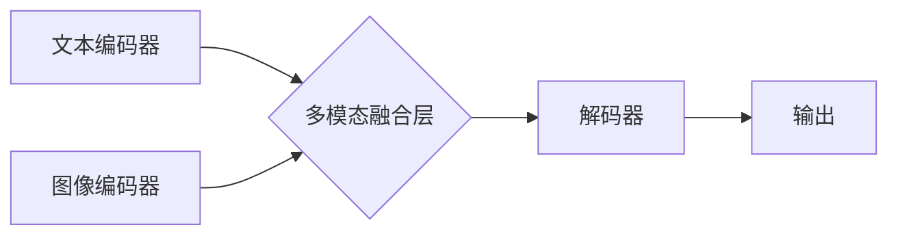

> 多模态大模型、多模态学习、Transformer、视觉语言模型、文本图像生成、高效训练、预训练微调

## 1. 背景介绍

近年来，人工智能领域取得了令人瞩目的进展，其中多模态大模型 (Multimodal Large Models, MMLMs) 作为一种新兴技术，展现出巨大的潜力。与单模态模型相比，MMLMs能够处理多种类型的数据，例如文本、图像、音频、视频等，从而更全面地理解和交互世界。

传统的单模态模型在处理多模态数据时存在局限性，例如需要将不同模态的数据进行人工融合，或者无法充分利用不同模态之间的语义关联。MMLMs通过学习不同模态之间的映射关系，能够更好地理解和整合多模态信息，从而实现更精准、更智能的应用。

## 2. 核心概念与联系

**2.1 多模态学习**

多模态学习是指训练模型能够从多个模态数据中学习，并理解不同模态之间的关系。例如，一个多模态模型可以学习图像和文本之间的关联，从而实现图像描述、图像问答等任务。

**2.2 多模态大模型**

多模态大模型是指拥有大量参数，能够处理多种模态数据的深度学习模型。MMLMs通常基于Transformer架构，并利用自注意力机制学习不同模态之间的关系。

**2.3 核心架构**



**2.4 核心概念联系**

多模态学习是MMLMs的基础，而MMLMs则是多模态学习的具体实现。MMLMs通过学习不同模态之间的关系，实现多模态数据的理解和交互。

## 3. 核心算法原理 & 具体操作步骤

**3.1 算法原理概述**

MMLMs的核心算法原理是基于Transformer架构，并利用自注意力机制学习不同模态之间的关系。

**3.2 算法步骤详解**

1. **数据预处理:** 将文本、图像等多模态数据进行预处理，例如文本分词、图像裁剪等。
2. **模态编码:** 使用不同的编码器对不同模态数据进行编码，例如使用BERT对文本进行编码，使用Vision Transformer对图像进行编码。
3. **多模态融合:** 将不同模态的编码结果进行融合，例如使用注意力机制学习不同模态之间的关系，并将融合后的结果作为解码器的输入。
4. **解码:** 使用解码器生成最终的输出，例如生成文本描述、图像分类等。

**3.3 算法优缺点**

**优点:**

* 能够处理多种类型的数据，理解和整合多模态信息。
* 性能优于传统的单模态模型。
* 可迁移学习，在不同任务上表现良好。

**缺点:**

* 训练成本高，需要大量的计算资源和数据。
* 模型复杂度高，难以解释和调试。

**3.4 算法应用领域**

* **图像描述:** 生成图像的文本描述。
* **图像问答:** 回答关于图像的问题。
* **文本图像生成:** 根据文本描述生成图像。
* **视频理解:** 理解视频内容，例如动作识别、事件检测等。
* **多模态检索:** 根据文本或图像查询相关数据。

## 4. 数学模型和公式 & 详细讲解 & 举例说明

**4.1 数学模型构建**

MMLMs通常使用Transformer架构，其核心是自注意力机制。自注意力机制能够学习不同词之间的关系，并赋予每个词不同的权重。

**4.2 公式推导过程**

自注意力机制的计算公式如下：

$$
Attention(Q, K, V) = softmax(\frac{QK^T}{\sqrt{d_k}})V
$$

其中：

* $Q$：查询矩阵
* $K$：键矩阵
* $V$：值矩阵
* $d_k$：键向量的维度
* $softmax$：softmax函数

**4.3 案例分析与讲解**

例如，在图像描述任务中，图像编码器将图像编码为一个向量表示，文本编码器将文本编码为一个序列向量表示。自注意力机制可以学习图像和文本之间的关系，例如，将图像中的某个物体与描述该物体的文本词语关联起来。

## 5. 项目实践：代码实例和详细解释说明

**5.1 开发环境搭建**

* Python 3.7+
* PyTorch 1.7+
* CUDA 10.2+

**5.2 源代码详细实现**

```python
import torch
import torch.nn as nn

class MultimodalFusionLayer(nn.Module):
    def __init__(self, text_dim, image_dim):
        super(MultimodalFusionLayer, self).__init__()
        self.text_proj = nn.Linear(text_dim, text_dim)
        self.image_proj = nn.Linear(image_dim, text_dim)
        self.attention = nn.MultiheadAttention(embed_dim=text_dim, num_heads=8)

    def forward(self, text_embedding, image_embedding):
        text_embedding = self.text_proj(text_embedding)
        image_embedding = self.image_proj(image_embedding)
        fused_embedding = self.attention(text_embedding, image_embedding, image_embedding)[0]
        return fused_embedding

# ... 其他代码 ...
```

**5.3 代码解读与分析**

* `MultimodalFusionLayer` 类定义了一个多模态融合层，它接受文本和图像的编码结果作为输入，并使用多头注意力机制学习两者之间的关系。
* `text_proj` 和 `image_proj` 是两个线性层，用于将文本和图像的维度调整到一致。
* `attention` 是一个多头注意力层，它学习文本和图像之间的关系，并生成融合后的嵌入向量。

**5.4 运行结果展示**

运行代码后，可以得到融合后的文本和图像嵌入向量，这些向量可以用于后续的任务，例如图像描述、图像问答等。

## 6. 实际应用场景

**6.1 图像描述**

MMLMs可以生成图像的文本描述，例如，给定一张图片，MMLMs可以生成描述图片内容的句子，例如“一只小狗在草地上玩耍”。

**6.2 图像问答**

MMLMs可以回答关于图像的问题，例如，给定一张图片和一个问题，MMLMs可以根据图片内容回答问题，例如，给定一张图片，问“图片中有什么动物？”，MMLMs可以回答“图片中有一只小狗”。

**6.3 文本图像生成**

MMLMs可以根据文本描述生成图像，例如，给定一个文本描述，MMLMs可以生成与描述相匹配的图像，例如，给定文本描述“一只小猫在睡觉”，MMLMs可以生成一张小猫睡觉的图片。

**6.4 其他应用场景**

* 视频理解
* 多模态检索
* 机器翻译
* 聊天机器人

**6.5 未来应用展望**

MMLMs在未来将有更广泛的应用场景，例如：

* **增强现实 (AR) 和虚拟现实 (VR):** MMLMs可以理解用户与虚拟环境的交互，从而提供更沉浸式的体验。
* **自动驾驶:** MMLMs可以帮助自动驾驶汽车理解周围环境，例如识别交通信号灯、行人等。
* **医疗诊断:** MMLMs可以帮助医生分析医学图像，辅助诊断疾病。

## 7. 工具和资源推荐

**7.1 学习资源推荐**

* **书籍:**
    * 《深度学习》
    * 《Transformer 详解》
* **论文:**
    * 《BERT: Pre-training of Deep Bidirectional Transformers for Language Understanding》
    * 《Vision Transformer》
* **在线课程:**
    * Coursera: 深度学习
    * Udacity: 自然语言处理

**7.2 开发工具推荐**

* **PyTorch:** 深度学习框架
* **TensorFlow:** 深度学习框架
* **HuggingFace Transformers:** 预训练模型库

**7.3 相关论文推荐**

* 《CLIP: Contrastive Language-Image Pre-training》
* 《DALL-E 2: Hierarchical Text-Conditional Image Generation with CLIP Latents》
* 《Imagen: Text-to-Image Diffusion Models》

## 8. 总结：未来发展趋势与挑战

**8.1 研究成果总结**

近年来，MMLMs取得了显著进展，在图像描述、图像问答、文本图像生成等任务上取得了优异的性能。

**8.2 未来发展趋势**

* **模型规模和能力的提升:** 未来MMLMs的规模和能力将进一步提升，能够处理更复杂的任务。
* **多模态融合方法的创新:** 将探索更有效的多模态融合方法，例如跨模态注意力机制、多模态自监督学习等。
* **应用场景的拓展:** MMLMs将应用于更多领域，例如AR/VR、自动驾驶、医疗诊断等。

**8.3 面临的挑战**

* **数据获取和标注:** MMLMs需要大量的多模态数据进行训练，数据获取和标注成本较高。
* **模型训练效率:** MMLMs的训练成本很高，需要大量的计算资源。
* **模型解释性和可解释性:** MMLMs的模型结构复杂，难以解释和调试。

**8.4 研究展望**

未来研究将重点关注解决上述挑战，例如探索更有效的训练方法、开发更易解释的模型架构、以及探索新的多模态数据来源。


## 9. 附录：常见问题与解答

**9.1 如何选择合适的MMLMs模型？**

选择合适的MMLMs模型需要根据具体的应用场景和任务需求进行选择。例如，对于图像描述任务，可以考虑使用CLIP、DALL-E 2等模型；对于图像问答任务，可以考虑使用VL-BERT、UNITER等模型。

**9.2 如何训练MMLMs模型？**

训练MMLMs模型需要准备大量的多模态数据，并使用合适的训练方法，例如预训练微调。

**9.3 如何评估MMLMs模型的性能？**

MMLMs模型的性能可以根据具体的应用场景和任务需求进行评估，例如使用BLEU、ROUGE等指标评估图像描述任务的性能，使用准确率、召回率等指标评估图像问答任务的性能。


作者：禅与计算机程序设计艺术 / Zen and the Art of Computer Programming 
<end_of_turn>