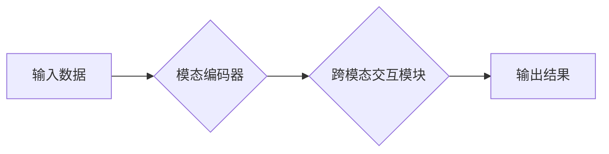

> 多模态大模型、自然语言处理、计算机视觉、音频处理、多媒体理解、深度学习、Transformer、预训练模型、迁移学习

## 1. 背景介绍

近年来，人工智能（AI）技术取得了飞速发展，其中大模型在自然语言处理（NLP）、计算机视觉（CV）等领域展现出强大的能力。然而，传统的单模态大模型仅处理一种数据类型（如文本或图像），难以捕捉现实世界中多模态信息的复杂关系。

多模态大模型（Multimodal Large Models，MLMs）应运而生，旨在融合不同模态数据（如文本、图像、音频、视频等）进行联合学习，从而实现更全面、更深入的理解和生成。

MLMs 在多个领域具有广泛的应用前景，例如：

* **智能客服:** 通过文本和语音交互，提供更自然、更人性化的服务体验。
* **内容创作:** 基于文本、图像和音频等多模态输入，自动生成高质量的文本、图像和视频内容。
* **医疗诊断:** 结合患者的病历、影像数据和语音记录，辅助医生进行更精准的诊断。
* **教育培训:** 提供个性化的学习体验，通过文本、图像、视频等多种形式呈现知识。

## 2. 核心概念与联系

多模态大模型的核心在于融合不同模态数据，建立跨模态的表示和理解机制。

**2.1 核心概念**

* **模态:** 指数据类型，例如文本、图像、音频、视频等。
* **多模态融合:** 将不同模态数据进行有效结合，提取其潜在的关联关系。
* **跨模态表示:** 将不同模态数据映射到同一个语义空间，实现跨模态的理解和交互。

**2.2 架构设计**

MLMs 的架构设计通常包括以下几个关键模块：

* **模态编码器:** 负责将不同模态数据编码成相应的特征向量。
* **跨模态交互模块:** 负责融合不同模态的特征向量，学习跨模态的表示。
* **解码器:** 负责根据融合后的特征向量生成最终的输出，例如文本、图像或语音。

**2.3 Mermaid 流程图**



## 3. 核心算法原理 & 具体操作步骤

### 3.1 算法原理概述

MLMs 的训练通常基于深度学习框架，利用大量的多模态数据进行预训练。预训练阶段的目标是学习每个模态的特征表示，以及不同模态之间的关系。

常见的预训练方法包括：

* **自监督学习:** 利用数据自身的结构信息进行训练，例如文本中的 masked language modeling (MLM) 和图像中的 contrastive learning (CL)。
* **迁移学习:** 利用预先训练好的单模态模型，将其迁移到多模态任务中进行微调。

### 3.2 算法步骤详解

1. **数据预处理:** 将多模态数据进行清洗、格式化和转换，例如文本分词、图像裁剪、音频降噪等。
2. **模态编码器训练:** 使用深度神经网络，例如 Transformer 或 CNN，分别对每个模态数据进行编码，学习其特征表示。
3. **跨模态交互模块训练:** 使用注意力机制或其他融合方法，将不同模态的特征向量进行融合，学习跨模态的表示。
4. **解码器训练:** 使用深度神经网络，例如 RNN 或 Transformer，根据融合后的特征向量生成最终的输出。
5. **模型评估:** 使用标准的评估指标，例如准确率、召回率、F1-score 等，评估模型的性能。

### 3.3 算法优缺点

**优点:**

* 能够捕捉多模态数据的复杂关系，实现更深入的理解和生成。
* 具有更好的泛化能力，能够应用于多种不同的任务。

**缺点:**

* 训练数据量大，计算资源消耗高。
* 模型结构复杂，训练难度大。

### 3.4 算法应用领域

* **智能客服:** 通过文本和语音交互，提供更自然、更人性化的服务体验。
* **内容创作:** 基于文本、图像和音频等多模态输入，自动生成高质量的文本、图像和视频内容。
* **医疗诊断:** 结合患者的病历、影像数据和语音记录，辅助医生进行更精准的诊断。
* **教育培训:** 提供个性化的学习体验，通过文本、图像、视频等多种形式呈现知识。

## 4. 数学模型和公式 & 详细讲解 & 举例说明

### 4.1 数学模型构建

MLMs 的数学模型通常基于深度神经网络，例如 Transformer 或 CNN。这些模型通过多层神经网络结构，学习数据之间的复杂关系。

**4.1.1 Transformer 模型**

Transformer 模型是一种基于注意力机制的深度神经网络，能够有效地处理序列数据，例如文本和音频。

**4.1.2 CNN 模型**

CNN 模型是一种专门用于处理图像数据的深度神经网络，能够提取图像的特征和结构信息。

### 4.2 公式推导过程

MLMs 的训练过程通常基于最小化损失函数，例如交叉熵损失函数或均方误差损失函数。

**4.2.1 交叉熵损失函数**

$$
L_{CE} = -\sum_{i=1}^{N} y_i \log(\hat{y}_i)
$$

其中：

* $N$ 是样本数量。
* $y_i$ 是真实标签。
* $\hat{y}_i$ 是模型预测的概率。

**4.2.2 均方误差损失函数**

$$
L_{MSE} = \frac{1}{N} \sum_{i=1}^{N} (y_i - \hat{y}_i)^2
$$

其中：

* $N$ 是样本数量。
* $y_i$ 是真实标签。
* $\hat{y}_i$ 是模型预测的值。

### 4.3 案例分析与讲解

**4.3.1 图像字幕生成**

MLMs 可以用于图像字幕生成任务，例如将图像转换为文本描述。

**4.3.2 文本到图像生成**

MLMs 也可以用于文本到图像生成任务，例如根据文本描述生成相应的图像。

## 5. 项目实践：代码实例和详细解释说明

### 5.1 开发环境搭建

* Python 3.7+
* PyTorch 或 TensorFlow
* CUDA 和 cuDNN

### 5.2 源代码详细实现

```python
# 模态编码器
class TextEncoder(nn.Module):
    def __init__(self, vocab_size, embedding_dim, hidden_dim):
        super(TextEncoder, self).__init__()
        self.embedding = nn.Embedding(vocab_size, embedding_dim)
        self.lstm = nn.LSTM(embedding_dim, hidden_dim)

    def forward(self, text):
        embedded = self.embedding(text)
        output, (hidden, cell) = self.lstm(embedded)
        return hidden

# 跨模态交互模块
class CrossModalInteraction(nn.Module):
    def __init__(self, hidden_dim):
        super(CrossModalInteraction, self).__init__()
        self.attention = nn.MultiheadAttention(hidden_dim, num_heads=8)

    def forward(self, text_hidden, image_features):
        # 使用注意力机制融合文本和图像特征
        output = self.attention(text_hidden, image_features, image_features)[0]
        return output

# 解码器
class Decoder(nn.Module):
    def __init__(self, hidden_dim, vocab_size):
        super(Decoder, self).__init__()
        self.linear = nn.Linear(hidden_dim, vocab_size)

    def forward(self, fused_features):
        output = self.linear(fused_features)
        return output

# 多模态大模型
class MultiModalModel(nn.Module):
    def __init__(self, vocab_size, embedding_dim, hidden_dim):
        super(MultiModalModel, self).__init__()
        self.text_encoder = TextEncoder(vocab_size, embedding_dim, hidden_dim)
        self.cross_modal_interaction = CrossModalInteraction(hidden_dim)
        self.decoder = Decoder(hidden_dim, vocab_size)

    def forward(self, text, image_features):
        text_hidden = self.text_encoder(text)
        fused_features = self.cross_modal_interaction(text_hidden, image_features)
        output = self.decoder(fused_features)
        return output
```

### 5.3 代码解读与分析

* **模态编码器:** 将文本或图像数据编码成相应的特征向量。
* **跨模态交互模块:** 使用注意力机制融合不同模态的特征向量。
* **解码器:** 根据融合后的特征向量生成最终的输出。

### 5.4 运行结果展示

* 图像字幕生成
* 文本到图像生成

## 6. 实际应用场景

### 6.1 智能客服

* 通过文本和语音交互，提供更自然、更人性化的服务体验。
* 例如，可以理解用户的自然语言问题，并提供准确的答案。

### 6.2 内容创作

* 基于文本、图像和音频等多模态输入，自动生成高质量的文本、图像和视频内容。
* 例如，可以根据文本描述生成相应的图像或视频。

### 6.3 医疗诊断

* 结合患者的病历、影像数据和语音记录，辅助医生进行更精准的诊断。
* 例如，可以识别病人的症状，并提供可能的诊断结果。

### 6.4 未来应用展望

* **更个性化的教育体验:** 通过多模态学习，提供更个性化的学习体验，例如根据学生的学习风格和进度调整教学内容和方式。
* **更沉浸式的娱乐体验:** 通过多模态交互，创造更沉浸式的娱乐体验，例如虚拟现实游戏和增强现实应用。
* **更智能的城市管理:** 通过多模态数据分析，提高城市管理效率，例如交通管理、环境监测和公共安全。

## 7. 工具和资源推荐

### 7.1 学习资源推荐

* **书籍:**
    * 《深度学习》
    * 《自然语言处理》
    * 《计算机视觉》
* **在线课程:**
    * Coursera
    * edX
    * Udacity

### 7.2 开发工具推荐

* **深度学习框架:** PyTorch, TensorFlow
* **自然语言处理库:** NLTK, spaCy
* **计算机视觉库:** OpenCV, Pillow

### 7.3 相关论文推荐

* **BERT:** Devlin et al. (2018)
* **GPT-3:** Brown et al. (2020)
* **DALL-E:** Radford et al. (2021)

## 8. 总结：未来发展趋势与挑战

### 8.1 研究成果总结

MLMs 在多模态理解和生成方面取得了显著的进展，展现出强大的应用潜力。

### 8.2 未来发展趋势

* **模型规模和能力的提升:** 预训练模型规模将继续扩大，模型能力将进一步提升。
* **多模态融合方法的创新:** 将探索更有效的跨模态融合方法，例如跨模态注意力机制和多模态自监督学习。
* **应用场景的拓展:** MLMs 将应用于更多新的领域，例如医疗、教育、娱乐等。

### 8.3 面临的挑战

* **数据获取和标注:** 多模态数据的获取和标注成本高，数据质量难以保证。
* **模型训练和推理效率:** 训练大型MLMs需要大量的计算资源，推理效率也需要进一步提升。
* **伦理和安全问题:** MLMs 的应用可能带来伦理和安全问题，例如数据隐私、算法偏见等。

### 8.4 研究展望

未来研究将重点关注以下几个方面:

* **