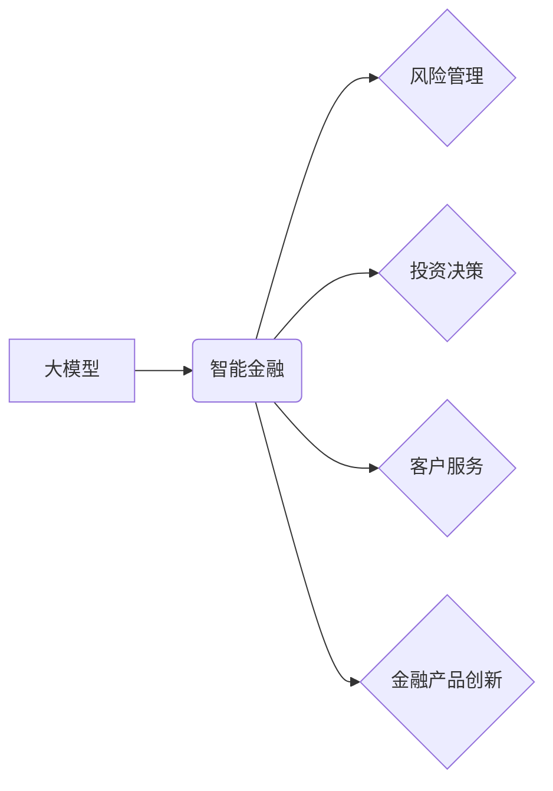

> 大模型，智能金融，自然语言处理，机器学习，风险管理，投资决策，客户服务

## 1. 背景介绍

金融行业作为经济发展的重要支柱，近年来正经历着数字化转型和智能化升级。大模型的出现为金融行业带来了前所未有的机遇，其强大的学习能力和泛化能力能够有效解决金融领域面临的诸多挑战，推动金融服务向智能化、个性化、高效化方向发展。

**1.1 金融行业面临的挑战**

传统金融服务模式面临着以下挑战：

* **数据处理能力不足:** 金融数据海量、复杂，传统处理方法难以有效挖掘数据价值。
* **风险管理难度大:** 金融风险复杂多变，传统风险管理方法难以全面覆盖，需要更智能化的风险识别和控制机制。
* **服务效率低下:** 金融服务流程繁琐，客户体验差，需要更高效、便捷的服务模式。
* **个性化服务缺失:** 金融产品和服务缺乏针对性，难以满足不同客户的个性化需求。

**1.2 大模型的优势**

大模型作为一种新型人工智能技术，具有以下优势：

* **强大的学习能力:** 大模型能够从海量数据中学习复杂的模式和关系，实现对金融数据的深度挖掘和分析。
* **泛化能力强:** 大模型能够将学习到的知识应用于不同的金融场景，实现跨领域的应用。
* **高效的处理能力:** 大模型能够快速处理海量数据，提高金融服务效率。
* **个性化服务:** 大模型能够根据客户的个人特征和需求，提供个性化的金融产品和服务。

## 2. 核心概念与联系

**2.1 大模型概述**

大模型是指参数规模庞大、训练数据海量的人工智能模型。其核心特点是：

* **参数规模大:** 大模型通常拥有数十亿甚至数千亿个参数，能够学习更复杂的知识和模式。
* **训练数据量大:** 大模型需要大量的训练数据才能达到最佳性能，通常包含海量文本、图像、音频等数据。
* **强大的计算能力:** 训练大模型需要强大的计算资源，通常需要使用分布式计算平台。

**2.2 智能金融概述**

智能金融是指利用人工智能技术，对金融服务进行智能化改造，提升金融服务效率、精准度和用户体验。其核心应用场景包括：

* **风险管理:** 利用大模型识别和预测金融风险，提高风险控制效率。
* **投资决策:** 利用大模型分析市场数据，辅助投资决策，提高投资收益。
* **客户服务:** 利用大模型提供智能客服，提高客户服务效率和体验。
* **金融产品创新:** 利用大模型开发新的金融产品和服务，满足客户个性化需求。

**2.3 大模型与智能金融的联系**

大模型是智能金融的重要技术基础，其强大的学习能力和泛化能力能够有效解决智能金融面临的挑战，推动智能金融的发展。

**2.4 核心概念关系图**



## 3. 核心算法原理 & 具体操作步骤

**3.1 算法原理概述**

大模型通常基于深度学习算法，例如Transformer、BERT等。这些算法能够学习语言的语义和结构，实现对文本数据的理解和生成。

**3.2 算法步骤详解**

1. **数据预处理:** 对金融数据进行清洗、格式化和编码，使其能够被模型理解。
2. **模型训练:** 利用大模型框架，训练模型参数，使其能够学习金融数据的模式和关系。
3. **模型评估:** 使用测试数据评估模型的性能，例如准确率、召回率等。
4. **模型部署:** 将训练好的模型部署到生产环境中，用于实际应用。

**3.3 算法优缺点**

**优点:**

* 强大的学习能力，能够从海量数据中学习复杂的模式和关系。
* 泛化能力强，能够应用于不同的金融场景。
* 高效的处理能力，能够快速处理海量数据。

**缺点:**

* 训练成本高，需要大量的计算资源和训练数据。
* 模型解释性差，难以理解模型的决策过程。
* 容易受到数据偏差的影响，需要进行数据清洗和预处理。

**3.4 算法应用领域**

* **风险管理:** 识别和预测金融风险，例如欺诈、违约等。
* **投资决策:** 分析市场数据，辅助投资决策，例如股票预测、基金管理等。
* **客户服务:** 提供智能客服，例如聊天机器人、语音助手等。
* **金融产品创新:** 开发新的金融产品和服务，例如个性化理财、智能保险等。

## 4. 数学模型和公式 & 详细讲解 & 举例说明

**4.1 数学模型构建**

大模型的训练过程本质上是一个优化问题，目标是找到模型参数，使得模型在训练数据上的损失函数最小。常用的损失函数包括交叉熵损失、均方误差等。

**4.2 公式推导过程**

例如，对于分类任务，可以使用交叉熵损失函数来衡量模型的预测结果与真实标签之间的差异。交叉熵损失函数的公式如下：

$$
L = -\sum_{i=1}^{N} y_i \log(p_i)
$$

其中：

* $L$ 是损失函数的值。
* $N$ 是样本数量。
* $y_i$ 是真实标签，取值为0或1。
* $p_i$ 是模型预测的概率，取值范围为0到1。

**4.3 案例分析与讲解**

假设我们训练一个模型用于识别金融欺诈交易。训练数据包含大量历史交易记录，每个记录包含交易金额、交易时间、交易地点等特征，以及是否为欺诈交易的标签。

模型训练过程中，会使用交叉熵损失函数来衡量模型的预测结果与真实标签之间的差异。模型会不断调整参数，使得损失函数值最小化，从而提高模型的识别欺诈交易的能力。

## 5. 项目实践：代码实例和详细解释说明

**5.1 开发环境搭建**

* 操作系统: Ubuntu 20.04
* Python 版本: 3.8
* 框架: TensorFlow 2.x

**5.2 源代码详细实现**

```python
import tensorflow as tf

# 定义模型结构
model = tf.keras.models.Sequential([
    tf.keras.layers.Embedding(input_dim=10000, output_dim=128),
    tf.keras.layers.LSTM(units=64),
    tf.keras.layers.Dense(units=1, activation='sigmoid')
])

# 编译模型
model.compile(optimizer='adam',
              loss='binary_crossentropy',
              metrics=['accuracy'])

# 训练模型
model.fit(x_train, y_train, epochs=10)

# 评估模型
loss, accuracy = model.evaluate(x_test, y_test)
print('Loss:', loss)
print('Accuracy:', accuracy)
```

**5.3 代码解读与分析**

* 代码首先定义了一个简单的深度学习模型，包含嵌入层、LSTM层和全连接层。
* 嵌入层将文本数据转换为向量表示。
* LSTM层能够学习文本序列中的长短依赖关系。
* 全连接层将LSTM层的输出映射到输出层。
* 模型使用Adam优化器、交叉熵损失函数和准确率作为评估指标。
* 代码最后训练模型并评估模型性能。

**5.4 运行结果展示**

训练完成后，可以查看模型的损失函数值和准确率。

## 6. 实际应用场景

**6.1 风险管理**

* **欺诈检测:** 利用大模型识别信用卡欺诈、网络钓鱼等金融欺诈行为。
* **信用风险评估:** 利用大模型分析客户的信用历史、收入、支出等信息，评估客户的信用风险。
* **市场风险管理:** 利用大模型分析市场数据，预测金融市场风险，例如股票市场波动、汇率变化等。

**6.2 投资决策**

* **股票预测:** 利用大模型分析股票价格、公司财务数据等信息，预测股票价格走势。
* **基金管理:** 利用大模型分析基金投资组合，优化基金收益率。
* **量化投资:** 利用大模型开发量化投资策略，自动进行股票交易。

**6.3 客户服务**

* **智能客服:** 利用大模型开发聊天机器人，为客户提供24小时在线服务，解答客户疑问，处理客户投诉。
* **个性化推荐:** 利用大模型分析客户的投资偏好、风险承受能力等信息，推荐个性化的金融产品和服务。

**6.4 未来应用展望**

* **智能合约:** 利用大模型自动生成和执行智能合约，提高金融交易效率和安全性。
* **去中心化金融:** 利用大模型构建去中心化的金融平台，降低金融服务成本，提高金融服务普惠性。
* **数字货币:** 利用大模型分析数字货币市场数据，预测数字货币价格走势，辅助数字货币投资决策。

## 7. 工具和资源推荐

**7.1 学习资源推荐**

* **书籍:**
    * 深度学习
    * 自然语言处理
* **在线课程:**
    * Coursera
    * edX
    * fast.ai

**7.2 开发工具推荐**

* **框架:** TensorFlow, PyTorch
* **库:** NLTK, spaCy
* **平台:** Google Colab, AWS SageMaker

**7.3 相关论文推荐**

* BERT: Pre-training of Deep Bidirectional Transformers for Language Understanding
* GPT-3: Language Models are Few-Shot Learners
* Transformer: Attention Is All You Need

## 8. 总结：未来发展趋势与挑战

**8.1 研究成果总结**

大模型在智能金融领域的应用取得了显著进展，例如欺诈检测、风险评估、投资决策等方面都取得了突破性进展。

**8.2 未来发展趋势**

* **模型规模更大:** 未来大模型的规模将进一步扩大，参数数量将达到数万亿甚至数千亿。
* **模型能力更强:** 未来大模型将具备更强的泛化能力、解释能力和鲁棒性。
* **应用场景更广泛:** 未来大模型将应用于更多金融场景，例如智能合约、去中心化金融等。

**8.3 面临的挑战**

* **数据安全和隐私保护:** 大模型训练需要海量数据，如何保证数据安全和隐私保护是一个重要挑战。
* **模型解释性和可信度:** 大模型的决策过程难以解释，如何提高模型的解释性和可信度是一个重要挑战。
* **模型偏见和公平性:** 大模型可能存在偏见和不公平性，如何解决模型偏见和公平性问题是一个重要挑战。

**8.4 研究展望**

未来研究将重点关注以下几个方面:

* **开发更安全、更可靠的大模型:** 研究更有效的模型训练方法，提高模型的安全性、可靠性和鲁棒性。
* **提高模型的解释性和可信度:** 研究模型解释技术，使模型的决策过程更加透明和可理解。
* **解决模型偏见和公平性问题:** 研究模型公平性评估方法，开发更公平的模型算法。


## 9. 附录：常见问题与解答

**9.1 如何选择合适的模型架构？**

选择合适的模型架构取决于具体的应用场景和数据特点。例如，对于文本分类任务，BERT模型效果较好；对于时间序列预测任务，LSTM模型效果较好。

**9.2 如何处理数据偏差？**

数据偏差会导致模型的性能下降，甚至产生不公平的结果。可以采用以下方法处理数据偏差：

* 数据清洗：删除或修正含有偏差的数据。
* 数据平衡：增加少数类样本，减少多数类样本。
* 模型调优：调整模型参数，减轻数据偏差的影响。

**9.3 如何评估模型性能？**

常用的模型性能评估指标包括准确率、召回率、F1-score等。选择合适的评估指标取决于具体的应用场景。

**9.4