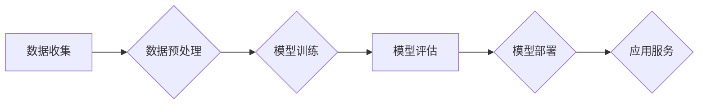

> 大模型、人工智能、自然语言处理、计算机视觉、机器学习、深度学习

## 1. 背景介绍

近年来，人工智能（AI）技术取得了飞速发展，其中大模型作为AI领域的重要组成部分，展现出强大的应用潜力。大模型是指参数规模庞大、训练数据海量的人工智能模型，其强大的学习能力和泛化能力使其能够在自然语言处理、计算机视觉、语音识别等多个领域取得突破性进展。

大模型的兴起，得益于以下几个方面：

* **计算能力的提升:**  近年来，GPU和TPU等高性能计算硬件的不断发展，为大模型的训练提供了强大的计算支撑。
* **数据量的爆炸式增长:**  互联网的普及和数字化转型，使得海量数据资源得以积累，为大模型的训练提供了充足的数据支撑。
* **算法的不断创新:**  深度学习算法的不断发展，特别是Transformer模型的出现，为大模型的训练和应用提供了新的思路和方法。

## 2. 核心概念与联系

大模型的核心概念包括：

* **模型规模:**  指模型参数的数量，通常以亿或十亿计。
* **训练数据:**  指用于训练模型的数据集，通常包含海量文本、图像、音频等数据。
* **训练方法:**  指用于训练模型的算法，例如深度学习算法、强化学习算法等。
* **应用场景:**  指大模型能够应用的领域，例如自然语言处理、计算机视觉、语音识别等。

大模型的训练和应用流程如下：



## 3. 核心算法原理 & 具体操作步骤

### 3.1  算法原理概述

大模型的训练主要基于深度学习算法，其中Transformer模型是目前最主流的架构。Transformer模型的核心思想是利用注意力机制来捕捉文本序列中的长距离依赖关系，从而提高模型的理解和生成能力。

### 3.2  算法步骤详解

大模型的训练步骤可以概括为以下几个阶段：

1. **数据预处理:**  收集和清洗数据，将其转换为模型能够理解的格式。
2. **模型构建:**  根据任务需求选择合适的模型架构，并初始化模型参数。
3. **模型训练:**  使用训练数据训练模型，通过反向传播算法不断调整模型参数，使其能够准确地预测目标输出。
4. **模型评估:**  使用测试数据评估模型的性能，并根据评估结果进行模型调优。
5. **模型部署:**  将训练好的模型部署到生产环境中，用于实际应用。

### 3.3  算法优缺点

**优点:**

* **强大的学习能力:**  大模型能够学习到复杂的模式和关系，从而实现更精准的预测和生成。
* **良好的泛化能力:**  大模型在训练数据之外的未知数据上也能表现出较好的性能。
* **广泛的应用场景:**  大模型能够应用于自然语言处理、计算机视觉、语音识别等多个领域。

**缺点:**

* **训练成本高:**  大模型的训练需要大量的计算资源和时间，成本较高。
* **数据依赖性强:**  大模型的性能取决于训练数据的质量和数量，数据不足或质量低劣会导致模型性能下降。
* **可解释性差:**  大模型的内部工作机制复杂，难以解释其决策过程。

### 3.4  算法应用领域

大模型在以下领域具有广泛的应用前景：

* **自然语言处理:**  机器翻译、文本摘要、问答系统、对话系统等。
* **计算机视觉:**  图像识别、物体检测、图像生成等。
* **语音识别:**  语音转文本、语音合成等。
* **推荐系统:**  商品推荐、内容推荐等。
* **医疗诊断:**  疾病诊断、药物研发等。

## 4. 数学模型和公式 & 详细讲解 & 举例说明

### 4.1  数学模型构建

大模型的训练过程本质上是一个优化问题，目标是找到模型参数，使得模型在训练数据上的损失函数最小。损失函数通常是模型预测值与真实值的差值，常用的损失函数包括均方误差（MSE）、交叉熵损失（Cross-Entropy Loss）等。

### 4.2  公式推导过程

假设模型的输出为 $y$，真实值是 $t$，损失函数为 $L(y,t)$，则模型训练的目标是：

$$
\min_{\theta} \mathcal{L}(\theta) = \frac{1}{N} \sum_{i=1}^{N} L(y_i, t_i)
$$

其中，$\theta$ 是模型参数，$N$ 是训练数据的数量。

通过梯度下降算法，不断更新模型参数，使得损失函数逐渐减小。梯度下降算法的更新公式为：

$$
\theta = \theta - \eta \nabla_{\theta} \mathcal{L}(\theta)
$$

其中，$\eta$ 是学习率，$\nabla_{\theta} \mathcal{L}(\theta)$ 是损失函数对模型参数的梯度。

### 4.3  案例分析与讲解

例如，在机器翻译任务中，模型的输出是目标语言的文本，真实值是源语言的文本。可以使用交叉熵损失函数来衡量模型的预测结果与真实结果之间的差异。

## 5. 项目实践：代码实例和详细解释说明

### 5.1  开发环境搭建

大模型的开发环境通常需要配置高性能的计算硬件，例如GPU或TPU。常用的开发框架包括TensorFlow、PyTorch等。

### 5.2  源代码详细实现

由于篇幅限制，这里只提供一个简单的代码示例，展示了如何使用PyTorch训练一个简单的文本分类模型。

```python
import torch
import torch.nn as nn

class TextClassifier(nn.Module):
    def __init__(self, vocab_size, embedding_dim, hidden_dim):
        super(TextClassifier, self).__init__()
        self.embedding = nn.Embedding(vocab_size, embedding_dim)
        self.lstm = nn.LSTM(embedding_dim, hidden_dim)
        self.fc = nn.Linear(hidden_dim, 2)  # 2个类别

    def forward(self, x):
        x = self.embedding(x)
        x, _ = self.lstm(x)
        x = x[:, -1, :]  # 取最后一个时间步的输出
        x = self.fc(x)
        return x

# ... 训练模型 ...
```

### 5.3  代码解读与分析

这段代码定义了一个简单的文本分类模型，它包含三个主要部分：

* **Embedding层:** 将文本单词映射到低维向量空间。
* **LSTM层:**  捕捉文本序列中的长距离依赖关系。
* **全连接层:**  将LSTM层的输出映射到分类结果。

### 5.4  运行结果展示

训练完成后，可以使用测试数据评估模型的性能，例如计算准确率、召回率等指标。

## 6. 实际应用场景

大模型在各个领域都有着广泛的应用场景：

### 6.1  自然语言处理

* **机器翻译:**  Google Translate、DeepL等翻译工具都使用了大模型来实现高质量的机器翻译。
* **文本摘要:**  自动生成文本的摘要，例如新闻摘要、会议纪要等。
* **问答系统:**  能够理解用户的问题并给出准确的答案，例如智能客服、搜索引擎等。
* **对话系统:**  例如ChatGPT、LaMDA等，能够进行自然流畅的对话。

### 6.2  计算机视觉

* **图像识别:**  识别图像中的物体、场景、人物等，例如自动驾驶、安防监控等。
* **物体检测:**  定位图像中物体的边界框，例如自动驾驶、零售分析等。
* **图像生成:**  生成逼真的图像，例如艺术创作、游戏开发等。

### 6.3  语音识别

* **语音转文本:**  将语音转换为文本，例如语音助手、语音输入等。
* **语音合成:**  将文本转换为语音，例如语音播报、虚拟助手等。

### 6.4  未来应用展望

随着大模型技术的不断发展，其应用场景将会更加广泛，例如：

* **个性化教育:**  根据学生的学习情况提供个性化的学习方案。
* **医疗诊断辅助:**  辅助医生进行疾病诊断，提高诊断准确率。
* **科学研究:**  加速科学研究的进程，例如药物研发、材料科学等。

## 7. 工具和资源推荐

### 7.1  学习资源推荐

* **书籍:**
    * 《深度学习》
    * 《自然语言处理》
    * 《机器学习》
* **在线课程:**
    * Coursera
    * edX
    * Udacity

### 7.2  开发工具推荐

* **TensorFlow:**  开源深度学习框架，支持多种硬件平台。
* **PyTorch:**  开源深度学习框架，以其灵活性和易用性而闻名。
* **HuggingFace:**  提供预训练的大模型和相关的工具。

### 7.3  相关论文推荐

* **Attention Is All You Need:**  Transformer模型的奠基论文。
* **BERT: Pre-training of Deep Bidirectional Transformers for Language Understanding:**  BERT模型的论文。
* **GPT-3: Language Models are Few-Shot Learners:**  GPT-3模型的论文。

## 8. 总结：未来发展趋势与挑战

### 8.1  研究成果总结

大模型技术取得了显著的进展，在自然语言处理、计算机视觉等领域取得了突破性成果。

### 8.2  未来发展趋势

* **模型规模的进一步扩大:**  随着计算能力的提升，大模型的规模将会继续扩大，从而提升模型的性能。
* **多模态大模型的开发:**  将文本、图像、音频等多种模态数据融合到一起，开发更强大的多模态大模型。
* **可解释性研究的加强:**  研究大模型的内部工作机制，提高模型的可解释性。

### 8.3  面临的挑战

* **训练成本高:**  大模型的训练成本很高，需要大量的计算资源和时间。
* **数据安全和隐私问题:**  大模型的训练需要海量数据，如何保证数据安全和隐私是一个重要的挑战。
* **模型偏见和公平性问题:**  大模型可能存在偏见和不公平性，需要进行相应的缓解措施。

### 8.4  研究展望

未来，大模型技术将会继续发展，并在更多领域发挥重要作用。需要加强对大模型的安全性、可靠性和可解释性的研究，确保其安全、可控地应用于社会各个领域。

## 9. 附录：常见问题与解答

### 9.1  常见问题

* **什么是大模型？**
* **大模型有哪些应用场景？**
* **如何训练大模型？**
* **大模型有哪些挑战？**

### 9.2  解答

* **什么是大模型？** 大模型是指参数规模庞大、训练数据海量的人工智能模型。
* **大模型有哪些应用场景？** 大模型应用于自然语言处理、计算机视觉、语音识别等多个领域。
* **如何训练大模型？** 大模型的训练需要大量的计算资源和时间，通常使用深度学习算法进行训练。
* **大模型有哪些挑战？** 大模型面临着训练成本高、数据安全和隐私问题、模型偏见和公平性问题等挑战。


作者：禅与计算机程序设计艺术 / Zen and the Art of Computer Programming 
<end_of_turn>