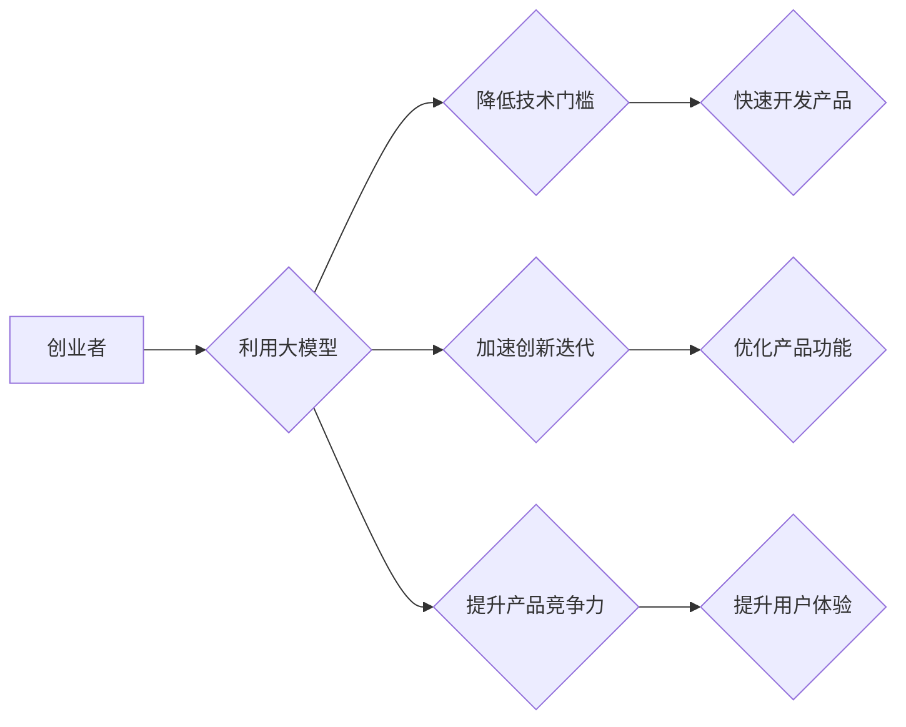

> 大模型、创业、人工智能、技术趋势、商业模式、创新

## 1. 背景介绍

近年来，人工智能（AI）技术突飞猛进，特别是大模型的出现，为各行各业带来了前所未有的机遇。大模型，是指参数规模庞大、训练数据海量的人工智能模型，具备强大的泛化能力和学习能力，能够在自然语言处理、计算机视觉、语音识别等领域取得突破性进展。

传统创业模式往往依赖于技术积累、市场洞察和团队执行力，而大模型的出现，正在重塑创业的规则。大模型的开源和易用性，为创业者提供了强大的工具和资源，降低了技术门槛，加速了创新迭代。

## 2. 核心概念与联系

**2.1 大模型概述**

大模型是指参数规模庞大、训练数据海量的人工智能模型。其核心特点包括：

* **规模化：** 大模型拥有数亿甚至数十亿个参数，远超传统机器学习模型。
* **泛化能力强：** 由于训练数据量大，大模型能够学习到更丰富的知识和模式，在不同任务和领域表现出色。
* **迁移学习能力强：** 大模型可以将已学习到的知识迁移到新的任务和领域，降低了模型训练成本和时间。

**2.2 大模型与创业的联系**

大模型为创业者提供了以下优势：

* **降低技术门槛：** 大模型的开源和易用性，使得创业者无需具备深厚的机器学习知识，即可利用其强大的功能。
* **加速创新迭代：** 大模型可以快速生成创意、优化方案，加速创业项目的开发和迭代。
* **提升产品竞争力：** 大模型可以赋能产品，提升用户体验，增强产品竞争力。

**2.3 大模型应用场景**

大模型在创业领域具有广泛的应用场景，例如：

* **内容创作：** 利用大模型生成高质量的文字、图片、视频等内容，为创业项目提供创意和素材。
* **客户服务：** 利用大模型构建智能客服系统，提高客户服务效率和体验。
* **市场营销：** 利用大模型分析用户数据，精准推送广告，提升营销效果。
* **产品研发：** 利用大模型辅助产品设计、开发和测试，加速产品迭代。

**2.4 Mermaid 流程图**



## 3. 核心算法原理 & 具体操作步骤

**3.1 算法原理概述**

大模型的训练主要基于深度学习算法，其中Transformer模型是目前最主流的架构。Transformer模型的核心思想是利用注意力机制，捕捉文本序列中不同词语之间的关系，从而更好地理解上下文信息。

**3.2 算法步骤详解**

大模型的训练过程可以概括为以下步骤：

1. **数据预处理：** 将原始数据清洗、格式化，并转换为模型可理解的格式。
2. **模型构建：** 根据任务需求，选择合适的Transformer模型架构，并设置模型参数。
3. **模型训练：** 使用训练数据，通过反向传播算法，调整模型参数，使模型输出与真实标签尽可能接近。
4. **模型评估：** 使用测试数据，评估模型的性能，例如准确率、召回率等。
5. **模型部署：** 将训练好的模型部署到生产环境，用于实际应用。

**3.3 算法优缺点**

**优点：**

* 泛化能力强：能够在不同任务和领域表现出色。
* 迁移学习能力强：可以将已学习到的知识迁移到新的任务和领域。
* 性能优越：在许多任务上，大模型的性能优于传统机器学习模型。

**缺点：**

* 计算资源需求高：训练大模型需要大量的计算资源和时间。
* 数据依赖性强：大模型的性能与训练数据质量密切相关。
* 可解释性差：大模型的决策过程难以理解，缺乏可解释性。

**3.4 算法应用领域**

大模型在以下领域具有广泛的应用：

* 自然语言处理：文本分类、情感分析、机器翻译、对话系统等。
* 计算机视觉：图像识别、物体检测、图像生成等。
* 语音识别：语音转文本、语音合成等。
* 其他领域：药物研发、金融预测、科学研究等。

## 4. 数学模型和公式 & 详细讲解 & 举例说明

**4.1 数学模型构建**

大模型的训练过程本质上是一个优化问题，目标是找到模型参数，使得模型输出与真实标签之间的误差最小。常用的损失函数包括交叉熵损失函数、均方误差损失函数等。

**4.2 公式推导过程**

例如，对于文本分类任务，可以使用交叉熵损失函数来衡量模型预测结果与真实标签之间的差异。交叉熵损失函数的公式如下：

$$
L = -\sum_{i=1}^{N} y_i \log(\hat{y}_i)
$$

其中：

* $L$ 表示损失函数值。
* $N$ 表示样本数量。
* $y_i$ 表示真实标签。
* $\hat{y}_i$ 表示模型预测结果。

**4.3 案例分析与讲解**

假设我们有一个文本分类任务，需要将文本分类为正类或负类。模型预测结果为 $\hat{y}_i = 0.8$，真实标签为 $y_i = 1$。则损失函数值为：

$$
L = -1 \log(0.8) \approx 0.22
$$

## 5. 项目实践：代码实例和详细解释说明

**5.1 开发环境搭建**

使用Python语言开发大模型应用，需要安装以下软件包：

* TensorFlow 或 PyTorch：深度学习框架。
* NumPy：数值计算库。
* Pandas：数据处理库。
* Matplotlib：数据可视化库。

**5.2 源代码详细实现**

以下是一个使用TensorFlow训练文本分类模型的简单代码示例：

```python
import tensorflow as tf

# 定义模型
model = tf.keras.models.Sequential([
    tf.keras.layers.Embedding(input_dim=10000, output_dim=128),
    tf.keras.layers.LSTM(units=64),
    tf.keras.layers.Dense(units=1, activation='sigmoid')
])

# 编译模型
model.compile(optimizer='adam', loss='binary_crossentropy', metrics=['accuracy'])

# 训练模型
model.fit(x_train, y_train, epochs=10)

# 评估模型
loss, accuracy = model.evaluate(x_test, y_test)
print('Loss:', loss)
print('Accuracy:', accuracy)
```

**5.3 代码解读与分析**

* 代码首先定义了一个简单的文本分类模型，包含嵌入层、LSTM层和全连接层。
* 然后，使用Adam优化器、二分类交叉熵损失函数和准确率作为评估指标，编译模型。
* 最后，使用训练数据训练模型，并使用测试数据评估模型性能。

**5.4 运行结果展示**

训练完成后，可以查看模型的损失值和准确率，评估模型的性能。

## 6. 实际应用场景

**6.1 内容创作**

大模型可以用于生成高质量的文字、图片、视频等内容，为创业项目提供创意和素材。例如，可以使用大模型生成产品描述、广告文案、新闻报道等。

**6.2 客户服务**

大模型可以构建智能客服系统，提高客户服务效率和体验。例如，可以使用大模型处理常见客户问题，提供快速响应和个性化服务。

**6.3 市场营销**

大模型可以分析用户数据，精准推送广告，提升营销效果。例如，可以使用大模型分析用户的兴趣爱好，推荐相关的产品和服务。

**6.4 未来应用展望**

大模型的应用场景还在不断扩展，未来将应用于更多领域，例如：

* 个性化教育：根据学生的学习情况，提供个性化的学习方案和辅导。
* 医疗诊断：辅助医生进行疾病诊断，提高诊断准确率。
* 科学研究：加速科学研究，发现新的知识和规律。

## 7. 工具和资源推荐

**7.1 学习资源推荐**

* **书籍：**
    * 《深度学习》
    * 《自然语言处理》
    * 《机器学习》
* **在线课程：**
    * Coursera
    * edX
    * Udacity

**7.2 开发工具推荐**

* **深度学习框架：** TensorFlow、PyTorch
* **数据处理库：** NumPy、Pandas
* **数据可视化库：** Matplotlib、Seaborn

**7.3 相关论文推荐**

* 《Attention Is All You Need》
* 《BERT: Pre-training of Deep Bidirectional Transformers for Language Understanding》
* 《GPT-3: Language Models are Few-Shot Learners》

## 8. 总结：未来发展趋势与挑战

**8.1 研究成果总结**

近年来，大模型在人工智能领域取得了突破性进展，为创业者提供了强大的工具和资源。大模型的开源和易用性，降低了技术门槛，加速了创新迭代。

**8.2 未来发展趋势**

未来，大模型的发展趋势包括：

* 模型规模进一步扩大：参数规模将继续增长，模型能力将进一步提升。
* 训练效率提升：新的训练算法和硬件将加速模型训练速度。
* 应用场景拓展：大模型将应用于更多领域，带来更多创新应用。

**8.3 面临的挑战**

大模型的发展也面临一些挑战：

* 计算资源需求高：训练大模型需要大量的计算资源，成本较高。
* 数据依赖性强：大模型的性能与训练数据质量密切相关，数据获取和标注成本高。
* 可解释性差：大模型的决策过程难以理解，缺乏可解释性。

**8.4 研究展望**

未来研究方向包括：

* 开发更有效的训练算法和硬件，降低训练成本。
* 探索新的数据获取和标注方法，提高数据质量。
* 研究大模型的可解释性，提高模型的透明度和信任度。

## 9. 附录：常见问题与解答

**9.1 如何选择合适的模型架构？**

选择合适的模型架构取决于具体的应用场景和数据特点。例如，对于文本分类任务，可以使用LSTM或Transformer模型；对于图像识别任务，可以使用CNN模型。

**9.2 如何评估模型性能？**

常用的模型性能评估指标包括准确率、召回率、F1-score等。

**9.3 如何处理过拟合问题？**

过拟合是指模型在训练数据上表现良好，但在测试数据上表现较差。常用的处理过拟合方法包括：

* 增加训练数据量。
* 使用正则化技术，例如L1正则化和L2正则化。
* 使用Dropout技术，随机丢弃一部分神经元。

**9.4 如何部署大模型？**

大模型的部署方式包括：

* 云端部署：将模型部署到云服务器上，提供API接口供用户调用。
* 边缘部署：将模型部署到边缘设备上，实现本地化处理。


作者：禅与计算机程序设计艺术 / Zen and the Art of Computer Programming 
<end_of_turn>