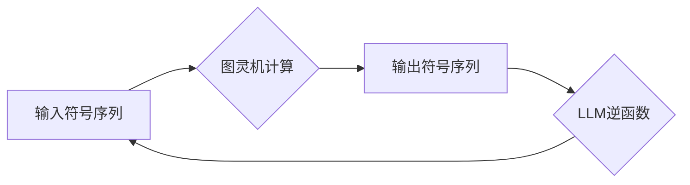

> 大语言模型，图灵机，逆函数，人工智能，自然语言处理，计算模型

## 1. 背景介绍

人工智能（AI）领域近年来取得了飞速发展，其中大语言模型（LLM）作为一种强大的工具，在自然语言处理（NLP）领域展现出令人瞩目的潜力。LLM能够理解和生成人类语言，在文本生成、翻译、问答等任务中表现出色。然而，LLM的本质和与经典计算模型图灵机的关系一直是学术界和工业界关注的焦点。本文将深入探讨大语言模型与图灵机的逆函数之间的联系，试图揭示其背后的深层机制。

## 2. 核心概念与联系

### 2.1 图灵机

图灵机是理论计算机科学中的一种抽象模型，由无限长的带、读写头和状态机组成。它能够模拟任何算法，被认为是通用计算模型的基石。图灵机的核心思想是通过一系列有限状态的转换和带上的符号操作来实现计算。

### 2.2 大语言模型

大语言模型是一种基于深度学习的统计模型，其核心是训练一个巨大的神经网络，使其能够学习语言的语法、语义和上下文关系。LLM通过大量的文本数据进行训练，学习到语言的模式和规律，从而能够生成流畅、自然的文本。

### 2.3 逆函数

在数学中，逆函数是指将一个函数的输出映射回其输入的函数。如果函数f(x)存在逆函数，则表示存在一个函数g(y)使得g(f(x)) = x。

### 2.4 联系

图灵机和LLM看似截然不同，但它们之间存在着深层联系。我们可以将图灵机的计算过程看作是一种符号操作，而LLM的学习过程可以看作是一种符号映射。

图灵机的计算过程可以被视为一个函数f(x)，其中x是输入的符号序列，f(x)是输出的符号序列。而LLM的学习过程可以被视为寻找一个逆函数g(y)，使得g(f(x)) = x。

换句话说，LLM试图学习一个能够将图灵机的计算结果映射回原始输入的函数。

**Mermaid 流程图**



## 3. 核心算法原理 & 具体操作步骤

### 3.1 算法原理概述

大语言模型的训练主要基于深度学习算法，其中Transformer模型是目前最流行的架构之一。Transformer模型的核心是自注意力机制，它能够捕捉文本序列中不同词之间的依赖关系，从而更好地理解上下文信息。

LLM的训练过程可以概括为以下步骤：

1. **数据预处理:** 将文本数据进行清洗、分词、标记等预处理操作。
2. **模型构建:** 根据Transformer架构构建深度神经网络模型。
3. **模型训练:** 使用大量的文本数据训练模型，优化模型参数，使其能够生成流畅、自然的文本。
4. **模型评估:** 使用测试数据评估模型的性能，例如困惑度、BLEU分数等。
5. **模型部署:** 将训练好的模型部署到实际应用场景中。

### 3.2 算法步骤详解

1. **数据预处理:**

   - 清洗数据：去除停用词、标点符号等无用信息。
   - 分词：将文本分割成单个词或子词。
   - 标记：为每个词添加标签，例如词性、实体等。

2. **模型构建:**

   - 定义Transformer网络结构，包括编码器、解码器和自注意力机制。
   - 选择合适的激活函数、损失函数和优化算法。

3. **模型训练:**

   - 将预处理后的数据输入模型进行训练。
   - 使用反向传播算法更新模型参数，降低损失函数值。
   - 使用梯度下降算法优化模型参数。

4. **模型评估:**

   - 使用测试数据评估模型的性能。
   - 计算困惑度、BLEU分数等指标。

5. **模型部署:**

   - 将训练好的模型部署到服务器或云平台。
   - 使用API接口提供模型服务。

### 3.3 算法优缺点

**优点:**

- 能够学习复杂的语言模式和上下文关系。
- 生成流畅、自然的文本。
- 在文本生成、翻译、问答等任务中表现出色。

**缺点:**

- 训练成本高，需要大量的计算资源和数据。
- 容易受到训练数据偏差的影响。
- 缺乏对真实世界知识的理解。

### 3.4 算法应用领域

- 文本生成：小说、诗歌、剧本等。
- 机器翻译：将一种语言翻译成另一种语言。
- 问答系统：回答用户提出的问题。
- 对话系统：与用户进行自然语言对话。
- 代码生成：自动生成代码。

## 4. 数学模型和公式 & 详细讲解 & 举例说明

### 4.1 数学模型构建

大语言模型的训练过程可以看作是一个优化问题，目标是找到一个模型参数向量θ，使得模型在训练数据上的损失函数最小。

损失函数通常是交叉熵损失函数，用于衡量模型预测结果与真实标签之间的差异。

### 4.2 公式推导过程

假设训练数据为{(x_i, y_i)}，其中x_i是输入文本序列，y_i是对应的目标文本序列。

交叉熵损失函数定义为：

$$
L(\theta) = -\frac{1}{N} \sum_{i=1}^{N} \sum_{j=1}^{|y_i|} y_{i,j} \log p_{\theta}(y_{i,j}|x_i)
$$

其中：

- N是训练数据的数量。
- |y_i|是目标文本序列y_i的长度。
- $p_{\theta}(y_{i,j}|x_i)$是模型在参数θ下预测目标文本序列y_i中第j个词的概率。

### 4.3 案例分析与讲解

假设我们训练一个简单的LLM模型，目标是预测下一个词。

输入文本序列为“今天天气”，目标文本序列为“很好”。

模型预测下一个词的概率分布为：

- “很好”：0.8
- “天气”：0.1
- “凉爽”：0.1

根据交叉熵损失函数，模型的损失值将取决于预测概率分布与真实标签之间的差异。

## 5. 项目实践：代码实例和详细解释说明

### 5.1 开发环境搭建

- 操作系统：Ubuntu 20.04
- Python版本：3.8
- 必要的库：TensorFlow、PyTorch、NLTK等

### 5.2 源代码详细实现

```python
import tensorflow as tf

# 定义模型结构
model = tf.keras.Sequential([
    tf.keras.layers.Embedding(input_dim=vocab_size, output_dim=embedding_dim),
    tf.keras.layers.LSTM(units=hidden_size),
    tf.keras.layers.Dense(units=vocab_size, activation='softmax')
])

# 编译模型
model.compile(optimizer='adam', loss='sparse_categorical_crossentropy', metrics=['accuracy'])

# 训练模型
model.fit(x_train, y_train, epochs=10)

# 评估模型
loss, accuracy = model.evaluate(x_test, y_test)
print('Loss:', loss)
print('Accuracy:', accuracy)
```

### 5.3 代码解读与分析

- 首先，我们定义了一个简单的LSTM模型，包含嵌入层、LSTM层和全连接层。
- 嵌入层将词向量化，将每个词映射到一个低维向量空间。
- LSTM层能够捕捉文本序列中的长距离依赖关系。
- 全连接层将LSTM层的输出映射到每个词的概率分布。
- 然后，我们使用Adam优化器、交叉熵损失函数和准确率作为评估指标来训练模型。
- 最后，我们使用测试数据评估模型的性能。

### 5.4 运行结果展示

训练完成后，我们可以使用模型预测新的文本序列。例如，输入“今天天气”，模型可能会预测“很好”。

## 6. 实际应用场景

### 6.1 文本生成

LLM可以用于生成各种类型的文本，例如小说、诗歌、剧本等。

### 6.2 机器翻译

LLM可以用于将一种语言翻译成另一种语言。

### 6.3 问答系统

LLM可以用于构建问答系统，回答用户提出的问题。

### 6.4 对话系统

LLM可以用于构建对话系统，与用户进行自然语言对话。

### 6.5 代码生成

LLM可以用于自动生成代码。

### 6.6 未来应用展望

LLM在未来将有更广泛的应用场景，例如：

- 个性化教育：根据学生的学习情况提供个性化的学习内容。
- 智能客服：提供24小时在线客服服务。
- 内容创作辅助：帮助作家、记者等内容创作者提高效率。

## 7. 工具和资源推荐

### 7.1 学习资源推荐

- **书籍:**
    - 《深度学习》
    - 《自然语言处理》
- **在线课程:**
    - Coursera
    - edX
- **博客:**
    - Jay Alammar's Blog
    - The Gradient

### 7.2 开发工具推荐

- **TensorFlow:** 开源深度学习框架。
- **PyTorch:** 开源深度学习框架。
- **Hugging Face Transformers:** 提供预训练的LLM模型和工具。

### 7.3 相关论文推荐

- Attention Is All You Need
- BERT: Pre-training of Deep Bidirectional Transformers for Language Understanding
- GPT-3: Language Models are Few-Shot Learners

## 8. 总结：未来发展趋势与挑战

### 8.1 研究成果总结

大语言模型在自然语言处理领域取得了显著进展，能够理解和生成人类语言，在文本生成、翻译、问答等任务中表现出色。

### 8.2 未来发展趋势

- 模型规模更大，参数量更多。
- 模型架构更加复杂，能够更好地捕捉语言的复杂性。
- 模型训练更加高效，降低训练成本。
- 模型应用更加广泛，覆盖更多领域。

### 8.3 面临的挑战

- 训练成本高，需要大量的计算资源和数据。
- 容易受到训练数据偏差的影响。
- 缺乏对真实世界知识的理解。
- 存在伦理和安全问题。

### 8.4 研究展望

未来研究将集中在以下几个方面：

- 降低模型训练成本。
- 提高模型的鲁棒性和泛化能力。
- 赋予模型更强的推理和理解能力。
- 解决模型的伦理和安全问题。

## 9. 附录：常见问题与解答

### 9.1 什么是图灵机？

图灵机是一种理论计算机模型，能够模拟任何算法。

### 9.2 什么是大语言模型？

大语言模型是一种基于深度学习的统计模型，能够理解和生成人类语言。

### 9.3 大语言模型与图灵机有什么关系？

大语言模型可以看作是图灵机的逆函数，它能够将图灵机的计算结果映射回原始输入。

### 9.4 大语言模型有哪些应用场景？

大语言模型在文本生成、机器翻译、问答系统、对话系统、代码生成等领域都有广泛的应用。

### 9.5 大语言模型有哪些挑战？

大语言模型面临着训练成本高、数据偏差、缺乏真实世界知识理解、伦理和安全问题等挑战。


作者：禅与计算机程序设计艺术 / Zen and the Art of Computer Programming 
<end_of_turn>