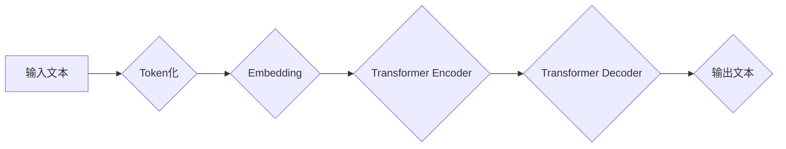

> 大语言模型、Transformer、自然语言处理、深度学习、文本生成

## 1. 背景介绍

近年来，深度学习技术取得了飞速发展，尤其是在自然语言处理（NLP）领域取得了突破性进展。大语言模型（Large Language Model，LLM）作为深度学习在NLP领域的代表性成果，凭借其强大的文本理解和生成能力，在机器翻译、文本摘要、对话系统、代码生成等领域展现出巨大的应用潜力。

传统的NLP模型主要依赖于手工设计的特征工程和规则化方法，难以捕捉语言的复杂性和语义关系。而LLM则通过训练海量文本数据，学习语言的潜在结构和规律，从而实现更准确、更自然的文本处理。

## 2. 核心概念与联系

大语言模型的核心概念包括：

* **Transformer:** Transformer是一种基于注意力机制的深度神经网络架构，是LLM的基础。它能够有效地捕捉文本序列中的长距离依赖关系，显著提升了模型的性能。

* **自回归语言模型:** 自回归语言模型是一种预测下一个词的概率分布的模型。LLM通常采用自回归的方式进行文本生成，通过预测下一个词，逐步生成完整的文本。

* **预训练和微调:** LLM通常采用预训练和微调的策略进行训练。预训练阶段，模型在大量文本数据上进行无监督学习，学习语言的通用知识和表示。微调阶段，模型在特定任务的数据上进行训练，使其能够完成特定的任务。

**Mermaid 流程图:**



## 3. 核心算法原理 & 具体操作步骤

### 3.1  算法原理概述

Transformer模型的核心是注意力机制，它能够学习文本序列中不同词之间的关系，并赋予每个词不同的权重。

注意力机制可以分为三种类型：

* **自注意力 (Self-Attention):** 计算每个词与所有其他词之间的关系。
* **多头注意力 (Multi-Head Attention):** 使用多个自注意力头，学习不同类型的词之间的关系。
* **交叉注意力 (Cross-Attention):** 计算两个序列之间的关系。

Transformer模型由编码器和解码器组成。编码器负责将输入文本转换为隐藏表示，解码器则根据隐藏表示生成输出文本。

### 3.2  算法步骤详解

1. **Token化:** 将输入文本分割成一个个独立的词或子词。
2. **Embedding:** 将每个词转换为一个向量表示。
3. **编码器:** 将嵌入后的词向量输入到编码器中，通过多层Transformer模块进行处理，最终得到隐藏表示。
4. **解码器:** 将隐藏表示输入到解码器中，通过多层Transformer模块进行处理，并使用自回归的方式生成输出文本。

### 3.3  算法优缺点

**优点:**

* 能够有效地捕捉文本序列中的长距离依赖关系。
* 性能优于传统的RNN模型。
* 可并行训练，训练速度更快。

**缺点:**

* 参数量大，训练成本高。
* 对训练数据质量要求高。

### 3.4  算法应用领域

* 机器翻译
* 文本摘要
* 问答系统
* 对话系统
* 代码生成
* 文本分类

## 4. 数学模型和公式 & 详细讲解 & 举例说明

### 4.1  数学模型构建

Transformer模型的数学模型主要基于注意力机制和多层感知机 (MLP)。

**注意力机制:**

注意力机制的目的是学习每个词与所有其他词之间的关系，并赋予每个词不同的权重。

**公式:**

$$
Attention(Q, K, V) = softmax(\frac{QK^T}{\sqrt{d_k}})V
$$

其中：

* $Q$：查询矩阵
* $K$：键矩阵
* $V$：值矩阵
* $d_k$：键向量的维度
* $softmax$：softmax函数

**多层感知机 (MLP):**

MLP是一种多层神经网络，用于对隐藏表示进行非线性变换。

**公式:**

$$
MLP(x) = ReLU(W_1x + b_1)W_2 + b_2
$$

其中：

* $x$：输入向量
* $W_1$、$W_2$：权重矩阵
* $b_1$、$b_2$：偏置向量
* $ReLU$：ReLU激活函数

### 4.2  公式推导过程

注意力机制的公式推导过程可以参考相关文献，例如Vaswani et al. (2017)的论文。

### 4.3  案例分析与讲解

**举例说明:**

假设我们有一个句子 "The cat sat on the mat"，我们使用注意力机制来计算每个词与所有其他词之间的关系。

注意力机制会计算每个词与所有其他词之间的点积，然后使用softmax函数将点积转换为概率分布。概率分布表示每个词对其他词的关注程度。

例如，对于词 "cat"，注意力机制会计算它与所有其他词之间的点积，然后得到一个概率分布，表示 "cat" 对其他词的关注程度。

## 5. 项目实践：代码实例和详细解释说明

### 5.1  开发环境搭建

* Python 3.7+
* PyTorch 1.7+
* CUDA 10.2+

### 5.2  源代码详细实现

```python
import torch
import torch.nn as nn

class Transformer(nn.Module):
    def __init__(self, vocab_size, embedding_dim, num_heads, num_layers):
        super(Transformer, self).__init__()
        self.embedding = nn.Embedding(vocab_size, embedding_dim)
        self.transformer_encoder = nn.TransformerEncoder(nn.TransformerEncoderLayer(embedding_dim, num_heads), num_layers)

    def forward(self, x):
        x = self.embedding(x)
        x = self.transformer_encoder(x)
        return x
```

### 5.3  代码解读与分析

* `__init__` 方法初始化模型参数，包括词嵌入层、Transformer编码器层。
* `forward` 方法定义模型的正向传播过程，将输入词向量输入到词嵌入层，然后输入到Transformer编码器层，最终得到隐藏表示。

### 5.4  运行结果展示

运行代码并训练模型，可以得到模型的训练结果，例如准确率、损失值等。

## 6. 实际应用场景

### 6.1  机器翻译

LLM可以用于机器翻译，将一种语言的文本翻译成另一种语言。

### 6.2  文本摘要

LLM可以用于文本摘要，将长篇文本压缩成短篇摘要。

### 6.3  问答系统

LLM可以用于问答系统，根据给定的问题回答问题。

### 6.4  未来应用展望

LLM在未来将有更广泛的应用场景，例如：

* 代码生成
* 文本创作
* 聊天机器人
* 个性化教育

## 7. 工具和资源推荐

### 7.1  学习资源推荐

* **论文:**

    * Attention Is All You Need (Vaswani et al., 2017)
    * BERT: Pre-training of Deep Bidirectional Transformers for Language Understanding (Devlin et al., 2018)
    * GPT-3: Language Models are Few-Shot Learners (Brown et al., 2020)

* **博客:**

    * The Illustrated Transformer (Jay Alammar)
    * Hugging Face Blog

### 7.2  开发工具推荐

* **PyTorch:** 深度学习框架
* **TensorFlow:** 深度学习框架
* **Hugging Face Transformers:** 预训练模型库

### 7.3  相关论文推荐

* **BERT:** https://arxiv.org/abs/1810.04805
* **GPT-3:** https://arxiv.org/abs/2005.14165
* **T5:** https://arxiv.org/abs/1910.10683

## 8. 总结：未来发展趋势与挑战

### 8.1  研究成果总结

近年来，LLM取得了显著进展，在文本理解和生成方面展现出强大的能力。

### 8.2  未来发展趋势

* **模型规模更大:** 随着计算能力的提升，LLM模型规模将继续扩大，性能将进一步提升。
* **多模态学习:** LLM将与其他模态数据（例如图像、音频）进行融合，实现多模态理解和生成。
* **可解释性增强:** 研究如何提高LLM的解释性，使其决策过程更加透明。

### 8.3  面临的挑战

* **数据获取和标注:** LLM训练需要海量高质量数据，数据获取和标注成本高昂。
* **计算资源:** 训练大型LLM模型需要大量的计算资源，成本高昂。
* **伦理问题:** LLM可能被用于生成虚假信息、进行恶意攻击等，需要关注其伦理问题。

### 8.4  研究展望

未来，LLM研究将继续朝着更强大、更安全、更可解释的方向发展。


## 9. 附录：常见问题与解答

* **什么是LLM？**

LLM是指大规模语言模型，是一种能够理解和生成人类语言的深度学习模型。

* **LLM有哪些应用场景？**

LLM在机器翻译、文本摘要、问答系统、对话系统、代码生成等领域都有广泛的应用。

* **如何训练LLM？**

LLM通常采用预训练和微调的策略进行训练。预训练阶段，模型在大量文本数据上进行无监督学习，学习语言的通用知识和表示。微调阶段，模型在特定任务的数据上进行训练，使其能够完成特定的任务。

* **LLM有哪些挑战？**

LLM面临的数据获取和标注成本高、计算资源需求大、伦理问题等挑战。


作者：禅与计算机程序设计艺术 / Zen and the Art of Computer Programming 
<end_of_turn>