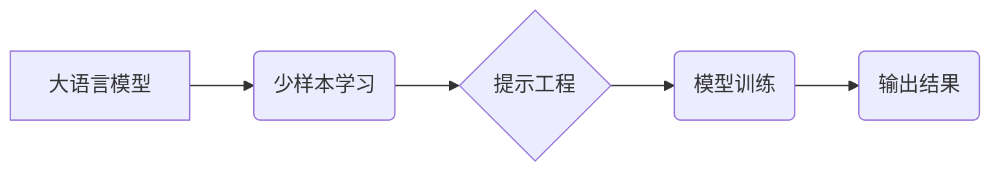

> 大语言模型、少样本学习、提示工程、自然语言处理、Transformer

## 1. 背景介绍

近年来，大语言模型（Large Language Models，LLMs）在自然语言处理（Natural Language Processing，NLP）领域取得了令人瞩目的成就。从文本生成、翻译到问答和代码编写，LLMs展现出强大的能力，深刻地改变了我们与语言交互的方式。然而，传统的LLMs通常需要海量的数据进行训练，这在数据稀缺或成本高昂的情况下显得难以实施。

少样本提示（Few-Shot Prompting）作为一种新型的学习范式，为解决这一问题提供了新的思路。它通过在训练数据中加入少量示例，引导模型学习新的任务，从而降低了数据需求，提高了模型的泛化能力。

## 2. 核心概念与联系

**2.1  大语言模型 (LLMs)**

大语言模型是指参数量巨大、训练数据海量的人工智能模型，能够理解和生成人类语言。它们通常基于Transformer架构，并通过大量的文本数据进行预训练，学习语言的语法、语义和上下文关系。

**2.2  少样本学习 (Few-Shot Learning)**

少样本学习是指在少量样本数据下进行模型训练的学习范式。与传统的监督学习相比，少样本学习能够有效降低数据需求，并提高模型在数据稀缺场景下的泛化能力。

**2.3  提示工程 (Prompt Engineering)**

提示工程是指设计和优化输入提示，以引导模型生成更准确、更符合预期结果的输出。在少样本提示中，精心设计的提示能够提供模型学习新任务所需的上下文信息和示例，从而提高模型的性能。

**2.4  核心概念关系图**



## 3. 核心算法原理 & 具体操作步骤

**3.1  算法原理概述**

少样本提示的核心思想是利用少量示例数据，引导模型学习新的任务。在训练过程中，除了原始训练数据外，还会加入少量与目标任务相关的示例数据，称为提示数据。这些提示数据包含输入文本和对应的输出结果，为模型提供学习新任务的参考。

**3.2  算法步骤详解**

1. **数据准备:** 收集原始训练数据和与目标任务相关的提示数据。
2. **模型预训练:** 使用原始训练数据对大语言模型进行预训练，使其具备基本的语言理解和生成能力。
3. **提示数据设计:** 设计有效的提示数据，包含输入文本和对应的输出结果，并将其与原始训练数据结合。
4. **模型微调:** 使用预训练模型和提示数据进行微调，使模型能够更好地理解和完成目标任务。
5. **模型评估:** 使用测试数据评估模型的性能，并根据评估结果进行模型优化。

**3.3  算法优缺点**

**优点:**

* 降低数据需求: 少样本提示能够有效降低模型训练所需的样本数据量。
* 提高泛化能力: 通过学习少量示例数据，模型能够更好地泛化到新的任务和数据。
* 灵活性和适应性强: 可以通过调整提示数据来适应不同的任务和场景。

**缺点:**

* 提示数据设计难度: 设计有效的提示数据需要一定的经验和技巧。
* 模型性能受限: 模型性能仍然受限于预训练数据和提示数据质量。

**3.4  算法应用领域**

少样本提示在多个领域都有广泛的应用，例如:

* **文本分类:** 根据少量示例数据，训练模型对文本进行分类。
* **问答系统:** 利用少量问答对，训练模型回答用户提出的问题。
* **机器翻译:** 通过少量翻译对，训练模型进行文本翻译。
* **代码生成:** 使用少量代码示例，训练模型生成新的代码。

## 4. 数学模型和公式 & 详细讲解 & 举例说明

**4.1  数学模型构建**

少样本提示的数学模型通常基于Transformer架构，并使用注意力机制来学习文本之间的关系。模型的输入是一个序列化的文本，每个单词都映射到一个向量表示。通过多层Transformer编码器，模型学习文本的语义和上下文信息。

**4.2  公式推导过程**

Transformer模型的核心是注意力机制，其计算公式如下:

$$
Attention(Q, K, V) = softmax(\frac{QK^T}{\sqrt{d_k}})V
$$

其中:

* $Q$：查询矩阵
* $K$：键矩阵
* $V$：值矩阵
* $d_k$：键向量的维度

**4.3  案例分析与讲解**

假设我们想要训练一个模型进行文本分类任务，目标是将文本分类为“正面”或“负面”。我们可以使用少样本提示的方式，在训练数据中加入少量示例数据，例如:

* 输入文本: “这部电影非常精彩！”，输出标签: “正面”
* 输入文本: “这部电影很无聊。”，输出标签: “负面”

通过学习这些示例数据，模型能够更好地理解“正面”和“负面”的含义，并将其应用于新的文本分类任务。

## 5. 项目实践：代码实例和详细解释说明

**5.1  开发环境搭建**

* Python 3.7+
* PyTorch 1.7+
* Transformers 4.10+

**5.2  源代码详细实现**

```python
from transformers import AutoModelForSequenceClassification, AutoTokenizer

# 加载预训练模型和词典
model_name = "bert-base-uncased"
tokenizer = AutoTokenizer.from_pretrained(model_name)
model = AutoModelForSequenceClassification.from_pretrained(model_name, num_labels=2)

# 定义训练数据
train_data = [
    {"text": "这部电影非常精彩！", "label": 1},
    {"text": "这部电影很无聊。", "label": 0},
    # ... 其他训练数据
]

# 定义提示数据
prompt_data = [
    {"text": "这部电影怎么样？", "label": None},
    # ... 其他提示数据
]

# 训练模型
# ... 训练代码

# 预测结果
text = "这部电影太棒了！"
inputs = tokenizer(text, return_tensors="pt")
outputs = model(**inputs)
predicted_label = torch.argmax(outputs.logits).item()

print(f"预测结果: {predicted_label}")
```

**5.3  代码解读与分析**

* 代码首先加载预训练的BERT模型和词典。
* 然后定义训练数据和提示数据。
* 接着使用PyTorch框架训练模型。
* 最后使用训练好的模型预测新的文本的类别。

**5.4  运行结果展示**

运行代码后，模型将输出预测结果，例如：

```
预测结果: 1
```

这表明模型预测文本“这部电影太棒了！”属于“正面”类别。

## 6. 实际应用场景

少样本提示在实际应用场景中具有广泛的应用前景，例如:

* **个性化推荐:** 根据用户的少量反馈数据，训练模型进行个性化推荐。
* **医疗诊断:** 利用少量病历数据，训练模型辅助医生进行诊断。
* **客户服务:** 使用少样本提示训练聊天机器人，提高其对用户问题的理解和回复能力。

**6.4  未来应用展望**

随着大语言模型和少样本学习技术的不断发展，少样本提示将在更多领域得到应用，例如:

* **自动代码生成:** 利用少量代码示例，训练模型自动生成代码。
* **文本摘要:** 根据用户对文本的少量标记，训练模型自动生成文本摘要。
* **机器翻译:** 利用少量翻译对，训练模型进行更精准的机器翻译。

## 7. 工具和资源推荐

**7.1  学习资源推荐**

* **论文:**
    * Few-Shot Prompt Learning for Large Language Models
    * Prompt Engineering for Large Language Models

* **博客:**
    * The Illustrated Transformer
    * OpenAI Blog

**7.2  开发工具推荐**

* **Transformers:** 一个用于处理自然语言处理任务的开源库，提供了预训练模型和工具。
* **Hugging Face:** 一个用于分享和探索预训练模型的平台。

**7.3  相关论文推荐**

* Few-Shot Prompt Learning for Large Language Models
* Prompt Engineering for Large Language Models
* Exploring the Limits of Few-Shot Prompt Learning

## 8. 总结：未来发展趋势与挑战

**8.1  研究成果总结**

少样本提示技术取得了显著的进展，有效降低了模型训练的数据需求，并提高了模型的泛化能力。

**8.2  未来发展趋势**

* **更有效的提示设计:** 研究更有效的提示设计方法，提高模型的学习效率和性能。
* **跨模态少样本学习:** 将少样本提示技术应用于跨模态任务，例如文本-图像、文本-音频等。
* **可解释性增强:** 研究少样本提示模型的可解释性，提高模型的透明度和可信度。

**8.3  面临的挑战**

* **提示数据质量:** 提示数据质量直接影响模型性能，如何获取高质量的提示数据仍然是一个挑战。
* **模型泛化能力:** 模型的泛化能力仍然受限于预训练数据和提示数据质量，需要进一步提高模型的鲁棒性和泛化能力。
* **计算资源:** 训练大型语言模型需要大量的计算资源，这对于资源有限的机构或个人来说是一个挑战。

**8.4  研究展望**

未来，少样本提示技术将继续发展，并应用于更多领域。随着技术的进步，我们期待看到更强大的少样本学习模型，能够更好地理解和生成人类语言，并为我们带来更多便利。

## 9. 附录：常见问题与解答

**9.1  如何设计有效的提示数据？**

* 确保提示数据与目标任务相关。
* 提供足够的上下文信息，帮助模型理解任务要求。
* 使用多样化的示例数据，提高模型的泛化能力。

**9.2  少样本提示技术与迁移学习有什么区别？**

* 少样本提示技术是在少量示例数据下进行模型微调，而迁移学习是在预训练模型上进行领域特定任务的训练。

**9.3  少样本提示技术有哪些局限性？**

* 模型性能仍然受限于预训练数据和提示数据质量。
* 提示数据设计难度较大，需要一定的经验和技巧。


作者：禅与计算机程序设计艺术 / Zen and the Art of Computer Programming 
<end_of_turn>