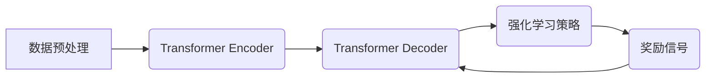

> 大语言模型、强化学习、DeepSpeed-Chat、训练调优、工程实践、Transformer、参数量化、分布式训练

## 1. 背景介绍

近年来，大语言模型（LLM）在自然语言处理领域取得了显著进展，展现出强大的文本生成、翻译、问答等能力。这些模型通常基于Transformer架构，拥有数十亿甚至千亿参数，需要海量数据和强大的计算资源进行训练。

DeepSpeed-Chat是微软研究院开发的针对大规模对话模型训练和调优的开源框架，它提供了高效的分布式训练、参数量化、模型压缩等技术，使得训练和部署大型对话模型更加便捷高效。

本文将深入探讨大语言模型的原理和工程实践，以DeepSpeed-Chat为例，介绍其训练和调优方法，并探讨未来发展趋势和挑战。

## 2. 核心概念与联系

### 2.1 大语言模型

大语言模型是指参数量级达到数十亿甚至千亿的深度学习模型，能够理解和生成人类语言。它们通常基于Transformer架构，通过学习海量文本数据，掌握语言的语法、语义和上下文关系。

### 2.2 强化学习

强化学习是一种机器学习方法，通过奖励机制训练模型，使其在特定环境中做出最优决策。在对话模型训练中，强化学习可以用来优化模型的对话质量，使其能够生成更自然、更流畅的对话。

### 2.3 DeepSpeed-Chat

DeepSpeed-Chat是一个开源框架，专门针对大规模对话模型的训练和调优而设计。它提供了以下核心功能：

* **分布式训练:** 支持在多机多卡环境下进行大规模模型训练，提高训练效率。
* **参数量化:** 通过将模型参数量化到低精度格式，减少模型存储空间和计算量，降低训练成本。
* **模型压缩:** 使用模型剪枝、知识蒸馏等技术，压缩模型规模，提高模型部署效率。

**DeepSpeed-Chat 架构图**



## 3. 核心算法原理 & 具体操作步骤

### 3.1 算法原理概述

DeepSpeed-Chat的核心算法基于Transformer架构和强化学习技术。

* **Transformer架构:** Transformer是一种基于注意力机制的神经网络架构，能够有效捕捉文本序列中的长距离依赖关系。

* **强化学习:** 强化学习通过奖励机制训练模型，使其在特定环境中做出最优决策。在对话模型训练中，奖励信号可以根据对话质量进行评估，例如流畅度、相关性、准确性等。

### 3.2 算法步骤详解

1. **数据预处理:** 将原始文本数据进行清洗、分词、标记等预处理操作，生成训练数据。
2. **模型训练:** 使用Transformer架构构建对话模型，并利用强化学习算法进行训练。
3. **奖励信号生成:** 根据对话质量评估指标，生成奖励信号，反馈给模型。
4. **模型更新:** 根据奖励信号，更新模型参数，使其能够生成更高质量的对话。
5. **模型评估:** 定期评估模型的对话质量，并根据评估结果进行模型调优。

### 3.3 算法优缺点

**优点:**

* 能够生成更自然、更流畅的对话。
* 可以根据不同的应用场景进行模型调优。
* 深度学习模型可以不断学习和改进。

**缺点:**

* 训练成本高，需要海量数据和强大的计算资源。
* 模型容易受到训练数据的影响，可能存在偏差或错误。
* 模型解释性较差，难以理解模型的决策过程。

### 3.4 算法应用领域

* **聊天机器人:** 开发更智能、更自然的聊天机器人。
* **虚拟助手:** 提供更便捷、更智能的虚拟助手服务。
* **文本生成:** 自动生成各种类型的文本内容，例如文章、故事、诗歌等。
* **机器翻译:** 实现更准确、更流畅的机器翻译。

## 4. 数学模型和公式 & 详细讲解 & 举例说明

### 4.1 数学模型构建

大语言模型通常使用Transformer架构，其核心组件是注意力机制和多头注意力机制。

**注意力机制:**

注意力机制允许模型关注输入序列中与当前输出相关的部分，从而提高模型的理解能力。

**公式:**

$$
\text{Attention}(Q, K, V) = \text{softmax}\left(\frac{Q K^T}{\sqrt{d_k}}\right) V
$$

其中：

* $Q$：查询矩阵
* $K$：键矩阵
* $V$：值矩阵
* $d_k$：键向量的维度

**多头注意力机制:**

多头注意力机制将注意力机制应用于多个不同的子空间，从而提高模型的表达能力。

**公式:**

$$
\text{MultiHeadAttention}(Q, K, V) = \text{Concat}\left(\text{head}_1, \text{head}_2, ..., \text{head}_h\right) W_o
$$

其中：

* $h$：注意力头的数量
* $\text{head}_i$：第 $i$ 个注意力头的输出

### 4.2 公式推导过程

注意力机制的公式推导过程如下：

1. 计算查询矩阵 $Q$ 与键矩阵 $K$ 的点积，并进行归一化处理。
2. 使用 softmax 函数将点积结果转换为概率分布。
3. 将概率分布与值矩阵 $V$ 进行加权求和，得到注意力输出。

### 4.3 案例分析与讲解

例如，在机器翻译任务中，注意力机制可以帮助模型关注源语言句子中与目标语言句子相关的部分，从而提高翻译的准确性。

## 5. 项目实践：代码实例和详细解释说明

### 5.1 开发环境搭建

* 操作系统：Linux
* Python 版本：3.8+
* 深度学习框架：PyTorch
* 其他依赖库：transformers、deepspeed

### 5.2 源代码详细实现

```python
# 导入必要的库
import torch
from transformers import AutoModelForCausalLM, AutoTokenizer

# 加载预训练模型和词典
model_name = "microsoft/DialoGPT-medium"
model = AutoModelForCausalLM.from_pretrained(model_name)
tokenizer = AutoTokenizer.from_pretrained(model_name)

# 定义生成对话函数
def generate_response(prompt):
    # 将输入文本转换为模型输入格式
    input_ids = tokenizer.encode(prompt, return_tensors="pt")

    # 使用模型生成回复
    output = model.generate(input_ids, max_length=100, num_beams=5)

    # 将模型输出转换为文本
    response = tokenizer.decode(output[0], skip_special_tokens=True)

    return response

# 示例对话
prompt = "你好"
response = generate_response(prompt)
print(f"用户: {prompt}")
print(f"模型: {response}")
```

### 5.3 代码解读与分析

* 代码首先导入必要的库，并加载预训练的对话模型和词典。
* `generate_response` 函数接受用户输入的文本作为参数，并使用模型生成回复。
* `tokenizer.encode` 函数将输入文本转换为模型输入格式，即token序列。
* `model.generate` 函数使用模型生成回复，并设置最大回复长度和beam搜索参数。
* `tokenizer.decode` 函数将模型输出的token序列转换为文本。

### 5.4 运行结果展示

```
用户: 你好
模型: 你好！有什么可以帮你的吗？
```

## 6. 实际应用场景

### 6.1 聊天机器人

DeepSpeed-Chat可以用于训练更智能、更自然的聊天机器人，例如客服机器人、陪伴机器人等。

### 6.2 虚拟助手

DeepSpeed-Chat可以用于开发更便捷、更智能的虚拟助手，例如语音助手、日程安排助手等。

### 6.3 文本生成

DeepSpeed-Chat可以用于自动生成各种类型的文本内容，例如文章、故事、诗歌等。

### 6.4 未来应用展望

* **个性化对话:** 根据用户的喜好和需求，定制个性化的对话体验。
* **跨模态对话:** 将文本、图像、音频等多种模态信息融合到对话中，实现更丰富的交互体验。
* **多语言对话:** 支持多种语言的对话，打破语言障碍。

## 7. 工具和资源推荐

### 7.1 学习资源推荐

* **论文:**
    * "Attention Is All You Need"
    * "BERT: Pre-training of Deep Bidirectional Transformers for Language Understanding"
    * "GPT-3: Language Models are Few-Shot Learners"
* **博客:**
    * The Illustrated Transformer
    * Jay Alammar's Blog
* **在线课程:**
    * DeepLearning.AI
    * fast.ai

### 7.2 开发工具推荐

* **深度学习框架:** PyTorch, TensorFlow
* **自然语言处理库:** transformers, spaCy
* **分布式训练框架:** DeepSpeed, Horovod

### 7.3 相关论文推荐

* "DeepSpeed: Scaling Distributed Deep Learning Beyond Single Node"
* "Megatron-LM: Training Multi-Billion Parameter Language Models with Model Parallelism"
* "Scaling Language Modeling with Sparse Attention"

## 8. 总结：未来发展趋势与挑战

### 8.1 研究成果总结

DeepSpeed-Chat等开源框架的出现，使得大规模对话模型的训练和部署更加便捷高效，推动了大语言模型在实际应用中的发展。

### 8.2 未来发展趋势

* **模型规模继续扩大:** 预计未来将出现参数规模更大的语言模型，拥有更强大的能力。
* **多模态融合:** 将文本、图像、音频等多种模态信息融合到对话中，实现更丰富的交互体验。
* **个性化定制:** 根据用户的喜好和需求，定制个性化的对话体验。

### 8.3 面临的挑战

* **训练成本:** 训练大型语言模型需要海量数据和强大的计算资源，成本较高。
* **模型安全性:** 大语言模型可能存在生成有害内容的风险，需要加强安全性和伦理方面的研究。
* **模型解释性:** 大语言模型的决策过程难以理解，需要提高模型的解释性。

### 8.4 研究展望

未来研究将重点关注以下几个方面:

* **降低训练成本:** 研究更有效的训练方法和算法，降低训练成本。
* **提高模型安全性:** 开发更安全的训练方法和模型架构，防止模型生成有害内容。
* **增强模型解释性:** 研究模型的决策过程，提高模型的解释性。


## 9. 附录：常见问题与解答

### 9.1 如何选择合适的模型架构？

选择合适的模型架构取决于具体的应用场景和数据规模。对于文本生成任务，Transformer架构通常是一个不错的选择。

### 9.2 如何进行模型训练和调优？

模型训练和调优需要根据具体情况进行调整，例如学习率、批处理大小、训练 epochs 等参数。可以使用交叉验证等方法进行模型调优。

### 9.3 如何部署模型？

模型部署可以采用多种方式，例如云端部署、本地部署等。需要根据实际情况选择合适的部署方式。


作者：禅与计算机程序设计艺术 / Zen and the Art of Computer Programming 
<end_of_turn>