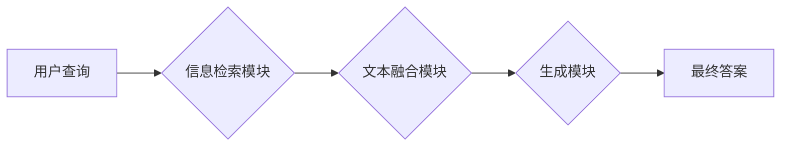

> 大语言模型，RAG框架，微调，知识问答，信息检索，自然语言处理，人工智能

## 1. 背景介绍

近年来，大语言模型（LLM）在自然语言处理（NLP）领域取得了显著进展，展现出强大的文本生成、翻译、摘要等能力。然而，LLM通常缺乏对外部知识的访问和理解，这限制了其在知识问答、信息检索等任务中的应用。为了解决这一问题，研究者们提出了 Retrieval-Augmented Generation（RAG）框架，将LLM与外部知识库相结合，提升模型的知识推理和问答能力。

RAG框架的核心思想是将用户查询与知识库中的相关信息进行匹配，并将匹配到的信息作为上下文，辅助LLM生成更准确、更有针对性的答案。这种框架能够有效地弥补LLM自身知识储备的不足，并提升其在知识密集型任务中的表现。

## 2. 核心概念与联系

### 2.1 RAG框架架构

RAG框架通常由以下几个主要模块组成：

* **信息检索模块:** 负责根据用户查询从知识库中检索相关信息。
* **文本融合模块:** 将检索到的信息与用户查询进行融合，生成上下文信息。
* **生成模块:** 基于上下文信息，利用LLM生成最终的答案。

**Mermaid 流程图:**



### 2.2 RAG框架优势

* **知识增强:** RAG框架能够将外部知识库与LLM相结合，提升模型的知识储备和推理能力。
* **准确性提升:** 通过检索相关信息，RAG框架能够帮助LLM生成更准确、更有针对性的答案。
* **可扩展性强:** RAG框架可以轻松地接入不同的知识库和LLM模型，实现灵活的应用。

## 3. 核心算法原理 & 具体操作步骤

### 3.1 算法原理概述

RAG框架的核心算法是信息检索和文本融合。信息检索模块通常采用基于关键词匹配、TF-IDF或BERT等方法检索相关信息。文本融合模块则利用注意力机制或其他文本表示方法将检索到的信息与用户查询进行融合，生成上下文信息。

### 3.2 算法步骤详解

1. **用户查询输入:** 用户输入一个自然语言查询。
2. **信息检索:** 根据用户查询，从知识库中检索相关信息。
3. **文本融合:** 将检索到的信息与用户查询进行融合，生成上下文信息。
4. **LLM生成:** 基于上下文信息，利用LLM生成最终的答案。
5. **答案输出:** 将生成的答案输出给用户。

### 3.3 算法优缺点

**优点:**

* 能够有效地提升LLM的知识推理和问答能力。
* 能够处理更复杂、更具挑战性的查询。
* 可扩展性强，可以接入不同的知识库和LLM模型。

**缺点:**

* 信息检索模块的性能会直接影响RAG框架的整体性能。
* 文本融合模块需要精心设计，才能有效地融合检索到的信息和用户查询。
* RAG框架的训练和部署成本相对较高。

### 3.4 算法应用领域

RAG框架在以下领域具有广泛的应用前景：

* **知识问答系统:** RAG框架可以构建更智能、更准确的知识问答系统，例如搜索引擎、聊天机器人等。
* **信息检索系统:** RAG框架可以提升信息检索系统的准确性和效率，例如学术文献检索、法律法规检索等。
* **文本摘要和翻译:** RAG框架可以利用外部知识库辅助LLM进行文本摘要和翻译，提升其质量和准确性。

## 4. 数学模型和公式 & 详细讲解 & 举例说明

### 4.1 数学模型构建

RAG框架的数学模型主要包括信息检索模型和文本融合模型。

**信息检索模型:** 通常采用基于关键词匹配、TF-IDF或BERT等方法，将用户查询与知识库中的文档进行匹配。

**文本融合模型:** 通常采用注意力机制或其他文本表示方法，将检索到的信息与用户查询进行融合，生成上下文信息。

### 4.2 公式推导过程

**信息检索模型:**

* **TF-IDF:**

$$
TF-IDF(t, d) = TF(t, d) \times IDF(t)
$$

其中，$TF(t, d)$表示词语$t$在文档$d$中的词频，$IDF(t)$表示词语$t$在整个语料库中的逆向文档频率。

**文本融合模型:**

* **注意力机制:**

$$
Attention(Q, K, V) = softmax(\frac{QK^T}{\sqrt{d_k}})V
$$

其中，$Q$、$K$、$V$分别表示查询向量、键向量和值向量，$d_k$表示键向量的维度。

### 4.3 案例分析与讲解

**案例:**

假设用户查询“中国古代四大发明”，知识库中包含关于四大发明的信息。

**信息检索:**

* TF-IDF模型可以将用户查询与知识库中的相关文档进行匹配，例如“中国古代四大发明”相关的文档。

**文本融合:**

* 注意力机制可以将检索到的文档信息与用户查询进行融合，生成上下文信息，例如“中国古代四大发明包括指南针、火药、印刷术和造纸术”。

**LLM生成:**

* 基于上下文信息，LLM可以生成更准确、更有针对性的答案，例如“中国古代四大发明对世界文明发展做出了巨大贡献”。

## 5. 项目实践：代码实例和详细解释说明

### 5.1 开发环境搭建

* Python 3.7+
* PyTorch 1.7+
* Transformers 4.10+
* Faiss 1.7+

### 5.2 源代码详细实现

```python
# 信息检索模块
from transformers import AutoTokenizer, AutoModelForSeq2SeqLM
tokenizer = AutoTokenizer.from_pretrained("bert-base-uncased")
model = AutoModelForSeq2SeqLM.from_pretrained("t5-base")

def retrieve_documents(query):
    # 使用Faiss进行相似度检索
    # ...
    return retrieved_documents

# 文本融合模块
def fuse_text(query, documents):
    # 使用注意力机制融合文本
    # ...
    return fused_text

# 生成模块
def generate_answer(fused_text):
    # 使用LLM生成答案
    # ...
    return answer

# RAG框架
def rag_query(query):
    documents = retrieve_documents(query)
    fused_text = fuse_text(query, documents)
    answer = generate_answer(fused_text)
    return answer

# 示例
query = "中国古代四大发明"
answer = rag_query(query)
print(answer)
```

### 5.3 代码解读与分析

* 信息检索模块使用Faiss库进行相似度检索，将用户查询与知识库中的文档进行匹配。
* 文本融合模块使用注意力机制将检索到的文档信息与用户查询进行融合，生成上下文信息。
* 生成模块使用LLM模型生成最终的答案。

### 5.4 运行结果展示

运行上述代码，可以得到关于“中国古代四大发明”的答案。

## 6. 实际应用场景

### 6.1 知识问答系统

RAG框架可以构建更智能、更准确的知识问答系统，例如搜索引擎、聊天机器人等。

### 6.2 信息检索系统

RAG框架可以提升信息检索系统的准确性和效率，例如学术文献检索、法律法规检索等。

### 6.3 文本摘要和翻译

RAG框架可以利用外部知识库辅助LLM进行文本摘要和翻译，提升其质量和准确性。

### 6.4 未来应用展望

RAG框架在未来将有更广泛的应用前景，例如：

* **个性化教育:** RAG框架可以根据学生的学习情况，提供个性化的学习内容和答疑服务。
* **医疗诊断:** RAG框架可以辅助医生进行疾病诊断，提高诊断准确率。
* **法律服务:** RAG框架可以帮助律师进行法律研究和案件分析，提高工作效率。

## 7. 工具和资源推荐

### 7.1 学习资源推荐

* **论文:**

* "Retrieval-Augmented Generation for Knowledge Question Answering"
* "RAG: Retrieval Augmented Generation for Text Summarization"

* **博客:**

* https://huggingface.co/blog/rag
* https://www.tensorflow.org/tutorials/text/text_classification

### 7.2 开发工具推荐

* **Faiss:** https://github.com/facebookresearch/faiss
* **Transformers:** https://huggingface.co/docs/transformers/index
* **PyTorch:** https://pytorch.org/

### 7.3 相关论文推荐

* "BERT: Pre-training of Deep Bidirectional Transformers for Language Understanding"
* "T5: Text-to-Text Transfer Transformer"
* "XLNet: Generalized Autoregressive Pretraining for Language Understanding"

## 8. 总结：未来发展趋势与挑战

### 8.1 研究成果总结

RAG框架在知识问答、信息检索等领域取得了显著进展，有效地提升了LLM的知识推理和问答能力。

### 8.2 未来发展趋势

* **多模态RAG:** 将图像、音频等多模态信息融入RAG框架，构建更全面的知识理解模型。
* **联邦学习RAG:** 利用联邦学习技术，在保护用户隐私的前提下进行RAG模型训练。
* **动态知识更新:** 实现RAG框架的动态知识更新机制，保证模型知识的时效性。

### 8.3 面临的挑战

* **知识库质量:** RAG框架的性能依赖于知识库的质量，如何构建高质量的知识库仍然是一个挑战。
* **计算资源:** RAG框架的训练和部署需要大量的计算资源，如何降低计算成本是一个关键问题。
* **伦理问题:** RAG框架可能存在偏见和误导性问题，如何确保其伦理安全是一个需要关注的问题。

### 8.4 研究展望

未来，我们将继续致力于RAG框架的研究，探索其在更多领域的应用，并解决其面临的挑战，推动人工智能技术的发展。

## 9. 附录：常见问题与解答

**常见问题:**

* RAG框架与其他问答系统相比有什么优势？
* RAG框架的训练和部署成本如何？
* RAG框架如何应对知识库的更新？

**解答:**

* RAG框架能够有效地利用外部知识库，提升模型的知识推理和问答能力，相比于只依赖LLM的传统问答系统，RAG框架能够提供更准确、更全面的答案。
* RAG框架的训练和部署成本相对较高，需要大量的计算资源和专业知识。
* RAG框架可以通过定期更新知识库，或者采用动态知识更新机制，来应对知识库的更新。


作者：禅与计算机程序设计艺术 / Zen and the Art of Computer Programming 
<end_of_turn>