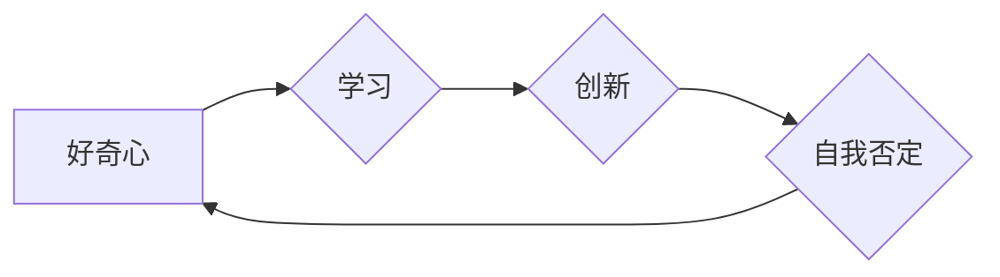

>  好奇心、探索、自我否定、人工智能、学习、创新、技术发展

## 1. 背景介绍

在瞬息万变的科技时代，创新和进步是永恒的主题。而推动这一切的，正是人类那源源不断的“好奇心”。好奇心，是一种对未知事物的强烈渴望，它驱使我们不断探索、学习和突破自我。对于人工智能领域而言，好奇心更是至关重要的驱动力。

从最初的符号逻辑到如今的深度学习，人工智能的发展历程就是一次又一次对未知的探索和挑战。每一次突破，都源于对现有知识的质疑和对更深层次问题的探索。正是这种对未知的渴望，让人工智能不断向前发展，并最终走向了今天的高度。

## 2. 核心概念与联系

### 2.1  好奇心与学习

好奇心是学习的源泉。当我们对某件事物感到好奇时，就会产生学习的动机。我们渴望了解它的本质、原理和运作方式。这种渴望会让我们主动寻求信息、进行思考和实验，最终达到理解和掌握的目的。

### 2.2  好奇心与创新

好奇心是创新的基石。创新需要打破既有思维模式，探索新的可能性。而好奇心正是这种打破和探索的动力。它让我们敢于质疑现状，勇于尝试新的想法，最终实现突破和创新。

### 2.3  好奇心与自我否定

自我否定，是指我们不断反思和改进自己的过程。好奇心促使我们不断学习和探索，同时也让我们意识到自身的局限性。这种认识会让我们更加谦虚，更加愿意接受新的知识和观点，从而不断完善自己。

**Mermaid 流程图**



## 3. 核心算法原理 & 具体操作步骤

### 3.1  算法原理概述

**深度学习**是一种基于人工神经网络的机器学习算法，它能够从海量数据中学习复杂的模式和关系。深度学习算法的核心原理是**多层神经网络**，通过多个隐藏层对数据进行逐层处理，最终提取出高层次的特征和知识。

### 3.2  算法步骤详解

1. **数据预处理:** 将原始数据进行清洗、转换和格式化，使其适合深度学习算法的训练。
2. **网络结构设计:** 根据具体任务需求，设计深度神经网络的结构，包括层数、节点数量、激活函数等参数。
3. **参数初始化:** 为神经网络中的权重和偏置参数进行随机初始化。
4. **前向传播:** 将输入数据通过神经网络层层传递，最终得到输出结果。
5. **损失函数计算:** 计算模型输出结果与真实标签之间的误差，即损失函数值。
6. **反向传播:** 根据损失函数值，利用梯度下降算法反向传播误差，更新神经网络的参数。
7. **迭代训练:** 重复前向传播、损失函数计算和反向传播的过程，直到模型达到预设的精度。

### 3.3  算法优缺点

**优点:**

* 能够学习复杂的数据模式和关系。
* 具有强大的泛化能力，能够应用于多种不同的任务。
* 随着数据量的增加，模型性能不断提升。

**缺点:**

* 训练数据量要求高，需要大量的标注数据。
* 训练时间长，计算资源消耗大。
* 模型解释性差，难以理解模型的决策过程。

### 3.4  算法应用领域

深度学习算法已广泛应用于各个领域，例如：

* **图像识别:** 人脸识别、物体检测、图像分类等。
* **自然语言处理:** 机器翻译、文本摘要、情感分析等。
* **语音识别:** 语音转文本、语音助手等。
* **推荐系统:** 商品推荐、内容推荐等。
* **医疗诊断:** 疾病诊断、影像分析等。

## 4. 数学模型和公式 & 详细讲解 & 举例说明

### 4.1  数学模型构建

深度学习模型的核心是**多层感知机 (MLP)**，它由多个全连接层组成。每个层包含多个神经元，每个神经元接收来自上一层的输入信号，并通过**激活函数**进行处理，最终输出到下一层。

**激活函数**的作用是引入非线性，使神经网络能够学习复杂的模式。常用的激活函数包括**ReLU (Rectified Linear Unit)**、**Sigmoid** 和 **Tanh**。

### 4.2  公式推导过程

**前向传播公式:**

$$
y = f(W^L x^L + b^L)
$$

其中:

* $y$ 是输出结果
* $f$ 是激活函数
* $W^L$ 是第 L 层的权重矩阵
* $x^L$ 是第 L 层的输入向量
* $b^L$ 是第 L 层的偏置向量

**反向传播公式:**

$$
\frac{\partial Loss}{\partial W^L} = \frac{\partial Loss}{\partial y} \cdot \frac{\partial y}{\partial W^L}
$$

其中:

* $Loss$ 是损失函数值
* $\frac{\partial Loss}{\partial y}$ 是损失函数对输出结果的梯度
* $\frac{\partial y}{\partial W^L}$ 是输出结果对权重矩阵的梯度

### 4.3  案例分析与讲解

**举例说明:**

假设我们有一个简单的深度学习模型，用于识别手写数字。模型包含两层神经元，第一层有 10 个神经元，第二层有 10 个神经元。输入数据是一个 28x28 的图像，经过第一层神经元处理后，得到一个 10 维的向量，再经过第二层神经元处理后，得到一个 10 维的输出向量，其中每个元素代表识别数字 0 到 9 的概率。

通过训练数据，模型会学习到权重矩阵和偏置向量，使得输出向量能够准确地反映图像中数字的类别。

## 5. 项目实践：代码实例和详细解释说明

### 5.1  开发环境搭建

* **操作系统:** Ubuntu 20.04
* **编程语言:** Python 3.8
* **深度学习框架:** TensorFlow 2.0
* **其他工具:** Jupyter Notebook

### 5.2  源代码详细实现

```python
import tensorflow as tf

# 定义模型结构
model = tf.keras.models.Sequential([
    tf.keras.layers.Flatten(input_shape=(28, 28)),
    tf.keras.layers.Dense(128, activation='relu'),
    tf.keras.layers.Dense(10, activation='softmax')
])

# 编译模型
model.compile(optimizer='adam',
              loss='sparse_categorical_crossentropy',
              metrics=['accuracy'])

# 加载训练数据
(x_train, y_train), (x_test, y_test) = tf.keras.datasets.mnist.load_data()

# 训练模型
model.fit(x_train, y_train, epochs=5)

# 评估模型
loss, accuracy = model.evaluate(x_test, y_test)
print('Test loss:', loss)
print('Test accuracy:', accuracy)
```

### 5.3  代码解读与分析

* **模型结构:** 模型包含两层全连接层，第一层有 128 个神经元，第二层有 10 个神经元，对应于识别 0 到 9 的数字类别。
* **激活函数:** 使用 ReLU 激活函数，可以引入非线性，提高模型的表达能力。
* **损失函数:** 使用 sparse_categorical_crossentropy 损失函数，适用于多分类问题。
* **优化器:** 使用 Adam 优化器，可以快速收敛到局部最优解。
* **训练数据:** 使用 MNIST 手写数字数据集进行训练。

### 5.4  运行结果展示

训练完成后，模型能够准确识别手写数字。

## 6. 实际应用场景

深度学习算法已广泛应用于各个领域，例如：

* **图像识别:** 人脸识别、物体检测、图像分类等。
* **自然语言处理:** 机器翻译、文本摘要、情感分析等。
* **语音识别:** 语音转文本、语音助手等。
* **推荐系统:** 商品推荐、内容推荐等。
* **医疗诊断:** 疾病诊断、影像分析等。

## 7. 工具和资源推荐

### 7.1  学习资源推荐

* **书籍:**
    * 深度学习 (Deep Learning) - Ian Goodfellow, Yoshua Bengio, Aaron Courville
    * 构建深度学习模型 (Hands-On Machine Learning with Scikit-Learn, Keras & TensorFlow) - Aurélien Géron
* **在线课程:**
    * 深度学习 Specialization - Andrew Ng (Coursera)
    * fast.ai - Practical Deep Learning for Coders
* **博客和网站:**
    * TensorFlow Blog
    * PyTorch Blog
    * Towards Data Science

### 7.2  开发工具推荐

* **深度学习框架:** TensorFlow, PyTorch, Keras
* **编程语言:** Python
* **数据处理工具:** Pandas, NumPy
* **可视化工具:** Matplotlib, Seaborn

### 7.3  相关论文推荐

* **AlexNet:** ImageNet Classification with Deep Convolutional Neural Networks
* **VGGNet:** Very Deep Convolutional Networks for Large-Scale Image Recognition
* **ResNet:** Deep Residual Learning for Image Recognition
* **BERT:** Pre-training of Deep Bidirectional Transformers for Language Understanding

## 8. 总结：未来发展趋势与挑战

### 8.1  研究成果总结

深度学习算法取得了令人瞩目的成就，在图像识别、自然语言处理、语音识别等领域取得了突破性的进展。

### 8.2  未来发展趋势

* **模型规模和复杂度:** 模型规模和复杂度将继续增加，以提高模型的性能和泛化能力。
* **数据效率:** 研究更有效的训练方法，降低模型对训练数据的依赖。
* **可解释性:** 提高模型的解释性，使人类能够更好地理解模型的决策过程。
* **边缘计算:** 将深度学习模型部署到边缘设备，实现实时推理和低延迟应用。

### 8.3  面临的挑战

* **数据获取和标注:** 训练深度学习模型需要大量的标注数据，数据获取和标注成本高昂。
* **计算资源:** 训练大型深度学习模型需要大量的计算资源，成本高昂。
* **模型安全性:** 深度学习模型容易受到攻击，需要研究更安全的模型架构和训练方法。

### 8.4  研究展望

未来，深度学习领域将继续朝着更强大、更智能、更安全的方向发展。

## 9. 附录：常见问题与解答

**常见问题:**

* **深度学习算法的原理是什么？**
* **如何选择合适的深度学习模型？**
* **如何训练和评估深度学习模型？**
* **深度学习算法有哪些应用场景？**

**解答:**

* 深度学习算法的原理是通过多层神经网络学习数据中的复杂模式和关系。
* 选择合适的深度学习模型需要根据具体任务需求和数据特点进行选择。
* 训练和评估深度学习模型需要使用训练数据和测试数据，并使用损失函数和评价指标进行评估。
* 深度学习算法已广泛应用于图像识别、自然语言处理、语音识别、推荐系统等领域。


作者：禅与计算机程序设计艺术 / Zen and the Art of Computer Programming 
<end_of_turn>