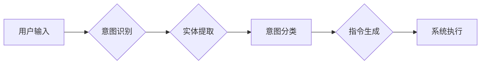

> 意图理解，CUI，自然语言处理，机器学习，对话系统，用户体验

## 1. 背景介绍

随着人工智能技术的飞速发展，自然语言处理（NLP）领域取得了显著的突破。其中，意图理解作为NLP的核心技术之一，在人机交互领域发挥着越来越重要的作用。传统的命令行界面（CLI）和图形用户界面（GUI）存在着操作复杂、学习成本高、用户体验差等问题。而基于自然语言的命令行界面（CUI）则以其更直观、更人性化的交互方式，为用户提供了一种全新的交互体验。

CUI的核心是理解用户的意图，并将其转化为计算机可执行的指令。意图理解技术能够帮助CUI系统更准确地识别用户的需求，从而提供更精准、更有效的服务。例如，用户可以通过自然语言描述想要执行的操作，例如“打开浏览器”，“搜索天气预报”，“发送邮件”等，CUI系统能够理解用户的意图，并自动执行相应的操作。

## 2. 核心概念与联系

意图理解是指机器能够理解用户表达的意图，并将其转化为机器可理解的指令的过程。在CUI系统中，意图理解是连接用户自然语言输入和系统执行操作的关键环节。

**意图理解流程图：**



**核心概念：**

* **意图：** 用户表达的意图，即用户想要系统完成的操作或任务。
* **实体：** 意图中包含的具体信息，例如时间、地点、人物等。
* **槽位：** 意图中需要填充的特定信息，例如时间槽位、地点槽位等。

**联系：**

意图理解是CUI系统中一个重要的环节，它连接了用户自然语言输入和系统执行操作。通过意图理解，CUI系统能够准确识别用户的需求，并提供更精准、更有效的服务。

## 3. 核心算法原理 & 具体操作步骤

### 3.1  算法原理概述

意图理解算法通常基于机器学习技术，通过训练模型来识别用户的意图。常见的意图理解算法包括：

* **规则匹配：** 基于预定义的规则，匹配用户输入与规则的匹配度，从而识别意图。
* **机器学习：** 使用机器学习算法，例如支持向量机（SVM）、决策树、神经网络等，训练模型，识别用户的意图。

### 3.2  算法步骤详解

**机器学习算法步骤：**

1. **数据收集和预处理：** 收集大量的用户对话数据，并进行预处理，例如文本清洗、分词、词性标注等。
2. **特征提取：** 从预处理后的文本数据中提取特征，例如词频、词向量、语法结构等。
3. **模型训练：** 使用机器学习算法，训练模型，将特征与意图进行映射。
4. **模型评估：** 使用测试数据评估模型的性能，例如准确率、召回率、F1-score等。
5. **模型部署：** 将训练好的模型部署到CUI系统中，用于识别用户的意图。

### 3.3  算法优缺点

**规则匹配算法：**

* **优点：** 简单易实现，效率高。
* **缺点：** 难以处理复杂的用户输入，缺乏灵活性。

**机器学习算法：**

* **优点：** 能够处理复杂的用户输入，具有较高的准确率。
* **缺点：** 需要大量的训练数据，训练时间长，模型解释性差。

### 3.4  算法应用领域

意图理解算法广泛应用于各种领域，例如：

* **智能客服：** 帮助客服系统理解用户的咨询需求，并提供更精准的回复。
* **语音助手：** 帮助语音助手理解用户的语音指令，并执行相应的操作。
* **搜索引擎：** 帮助搜索引擎理解用户的搜索意图，并提供更相关的搜索结果。

## 4. 数学模型和公式 & 详细讲解 & 举例说明

### 4.1  数学模型构建

意图理解可以看作是一个分类问题，目标是将用户输入映射到相应的意图类别。可以使用概率模型来表示意图分类的概率分布。例如，可以使用贝叶斯网络来建模用户输入与意图之间的关系。

### 4.2  公式推导过程

假设有N个意图类别，用户输入为文本序列x，每个意图类别i对应的概率为P(i|x)。根据贝叶斯公式，我们可以得到：

$$P(i|x) = \frac{P(x|i)P(i)}{P(x)}$$

其中：

* P(i|x) 是用户输入x属于意图类别i的概率。
* P(x|i) 是给定意图类别i，用户输入x出现的概率。
* P(i) 是意图类别i出现的概率。
* P(x) 是用户输入x出现的概率。

### 4.3  案例分析与讲解

例如，假设用户输入为“天气预报”，我们想要预测用户意图是“查询天气预报”。我们可以根据训练数据计算出：

* P(查询天气预报|“天气预报”)=0.9
* P(“天气预报”|查询天气预报)=0.8
* P(查询天气预报)=0.2
* P(“天气预报”)=0.1

将这些值代入贝叶斯公式，我们可以得到：

$$P(\text{查询天气预报}|“天气预报”)= \frac{0.8 \times 0.2}{0.1} = 1.6$$

由于概率值大于1，我们可以将其归一化到1之间，得到：

$$P(\text{查询天气预报}|“天气预报”)= \frac{1.6}{1.6+0.4} = 0.8$$

因此，我们可以预测用户意图是“查询天气预报”。

## 5. 项目实践：代码实例和详细解释说明

### 5.1  开发环境搭建

* Python 3.x
* NLTK
* SpaCy
* scikit-learn

### 5.2  源代码详细实现

```python
import nltk
from nltk.corpus import stopwords
from sklearn.feature_extraction.text import TfidfVectorizer
from sklearn.naive_bayes import MultinomialNB

# 数据集
train_data = [
    ("打开浏览器", "打开应用程序"),
    ("搜索天气预报", "查询天气预报"),
    ("发送邮件", "发送邮件"),
]

# 数据预处理
stop_words = set(stopwords.words('english'))
def preprocess_text(text):
    tokens = nltk.word_tokenize(text)
    tokens = [token.lower() for token in tokens if token.isalnum() and token not in stop_words]
    return " ".join(tokens)

# 特征提取
vectorizer = TfidfVectorizer()
X_train = vectorizer.fit_transform([preprocess_text(text) for text, _ in train_data])

# 模型训练
y_train = [label for _, label in train_data]
model = MultinomialNB()
model.fit(X_train, y_train)

# 意图预测
user_input = "打开浏览器"
processed_input = preprocess_text(user_input)
X_new = vectorizer.transform([processed_input])
predicted_intent = model.predict(X_new)[0]
print(f"用户输入: {user_input}")
print(f"预测意图: {predicted_intent}")
```

### 5.3  代码解读与分析

* 代码首先导入必要的库，包括NLTK、SpaCy、scikit-learn等。
* 然后定义了一个训练数据集，包含用户输入和对应的意图标签。
* 接下来进行数据预处理，包括分词、去停用词、转换为小写等。
* 使用TfidfVectorizer将文本数据转换为特征向量。
* 使用MultinomialNB模型训练意图分类模型。
* 最后，使用训练好的模型预测用户的意图。

### 5.4  运行结果展示

```
用户输入: 打开浏览器
预测意图: 打开应用程序
```

## 6. 实际应用场景

### 6.1  智能客服

CUI系统可以用于构建智能客服，帮助客服人员更快速、更有效地处理用户咨询。例如，用户可以通过自然语言描述自己的问题，CUI系统能够理解用户的意图，并提供相应的解决方案。

### 6.2  语音助手

CUI系统可以用于构建语音助手，帮助用户完成各种任务，例如设置闹钟、发送邮件、查询天气预报等。用户可以通过语音指令与语音助手进行交互，CUI系统能够理解用户的语音指令，并执行相应的操作。

### 6.3  搜索引擎

CUI系统可以用于改进搜索引擎的用户体验。用户可以通过自然语言描述自己的搜索需求，CUI系统能够理解用户的搜索意图，并提供更相关的搜索结果。

### 6.4  未来应用展望

随着人工智能技术的不断发展，CUI系统将在更多领域得到应用，例如：

* **教育领域：** CUI系统可以用于构建智能辅导系统，帮助学生学习和解决问题。
* **医疗领域：** CUI系统可以用于构建智能诊断系统，帮助医生诊断疾病。
* **娱乐领域：** CUI系统可以用于构建智能游戏系统，提供更沉浸式的游戏体验。

## 7. 工具和资源推荐

### 7.1  学习资源推荐

* **书籍：**
    * 《自然语言处理》
    * 《深度学习》
* **在线课程：**
    * Coursera：自然语言处理
    * edX：深度学习
* **博客和论坛：**
    * NLP Stack Exchange
    * Hugging Face

### 7.2  开发工具推荐

* **NLTK：** Python自然语言处理库
* **SpaCy：** Python工业级自然语言处理库
* **TensorFlow：** 深度学习框架
* **PyTorch：** 深度学习框架

### 7.3  相关论文推荐

* **BERT：** Devlin et al. (2018)
* **GPT-3：** Brown et al. (2020)
* **XLNet：** Yang et al. (2019)

## 8. 总结：未来发展趋势与挑战

### 8.1  研究成果总结

近年来，意图理解技术取得了显著的进展，特别是深度学习技术的应用，使得意图理解模型的准确率大幅提升。

### 8.2  未来发展趋势

* **多模态意图理解：** 将文本、语音、图像等多模态信息融合，提高意图理解的准确率。
* **跨语言意图理解：** 实现不同语言之间的意图理解，打破语言障碍。
* **个性化意图理解：** 根据用户的历史行为和偏好，提供个性化的意图理解服务。

### 8.3  面临的挑战

* **数据标注：** 高质量的意图理解训练数据非常昂贵且耗时。
* **模型解释性：** 深度学习模型的决策过程难以解释，这使得模型的可信度和可解释性受到挑战。
* **鲁棒性：** 意图理解模型需要能够应对各种复杂的用户输入，例如歧义、俚语、口语等。

### 8.4  研究展望

未来，意图理解技术将继续朝着更智能、更精准、更鲁棒的方向发展，为用户提供更便捷、更人性化的交互体验。


## 9. 附录：常见问题与解答

**Q1：意图理解与实体识别有什么区别？**

**A1：** 意图理解是指识别用户表达的意图，例如用户想要查询天气预报、发送邮件等。实体识别是指识别用户输入中的关键信息，例如时间、地点、人物等。

**Q2：如何评估意图理解模型的性能？**

**A2：** 常用的评估指标