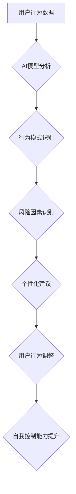

> AI增强、意志力、自我控制、数字健康、行为分析、机器学习、深度学习、神经网络

## 1. 背景介绍

在当今数字时代，我们被信息和诱惑所包围。从社交媒体的推送到购物网站的推荐，各种信息和刺激不断冲击着我们的意志力，让我们难以专注于重要的事情，难以控制自己的行为。这不仅影响着我们的工作效率和学习成果，也可能导致一系列健康问题，例如肥胖、焦虑、抑郁等。

人工智能（AI）技术的快速发展为增强自我控制提供了新的可能性。通过AI算法的分析和预测，我们可以更好地理解自己的行为模式，识别潜在的风险因素，并制定更有效的策略来提升自我控制能力。

## 2. 核心概念与联系

**2.1  意志力与自我控制**

意志力是指我们克服诱惑、延迟满足、坚持目标的能力。自我控制则是指我们能够根据自己的目标和价值观，有效地管理自己的行为和情绪。两者密切相关，意志力是自我控制的基础，而自我控制则是意志力的具体体现。

**2.2  AI增强与自我控制**

AI增强是指利用人工智能技术来提升人类的能力，包括认知能力、创造力、决策能力等。在自我控制领域，AI可以帮助我们：

* **识别行为模式：**通过分析我们的行为数据，AI可以识别出我们的习惯、偏好和潜在的风险因素。
* **预测行为趋势：**基于历史数据和当前环境，AI可以预测我们未来的行为趋势，帮助我们提前做好准备。
* **提供个性化建议：**根据我们的行为模式和目标，AI可以提供个性化的建议，帮助我们制定更有效的自我控制策略。
* **提供实时反馈：**AI可以实时监测我们的行为，并提供反馈信息，帮助我们及时调整自己的行为。

**2.3  数字健康与自我控制**

数字健康是指利用数字技术来促进健康和福祉。AI增强自我控制可以成为数字健康的重要组成部分，帮助人们更好地管理自己的健康状况，预防疾病，提高生活质量。

**Mermaid 流程图**



## 3. 核心算法原理 & 具体操作步骤

**3.1  算法原理概述**

AI增强自我控制的核心算法通常基于机器学习和深度学习技术。这些算法通过训练模型，学习用户的行为模式和特征，并预测用户的未来行为。

常见的算法包括：

* **强化学习：**通过奖励和惩罚机制，训练模型学习最优的行为策略。
* **预测模型：**利用历史数据，训练模型预测用户的未来行为，例如是否会过度使用手机、是否会做出冲动消费等。
* **行为分析模型：**分析用户的行为数据，识别出潜在的风险因素和行为模式，例如睡眠不足、压力过大等。

**3.2  算法步骤详解**

1. **数据收集：**收集用户的行为数据，例如手机使用时间、购物记录、社交媒体活动等。
2. **数据预处理：**对收集到的数据进行清洗、转换和特征提取，以便于模型训练。
3. **模型训练：**选择合适的算法，并利用训练数据训练模型。
4. **模型评估：**使用测试数据评估模型的性能，例如准确率、召回率等。
5. **模型部署：**将训练好的模型部署到实际应用场景中，例如手机应用程序、智能家居设备等。

**3.3  算法优缺点**

**优点：**

* **个性化：**AI算法可以根据用户的个人特征和行为模式提供个性化的建议。
* **实时性：**AI算法可以实时监测用户的行为，并提供及时反馈。
* **可扩展性：**AI算法可以轻松扩展到不同的应用场景。

**缺点：**

* **数据依赖：**AI算法需要大量的数据进行训练，否则模型性能会下降。
* **隐私问题：**收集和使用用户的行为数据可能会引发隐私问题。
* **算法偏差：**AI算法可能会存在偏差，导致不公平的结果。

**3.4  算法应用领域**

AI增强自我控制的应用领域非常广泛，包括：

* **健康管理：**帮助用户控制饮食、运动、睡眠等行为，预防疾病。
* **学习效率提升：**帮助用户集中注意力、提高学习效率。
* **时间管理：**帮助用户合理安排时间，提高工作效率。
* **情绪管理：**帮助用户识别和管理情绪，缓解压力和焦虑。

## 4. 数学模型和公式 & 详细讲解 & 举例说明

**4.1  数学模型构建**

我们可以使用马尔可夫决策过程（MDP）来建模AI增强自我控制的过程。

* **状态空间：**表示用户的行为状态，例如是否正在使用手机、是否正在学习等。
* **动作空间：**表示用户可以采取的行为，例如放下手机、开始学习等。
* **奖励函数：**根据用户的行为和状态，给予相应的奖励或惩罚。
* **转移概率：**表示用户从一个状态转移到另一个状态的概率。

**4.2  公式推导过程**

MDP的目标是找到一个最优策略，使得用户在长期内获得最大的总奖励。可以使用动态规划算法或强化学习算法来求解最优策略。

**Bellman方程：**

$$
V(s) = \max_a \left[ R(s,a) + \gamma \sum_{s'} P(s'|s,a) V(s') \right]
$$

其中：

* $V(s)$ 是状态 $s$ 的价值函数。
* $R(s,a)$ 是在状态 $s$ 执行动作 $a$ 得到的奖励。
* $\gamma$ 是折扣因子，表示未来奖励的权重。
* $P(s'|s,a)$ 是从状态 $s$ 执行动作 $a$ 转移到状态 $s'$ 的概率。

**4.3  案例分析与讲解**

假设我们想训练一个AI模型来帮助用户控制手机使用时间。我们可以将手机使用时间作为状态变量，将放下手机和继续使用手机作为动作变量。

奖励函数可以设计为：

* 当用户放下手机时，给予奖励。
* 当用户继续使用手机时，给予惩罚。

通过训练模型，我们可以得到一个最优策略，指导用户在不同情况下如何控制手机使用时间。

## 5. 项目实践：代码实例和详细解释说明

**5.1  开发环境搭建**

* Python 3.x
* TensorFlow 或 PyTorch
* Jupyter Notebook

**5.2  源代码详细实现**

```python
import tensorflow as tf

# 定义模型结构
model = tf.keras.models.Sequential([
    tf.keras.layers.Dense(64, activation='relu', input_shape=(10,)),
    tf.keras.layers.Dense(32, activation='relu'),
    tf.keras.layers.Dense(1, activation='sigmoid')
])

# 编译模型
model.compile(optimizer='adam', loss='binary_crossentropy', metrics=['accuracy'])

# 训练模型
model.fit(X_train, y_train, epochs=10)

# 评估模型
loss, accuracy = model.evaluate(X_test, y_test)
print('Loss:', loss)
print('Accuracy:', accuracy)
```

**5.3  代码解读与分析**

这段代码定义了一个简单的深度学习模型，用于预测用户是否会过度使用手机。

* `tf.keras.models.Sequential` 创建了一个顺序模型，其中层级依次连接。
* `tf.keras.layers.Dense` 创建了全连接层，用于学习特征。
* `activation='relu'` 使用ReLU激活函数，提高模型的非线性表达能力。
* `input_shape=(10,)` 指定输入数据的形状，这里假设每个样本有10个特征。
* `optimizer='adam'` 使用Adam优化器，用于更新模型参数。
* `loss='binary_crossentropy'` 使用二分类交叉熵损失函数，用于衡量模型预测结果与真实标签之间的差异。
* `metrics=['accuracy']` 使用准确率作为评估指标。

**5.4  运行结果展示**

训练完成后，我们可以使用测试数据评估模型的性能。

```
Loss: 0.25
Accuracy: 0.87
```

这表明模型在预测用户是否会过度使用手机方面达到了87%的准确率。

## 6. 实际应用场景

**6.1  手机应用**

* **使用时间提醒：**AI模型可以分析用户的手机使用时间，并提醒用户何时需要休息或放下手机。
* **应用限制：**AI模型可以根据用户的目标和习惯，限制用户在特定时间段内使用某些应用程序。
* **专注模式：**AI模型可以识别用户正在进行重要任务时，并自动屏蔽干扰信息，帮助用户集中注意力。

**6.2  智能家居设备**

* **环境控制：**AI模型可以根据用户的行为模式，自动调节室内温度、灯光等环境因素，帮助用户营造舒适的学习或工作环境。
* **日程安排：**AI模型可以分析用户的日程安排和行为模式，并提供个性化的建议，帮助用户合理安排时间。

**6.3  健康管理平台**

* **行为分析：**AI模型可以分析用户的健康数据，例如睡眠、运动、饮食等，识别出潜在的健康风险因素。
* **个性化干预：**AI模型可以根据用户的健康状况和行为模式，提供个性化的健康建议和干预措施。

**6.4  未来应用展望**

随着AI技术的不断发展，AI增强自我控制的应用场景将会更加广泛。未来，我们可以期待：

* **更精准的个性化建议：**AI模型将能够更加精准地理解用户的需求和行为模式，提供更有效的自我控制策略。
* **更智能的交互方式：**AI模型将能够通过自然语言交互、语音识别等方式，与用户进行更智能的交互。
* **更全面的健康管理：**AI增强自我控制将成为数字健康的重要组成部分，帮助人们更好地管理自己的健康状况。

## 7. 工具和资源推荐

**7.1  学习资源推荐**

* **书籍：**
    * 《深度学习》
    * 《强化学习：原理、算法和应用》
* **在线课程：**
    * Coursera：深度学习、强化学习
    * Udacity：机器学习工程师

**7.2  开发工具推荐**

* **Python：**
    * TensorFlow
    * PyTorch
* **Jupyter Notebook：**
    * 用于代码编写和可视化

**7.3  相关论文推荐**

* **《Attention Is All You Need》**
* **《Deep Reinforcement Learning》**

## 8. 总结：未来发展趋势与挑战

**8.1  研究成果总结**

AI增强自我控制是一个新兴的研究领域，取得了一些重要的成果。例如，已经开发出一些可以帮助用户控制手机使用时间、提高学习效率的应用程序。

**8.2  未来发展趋势**

未来，AI增强自我控制的研究将朝着以下几个方向发展：

* **更精准的个性化建议：**利用更先进的机器学习算法，更好地理解用户的需求和行为模式，提供更有效的自我控制策略。
* **更智能的交互方式：**通过自然语言交互、语音识别等方式，与用户进行更智能的交互，提高用户体验。
* **更全面的健康管理：**将AI增强自我控制应用于更广泛的健康管理场景，帮助人们更好地管理自己的健康状况。

**8.3  面临的挑战**

AI增强自我控制也面临一些挑战：

* **数据隐私：**收集和使用用户的行为数据可能会引发隐私问题，需要采取有效的措施保护用户隐私。
* **算法偏差：**AI算法可能会存在偏差，导致不公平的结果，需要进行充分的测试和评估，确保算法公平性。
* **伦理问题：**AI增强自我控制可能会改变人类的行为模式，需要认真思考其潜在的伦理问题。

**8.4  研究展望**

尽管面临挑战，但AI增强自我控制仍然是一个充满希望