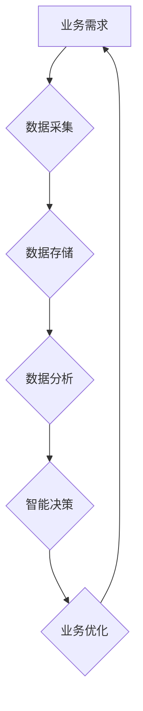

> 数字化转型,人工智能,云计算,大数据,区块链,物联网,5G,机器学习,深度学习

## 1. 背景介绍

在当今科技飞速发展的时代，数字化转型已成为各行各业的必然趋势。从传统企业到新兴科技公司，都面临着数字化转型的挑战和机遇。数字化转型是指企业利用数字化技术和方法，重塑业务模式、优化运营流程、提升客户体验，最终实现业务创新和可持续发展。

数字化转型并非简单的技术升级，而是一个全面的变革过程，涉及到组织架构、文化理念、业务流程、技术平台等多个方面。成功的数字化转型需要企业制定清晰的战略规划，整合内部资源，加强外部合作，并不断学习和适应新的技术和市场变化。

## 2. 核心概念与联系

**2.1 数字化转型核心概念**

* **数字化:** 将传统业务和数据以数字形式进行存储、处理和分析。
* **转型:** 对现有业务模式、运营流程和组织结构进行重构和优化。

**2.2 数字化转型关键技术**

* **人工智能 (AI):** 利用机器学习、深度学习等算法，赋予机器智能化能力，实现自动决策、智能服务等功能。
* **云计算:** 提供弹性、可扩展的计算资源和存储服务，降低企业IT成本，提高业务敏捷性。
* **大数据:** 收集、存储、分析海量数据，挖掘数据价值，为企业决策提供支持。
* **区块链:** 提供去中心化、安全可靠的数据存储和交易平台，促进数据共享和信任构建。
* **物联网 (IoT):** 连接各种物理设备，收集设备数据，实现远程监控、智能控制等功能。
* **5G:** 提供高速、低延迟的网络连接，为万物互联、智能应用提供基础设施支持。

**2.3 数字化转型架构**



**2.4 数字化转型关键要素**

* **战略规划:** 明确数字化转型目标、方向和路径。
* **组织变革:** 建立数字化转型团队，赋予团队决策权和资源支持。
* **技术创新:** 采用先进的数字化技术，构建数字化平台。
* **人才培养:** 培养数字化转型所需的专业人才。
* **文化建设:** 营造数字化转型所需的创新文化和协作氛围。

## 3. 核心算法原理 & 具体操作步骤

**3.1 算法原理概述**

机器学习算法是人工智能的核心技术之一，它通过训练模型，从数据中学习规律，实现预测、分类、聚类等功能。常见的机器学习算法包括：

* **监督学习:** 利用标记数据训练模型，预测未知数据类别或值。
* **无监督学习:** 利用未标记数据发现数据结构和模式。
* **强化学习:** 通过试错学习，在环境中获得最大奖励。

**3.2 算法步骤详解**

1. **数据收集和预处理:** 收集相关数据，并进行清洗、转换、特征工程等预处理操作。
2. **模型选择:** 根据具体任务选择合适的机器学习算法。
3. **模型训练:** 利用训练数据训练模型，调整模型参数，使模型能够准确预测或分类。
4. **模型评估:** 利用测试数据评估模型性能，选择最佳模型。
5. **模型部署:** 将训练好的模型部署到生产环境，用于实际应用。

**3.3 算法优缺点**

* **优点:** 能够自动学习数据规律，提高预测精度，适应不断变化的数据环境。
* **缺点:** 需要大量数据进行训练，训练过程耗时，模型解释性较差。

**3.4 算法应用领域**

* **图像识别:** 人脸识别、物体检测、图像分类。
* **自然语言处理:** 文本分类、情感分析、机器翻译。
* **推荐系统:** 商品推荐、内容推荐、用户画像。
* **金融风险控制:** 欺诈检测、信用评估、风险预测。

## 4. 数学模型和公式 & 详细讲解 & 举例说明

**4.1 数学模型构建**

机器学习算法通常基于数学模型进行构建，例如线性回归模型、逻辑回归模型、支持向量机模型等。这些模型通过数学公式来描述数据之间的关系，并利用训练数据来估计模型参数。

**4.2 公式推导过程**

例如，线性回归模型的目标是找到一条直线，能够最佳地拟合训练数据中的样本点。模型的数学公式如下：

$$y = w_0 + w_1x_1 + w_2x_2 + ... + w_nx_n$$

其中：

* $y$ 是预测值
* $w_0, w_1, w_2, ..., w_n$ 是模型参数
* $x_1, x_2, ..., x_n$ 是输入特征

模型参数的估计可以通过最小二乘法等优化算法来实现。

**4.3 案例分析与讲解**

假设我们有一个数据集，包含房屋面积和房屋价格的信息。我们可以使用线性回归模型来预测房屋价格。

* 输入特征: 房屋面积
* 输出特征: 房屋价格

通过训练模型，我们可以得到一个线性回归方程，例如：

$$价格 = 5000 + 100 * 面积$$

这个方程表示，房屋面积每增加1平方米，房屋价格就会增加100元。

## 5. 项目实践：代码实例和详细解释说明

**5.1 开发环境搭建**

* 操作系统: Ubuntu 20.04
* Python 版本: 3.8
* 必要的库: pandas, numpy, scikit-learn

**5.2 源代码详细实现**

```python
import pandas as pd
from sklearn.linear_model import LinearRegression
from sklearn.model_selection import train_test_split

# 加载数据
data = pd.read_csv('house_data.csv')

# 分割数据
X = data[['面积']]
y = data['价格']
X_train, X_test, y_train, y_test = train_test_split(X, y, test_size=0.2, random_state=42)

# 创建线性回归模型
model = LinearRegression()

# 训练模型
model.fit(X_train, y_train)

# 预测测试数据
y_pred = model.predict(X_test)

# 评估模型性能
from sklearn.metrics import mean_squared_error
mse = mean_squared_error(y_test, y_pred)
print(f'均方误差: {mse}')
```

**5.3 代码解读与分析**

* 首先，我们加载数据，并将其分割成训练集和测试集。
* 然后，我们创建了一个线性回归模型，并使用训练集进行模型训练。
* 训练完成后，我们使用测试集进行模型预测，并计算模型的均方误差来评估模型性能。

**5.4 运行结果展示**

运行代码后，会输出模型的均方误差值。均方误差值越小，模型的预测精度越高。

## 6. 实际应用场景

**6.1 金融领域**

* 欺诈检测: 利用机器学习算法分析交易数据，识别异常交易行为。
* 风险评估: 利用机器学习算法评估客户信用风险，为贷款决策提供支持。
* 投资预测: 利用机器学习算法分析市场数据，预测股票价格走势。

**6.2 医疗领域**

* 疾病诊断: 利用机器学习算法分析患者病历数据，辅助医生诊断疾病。
* 药物研发: 利用机器学习算法分析药物分子结构，加速药物研发过程。
* 医疗影像分析: 利用机器学习算法分析医学影像数据，辅助医生进行诊断和治疗。

**6.3 电商领域**

* 商品推荐: 利用机器学习算法分析用户购买历史和行为数据，推荐个性化商品。
* 营销精准化: 利用机器学习算法分析用户数据，进行精准营销推广。
* 供应链优化: 利用机器学习算法优化库存管理、物流配送等环节。

**6.4 未来应用展望**

随着人工智能技术的不断发展，数字化转型将应用于更多领域，例如教育、交通、能源等。未来，人工智能将更加智能化、个性化、自动化，为人类社会带来更多便利和福祉。

## 7. 工具和资源推荐

**7.1 学习资源推荐**

* **在线课程:** Coursera, edX, Udacity
* **书籍:**
    * 《深度学习》
    * 《机器学习实战》
    * 《Python机器学习》

**7.2 开发工具推荐**

* **Python:** 广泛应用于机器学习和人工智能开发。
* **TensorFlow:** Google开发的开源机器学习框架。
* **PyTorch:** Facebook开发的开源机器学习框架。
* **Scikit-learn:** Python机器学习库。

**7.3 相关论文推荐**

* **《ImageNet Classification with Deep Convolutional Neural Networks》**
* **《Attention Is All You Need》**
* **《BERT: Pre-training of Deep Bidirectional Transformers for Language Understanding》**

## 8. 总结：未来发展趋势与挑战

**8.1 研究成果总结**

近年来，人工智能领域取得了显著进展，例如图像识别、自然语言处理、语音识别等领域取得了突破性进展。这些成果为数字化转型提供了强大的技术支撑。

**8.2 未来发展趋势**

* **模型更加智能化:** 模型将更加能够理解和处理复杂数据，并具备更强的学习和适应能力。
* **应用更加广泛:** 人工智能将应用于更多领域，例如医疗、教育、交通等。
* **伦理问题更加突出:** 人工智能的应用引发了伦理问题，例如算法偏见、数据隐私等，需要引起重视和解决。

**8.3 面临的挑战**

* **数据质量问题:** 人工智能模型的性能依赖于数据质量，数据不完整、不准确、不平衡等问题会影响模型效果。
* **算法解释性问题:** 许多人工智能算法是黑箱模型，难以解释模型的决策过程，这限制了模型的应用和信任度。
* **人才短缺问题:** 人工智能领域人才需求量大，但人才供给不足，需要加强人才培养和引进。

**8.4 研究展望**

未来，人工智能研究将更加注重模型的解释性、鲁棒性和安全性，并探索人工智能与人类的协同合作模式。


## 9. 附录：常见问题与解答

**9.1 如何选择合适的机器学习算法？**

选择合适的机器学习算法需要根据具体任务和数据特点进行选择。例如，对于分类任务，可以考虑逻辑回归、支持向量机、决策树等算法；对于回归任务，可以考虑线性回归、支持向量回归等算法。

**9.2 如何处理数据不平衡问题？**

数据不平衡是指训练数据中不同类别样本数量不均衡的情况。可以采用以下方法处理数据不平衡问题：

* **过采样:** 增加少数类样本数量。
* **欠采样:** 减少多数类样本数量。
* **合成少数类样本:** 利用现有数据生成新的少数类样本。

**9.3 如何评估机器学习模型性能？**

常用的机器学习模型性能评估指标包括准确率、召回率、F1-score、AUC等。选择合适的评估指标需要根据具体任务和数据特点进行选择。


作者：禅与计算机程序设计艺术 / Zen and the Art of Computer Programming 
<end_of_turn>